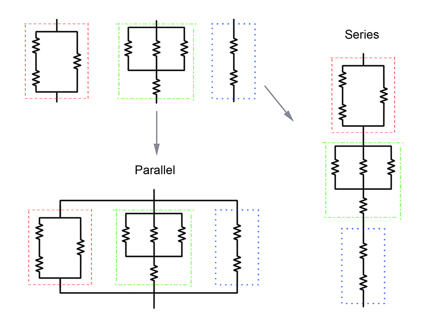

<h1 style='text-align: center;'> E. Kirchhoff's Current Loss</h1>

<h5 style='text-align: center;'>time limit per test: 2 seconds</h5>
<h5 style='text-align: center;'>memory limit per test: 256 megabytes</h5>

Your friend Kirchhoff is shocked with the current state of electronics design.

"Ohmygosh! Watt is wrong with the field? All these circuits are inefficient! There's so much capacity for improvement. The electrical engineers must not conduct their classes very well. It's absolutely revolting" he said.

The negativity just keeps flowing out of him, but even after complaining so many times he still hasn't lepton the chance to directly change anything.

"These circuits have too much total resistance. Wire they designed this way? It's just causing a massive loss of resistors! Their entire field could conserve so much money if they just maximized the potential of their designs. Why can't they just try alternative ideas?"

The frequency of his protests about the electrical engineering department hertz your soul, so you have decided to take charge and help them yourself. You plan to create a program that will optimize the circuits while keeping the same circuit layout and maintaining the same effective resistance.

A circuit has two endpoints, and is associated with a certain constant, $R$, called its effective resistance. 

The circuits we'll consider will be formed from individual resistors joined together in series or in parallel, forming more complex circuits. The following image illustrates combining circuits in series or parallel. 

  According to your friend Kirchhoff, the effective resistance can be calculated quite easily when joining circuits this way:

* When joining $k$ circuits in series with effective resistances $R_1, R_2, \ldots, R_k$, the effective resistance $R$ of the resulting circuit is the sum $$R = R_1 + R_2 + \ldots + R_k.$$
* When joining $k$ circuits in parallel with effective resistances $R_1, R_2, \ldots, R_k$, the effective resistance $R$ of the resulting circuit is found by solving for $R$ in $$\frac{1}{R} = \frac{1}{R_1} + \frac{1}{R_2} + \ldots + \frac{1}{R_k},$$ assuming all $R_i > 0$; if at least one $R_i = 0$, then the effective resistance of the whole circuit is simply $R = 0$.

Circuits will be represented by strings. Individual resistors are represented by an asterisk, "*". For more complex circuits, suppose $s_1, s_2, \ldots, s_k$ represent $k \ge 2$ circuits. Then:

* "($s_1$ S $s_2$ S $\ldots$ S $s_k$)" represents their series circuit;
* "($s_1$ P $s_2$ P $\ldots$ P $s_k$)" represents their parallel circuit.

For example, "(* P (* S *) P *)" represents the following circuit:

  Given a circuit, your task is to assign the resistances of the individual resistors such that they satisfy the following requirements:

* Each individual resistor has a nonnegative integer resistance value;
* The effective resistance of the whole circuit is $r$;
* The sum of the resistances of the individual resistors is minimized.

If there are $n$ individual resistors, then you need to output the list $r_1, r_2, \ldots, r_n$ ($0 \le r_i$, and $r_i$ is an integer), where $r_i$ is the resistance assigned to the $i$-th individual resistor that appears in the input (from left to right). If it is impossible to accomplish the task, you must say so as well.

If it is possible, then it is guaranteed that the minimum sum of resistances is at most $10^{18}$. 

### Input

The first line of input contains a single integer $t$ ($1 \le t \le 32000$), denoting the number of test cases. The next lines contain descriptions of the test cases.

Each test case consists of a single line containing the integer $r$ ($1 \le r \le 10^6$), space, and then the string representing the circuit. It is guaranteed that the string is valid and follows the description above. The number of individual resistors (symbols "*") is at least $1$ and at most $80000$.

It is guaranteed that the total number of individual resistors across all test cases is at most $320000$.

### Output

For each test case, print a single line:

* If it's possible to achieve an effective resistance of $r$, print "REVOLTING" (without quotes) and then $n$ integers $r_1, r_2, \ldots, r_n$ — the resistances assigned to the individual resistors. Here, $n$ denotes the number of the individual resistors in the circuit.  There may be multiple possible such assignments with a minimal sum of resistances of the individual resistors, you can output any of them;
* If it's impossible, print the string: "LOSS" (without quotes).
## Example

### Input


```text
3
5 *
1 (* S *)
1 (* P (* S *))
```
### Output


```text
REVOLTING 5
REVOLTING 1 0
REVOLTING 2 1 1
```
## Note

The following illustrates the third sample case:

  Here, the sum of the resistances of the individual resistors is $2 + 1 + 1 = 4$, which can be shown to be the minimum. 
## Note

 that there may be other assignments that achieve this minimum.


#### Tags 

#2900 #NOT OK #math 

## Blogs
- [All Contest Problems](../Codeforces_Round_607_(Div._1).md)
- [Announcement (en)](../blogs/Announcement_(en).md)
- [Tutorial (en)](../blogs/Tutorial_(en).md)
