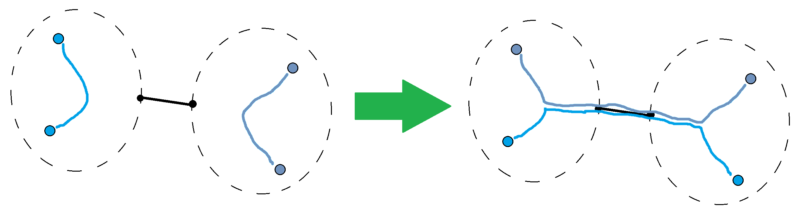
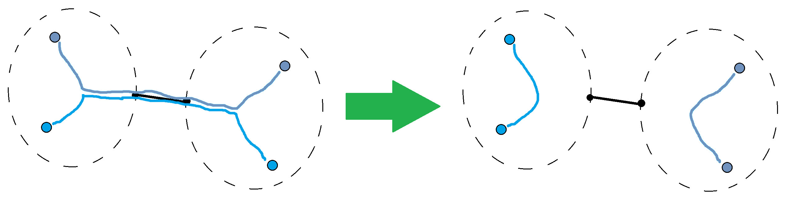
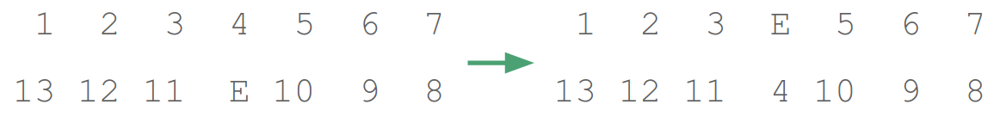
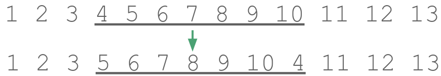
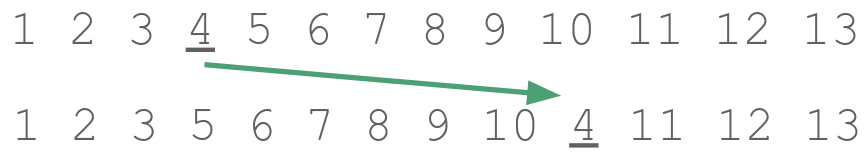

# Tutorial_(en)

I hope you enjoyed the problems! Thanks to the onsite teams and coaches who gave feedback; I'm glad the reception was positive.

Interestingly, in the onsite ICPC round, while "Kirchhoff" got several accepted solutions, "Miss Punyverse" got no accepted submissions at all! It is the reverse here. (Kirchhoff even has a trickier output format in the onsite round compared to the version presented in Codeforces.) It seems the ICPC scoreboard really affects the results greatly; what the top few teams are working on influences what everyone else will be working on.

I am planning on releasing the full, untouched ICPC Manila 2019 problem set in the gym sometime in the future, so you can see which problems you missed. The Intergalactic Sliding Puzzle is *not* the hardest problem in the round!

[1281A - Suffix Three](../problems/A._Suffix_Three.md "Codeforces Round 607 (Div. 2)")

 **Solution Sketch**
### [1281A - Suffix Three](../problems/A._Suffix_Three.md "Codeforces Round 607 (Div. 2)")

The simplest way to solve it is to use your language's builtin string methods like ends_with. (It might be different in your preferred language.) Alternatively, if you know how to access the individual letters of a string, then you may implement something similar to ends_with yourself.

To print the required output, you can just use something like: 


```cpp
  
if s.endswith("po"):  
    print("FILIPINO")  
  
if s.endswith("desu") or s.endswith("masu"):  
    print("JAPANESE")  
  
if s.endswith("mnida"):  
    print("KOREAN")  

```
Alternatively, notice that you can simply check the last letter since o, u and a are distinct, so it can be simplified slightly. One can even write a Python one-liner (for a single test case): 


```cpp
  
print({"o": "FILIPINO", "a": "KOREAN", "u": "JAPANESE"}[input()[-1]])  

```
 **Accepted Code**
```cpp
for cas in range(int(input())): print({'o': "FILIPINO", 'a': "KOREAN", 'u': "JAPANESE"}[input()[-1]])
```
Accepted Submission: [67015948](https://codeforces.com/contest/1281/submission/67015948 "Submission 67015948 by kevinsogo")

[1281B - Azamon Web Services](../problems/B._Azamon_Web_Services.md "Codeforces Round 607 (Div. 2)")

 **Solution Sketch**
### [1281B - Azamon Web Services](../problems/B._Azamon_Web_Services.md "Codeforces Round 607 (Div. 2)")

The problem becomes a bit easier if we try to answer a different question: What is the lexicographically smallest string we can form from SS? We then simply compare this string with CC. This works because if the smallest string we can form is not smaller than CC, then clearly no other string we can form will be smaller than CC.

To find the lexicographically smallest string we can form, we can be greedy. We sort SS and find the first letter that isn't in its correct sorted position. In other words, find the first position where SS and sorted(S)sorted(S) doesn't match. We then find the letter that should be in that position and put it in its correct position. If there are multiple choices, it is better to take the one that occurs last, since it makes the resulting string smallest.

A special case is when SS is already sorted. In this case, we can't make SS any smaller, so we should not swap at all.

The solution runs in O(|S|log|S|)O(|S|log⁡|S|), but solutions running in O(|S|2)O(|S|2) are also accepted. (There are other, different solutions that run in O(|S|2)O(|S|2).) This can be improved to O(|S|)O(|S|) by replacing the sorting step with simpler operations, since we don't actually need the full sorted version of SS. 

 **Accepted Code**
```cpp
def solve(s, t):
    mns = list(s)
    for i in range(len(s)-2,-1,-1): mns[i] = min(mns[i], mns[i + 1])
    for i in range(len(s)):
        if s[i] != mns[i]:
            j = max(j for j, v in enumerate(s[i:], i) if v == mns[i])
            s = s[:i] + s[j] + s[i+1:j] + s[i] + s[j+1:]
            break
    return s if s < t else '---'

for cas in range(int(input())):
    print(solve(*input().split()))
```
Accepted Submission: [67049609](https://codeforces.com/contest/1281/submission/67049609 "Submission 67049609 by kevinsogo")

[1281C - Cut and Paste](https://codeforces.com/contest/1281/problem/C "Codeforces Round 607 (Div. 2)")

 **Solution Sketch**
### [1281C - Cut and Paste](https://codeforces.com/contest/1281/problem/C "Codeforces Round 607 (Div. 2)")

Let StSt be the string SS after the ttth round, and let S0S0 be the initial SS. We also denote by Si…Si… the suffix of SS from the iith character, SiSi, onwards.

A single round turns St−1St−1 into StSt by replicating the suffix St−1t+1…St+1…t−1 exactly StSt times. Hence, we have the recurrence St=St−1+St−1t+1…⋅(St−1t−1),St=St−1+St+1…t−1⋅(Stt−1−1), where ++ represents concatenation, and s⋅ns⋅n represents replicating ss nn times. (Note that St−1tStt−1 is interpreted as an integer.)

In terms of lengths, we have ∣∣St∣∣=∣∣St−1∣∣+∣∣St−1t+1…∣∣⋅(St−1t−1).|St|=|St−1|+|St+1…t−1|⋅(Stt−1−1). Since |Si+1…|=|S|−i|Si+1…|=|S|−i, this is equivalent to ∣∣St∣∣=∣∣St−1∣∣+(∣∣St−1∣∣−t)⋅(St−1t−1).|St|=|St−1|+(|St−1|−t)⋅(Stt−1−1). 

This cannot be simulated yet as it is since the length of SS could be growing very quickly. But notice that St−1St−1 is always a prefix of StSt. Therefore, for any two t1t1 and t2t2, the iith letters of St1St1 and St2St2 are the same (as long as their lengths are at least ii). Also, note that we only need to access up to the xxth character, SxSx. Therefore, we only need to grow SS just enough until it contains at least xx characters. After that, we can stop modifying SS at that point and simply keep track of the length, maintaining it using the recurrence above. 

The running time is O(|S|+x)O(|S|+x). (But in languages where strings are immutable, you should use a dynamically-resizing list instead of appending strings repeatedly, otherwise, you'll get a running time of O(x2)O(x2).)

 **Accepted Code**
```cpp
#include <bits/stdc++.h>
using namespace std;
using ll = long long;
constexpr ll mod = 1'000'000'007; //'
constexpr int N = 1111;

char _s[N];
ll solve() {
    int x;
    scanf("%d%s", &x, _s);
    ll ls = strlen(_s);
    vector<char> s(_s, _s + ls);
    for (int i = 1; i <= x; i++) {
        int v = s[i - 1] - '1';
        if (s.size() < x) {
            vector<char> sub(s.begin() + i, s.end());
            for (int it = 0; it < v; it++) s.insert(s.end(), sub.begin(), sub.end());
        }
        ls = (ls + (ls - i) * v) % mod;
    }
    return ls;
}


int main() {
    int z;
    for (scanf("%d", &z); z--; printf("%lldn", (solve() % mod + mod) % mod));
}
```
Accepted Submission: [67016113](https://codeforces.com/contest/1280/submission/67016113 "Submission 67016113 by kevinsogo")

[1281D - Beingawesomeism](https://codeforces.com/contest/1281/problem/D "Codeforces Round 607 (Div. 2)")

 **Solution Sketch**
### [1281D - Beingawesomeism](https://codeforces.com/contest/1281/problem/D "Codeforces Round 607 (Div. 2)")

If everything is P, then it is clearly impossible (MORTAL). Otherwise, you can turn everything into A in at most 44 moves, starting from any single A. Thus, the answer is between 00 and 44. We can exhaust all possibilities:

* The answer is 00 if:
	+ Everything is an A.
	+ Otherwise, at least 11 move is needed.
* The answer is 11 if:
	+ At least one of the edge rows/columns is all As.
	+ Otherwise, it can be shown that at least 22 moves are needed, because if every edge has at least one P, then no single move can simultaneously turn all four edges into A. To see this, note that our move must simultaneously touch all four edges. This forces us to select our initial row/column to be an entire edge row/column of the grid. But then, we are forced to have at least one P in our selection, and this P cannot be removed in this move.
* The answer is 22 if:
	+ There is one corner that's an A because in a single move, we can turn an edge into all As.
	+ There's a whole column or row of As, because again, in a single move, we can turn an edge into all As. (This case could be tricky to spot.)
	+ Otherwise, it can be shown that at least 33 moves are needed. This is because, if we are only allowed 22 moves, then our first move must take us to a configuration where only 11 move is needed. In other words, in a single move, we must ensure that one edge has all As. Now, suppose we have decided which edge to turn into all As. Since all corners are Ps, our move must touch both corners of that edge, and so we are forced to copy an entire row/column up to that edge. But since every row/column has a P, this means that the edge will contain a P after the move, and hence, we have failed to turn that edge into all As. (We cannot also have accidentally turned another edge into all As since the other corners are still Ps.)
* The answer is 33 if:
	+ There is at least one A in one of the edges, because in a single move, we can ensure that one corner becomes an A.
	+ Otherwise, it can be shown that at least 44 moves are needed, because we can't turn any corner into A in a single move (because all edges are Ps, and only cells in edges get copied onto corners), and we also can't turn any row/column into all As in a single move (since that requires copying an entire row/column onto it, but again, note that the edges are all Ps).
* The answer is 44 if:
	+ It is not one of the cases above, since 44 moves are always enough.
 **Accepted Code**
```cpp
#include <bits/stdc++.h>
using namespace std;

int solve(int r, int c, vector<string> grid) {
    vector<int> rows(r), cols(c);
    int total = 0;
    for (int i = 0; i < r; i++) {
        for (int j = 0; j < c; j++) {
            if (grid[i][j] == 'A') rows[i]++, cols[j]++, total++;
        }
    }
    if (total == r * c) return 0;
    if (total == 0) return -1;

    if (rows[0] == c || rows.back() == c || cols[0] == r || cols.back() == r) return 1;
    if (grid[0][0] == 'A' || grid[0].back() == 'A' || grid.back()[0] == 'A' || grid.back().back() == 'A') return 2;
    if (*max_element(rows.begin(), rows.end()) == c || *max_element(cols.begin(), cols.end()) == r) return 2;
    if (rows[0] || rows.back() || cols[0] || cols.back()) return 3;
    return 4;
}

int main() {
    int z;
    for (cin >> z; z--;) {
        int r, c;
        cin >> r >> c;
        vector<string> grid(r);
        for (int i = 0; i < r; i++) cin >> grid[i];
        int res = solve(r, c, grid);
        (~res ? cout << res : cout << "MORTAL") << 'n';
    }
}
```
Accepted Submission: [67016167](https://codeforces.com/contest/1280/submission/67016167 "Submission 67016167 by kevinsogo")

[1281E - Jeremy Bearimy](https://codeforces.com/contest/1281/problem/E "Codeforces Round 607 (Div. 2)")

 **Solution Sketch**
### [1281E - Jeremy Bearimy](https://codeforces.com/contest/1281/problem/E "Codeforces Round 607 (Div. 2)")

Maximization

Suppose we're maximizing the sum. Consider a single edge (a,b), and consider the two components on either side of this edge. Then we have an important observation: in the optimal solution, the nodes of one component are all paired with nodes on the other component. This is because otherwise, there will be at least one pair in each component that lies entirely in that component, say (ia,ja) and (ib,jb). But if we switch the pairing to, say, (ia,ib) and (ja,jb), then the cost increases, because we're introducing new edges (namely (a,b), among possibly others) while keeping everything from the previous pairing. 

  Repeating this, we can construct an optimal solution where all nodes in one component are paired with nodes in the other component.

This means that in the optimal solution, the edge (a,b) is counted exactly min(ca,cb) times, where ca is the size of the component on a's side, and cb is the size of the component on b's side. Therefore, the edge contributes exactly weight(a,b)⋅min(ca,cb) to the answer. 

But the same is true for all edges! Therefore, we can compute the answer by just summing up all contributions. The only remaining step needed is to compute the sizes of all subtrees, and this can be done with a single BFS/DFS and DP. This runs in O(n).

Minimization

Now, suppose we're minimizing the sum. Consider again a single edge (a,b). Again, we have an important observation: in the optimal solution, at most one pair passes through (a,b). This is because otherwise, if there are at least two such pairs, then we can again switch the pairing (essentially the reverse of maximizing), which decreases the cost, because it doesn't introduce additional edges but it decreases the number of pairs passing through (a,b) by 2.

  Repeating this, we can ensure that at most one pair passes through (a,b). 

Furthermore, the parity of the number of pairs passing through (a,b) is fixed. (Why?) Therefore, in the optimal solution, (a,b) is counted exactly (camod2) times. (Note that ca≡cb(mod2))

But again, the same is true for all edges! Therefore, we can compute the answer in O(n) as well, by summing up all contributions. 

 **Accepted Code**
```cpp
#include <bits/stdc++.h>
using namespace std;
using ll = long long;

void solve() {
    int n;
    cin >> n;
    n <<= 1;
    vector<vector<pair<int,ll>>> adj(n);
    for (int i = 0; i < n - 1; i++) {
        int a, b; ll c;
        cin >> a >> b >> c;
        a--, b--;
        adj[a].emplace_back(b, c);
        adj[b].emplace_back(a, c);
    }

    vector<int> parent(n, -1), que(1, 0);
    vector<ll> parent_cost(n);
    parent[0] = 0;
    for (int f = 0; f < que.size(); f++) {
        int i = que[f];
        for (auto [j, c]: adj[i]) {
            if (parent[j] == -1) {
                parent[j] = i;
                parent_cost[j] = c;
                que.push_back(j);
            }
        }
    }
    vector<int> size(n, 1);
    ll mn = 0, mx = 0;
    reverse(que.begin(), que.end());
    for (int i : que) {
        size[parent[i]] += size[i];
        mx += parent_cost[i] * min(size[i], n - size[i]);
        mn += parent_cost[i] * (size[i] & 1);
    }
    cout << mn << " " << mx << 'n';
}

int main() {
    ios_base::sync_with_stdio(false);
    cin.tie(NULL);
    int z;
    for (cin >> z; z--; solve());
}
```
Accepted Submission: [67020743](https://codeforces.com/contest/1280/submission/67020743 "Submission 67020743 by kevinsogo")

[1281F - Miss Punyverse](https://codeforces.com/contest/1281/problem/F "Codeforces Round 607 (Div. 2)")

 **Solution Sketch**
### [1281F - Miss Punyverse](https://codeforces.com/contest/1281/problem/F "Codeforces Round 607 (Div. 2)")

Let's say a region is winning if there are strictly more wasps than bees. Thus, we're maximizing the number of winning regions.

Tree DP seems natural in this sort of situation. For example, after rooting the tree arbitrarily, you could probably come up with something like f(i,r): Given the subtree rooted at i and the number of regions r, find the maximum number of winning regions if we partition that subtree into r regions. However, this has an issue: we also need to merge our topmost component with the topmost component of some subtrees, so the subtrees' vote advantage at their topmost components matter, and must also be considered in the DP. Unfortunately, if we just naively insert the vote advantage to our DP state (or output), this means that there could potentially be too many states/outputs to fit in the time limit.

Fortunately, we can keep the number of states the same by using the following greedy observation: It is optimal to maximize the number of winning regions first, and then to maximize the vote advantage at the top second. In other words, in a subtree, (x winning regions,−∞ vote advantage) is better than (x−1 winning regions,+∞ vote advantage). This is because the +∞ vote advantage at the top component, at best, can increase the number of winning regions by 1, but we can already guarantee to achieve that with (x,−∞).

So the DP now becomes f(i,r): Given the subtree rooted at i and the number of regions r, find the maximum number of winning regions, and among all such possibilities, find the maximum vote advantage of the top component.

Just be careful that your DP solution doesn't construct size-0 partitions. 

Now, what about the time complexity? We have a state that looks like (i,r), where 1≤r≤size(i), and a transition that runs in O(r), so naively it feels like it runs in O(n3) in the worst case. However, if you've seen this before, this is actually the sort of DP pattern that is really O(n2), at least with the right implementation.

Specifically, if we ensure that we only loop across the range where the substates are both valid, then you may check that the total amount of work done in each node is O(size(i)2−∑j is a child of isize(j)2), and such a recurrence can be analyzed to be O(n2).

 **Accepted Code**
```cpp
#include <bits/stdc++.h>
using namespace std;
using ll = long long;

struct Group {
    int win; ll adv;
    Group(int win = -1, ll adv = 0): win(win), adv(adv) {}
    Group operator+(const Group& o) const {
        return Group(win + o.win, adv + o.adv);
    }
    Group operator+() const {
        return Group(win + (adv > 0));
    }
    bool operator<(const Group& o) const {
        return win < o.win || win == o.win && adv < o.adv;
    }
};

vector<Group> convolve(const vector<Group>& fa, const vector<Group>& fb) {
    vector<Group> fi(fa.size() + fb.size());
    for (int a = 0; a < fa.size(); a++) {
        for (int b = 0; b < fb.size(); b++) {
            fi[a + b    ] = max(fi[a + b    ], fa[a] +  fb[b]);
            fi[a + b + 1] = max(fi[a + b + 1], fa[a] + +fb[b]);
        }
    }
    return fi;
}

vector<vector<Group>> f;
vector<vector<int>> adj;
void convolve_tree(int i, int p = -1) {
    for (int j : adj[i]) {
        if (j == p) continue;
        convolve_tree(j, i);
        f[i] = convolve(f[i], f[j]);
    }
}

int solve() {
    int n, m;
    scanf("%d%d", &n, &m);
    f = vector<vector<Group>>(n, vector<Group>(1, Group(0)));
    for (int i = 0, b; i < n; i++) {
        scanf("%d", &b);
        f[i][0].adv -= b;
    }
    for (int i = 0, w; i < n; i++) {
        scanf("%d", &w);
        f[i][0].adv += w;
    }
    adj = vector<vector<int>>(n);
    for (int i = 1; i < n; i++) {
        int x, y;
        scanf("%d%d", &x, &y);
        x--, y--;
        adj[x].push_back(y);
        adj[y].push_back(x);
    }
    convolve_tree(0);
    return (+f[0][m - 1]).win;
}

int main() {
    int z;
    for (scanf("%d", &z); z--; printf("%dn", solve()));
}
```
Accepted Submission: [67016189](https://codeforces.com/contest/1280/submission/67016189 "Submission 67016189 by kevinsogo")

[1280E - Kirchhoff's Current Loss](https://codeforces.com/contest/1280/problem/E "Codeforces Round 607 (Div. 1)")

 **Solution Sketch**
### [1280E - Kirchhoff's Current Loss](https://codeforces.com/contest/1280/problem/E "Codeforces Round 607 (Div. 1)")

Instead of minimizing the integer cost (which feels like a hard number theory problem), let's try to minimize the real number cost first. This is a bit easier, but it should help us solve the integer case by at least giving us a lower bound.

If we're allowed to assign arbitrary real numbers as costs, then we can deduce that the minimum cost to obtain a resistance of r is proportional to r. This is because we can just scale resistances arbitrarily, so if we have an optimal solution for one given r with optimal cost c⋅r, then to get any other target resistance r′, we can simply scale all resistances by r′/r, and we get a circuit with resistance r′ and cost c⋅r′ that should also be optimal.

To prove this more rigorously, define f(r) to be the optimal cost for a target resistance r. Then, the scaling idea above shows that f(r′)≤f(r)⋅(r′/r), which is equivalent to f(r′)/r′≤f(r)/r. By symmetry, f(r′)/r′≥f(r)/r, and so f(r′)/r′=f(r)/r, for any r,r′>0. Therefore, f must be linear in r, i.e., f(r)=c⋅r for some c.

Thus, we just need to find this proportionality constant c for our input circuit. This can be computed inductively. 

* For a basic resistor, c=1.
* For k circuits with constants c1,…,ck joined in series, c=min(c1,…,ck).
* For k circuits with constants c1,…,ck joined in parallel, √c=√c1+…+√ck.

 The latter two can be derived with some basic calculus. (For the case of parallel circuits, using Lagrange multipliers is the easiest way, at least for me.)But note that all three statements imply (via induction) that √c is an integer! Even more, using the formulas above, we can deduce the following stronger statement: for the purposes of minimization, the whole circuit is equivalent to a parallel circuit with √c resistors. You can also prove this via induction, and it's actually not that hard. The hardest part is knowing what to prove in the first place.

Once we have this statement, we can now turn its proof into a recursive algorithm that actually computes these √c parallel resistors the whole circuit is equivalent to. (The most straightforward proof of it naturally translates into such an algorithm.) We then assign a resistance of 0 to everything else. Finally, using the same analysis as before, to obtain a resistance of r in a parallel circuit of √c resistors, the optimal way is to assign √c⋅r to everything.

But if r is an integer, then √c⋅r is an integer as well, and since we're assigning 0 to everything else, it means that the minimum cost to achieve r can be achieved in integers as well!

 **Accepted Code**
```cpp
#include <bits/stdc++.h>
using namespace std;
using ll = long long;
const ll INF = 1LL << 60;

class Circuit {
public:
    ll w = -1;
    ll width() {
        if (w == -1) compute_width();
        return w;
    }
    virtual void compute_width() {}
    virtual void assign(ll value) {}
    virtual ostream& write_to(ostream& os) const { return os; }
    void assign_minimal(ll value) { assign(value * width()); }
    friend ostream& operator<<(ostream& os, const Circuit& circuit);
};

ostream& operator<<(ostream& os, const Circuit& circuit) {
    return circuit.write_to(os);
}

class Resistor: public Circuit {
public:
    ll value = -1;
    Resistor() {}
    void compute_width() override {
        w = 1;
    }
    void assign(ll value) override {
        this->value = value;
    }
    ostream& write_to(ostream& os) const override {
        return os << ' ' << value;
    }
};

class Join: public Circuit {
public:
    char typ;
    vector<Circuit*> children;
    Join() {}
    void compute_width() override {
        w = typ == 'S' ? INF : 0;
        for (auto child: children) {
            ll ww = child->width();
            w = typ == 'S' ? min(w, ww) : w + ww;
        }
    }
    void assign(ll value) override {
        for (auto child: children) {
            if (typ == 'S') {
                if (child->width() == width()) {
                    child->assign(value);
                    value = 0;
                } else {
                    child->assign(0);
                }
            } else {
                child->assign(value);
            }
        }
    }
    ostream& write_to(ostream& os) const override {
        for (auto child: children) os << *child;
        return os;
    }
};

class CircuitParser {
    const string& s;
    int i = 0;
    CircuitParser(const string& s): s(s) {}
    Circuit *parse() {
        if (s[i++] == '(') {
            Join *j = new Join();
            while (true) {
                j->children.push_back(parse());
                if (s[i++] == ')') break;
                j->typ = s[i++];
                i++;
            }
            return j;
        } else {
            return new Resistor();
        }
    }
public:
    static Circuit *parse(const string& s) {
        return CircuitParser(s).parse();
    }
};

void solve(ll a, const string& s) {
    Circuit *c = CircuitParser::parse(s);
    c->assign_minimal(a);
    cout << "REVOLTING" << *c << 'n';
}

int main() {
    ios_base::sync_with_stdio(false);
    cin.tie(NULL);
    int z;
    for (cin >> z; z--;) {
        ll a;
        string s;
        cin >> a;
        getline(cin, s);
        assert(s[0] == ' ');
        solve(a, s.substr(1));
    }
}
```
Accepted Submission: [67016199](https://codeforces.com/contest/1280/submission/67016199 "Submission 67016199 by kevinsogo")

[1280F - Intergalactic Sliding Puzzle](https://codeforces.com/contest/1280/problem/F "Codeforces Round 607 (Div. 1)")

 **Solution Sketch**
### [1280F - Intergalactic Sliding Puzzle](https://codeforces.com/contest/1280/problem/F "Codeforces Round 607 (Div. 1)")

The "shortcuts" thing in the output section is basically a way for you to define subroutines, i.e., you can create simpler (useful) operations, and then you can combine them into more complex operations.

Now, to solve the problem, we may represent the grid by the "circular permutation" obtained by going around the grid once, say in a clockwise order, starting from, say, the top-left corner.

Without the middle column, this circular permutation cannot be changed; we can rotate it, but that's it. Thus, to make progress, we must use the middle column. The key insight here is that moving something through the middle column corresponds to one, and only one, kind of operation:

  which, on our circular permutation, corresponds to:

  Notice that it simply moved 4 a couple of places to the right.

  In other words, moving through the middle corresponds to a rotation of 2k+1 elements. Since we can also rotate the whole thing, this (2k+1)-rotation can be performed anywhere in our permutation.

But since (2k+1)-rotations and full rotations (i.e., (4k+1)-rotations) are both even permutations, and these are the only available moves, this means that inputs that are an odd permutation away from the target state are unsolvable! (You can also notice this right away once you realize that this problem is essentially the "sliding picture puzzle" but with even more restricted moves.)

Amazingly, the converse is true: all even permutations are solvable! This follows from the fact that we can produce a 3-rotation from the given operations. You may want to try to come up with it yourself, so instead of giving the sequence of moves directly, I'll just give you a hint: there is a sequence of six (2k+1)-rotations that is equivalent to the 3-rotation (123) or (132), and it only involves moving 1, 2k+2 and 2k+3. (If you still can't find it, you could also write a backtracking program that finds it.)

Once we have any single 3-rotation, it can then be applied anywhere, again using with full rotations. Also, it is a well-known fact that any even permutation is representable by a product of 3-rotations. This means that all even permutations are solvable!

Now, determining which inputs are solvable is one thing, but actually finding the solution is a whole different beast. Fortunately, the "shortcuts" thing is here to make it a bit easier. The most important milestone is being able to come up with a sequence corresponding to a 3-rotation; assign an uppercase letter for such an operation. After that, you will only need 3-rotations and full rotations to solve the rest.

 **Accepted Code**
```cpp
def solve(k, grid):
    seek = *range(2*k + 2), *range(4*k + 1, 2*k + 1, -1)
    flat = [seek[v] for v in grid[0] + grid[1][::-1] if v]

    m = {
        'L': 'l'*2*k + 'u' + 'r'*2*k + 'd',
        'R': 'u' + 'l'*2*k + 'd' + 'r'*2*k,
        'C': 'l'*k + 'u' + 'r'*k + 'd',
        'D': 'CC' + 'R'*(2*k + 1) + 'CC' + 'R'*(2*k + 2),
        'F': 'R'*(k - 1) + 'DD' + 'R'*(2*k + 1) + 'D' + 'L'*2*k + 'DD' + 'L'*k,
        'G': 'FF',
    }

    [(i, j)] = [(i, j) for i in range(2) for j in range(2*k + 1) if grid[i][j] == 0]
    st = 'r'*(2*k - j) + 'd'*(1 - i)

    for v in range(2, 4*k + 2):
        ct = flat.index(v)

        if ct >= 2:
            st += 'L'*(ct - 2) + 'GR'*(ct - 2) + 'G'
            flat = flat[ct - 1: ct + 1] + flat[:ct - 1] + flat[ct + 1:]

        if ct >= 1:
            st += 'G'
            flat = flat[1:3] + flat[:1] + flat[3:]

        st += 'L'
        flat = flat[1:] + flat[:1]
        
    if flat[0] == 1: return st, m

def main():
    def get_line():
        return [0 if x == 'E' else int(x) for x in input().split()]

    for cas in range(int(input())):
        res = solve(int(input()), [get_line() for i in range(2)])
        if res is None:
            print('SURGERY FAILED')
        else:
            print('SURGERY COMPLETE')
            st, m = res
            print(st)
            for shortcut in m.items(): print(*shortcut)
            print('DONE')

main()
```
Accepted Submission: [67026155](https://codeforces.com/contest/1280/submission/67026155 "Submission 67026155 by kevinsogo")

