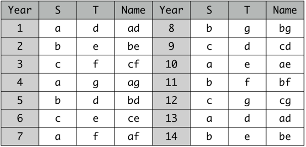

<h1 style='text-align: center;'> A. New Year and Naming</h1>

<h5 style='text-align: center;'>time limit per test: 1 second</h5>
<h5 style='text-align: center;'>memory limit per test: 1024 megabytes</h5>

Happy new year! The year 2020 is also known as Year Gyeongja (경자년, gyeongja-nyeon) in Korea. Where did the name come from? Let's briefly look at the Gapja system, which is traditionally used in Korea to name the years.

There are two sequences of $n$ strings $s_1, s_2, s_3, \ldots, s_{n}$ and $m$ strings $t_1, t_2, t_3, \ldots, t_{m}$. These strings contain only lowercase letters. There might be duplicates among these strings.

Let's call a concatenation of strings $x$ and $y$ as the string that is obtained by writing down strings $x$ and $y$ one right after another without changing the order. For example, the concatenation of the strings "code" and "forces" is the string "codeforces".

The year 1 has a name which is the concatenation of the two strings $s_1$ and $t_1$. When the year increases by one, we concatenate the next two strings in order from each of the respective sequences. If the string that is currently being used is at the end of its sequence, we go back to the first string in that sequence.

For example, if $n = 3, m = 4, s = ${"a", "b", "c"}, $t =$ {"d", "e", "f", "g"}, the following table denotes the resulting year names. 
## Note

 that the names of the years may repeat.

  You are given two sequences of strings of size $n$ and $m$ and also $q$ queries. For each query, you will be given the current year. Could you find the name corresponding to the given year, according to the Gapja system?

### Input

The first line contains two integers $n, m$ ($1 \le n, m \le 20$).

The next line contains $n$ strings $s_1, s_2, \ldots, s_{n}$. Each string contains only lowercase letters, and they are separated by spaces. The length of each string is at least $1$ and at most $10$.

The next line contains $m$ strings $t_1, t_2, \ldots, t_{m}$. Each string contains only lowercase letters, and they are separated by spaces. The length of each string is at least $1$ and at most $10$.

Among the given $n + m$ strings may be duplicates (that is, they are not necessarily all different).

The next line contains a single integer $q$ ($1 \le q \le 2\,020$).

In the next $q$ lines, an integer $y$ ($1 \le y \le 10^9$) is given, denoting the year we want to know the name for.

### Output

Print $q$ lines. For each line, print the name of the year as per the rule described above.

## Example

### Input


```text
10 12
sin im gye gap eul byeong jeong mu gi gyeong
yu sul hae ja chuk in myo jin sa o mi sin
14
1
2
3
4
10
11
12
13
73
2016
2017
2018
2019
2020
```
### Output


```text
sinyu
imsul
gyehae
gapja
gyeongo
sinmi
imsin
gyeyu
gyeyu
byeongsin
jeongyu
musul
gihae
gyeongja
```
## Note

The first example denotes the actual names used in the Gapja system. These strings usually are either a number or the name of some animal.


#### Tags 

#800 #NOT OK #implementation #strings 

## Blogs
- [All Contest Problems](../Hello_2020.md)
- [Hello 2020 (en)](../blogs/Hello_2020_(en).md)
- [Hello 2020 Editorial (en)](../blogs/Hello_2020_Editorial_(en).md)
