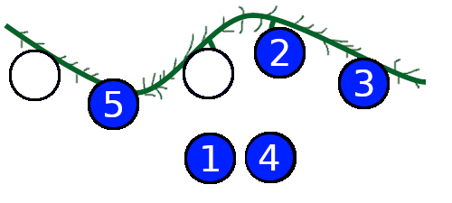

<h1 style='text-align: center;'> A. Garland</h1>

<h5 style='text-align: center;'>time limit per test: 1 second</h5>
<h5 style='text-align: center;'>memory limit per test: 256 megabytes</h5>

Vadim loves decorating the Christmas tree, so he got a beautiful garland as a present. It consists of $n$ light bulbs in a single row. Each bulb has a number from $1$ to $n$ (in arbitrary order), such that all the numbers are distinct. While Vadim was solving problems, his home Carp removed some light bulbs from the garland. Now Vadim wants to put them back on.

Vadim wants to put all bulb back on the garland. Vadim defines complexity of a garland to be the number of pairs of adjacent bulbs with numbers with different parity (remainder of the division by $2$). For example, the complexity of 1 4 2 3 5 is $2$ and the complexity of 1 3 5 7 6 4 2 is $1$.

No one likes complexity, so Vadim wants to minimize the number of such pairs. Find the way to put all bulbs back on the garland, such that the complexity is as small as possible.

#### Input

The first line contains a single integer $n$ ($1 \le n \le 100$) — the number of light bulbs on the garland.

The second line contains $n$ integers $p_1,\ p_2,\ \ldots,\ p_n$ ($0 \le p_i \le n$) — the number on the $i$-th bulb, or $0$ if it was removed.

#### Output

#### Output

 a single number — the minimum complexity of the garland.

## Examples

#### Input


```text
5
0 5 0 2 3
```
#### Output


```text
2
```
#### Input


```text
7
1 0 0 5 0 0 2
```
#### Output


```text
1
```
## Note

In the first example, one should place light bulbs as 1 5 4 2 3. In that case, the complexity would be equal to 2, because only $(5, 4)$ and $(2, 3)$ are the pairs of adjacent bulbs that have different parity.

In the second case, one of the correct answers is 1 7 3 5 6 4 2. 


#### Tags 

#1800 #NOT OK #dp #greedy #sortings 

## Blogs
- [All Contest Problems](../Codeforces_Round_612_(Div._1).md)
- [Codeforces Round #612](../blogs/Codeforces_Round_612.md)
- [Tutorial (en)](../blogs/Tutorial_(en).md)
