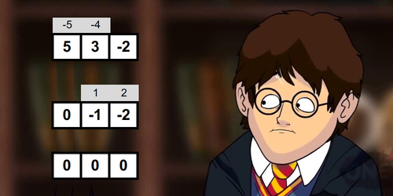

<h1 style='text-align: center;'> F. Harry The Potter</h1>

<h5 style='text-align: center;'>time limit per test: 9 seconds</h5>
<h5 style='text-align: center;'>memory limit per test: 1024 megabytes</h5>

To defeat Lord Voldemort, Harry needs to destroy all horcruxes first. The last horcrux is an array $a$ of $n$ integers, which also needs to be destroyed. The array is considered destroyed if all its elements are zeroes. To destroy the array, Harry can perform two types of operations:

1. choose an index $i$ ($1 \le i \le n$), an integer $x$, and subtract $x$ from $a_i$.
2. choose two indices $i$ and $j$ ($1 \le i, j \le n; i \ne j$), an integer $x$, and subtract $x$ from $a_i$ and $x + 1$ from $a_j$.

## Note

 that $x$ does not have to be positive.

Harry is in a hurry, please help him to find the minimum number of operations required to destroy the array and exterminate Lord Voldemort.

##### Input

The first line contains a single integer $n$ — the size of the array $a$ ($1 \le n \le 20$). 

The following line contains $n$ integers $a_1, a_2, \ldots, a_n$ — array elements ($-10^{15} \le a_i \le 10^{15}$).

##### Output

##### Output

 a single integer — the minimum number of operations required to destroy the array $a$.

## Examples

##### Input


```text
3
1 10 100
```
##### Output


```text
3
```
##### Input


```text
3
5 3 -2
```
##### Output


```text
2
```
##### Input


```text
1
0
```
##### Output


```text
0
```
## Note

In the first example one can just apply the operation of the first kind three times.

In the second example, one can apply the operation of the second kind two times: first, choose $i = 2, j = 1, x = 4$, it transforms the array into $(0, -1, -2)$, and then choose $i = 3, j = 2, x = -2$ to destroy the array.

In the third example, there is nothing to be done, since the array is already destroyed.


#### Tags 

#3100 #NOT OK #brute_force #constructive_algorithms #dp #fft #implementation #math 

## Blogs
- [All Contest Problems](../Codeforces_Round_612_(Div._1).md)
- [Codeforces Round #612](../blogs/Codeforces_Round_612.md)
- [Tutorial (en)](../blogs/Tutorial_(en).md)
