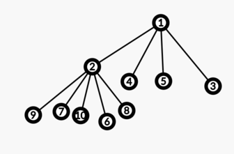

# Tutorial_(en)

### [1287A - Angry Students](../problems/A._Angry_Students.md "Codeforces Round 612 (Div. 2)")

We will take a look at two different solutions.

First has complexity $O(\sum\limits_{i = 0}^{t - 1} {k_i} ^ {2})$. In this solution, we will simulate the events described in the statement. We will simulate every minute. Note that every minute (until we have found the answer) number of angry students will increase by at least $1$, but it is bounded by $k$, so we don't need to simulate more than $k + 1$ minutes.

Assume that $a_i$ describe students' states after $i$ minutes. Then $a_0[j] = 1$ if initially $j$-th student is angry. And $a_i[j] = \max(a_{i - 1}[j], a_{i - 1}[j - 1])$.

Second solution has complexity $O(\sum\limits_{i = 0}^{t - 1} {k_i})$. Note that every angry student will make angry every student between him and the next (closest to the right) angry student. Students will become angry one by one. So for every angry student, we should update the answer by number of patient students till the nearest angry student to the right (or till the end of row.).

 
### [1287B - Hyperset](../problems/B._Hyperset.md "Codeforces Round 612 (Div. 2)")

Firstly, we can notice that two cards uniquely identify the third, which forms a set with them. If the $i$-th feature of two cards is the same, then in the third card also has the same, otherwise, it has a different feature. Thus, we can check all pairs of cards, find their third one, which forms a set with them, and find out if it exists.

Time complexity: $O$($kn^{2}$ $log n$).

 
### [1286A - Garland](https://codeforces.com/contest/1286/problem/A "Codeforces Round 612 (Div. 1)")

The problem can be solved using a greedy algorithm. Notice that the only information we need is parity of numbers on bulbs. So let's replace numbers by their remainders modulo $2$. Than complexity of garland will be the number of pairs of adjacent numbers that are different. Let's call such pairs as bad.

Divide garland into segments of removed bulbs. Let's call number before segment as left border and number after segment as right border. If there's no number before/after the segment than the segment doesn't have left/right border.

Notice that when filling a segment, one should place the same numbers in a row (if any). If the segment has different borders then the optimal way is to place all zeroes near zero-border and all ones near one-border. If the segment has the same borders and we place both numbers in the segment that there will be at least two bad pairs and we will achieve it by placing all zeroes and then all ones. Similarly one could prove cases with the absence of one or two borders.

If the segment has both borders and they are different then this segment always will increase the complexity by $1$. If the segment has both borders and they are different then this segment will increase the complexity by $0$ or $2$. $0$ will be in case we fill segment by numbers of the same parity as its borders. Otherwise, it will be $2$.

If the segment doesn't have at least one of borders, it will increase the complexity by $0$ if all numbers have the same parity as its border (if any) and $1$ otherwise.

So in order to minimize the complexity of garland, first of all, we should fill segments with the same borders by the numbers of the same parity. Obviously we should consider such segments in increasing length order.

Then we should fill segments with only one border such that complexity won't increase.

After that, we can place the remaining numbers arbitrary (but inside one segment we should place the same numbers in a row). Because for all remaining segments number of bad pairs is fixed.

Time complexity is $O(n \log n)$.

Also, this problem could be solved using dynamic programming.

 
### [1286B - Numbers on Tree](https://codeforces.com/contest/1286/problem/B "Codeforces Round 612 (Div. 1)")

There are several approaches to this problem. We will tell one of them. Note that if $c_i$ for some vertex is greater than the number of vertices in its subtree, then there is no answer.

Now we prove that we can always build the answer, so that all $a_i$ will be numbers from $1$ to $n$. On those numbers, let's build some structure that supports deleting elements and searching for k-th element. Let's denote by $d_v$ the number of vertices in the subtree of vertex $v$. Now iterate over the subtree of $v$ in the order of the depth first search. Then let's set $a_v$ = $c_v$-th element in our structure (and after that delete this element). Firstly, such an element will always exist. This is true because when we examine the vertex $v$, all vertices in the subtree of this vertex are not yet considered $\ Rightarrow$ since $c_v \ leq d_v$ $\ Rightarrow$ in our structure there are at least $c_v$ elements. Secondly, the set of all values in the subtree will be a prefix of our structure. If this is true, then the condition that the subtree contains exactly $c_v$ elements smaller than ours is guaranteed to be satisfied (because all elements from our structure that are smaller than ours are there, and we specifically took the $c_v$-th element). Let us prove this fact by induction on the size of the tree. For a tree of size $1$ this is obvious (we always take the first element). Now for size $k$, we have the root on which the number $c_x \ leq k-1$ is written. Then when we throw out $c_x$, and then throw out all the vertices in the subtree, we will remove the prefix of at least $k-1$ vertices, which means that we will drop all the vertices up to $c_x$, as well as some prefix of vertices after it, thus in total we'll throw out some prefix of vertices.

Now, we have reduced the problem to dfs and searching for k-order statistics. This can be done in a variety of ways - segment tree, Fenwick tree, sqrt decomposition, Cartesian tree, or a built-in c++ tree.

Code of the author solution with this tree.

 
### [1286C2 - Madhouse (Hard version)](https://codeforces.com/contest/1286/problem/C2 "Codeforces Round 612 (Div. 1)")

Let's consider the solution that uses $2$ queries with the lengths $n$ and $n-1$ (it asks about too many substrings, so it will not pass all the tests, but it will help us further). Let's ask about substrings $[1..n]$ and $[1..n-1]$. For convenience, rearrange the letters in all strings in alphabetical order. Then note that all the suffixes of $S$ correspond to those strings that we get in the first case, and do not get in the second. Having found all such strings, we can easily find all suffixes of $S$ by looking at them from smaller ones to bigger.

For a complete solution we should first find the first $n / 2$ characters of the string by the solution described above. Then ask about the whole string. Let $cnt_{i, x}$ be the number of times that the symbol $x$ occurs in total in all substrings of length $i$ in the last query. Note that the symbol at position $j$ is counted in $cnt_{i, x}$ exactly $min(i, j, n - j + 1)$ times. Then for all $i$ from $1$ to $n / 2$, the value $cnt_{i + 1, x}$ - $cnt_{i,x}$ is equal to the number of times that $x$ occurs on positions with indices from $i + 1$ to $n - i$. Knowing these quantities, it is possible to find out how many times the element x occurs on positions $i$ and $n - i + 1$ in sum for each $i$ from $1$ to $n / 2$. Since we already know the first half of the string, it is not difficult to restore the character at the position $n - i + 1$, and therefore the entire string.

In total, we asked about the substrings $[1 .. n / 2]$, $[1..n / 2 - 1]$ and $[1..n]$, the total number of substrings received is $\approx \frac{(\frac{n + 1}{2})^2}{2}+ \frac{(\frac{n + 1}{2})^2}{2} + \frac{(n + 1)^2}{2} = 0.75 (n + 1)^2$, and that quite satisfies the limitations of the problem.

 
### [1286D - LCC](https://codeforces.com/contest/1286/problem/D "Codeforces Round 612 (Div. 1)")

Note, that the first collision will occur between two neighboring particles in the original array. These two particles have 3 options to collide: both particles move to the right, both move to the left, they move towards each other. Let's go through these options and calculate the time of the collision. Let's do this for each pair of neighboring vertices and sort them by the collision time. Then the probability that $i$th will occur first is equal to the probability that the first $(i-1)$ collisions will not occur minus the probability that the first i will not occur. To find these probabilities we can use the Segment Tree. In each of its vertices, we will maintain an answer for four masks on which way the first and the last particle of the segment are moving. The answer for the mask is the probability that none of the first $X$ collisions will not occur, and the extreme ones move in accordance with the mask. Then to add a ban for the $(i + 1)$th collision, it is enough to make an update at the point. The final asymptotic is $O(n \cdot 2^4 \cdot \log(n))$

 
### [1286E - Fedya the Potter Strikes Back](https://codeforces.com/contest/1286/problem/E "Codeforces Round 612 (Div. 1)")

Let $ans_{i}$ be the answer for the moment after $i$ queries. Then, $s_{i} = ans_{i} - ans_{i-1}$ is equal to the sum of suspiciousness of suffixes of the string after $i$ queries. If we calculate $s_{i}$, $ans$ will be the prefix sums of this array.

Let's maintain the KMP tree of the string. Each vertex of the tree corresponds to a prefix of the string. Let $S$ be the subset of suffixes, which are equal to the corresponding prefixes. We can note that $S$ is exactly the path from the root to the current vertex in the tree.

Let $s_{v}$ be the next character of vertex of KMP, which corresponds to the prefix with length $v$ (the string is indexed from $0$). Let's find out what happens after adding a new character to the end of the string. Some suffixes from $S$ can't be extended with this character (keeping the condition about equality to the prefix), so they will be removed from the set. Also, if the new character is equal to $s_{0}$, a suffix with length $1$ will be added to the set. These are the only modifications that will be applied to $S$.

We want to find all elements of $S$, which will be removed after a certain query. Let's denote the number of these elements by $r$. If we find them in $O(r)$, the amortized time will be $O(n)$. A suffix can't be extended if and only if the next character of its vertex is not equal to the new character. We need to find all these vertexes on the way up from the last vertex. Let $link_{v}$ be the closest ancestor of $v$ with the different next character (we can calculate it for each vertex when it is added). Let's ascend from vertex $v$. If we are in a vertex with the same next character as in the vertex $v$, then we will go to the $link_{v}$, otherwise, we will handle this vertex as a removing suffix and go to the parent vertex. It's clear that it works in $O(r)$.

Now our task is just adding a suffix with length $1$, removing suffixes and adding an element to all suffixes. We can create a segment tree for minimum on $w$ in order to get the minimum on the removing segment. Let's maintain a mulitset of minimums on current suffixes. So, our queries are:

1. Add element $x$
2. Remove element $x$
3. For each element $a$ make $a = min(a, x)$
4. Get the sum of the elements

Let's store a map from an element to the number of its occurrences. Queries 1 and 2 can be done obviously. To perform the 3-rd query, we can just iterate through elements, which are bigger than $x$, remove them from the map, and add as many elements with value $x$. The amortized complexity of this solution is $O(n \log n)$.

BONUS: solve it when a suspiciousness of a "suspicious" segment is the $mex$ of elements instead of $min$.

[Code](https://codeforces.com/https://pastebin.com/jLts7gVc) (with BigInt realization)

 
### [1286F - Harry The Potter](https://codeforces.com/contest/1286/problem/F "Codeforces Round 612 (Div. 1)")

Assume that we have done $m$ queries of the second type. On the $i$th query we subtracted $x_i$ from $a_{p_i}$ and $x_i + 1$ from $a_{q_i}$. Let's construct undirected graph on $n$ vertices with edges $(p_i, q_i)$. Assume we have a cycle $c_1, c_2, ..., c_k$ in this graph, then, we can replace queries along this cycle with single queries of the first type to each vertex. Therefore, in an optimal answer queries of the second type form a forest. 

Let's call subset good if it size is $k$ and it can be destroyed with $k - 1$ operations of the second type. So, the problem is equivalent to grouping some of the elements of $a_i$ into maximal number of disjoint good subsets. Elements that do not belong to any set can be destroyed with operations of the first type.

Let's find out whether a subset $S$ is good or not. Let's forget about + 1 in a query(e.g. we subtract $x$ and $x$). Consider a sequence of $m$ queries $p_i$, $q_i$, $x_i$ that destroys $S$ and $(p_i, q_i)$ form a connected tree. Let's select an arbitrary vertex of this tree as a root. Then, it is easy to see that for each vertex only its height modulo 2 is matter. Therefore, we can consider only trees of the following structure:

The elements with the even height contribute positive change to the root, the elements with the odd height contribute negative change to the root. So, our problem is equivalent to finding the set $T \subset S$ such that $sum(S \setminus T) - sum(T) = 0$ and $T \neq \emptyset, T \neq S$.

Now we subtract $x$ and $x + 1$. It turns out that it changes the above condition to $sum(S \setminus T) - sum(T) \in \{-|S|, -|S| + 2, ..., |S| - 2, |S|\}$ and $T \neq \emptyset, T \neq S$.

Such set $T$ can be found with MITM in $O((1 + \sqrt{2}) ^ n)$ time (knapsack in $2^{n/2}$ over all subsets).

So, now we know all good subsets. Let $A_{mask} = 1$ if $mask$ is a good subset and $0$ otherwise. Let's denote $A * B$ operation as OR convolution on independent subsets. Suppose $p$ is a minimum integer such that $\underbrace{A * A * ... * A}_\textit{p times} = 0$(e.g. all values of the product array are zero). It is clear that $n - p$ is a minimal number of operations required to destroy the array. OR convolution on independent subsets can be done in $O(n^2 \cdot 2^n)$ time and the minimal power can be estimated in $O(\log{n})$ time. Also, this part can be done with dynamic programming on subsets in $O(3^n)$ time which some participants managed to squeeze.

So, the total time complexity is $O((1 + \sqrt{2})^n + \log{n} \cdot n^2 \cdot 2^n)$.

