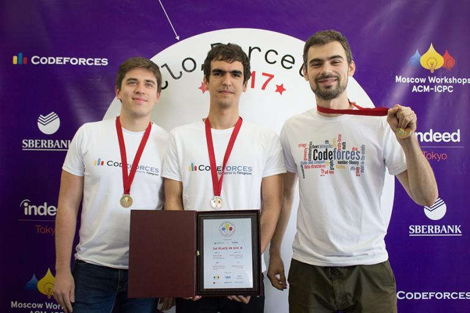

# Announcement

Hello Codeforces!

On [Tuesday, January 14, 2020 at 20:35UTC+6](https://codeforces.com/https://www.timeanddate.com/worldclock/fixedtime.html?day=14&month=1&year=2020&hour=17&min=35&sec=0&p1=166) [Educational Codeforces Round 80 (Rated for Div. 2)](https://codeforces.com/contest/1288 "Educational Codeforces Round 80 (Rated for Div. 2)") will start.

Series of Educational Rounds continue being held as [Harbour.Space University](https://codeforces.com/https://harbour.space/) initiative! You can read the details about the cooperation between [Harbour.Space University](https://codeforces.com/https://harbour.space/) and Codeforces in the [blog post](//codeforces.com/blog/entry/51208).

This round will be **rated for the participants with rating lower than 2100**. It will be held on extended ICPC rules. The penalty for each incorrect submission until the submission with a full solution is 10 minutes. After the end of the contest you will have 12 hours to hack any solution you want. You will have access to copy any solution and test it locally.

You will be given **6 problems** and **2 hours** to solve them.

The problems were invented and prepared by Roman [Roms](https://codeforces.com/profile/Roms "Master Roms") Glazov, Adilbek [adedalic](https://codeforces.com/profile/adedalic "International Master adedalic") Dalabaev, Vladimir [vovuh](https://codeforces.com/profile/vovuh "Master vovuh") Petrov, Ivan [BledDest](https://codeforces.com/profile/BledDest "International Grandmaster BledDest") Androsov, Maksim [Neon](https://codeforces.com/profile/Neon "Candidate Master Neon") Mescheryakov and me. Also huge thanks to Mike [MikeMirzayanov](https://codeforces.com/profile/MikeMirzayanov "Headquarters, MikeMirzayanov") Mirzayanov for great systems Polygon and Codeforces.

Good luck to all the participants!

Our friends at Harbour.Space also have a message for you:

   *Hi Codeforces!* 

*As a special prize for the Educational Round 80, we would like to invite the top 3 participants to take part in our [Hello Muscat ICPC Programming Bootcamp](https://icpc.harbour.space/?utm_source=codeforces&utm_medium=partners), which will take place in Oman, from March 19 to March 25, 2020. The prize will cover the participation fee, accommodation, and half-board meals for the entire duration of the bootcamp (except flights)!* 

***There are three requirements to satisfy:*** 

 * *You took part in at least 10 rated contests on Codeforces*
* *Your max rating should be less than 2400*
* *You should be eligible for ICPC and/or IOI 2020+*

  [Fill out the form→](https://codeforces.com/userForm/aa823c9335ecf7be) *Good luck to everyone!* 

*Note: If you really want to participate, but cannot afford the participation fee, get in touch with us to request a supporting letter for you to show to your university, employer, or local companies. With this letter, you are opening the possibility of being sponsored by them to attend the bootcamp.* 

*Please fill out [this form](https://icpc.harbour.space/support-letter/?utm_source=codeforces&utm_medium=partners) and we’ll send you the support letter within 3 days!* 

Congratulations to the winners: 

| Rank | Competitor | Problems Solved | Penalty |
| --- | --- | --- | --- |
| 1 | [isaf27](https://codeforces.com/profile/isaf27 "International Grandmaster isaf27") | 6 | 150 |
| 2 | [FSTForces](https://codeforces.com/profile/FSTForces "Candidate Master FSTForces") | 6 | 167 |
| 3 | [jiangly](https://codeforces.com/profile/jiangly "International Grandmaster jiangly") | 6 | 178 |
| 4 | [ko_osaga](https://codeforces.com/profile/ko_osaga "International Grandmaster ko_osaga") | 6 | 179 |
| 5 | [jhnan917](https://codeforces.com/profile/jhnan917 "Unrated, jhnan917") | 6 | 184 |

Congratulations to the best hackers: 

| Rank | Competitor | Hack Count |
| --- | --- | --- |
| 1 | [surung9898](https://codeforces.com/profile/surung9898 "Specialist surung9898") | **59****:-2** |
| 2 | [stdmultiset](https://codeforces.com/profile/stdmultiset "Pupil stdmultiset") | **35****:-1** |
| 3 | [B2ej5SjC](https://codeforces.com/profile/B2ej5SjC "Expert B2ej5SjC") | **30** |
| 4 | [spectre_1502](https://codeforces.com/profile/spectre_1502 "Specialist spectre_1502") | **21****:-1** |
| 5 | [Dilemma27](https://codeforces.com/profile/Dilemma27 "Pupil Dilemma27") | **20****:-4** |

 434 successful hacks and 746 unsuccessful hacks were made in total!And finally people who were the first to solve each problem: 

| Problem | Competitor | Penalty |
| --- | --- | --- |
| A | [okwedook](https://codeforces.com/profile/okwedook "Master okwedook") | 0:01 |
| B | [neal](https://codeforces.com/profile/neal "International Grandmaster neal") | 0:04 |
| C | [ko_osaga](https://codeforces.com/profile/ko_osaga "International Grandmaster ko_osaga") | 0:06 |
| D | [RUSH_D_CAT](https://codeforces.com/profile/RUSH_D_CAT "Grandmaster RUSH_D_CAT") | 0:07 |
| E | [peach](https://codeforces.com/profile/peach "Candidate Master peach") | 0:17 |
| F | [jiangly](https://codeforces.com/profile/jiangly "International Grandmaster jiangly") | 1:13 |

**UPD:** [The editorial is out](Tutorial.md)

