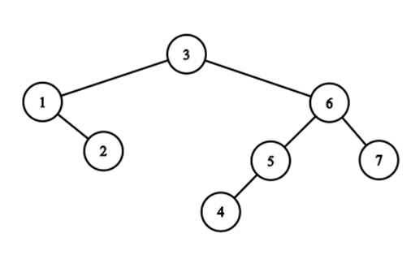
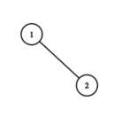
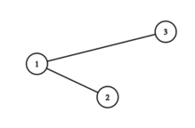
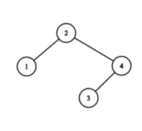
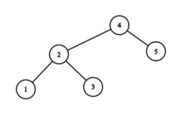

<h1 style='text-align: center;'> E. Cartesian Tree </h1>

<h5 style='text-align: center;'>time limit per test: 5 seconds</h5>
<h5 style='text-align: center;'>memory limit per test: 256 megabytes</h5>

Ildar is the algorithm teacher of William and Harris. Today, Ildar is teaching Cartesian Tree. However, Harris is sick, so Ildar is only teaching William.

A cartesian tree is a rooted tree, that can be constructed from a sequence of distinct integers. We build the cartesian tree as follows:

1. If the sequence is empty, return an empty tree;
2. Let the position of the maximum element be $x$;
3. Remove element on the position $x$ from the sequence and break it into the left part and the right part (which might be empty) (not actually removing it, just taking it away temporarily);
4. Build cartesian tree for each part;
5. Create a new vertex for the element, that was on the position $x$ which will serve as the root of the new tree. Then, for the root of the left part and right part, if exists, will become the children for this vertex;
6. Return the tree we have gotten.

For example, this is the cartesian tree for the sequence $4, 2, 7, 3, 5, 6, 1$:

  After teaching what the cartesian tree is, Ildar has assigned homework. He starts with an empty sequence $a$.

In the $i$-th round, he inserts an element with value $i$ somewhere in $a$. Then, he asks a question: what is the sum of the sizes of the subtrees for every node in the cartesian tree for the current sequence $a$?

Node $v$ is in the node $u$ subtree if and only if $v = u$ or $v$ is in the subtree of one of the vertex $u$ children. The size of the subtree of node $u$ is the number of nodes $v$ such that $v$ is in the subtree of $u$.

Ildar will do $n$ rounds in total. The homework is the sequence of answers to the $n$ questions.

The next day, Ildar told Harris that he has to complete the homework as well. Harris obtained the final state of the sequence $a$ from William. However, he has no idea how to find the answers to the $n$ questions. Help Harris!

#### Input

The first line contains a single integer $n$ ($1 \le n \le 150000$).

The second line contains $n$ integers $a_1, a_2, \ldots, a_n$ ($1 \le a_i \le n$). It is guarenteed that each integer from $1$ to $n$ appears in the sequence exactly once.

#### Output

Print $n$ lines, $i$-th line should contain a single integer  — the answer to the $i$-th question.

## Examples

#### Input


```text
5
2 4 1 5 3
```
#### Output


```text
1
3
6
8
11
```
#### Input


```text
6
1 2 4 5 6 3
```
#### Output


```text
1
3
6
8
12
17
```
## Note

After the first round, the sequence is $1$. The tree is

  The answer is $1$.

After the second round, the sequence is $2, 1$. The tree is

  The answer is $2+1=3$.

After the third round, the sequence is $2, 1, 3$. The tree is

  The answer is $2+1+3=6$.

After the fourth round, the sequence is $2, 4, 1, 3$. The tree is

  The answer is $1+4+1+2=8$.

After the fifth round, the sequence is $2, 4, 1, 5, 3$. The tree is

  The answer is $1+3+1+5+1=11$.


#### Tags 

#3300 #NOT OK #data_structures 

## Blogs
- [All Contest Problems](../Codeforces_Round_616_(Div._1).md)
- [Codeforces Round #616 (en)](../blogs/Codeforces_Round_616_(en).md)
- [Tutorial (en)](../blogs/Tutorial_(en).md)
