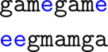
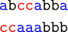

# Tutorial_(en)

Hello everyone, this is the editorial for [Codeforces Round 616 (Div. 1)](https://codeforces.com/contest/1290 "Codeforces Round 616 (Div. 1)") and [Codeforces Round 616 (Div. 2)](https://codeforces.com/contest/1291 "Codeforces Round 616 (Div. 2)")! Along with the solution to each problem, we will have the theme and easter egg solution as well! I hope you all enjoyed our problems ( ´ ▽ ` )b

[1291A - Even But Not Even](../problems/A._Even_But_Not_Even.md "Codeforces Round 616 (Div. 2)")

Author: [265918](https://codeforces.com/profile/265918 "Candidate Master 265918")

 **Tutorial**Tutorial is loading... **Implementation**
```cpp
#include <bits/stdc++.h>

using namespace std;

int main() {
    ios::sync_with_stdio(false);
    cin.tie(nullptr);
    int t; cin >> t;
    while (t--) {
        int n; cin >> n;
        string s; cin >> s;
        int odd = 0;
        for (char c : s) if ((c - '0') & 1) odd++;
        if (odd <= 1) { cout << "-1n"; continue; }
        int cnt = 0;
        for (char c : s) {
            if ((c - '0') & 1) { cout << c; cnt++; }
            if (cnt == 2) break;
        }
        cout << 'n';
    }
    return 0;
}
```
[1291B - Array Sharpening](../problems/B._Array_Sharpening.md "Codeforces Round 616 (Div. 2)")

Author: [hugopm](https://codeforces.com/profile/hugopm "International Master hugopm")

 **Tutorial**Tutorial is loading... **Implementation**
```cpp
#include <bits/stdc++.h>
using namespace std;

int main()
{
    ios::sync_with_stdio(false); cin.tie(0);

    int nbTests; cin >> nbTests;
    while (nbTests--) {
	    int nbElem; cin >> nbElem;
	    vector<int> tab(nbElem);

	    for (int i = 0; i < nbElem; ++i)
		    cin >> tab[i];

	    int prefixEnd = -1, suffixEnd = nbElem;

	    for (int i = 0; i < nbElem; ++i) {
		    if (tab[i] < i) break;
		    prefixEnd = i;
	    }
	    for (int i = nbElem-1; i >= 0; --i) {
		    if (tab[i] < (nbElem-1)-i) break;
		    suffixEnd = i;
	    }

	    if (suffixEnd <= prefixEnd) // Non-empty intersection
		    cout << "Yesn";
	    else
		    cout << "Non";
    }
}
```
[1290A - Mind Control](https://codeforces.com/contest/1290/problem/A "Codeforces Round 616 (Div. 1)")

Author: [Ari](https://codeforces.com/profile/Ari "Master Ari")

 **Tutorial**Tutorial is loading... **Implementation (quadratic)**
```cpp
#include <bits/stdc++.h>
using namespace std;

int main()
{
    ios::sync_with_stdio(false); cin.tie(0);

    int nbTests; cin >> nbTests;
    while (nbTests--) {
	    int nbElem, pos, nbControl;
	    cin >> nbElem >> pos >> nbControl;

	    int before = pos-1, behind = nbElem-pos;
	    nbControl = min(nbControl, before);

	    vector<int> tab(nbElem);
	    for (int i = 0; i < nbElem; ++i) cin >> tab[i];

	    int bestStrategy = 0;

	    for (int orderFirst = 0; orderFirst <= nbControl; ++orderFirst) {
		    int strategyAns = (int)(1e9) + 5;
		    for (int opponentFirst = 0; opponentFirst <= before-nbControl; ++opponentFirst) {
			    int caseAns = max(tab[orderFirst + opponentFirst], tab[orderFirst + opponentFirst + behind]); 
			    strategyAns = min(strategyAns, caseAns);
		    }
		    bestStrategy = max(bestStrategy, strategyAns);
	    }

	    cout << bestStrategy << "n";
    }
}
```
 **Implementation (linear)**
```cpp
#include <bits/stdc++.h>
using namespace std;

void solve() {
    int n, m, k;
    cin >> n >> m >> k;
    k = min(k, m - 1);
    vector<int> a(n);
    for(auto &x : a)
        cin >> x;
    vector<int> b;
    for(int i = 0; i < m; i++)
        b.push_back(max(a[i], a[i + n - m]));
    int sz = m - k;
    int ans = 0;
    deque<int> q;
    for(int i = 0, j = 0; i + sz - 1 < m; i++) {
        while(q.size() && q.front() < i)
            q.pop_front();
        while(j < i + sz) {
            while(q.size() && b[q.back()] >= b[j])
                q.pop_back();
            q.push_back(j++);
        }
        ans = max(ans, b[q.front()]);
    }
    cout << ans << 'n';
}

int main() {
    int t;
    cin >> t;
    while(t--)
        solve();
}
```
[1290B - Irreducible Anagrams](https://codeforces.com/contest/1290/problem/B "Codeforces Round 616 (Div. 1)")

Author: [Ari](https://codeforces.com/profile/Ari "Master Ari")

 **Tutorial**
### [1290B - Irreducible Anagrams](https://codeforces.com/contest/1290/problem/B "Codeforces Round 616 (Div. 1)")

We claim that a string has at least one irreducible anagram if and only if one of the following conditions holds:

* Its length is equal to $1$.
* Its first and last characters are different.
* It contains at least three different characters.

Once we have proven this characterization it is easy to solve the problem: For any given query, the first and second conditions are trivial to check, while the third condition can be checked efficiently if we maintain the number of appearances of each character in each prefix of our string. This allows us to answer queries in $O(k)$ where $k = 26$ is the size of our alphabet.

Now let's prove the characterization. Consider any string $s$ with $n = |s| \ge 2$. First note that for any two strings $a$ and $b$ that are anagrams, it is enough to check that no two proper prefixes of them are anagrams for them to be irreducible anagrams, because if $a$ and $b$ are reducible then $a_1$ and $b_1$ are two proper prefixes that are anagrams. We will consider three cases. In what follows all indices are $1$-based.

* If $s[1] \neq s[n]$.Write all occurrences of $s[n]$ in $s$, and then write all the remaining characters of $s$ in any order. Every proper prefix of the resulting string will have more occurrences of $s[n]$ than the corresponding prefix of $s$, so no two of them will be anagrams.

 
* If $s[1] = s[n]$ and $s$ has at least three different characters.Consider the last distinct character that appears in $s$. Write all occurrences of it, followed by all occurrences of $s[n]$, and then write the remaining characters of $s$ in any order. We can check that every proper prefix of the resulting strings contains more occurrences of either this last distinct character, or more occurrences of $s[n]$, than the corresponding prefix of $s$, so no two proper prefixes are anagrams.

 
* If $s[1] = s[n]$ and $s$ has at most two different characters.Assume that $s$ only has characters $a$ and $b$, and that $s[1] = a$. Assume that $s$ has an irreducible anagram $t$. Then $t[1] = b$, as otherwise $s[1, 1]$ and $t[1, 1]$ are anagrams.

Consider the leftmost position $x$ such that the prefix $s[1, x]$ has at least as many appearances of $b$ as $t$. We have $x \le n - 1$ because $s[1, n - 1]$ contains every possible appearance of $b$. Moreover, we have $x > 1$. Now, notice that $t[1, x - 1]$ must have strictly more appearances of $b$ than $s[1, x - 1]$. This is only possible if this prefix had exactly one more appearance of $b$, and then $s[1, x]$ and $t[1, x]$ have the same number of appearances of $b$. But this means that the proper prefixes $s[1, x]$ and $t[1, x]$ are anagrams  — a contradiction.

 
 **Implementation**
```cpp
#include <bits/stdc++.h>
using namespace std;

const int N = 200005;

char s[N];
int n, q, l, r, sum[N][26];

int main() {
    ios_base::sync_with_stdio(false);
    cin.tie(nullptr);
    cin >> (s + 1);
    n = strlen(s + 1);
    for (int i = 1; i <= n; i++) {
        for (int j = 0; j < 26; j++) {
            sum[i][j] = sum[i - 1][j];
        }
        sum[i][s[i] - 'a']++;
    }
    cin >> q;
    while (q--) {
        cin >> l >> r;
        int cnt = 0;
        for (int i = 0; i < 26; i++) {
            cnt += (sum[r][i] - sum[l - 1][i] > 0);
        }
        if (l == r || cnt >= 3 || s[l] != s[r]) {
            cout << "Yesn";
        } else {
            cout << "Non";
        }
    }
}
```
[1290C - Prefix Enlightenment](https://codeforces.com/contest/1290/problem/C "Codeforces Round 616 (Div. 1)")

Author: [hugopm](https://codeforces.com/profile/hugopm "International Master hugopm")

 **Tutorial**Tutorial is loading... **Implementation (preprocess with DFS)**
```cpp
#include <bits/stdc++.h>
using namespace std;
using pii = pair<int, int>;

const int lim = 1000*1000 + 5;
int nbElem, nbSub;
vector<int> subset[lim];
int side[lim];
int isIn[lim][2];
string ini;
int rep = 0;

int drepr[lim]; 
int dsz[lim];
int cnt[lim][2];

int dfind(int x)
{
    if (drepr[x] != x) drepr[x] = dfind(drepr[x]);
    return drepr[x];
}

void add(int cc, int s0, int s1)
{
    cc = dfind(cc);
    rep -= min(cnt[cc][0], cnt[cc][1]);
    cnt[cc][0] = min(lim, cnt[cc][0] + s0);
    cnt[cc][1] = min(lim, cnt[cc][1] + s1);
    rep += min(cnt[cc][0], cnt[cc][1]);
}

void dmerge(int a, int b)
{
    a = dfind(a); b = dfind(b);
    if (a == b) return;
    if (dsz[a] < dsz[b]) swap(a,b);
    add(a, cnt[b][0], cnt[b][1]);
    add(b, -cnt[b][0], -cnt[b][1]);
    dsz[a] += dsz[b];
    drepr[b] = a;
}

void dfs(int nod)
{
    cnt[nod][side[nod]] = 1;
    for (int elem : subset[nod]) {
	    if (isIn[elem][1] == -1) continue;
	    int oth = isIn[elem][0] + isIn[elem][1] - nod;
	    if (side[oth] == -1) {
		    side[oth] = side[nod] ^ (ini[elem] == '0');
		    dfs(oth);
	    }
    }
}

int main()
{
    ios::sync_with_stdio(false);
    cin.tie(0);
    cin >> nbElem >> nbSub;
    cin >> ini;
    fill(side,side+lim,-1);
    iota(drepr,drepr+lim,0);
    fill_n(&isIn[0][0], 2*lim, -1);

    for (int sub = 0; sub < nbSub; ++sub) {
	    int st; cin >> st;
	    subset[sub].resize(st);
	    for (int pos = 0; pos < st; ++pos) {
		    int elem; cin >> elem; --elem;
		    subset[sub][pos] = elem;
		    if (isIn[elem][0] == -1) isIn[elem][0] = sub;
		    else isIn[elem][1] = sub;
	    }
    }

    for (int sub = 0; sub < nbSub; ++sub) {
	    if (side[sub] == -1) {
		    side[sub] = 0;
		    dfs(sub);
	    }
    }

    for (int elem = 0; elem < nbElem; ++elem) {
	    int n0 = isIn[elem][0], n1 = isIn[elem][1];
	    if (n0 != -1 && n1 == -1) {
		    int destroy = side[n0] ^ (ini[elem] == '0');
		    if (destroy == 1) add(n0, 0, lim);
		    else add(n0, lim, 0);	
	    } else if (n0 != -1) {
		    dmerge(n0, n1);
	    }
	    cout << rep << "n";
    }
}
```
 **Implementation (dynamic bipartite DSU)**
```cpp
#include <bits/stdc++.h>
#define fi first
#define se second
using namespace std;

const int N = 1E6 + 5, K = 1E6 + 5, INF = 1E9 + 7;

int n, k, c, v, ans = 0, dsu[K];
char s[N];
vector<int> adj[N];

struct node {
    int l, r, xo;

    node(int _l = 0, int _r = 0, int _xo = 0) : l(_l), r(_r), xo(_xo) {}

    int get() {
        return min(l, r);
    }

    inline void operator+=(node oth) {
        l = min(INF, l + oth.l);
        r = min(INF, r + oth.r);
    }
} val[K];

pair<int, int> trace(int u) {
    if (dsu[u] < 0) {
        return {u, 0};
    } else {
        pair<int, int> tmp = trace(dsu[u]);
        dsu[u] = tmp.fi;
        val[u].xo ^= tmp.se;
        return {dsu[u], val[u].xo};
    }
}

int main() {
    ios_base::sync_with_stdio(false);
    cin.tie(nullptr);
    cin >> n >> k >> (s + 1);
    for (int i = 1; i <= k; i++) {
        dsu[i] = -1;
        val[i] = node(1, 0, 0);
        cin >> c;
        while (c--) {
            cin >> v;
            adj[v].push_back(i);
        }
    }
    for (int i = 1; i <= n; i++) {
        int typ = (s[i] - '0') ^ 1;
        if (ans != -1) {
            if (adj[i].size() == 1) {
                pair<int, int> u = trace(adj[i][0]);
                ans -= val[u.fi].get();
                val[u.fi] += node((u.se == typ) * INF, (u.se != typ) * INF);
                ans += val[u.fi].get();
            } else if (adj[i].size() == 2) {
                pair<int, int> u = trace(adj[i][0]);
                pair<int, int> v = trace(adj[i][1]);
                if (u.fi != v.fi) {
                    ans -= val[u.fi].get() + val[v.fi].get();
                    if (dsu[u.fi] > dsu[v.fi]) {
                        swap(u, v);
                    }
                    if (u.se ^ v.se ^ typ) {
                        swap(val[v.fi].l, val[v.fi].r);
                        val[v.fi].xo = 1;
                    }
                    dsu[u.fi] += dsu[v.fi];
                    dsu[v.fi] = u.fi;
                    val[u.fi] += val[v.fi];
                    ans += val[u.fi].get();
                }
            }
        }
        cout << ans << 'n';
    }
}
```
[1290D - Coffee Varieties (hard version)](https://codeforces.com/contest/1290/problem/D "Codeforces Round 616 (Div. 1)")

Author: [hugopm](https://codeforces.com/profile/hugopm "International Master hugopm")

 **Tutorial**Tutorial is loading... **Implementation**
```cpp
#include <bits/stdc++.h>
using namespace std;

bool ask(int pos)
{
    cout << "? " << pos+1 << endl << flush;
    char c; cin >> c;
    if (c == 'E') exit(0);
    return (c == 'Y');
}

int main()
{
    int nbElem, memSize, nbBlocks;
    cin >> nbElem >> memSize;
    nbBlocks = nbElem / memSize;

    vector<bool> isAlive(nbElem, true);

    for (int startBlock = 0; startBlock < nbBlocks; ++startBlock) {
	    int delta = 0;
	    cout << "R" << endl << flush;
	    for (int iDo = 0; iDo < nbBlocks; ++iDo) {
		    int curBlock = (startBlock+delta+nbBlocks) % nbBlocks;
		    int st = curBlock*memSize;
		    for (int elem = st; elem < st+memSize; ++elem) {
			    if (isAlive[elem]) {
				    if (ask(elem)) isAlive[elem] = false;
			    }
		    }

		    if (delta >= 0) ++delta;
		    delta = -delta;
	    }
    }

    int nbAlive = count(isAlive.begin(), isAlive.end(), true);
    cout << "! " << nbAlive << endl << flush;
}
```
[1290E - Cartesian Tree](https://codeforces.com/contest/1290/problem/E "Codeforces Round 616 (Div. 1)") 

Author: [gamegame](https://codeforces.com/profile/gamegame "International Grandmaster gamegame")

 **Tutorial**Tutorial is loading... **Implementation**
```cpp
#include<bits/stdc++.h>
using namespace std;
typedef long long ll;
const int N=3e5+1;
const int ts=1<<21;
int n;
ll mx[ts],se[ts],mxc[ts];//max, 2nd max, max count
int sz;
ll ch[N];//which values are changed
ll df[N];//change in frequency
void pass(int id,int c){
    if(mx[c]>mx[id]) mx[c]=mx[id];
}
void push(int id){
    pass(id,id*2);
    pass(id,id*2+1);
}
void pull(int id){
    mx[id]=max(mx[id*2],mx[id*2+1]);
    mxc[id]=0;
    if(mx[id]==mx[id*2]) mxc[id]+=mxc[id*2];
    if(mx[id]==mx[id*2+1]) mxc[id]+=mxc[id*2+1];
    se[id]=max(se[id*2],se[id*2+1]);
    if(mx[id*2]!=mx[id]) se[id]=max(se[id],mx[id*2]);
    if(mx[id*2+1]!=mx[id]) se[id]=max(se[id],mx[id*2+1]);
}
void upd(int id,int l,int r,int ql,int qr,int v){
    if(l>qr || r<ql || mx[id]<=v) return;
    if(ql<=l && r<=qr && se[id]<v){
	    ch[++sz]=mx[id];df[mx[id]]-=mxc[id];
	    mx[id]=v;
	    ch[++sz]=mx[id];df[mx[id]]+=mxc[id];
	    return;
    }
    push(id);
    int mid=(l+r)/2;
    upd(id*2,l,mid,ql,qr,v);
    upd(id*2+1,mid+1,r,ql,qr,v);
    pull(id);
}
void upd2(int id,int l,int r,int p,int v){
    if(l==r){
	    ch[++sz]=mx[id];df[mx[id]]-=mxc[id];
	    mx[id]=v;
	    ch[++sz]=mx[id];df[mx[id]]+=mxc[id];
	    return;
    }
    push(id);
    int mid=(l+r)/2;
    if(p<=mid) upd2(id*2,l,mid,p,v);
    else upd2(id*2+1,mid+1,r,p,v);
    pull(id);
}
void build(int id,int l,int r){
    mx[id]=0;mxc[id]=r-l+1;se[id]=-1e9;
    if(l==r) return;
    int mid=(l+r)/2;
    build(id*2,l,mid);
    build(id*2+1,mid+1,r);
}
/////////////////////////////////////////////////
ll bit1[N],bit2[N];
void bupd1(int id,ll v){
    for(int i=id; i<=n ;i+=i&-i) bit1[i]+=v;
}
void bupd2(int id,ll v){
    for(int i=id; i<=n ;i+=i&-i) bit2[i]+=v;
}
ll bqry1(int id){
    ll res=0;
    for(int i=id; i>=1 ;i-=i&-i) res+=bit1[i];
    return res;
}
ll bqry2(int id){
    ll res=0;
    for(int i=id; i>=1 ;i-=i&-i) res+=bit2[i];
    return res;
}
int a[N],p[N];
ll ans[N];
set<int>s,t;
void magic(int mg){
    s.clear();t.clear();build(1,1,n);
    for(int i=1; i<=n ;i++) bit1[i]=bit2[i]=0;
    s.insert(p[1]);//set of existed elements
    t.insert(p[1]);//set of l that maxr[] is not null
    bupd1(p[1],1);
    int mx=p[1];//largest existed position
    upd2(1,1,n,p[1],p[1]);
    bupd2(p[1],-1);
    ll tot=-1;
    for(int i=2; i<=n ;i++){
	    int cur=p[i];
	    auto it=s.lower_bound(cur);
	    bool rm=(it==s.end());//new element is rightmost
	    int nxt=0;
	    if(!rm) nxt=*it;//next
	    if(it==s.begin()){//new element is leftmost
		    tot-=bqry1(cur);bupd2(cur,-1);
		    t.insert(cur);
		    upd2(1,1,n,cur,mx);
	    }
	    else{
		    int prv=*(--it);
		    upd(1,1,n,1,prv,prv);
		    if(rm) mx=cur;
		    else{
			    upd2(1,1,n,nxt,mx);
			    if(t.find(nxt)==t.end()){
				    tot-=bqry1(nxt);bupd2(nxt,-1);
				    t.insert(nxt);
			    }
		    }
		    upd2(1,1,n,*s.begin(),mx);
	    }
	    s.insert(cur);
	    tot+=bqry2(n)-bqry2(cur-1);
	    bupd1(cur,1);
	    for(int j=1; j<=sz ;j++){
		    if(ch[j]!=0 && df[ch[j]]!=0){
			    tot+=df[ch[j]]*bqry1(ch[j]);
			    bupd2(ch[j],df[ch[j]]);
			    df[ch[j]]=0;
		    }
	    }
	    sz=0;
	    ans[i]+=tot;
    }
}
void solve(){
    for(int i=1; i<=n ;i++){
	    p[a[i]]=i;ans[i]=0;
    }
    magic(1);
    for(int i=1; i<=n ;i++) p[i]=n+1-p[i];
    magic(0);
    for(int i=1; i<=n ;i++) ans[i]+=1;
    for(int i=1; i<=n ;i++) cout << ans[i] << 'n';
}
int main(){
    ios::sync_with_stdio(false);
    cin >> n;
    for(int i=1; i<=n ;i++) cin >> a[i];
    solve();
}
```
[1290F - Making Shapes](https://codeforces.com/contest/1290/problem/F "Codeforces Round 616 (Div. 1)")

Author: [Kuroni](https://codeforces.com/profile/Kuroni "International Grandmaster Kuroni")

 **Tutorial**
### [1290F - Making Shapes](https://codeforces.com/contest/1290/problem/F "Codeforces Round 616 (Div. 1)")

Notice that there is a one-to-one correspondent between a non-degenerate convex shape and a non-empty multiset of vectors. That is because, for each shape, we can generate exactly one multiset of vectors by starting at the lowest-leftest point going counter-clockwise (this is possible because no two vectors are parallel); and for each multiset of vectors, we can generate a single convex shape by sorting the vectors by angle then add them in order.

Our problem is now counting the number of multisets of vectors that makes non-degenerate convex shapes that can be contained in a $m \times m$ square. Rather, we denote $c_i$ as the number of times the $i^{th}$ vector appears in our multiset. We need to count the number of arrays $c$ such that:

1. $\displaystyle \sum_{i=1}^{n} c_ix_i = \sum_{i=1}^{n} c_iy_i = 0$
2. $\displaystyle \sum_{1 \leq i \leq n,\, x_i > 0} c_ix_i \leq m$
3. $\displaystyle \sum_{1 \leq i \leq n,\, y_i > 0} c_iy_i \leq m$

Note that the first conditions are equivalent to $\displaystyle \sum_{1 \leq i \leq n,\, x_i < 0} -c_ix_i = \sum_{1 \leq i \leq n,\, x_i > 0} c_ix_i$ and $\displaystyle \sum_{1 \leq i \leq n,\, y_i < 0} -c_iy_i = \sum_{1 \leq i \leq n,\, y_i > 0} c_iy_i$.

For the sake of brevity, let's call $\displaystyle \sum_{1 \leq i \leq n,\, x_i < 0} -c_ix_i$, $\displaystyle \sum_{1 \leq i \leq n,\, x_i > 0} c_ix_i$, $\displaystyle \sum_{1 \leq i \leq n,\, y_i < 0} -c_iy_i$, and $\displaystyle \sum_{1 \leq i \leq n,\, y_i > 0} c_iy_i$ by $nx$, $px$, $ny$, and $py$ respectively.

We will now focus on $\log_2{m}$ layers of the array $c$, the $i^{th}$ layer is represented by a bitmask of $n$ bits, where each bit $j$ is the $i^{th}$ bit in the binary representation of $c_j$. We see that if we iterate over these layers like this, we can slowly construct $nx$, $px$, $ny$, and $py$ bit by bit, and be able to compare them with each other and with $m$. So, we do a dynamic programming solution where we maintain these states:

* The current bit.
* The carry-over value for $nx$.
* The carry-over value for $px$.
* The carry-over value for $ny$.
* The carry-over value for $py$.
* Whether the suffix of $px$ is larger than the suffix of $m$.
* Whether the suffix of $py$ is larger than the suffix of $m$.

When we iterate over the states, we iterate over the bitmask of the current layer and calculate and update on the next states. note that, for $px$ for example, the carry-over value has a limit of $\displaystyle \sum_{i=1}^{\infty} \lfloor \frac{px}{2^i} \rfloor = px$, and $px \leq 4n$, so each carry-over dimension is at most $4n$ (practically they cannot all be $4n$ at the same time, so pre-calculating the bound for each dimension is necessary).

Complexity: $O(\log_2{m} \cdot n^4 \cdot 2^n)$.

 **Implementation**
```cpp
#include <bits/stdc++.h>
using namespace std;

const int N = 5, MX = 4 * N, LG = 31, MOD = 998244353;

int n, m, x[N], y[N];
int px[1 << N], nx[1 << N], py[1 << N], ny[1 << N];
int dp[LG][MX][MX][MX][MX][2][2];

void add(int &x, int y) {
    x += y;
    if (x >= MOD) {
        x -= MOD;
    }
}

int main() {
    ios_base::sync_with_stdio(false);
    cin.tie(nullptr);
    cin >> n >> m;
    for (int i = 0; i < n; i++) {
        cin >> x[i] >> y[i];
    }
    for (int msk = 0; msk < (1 << n); msk++) {
        for (int i = 0; i < n; i++) {
            if (msk >> i & 1) {
                (x[i] < 0 ? nx : px)[msk] += abs(x[i]);
                (y[i] < 0 ? ny : py)[msk] += abs(y[i]);
            }
        }
    }
    int mpx = max(1, px[(1 << n) - 1]);
    int mpy = max(1, py[(1 << n) - 1]);
    int mnx = max(1, nx[(1 << n) - 1]);
    int mny = max(1, ny[(1 << n) - 1]);
    dp[0][0][0][0][0][0][0] = 1;
    for (int lg = 0; (1 << lg) <= m; lg++) {                                // bit position
        for (int cpx = 0; cpx < mpx; cpx++) {                               // carry of positive x
            for (int cpy = 0; cpy < mpy; cpy++) {                           // carry of positive y
                for (int cnx = 0; cnx < mnx; cnx++) {                       // carry of negative x
                    for (int cny = 0; cny < mny; cny++) {                   // carry of negative y
                        for (int sx = 0; sx < 2; sx++) {                    // is the suffix of x greater than the suffix of m
                            for (int sy = 0; sy < 2; sy++) {                // is the suffix of y greater than the suffix of m
                                for (int msk = 0; msk < (1 << n); msk++) {  // iterating over the mask of the current bit position
                                    int spx = cpx + px[msk];
                                    int spy = cpy + py[msk];
                                    int snx = cnx + nx[msk];
                                    int sny = cny + ny[msk];
                                    if (((spx ^ snx) & 1) || ((spy ^ sny) & 1)) {
                                        continue;
                                    }
                                    int bx = spx & 1, by = spy & 1;
                                    int nsx = (bx < (m >> lg & 1) ? 0 : bx > (m >> lg & 1) ? 1 : sx);
                                    int nsy = (by < (m >> lg & 1) ? 0 : by > (m >> lg & 1) ? 1 : sy);
                                    add(dp[lg + 1][spx / 2][spy / 2][snx / 2][sny / 2][nsx][nsy], dp[lg][cpx][cpy][cnx][cny][sx][sy]);
                                }
                            }
                        }
                    }
                }
            }
        }
    }
    cout << (dp[__lg(m) + 1][0][0][0][0][0][0] + MOD - 1) % MOD << 'n';
}
```
#### Theme and easter eggs

 **Spoilers**Oh boi this is gonna be interesting ( ͡° ͜ʖ ͡°)

The theme of the contest can be found by concatenating the first letter of each paragraph of the announcement ( ͡° ͜ʖ ͡°) From now on, we will refer to six-digit codes found in each problem statement as "sauce". ( ͡° ͜ʖ ͡°) 

For [1291A - Even But Not Even](../problems/A._Even_But_Not_Even.md "Codeforces Round 616 (Div. 2)"), the obvious sauces are 177013 and 265918. Along with this, break down the really long number in the sample input, you will get 4 sauces: 222373, 204424, 185217, and 171912.

For [1291B - Array Sharpening](../problems/B._Array_Sharpening.md "Codeforces Round 616 (Div. 2)"), the sauces are 282865, 256988 (found as inline examples for non-sharpened arrays), and 248618 (found in the sample input).

For [1290A - Mind Control](https://codeforces.com/contest/1290/problem/A "Codeforces Round 616 (Div. 1)"), the sauces are 292385 and 213604 (found in the sample input).

For [1290B - Irreducible Anagrams](https://codeforces.com/contest/1290/problem/B "Codeforces Round 616 (Div. 1)"), look at the second sample input. There are 6 queries, concatenate l and r of all queries to get 122153 and 242975.

For [1290C - Prefix Enlightenment](https://codeforces.com/contest/1290/problem/C "Codeforces Round 616 (Div. 1)"), the binary string of the last sample input encodes a sauce into binary. Decode it into decimal to get 299782. Fun side note, while developing this problem, the intended sauce was 299742, but I typed in the wrong code to the binary converter. It turned out to be better btw. ( ͡° ͜ʖ ͡°)

For [1290D - Coffee Varieties (hard version)](https://codeforces.com/contest/1290/problem/D "Codeforces Round 616 (Div. 1)"), the ? queries of the second sample output gives you 264525. Additionally, the ! query gives you page 6 of the sauce. ( ͡° ͜ʖ ͡°)

For [1290E - Cartesian Tree](https://codeforces.com/contest/1290/problem/E "Codeforces Round 616 (Div. 1)") , the permutation of the second sample input gives you 124563.

For [1290F - Making Shapes](https://codeforces.com/contest/1290/problem/F "Codeforces Round 616 (Div. 1)"), the third sample output gives you the sauce 296161.

**UPD**: As I write these lines, 300000 has been born. So unironically, the constraints of [1291B - Array Sharpening](../problems/B._Array_Sharpening.md "Codeforces Round 616 (Div. 2)") and [1290C - Prefix Enlightenment](https://codeforces.com/contest/1290/problem/C "Codeforces Round 616 (Div. 1)") are now sauces. ( ͡° ͜ʖ ͡°)

Hope you have fun with the easter eggs we provided. ( ͡~ ͜ʖ ͡°)

