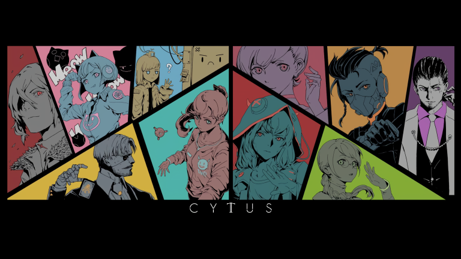

# Codeforces_Round_614_(en)

*"Can you hear me?"*

*"Vanessa...?"*

Hello Codeforces!

We are here to invite you to Codeforces Round #614 (Div. 1) and Codeforces Round #614 (Div. 2), which will take place at [Sunday, January 19, 2020 at 19:35UTC+6](https://codeforces.com/https://www.timeanddate.com/worldclock/fixedtime.html?day=19&month=1&year=2020&hour=16&min=35&sec=0&p1=166). The round is rated for both divisions.

This is our first round including Div.1 parts, hopefully you'll find the problems interesting. ;)

This round is themed based on the Rayark Inc.'s rhythm game, [*"Cytus II"*](https://codeforces.com/https://www.rayark.com/g/cytus2/). You are about to help our characters in various problems, whether inside or outside of the virtual Internet! Also, feel free to listen to the music tracks I've chosen from the game for each problem (and later, editorial!). ;)

Each division will be given **6** problems to solve in **2 hours.** The round's problems were prepared by Xuan-Quang [xuanquang1999](https://codeforces.com/profile/xuanquang1999 "Grandmaster xuanquang1999") D. Nguyen, Duy-Bach [AkiLotus](https://codeforces.com/profile/AkiLotus "Master AkiLotus") Le and Tuan-Dung [low_](https://codeforces.com/profile/low_ "Master low_") To.

Interactive problem(s) might be found in this round. Learn about them [here](https://codeforces.com/blog/entry/45307).

We also want to thanks our friends for helping this contest being possible:

 * Our dear Codeforces coordinator Dmitry [cdkrot](https://codeforces.com/profile/cdkrot "International Grandmaster cdkrot") Sayutin for reviewing our problems, and roasting a whole bunch of them as well. :D
* Grigory [vintage_Vlad_Makeev](https://codeforces.com/profile/vintage_Vlad_Makeev "International Grandmaster vintage_Vlad_Makeev") Reznikov, Quang-Minh [MofK](https://codeforces.com/profile/MofK "Grandmaster MofK") D. Nguyen, Yufan [ouuan](https://codeforces.com/profile/ouuan "Master ouuan") You and [Sulfox](https://codeforces.com/profile/Sulfox "Grandmaster Sulfox") for helping us in preparing and adjusting difficulties of a few problems.
* Anton [antontrygubO_o](https://codeforces.com/profile/antontrygubO_o "International Master antontrygubO_o") Trygub, Duc-Trung [Kuroni](https://codeforces.com/profile/Kuroni "International Grandmaster Kuroni") D. Dang and Duy-Thuc [leduythuc](https://codeforces.com/profile/leduythuc "Master leduythuc") Le for being our testers.

Last but not least, I want to give a huge appreciation to [MikeMirzayanov](https://codeforces.com/profile/MikeMirzayanov "Headquarters, MikeMirzayanov") for the awesome Codeforces and Polygon platform, which makes this contest possible.

**Wish everyone good luck and high rating!**

**UPD1:** Editorial is available [here](https://codeforces.com/https://www.youtube.com/watch?v=h-mUGj41hWA&t=194s).

**UPD2:** Many more testers helped us in this round! Huge thanks to Kevin [ksun48](https://codeforces.com/profile/ksun48 "International Grandmaster ksun48") Sun, Andrew [ecnerwala](https://codeforces.com/profile/ecnerwala "Legendary Grandmaster ecnerwala") He, Aydar [aid](https://codeforces.com/profile/aid "International Grandmaster aid") Sayranov, Nikolay [KAN](https://codeforces.com/profile/KAN "International Grandmaster KAN") Kalinin, Oleg [Mustang98](https://codeforces.com/profile/Mustang98 "Master Mustang98") Vallas, Mohammed [mohammedehab2002](https://codeforces.com/profile/mohammedehab2002 "Master mohammedehab2002") Ehab, Artem [Rox](https://codeforces.com/profile/Rox "Candidate Master Rox") Plotkin, Mingming [Nero](https://codeforces.com/profile/Nero "Master Nero") Zhang, [Darko](https://codeforces.com/profile/Darko "Expert Darko") Aleksic, Ilya [IlyaCk](https://codeforces.com/profile/IlyaCk "Expert IlyaCk") Porublyov, [NatInTheHat](https://codeforces.com/profile/NatInTheHat "Candidate Master NatInTheHat") and [NIWIS](https://codeforces.com/profile/NIWIS "Specialist NIWIS")!

**UPD3:** Score distribution:

 * **Div. 1**: 500-750-1250-1750-2250-2750
* **Div. 2**: 500-750-1250-1500-2000-2500

**UPD4:** **True** editorial is available [here](Tutorial_(en).md)!

**UPD5:** The contest is over. Thanks for participating, and here are the winners:

 * **Div. 1**:

 1. [Um_nik](https://codeforces.com/profile/Um_nik "Legendary Grandmaster Um_nik") (first to solve F)
2. [tourist](https://codeforces.com/profile/tourist "Legendary Grandmaster tourist") (first to solve A, B, D and E)
3. [Benq](https://codeforces.com/profile/Benq "Legendary Grandmaster Benq")
4. [HIR180](https://codeforces.com/profile/HIR180 "International Grandmaster HIR180")
5. [jiangly](https://codeforces.com/profile/jiangly "International Grandmaster jiangly")
6. [TLE](https://codeforces.com/profile/TLE "Legendary Grandmaster TLE")
7. [AprilGrimoire](https://codeforces.com/profile/AprilGrimoire "International Grandmaster AprilGrimoire")
8. [Golovanov399](https://codeforces.com/profile/Golovanov399 "International Grandmaster Golovanov399")
9. [cz_xuyixuan](https://codeforces.com/profile/cz_xuyixuan "International Grandmaster cz_xuyixuan")
10. [fateice](https://codeforces.com/profile/fateice "International Grandmaster fateice")

 * **Div. 2**:

 1. [DestinyFucker9000](https://codeforces.com/profile/DestinyFucker9000 "Expert DestinyFucker9000") (solved all Div.2 problems!)
2. [about](https://codeforces.com/profile/about "Expert about")
3. [Isaunoya](https://codeforces.com/profile/Isaunoya "Expert Isaunoya")
4. [espr1t](https://codeforces.com/profile/espr1t "Expert espr1t")
5. [Nephren](https://codeforces.com/profile/Nephren "Expert Nephren")
6. [the_happy_camel](https://codeforces.com/profile/the_happy_camel "Expert the_happy_camel")
7. [changruinian2020](https://codeforces.com/profile/changruinian2020 "Expert changruinian2020")
8. [Agarifighter](https://codeforces.com/profile/Agarifighter "Specialist Agarifighter")
9. [Small_Pax](https://codeforces.com/profile/Small_Pax "Specialist Small_Pax")
10. [TaeHo0o00o0N](https://codeforces.com/profile/TaeHo0o00o0N "Specialist TaeHo0o00o0N")

Also, as the direct setter of Div1B/Div2D, I sincerely apologized for the weak testsets. I must admit, I underperformed this time, and might cause some of you inconvenience. Hope to see you guys another time with a better contest.

