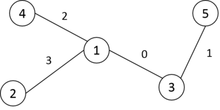

<h1 style='text-align: center;'> C. Xenon's Attack on the Gangs</h1>

<h5 style='text-align: center;'>time limit per test: 3 seconds</h5>
<h5 style='text-align: center;'>memory limit per test: 512 megabytes</h5>

[INSPION FullBand Master - INSPION](https://www.youtube.com/watch?v=kwsciXm_7sA) [INSPION - IOLITE-SUNSTONE](https://www.youtube.com/watch?v=kwsciXm_7sA)On another floor of the A.R.C. Markland-N, the young man Simon "Xenon" Jackson, takes a break after finishing his project early (as always). Having a lot of free time, he decides to put on his legendary hacker "X" instinct and fight against the gangs of the cyber world.

His target is a network of $n$ small gangs. This network contains exactly $n - 1$ direct links, each of them connecting two gangs together. The links are placed in such a way that every pair of gangs is connected through a sequence of direct links.

By mining data, Xenon figured out that the gangs used a form of cross-encryption to avoid being busted: every link was assigned an integer from $0$ to $n - 2$ such that all assigned integers are distinct and every integer was assigned to some link. If an intruder tries to access the encrypted data, they will have to surpass $S$ password layers, with $S$ being defined by the following formula:

$$S = \sum_{1 \leq u < v \leq n} mex(u, v)$$

Here, $mex(u, v)$ denotes the smallest non-negative integer that does not appear on any link on the unique simple path from gang $u$ to gang $v$.

Xenon doesn't know the way the integers are assigned, but it's not a problem. He decides to let his AI's instances try all the passwords on his behalf, but before that, he needs to know the maximum possible value of $S$, so that the AIs can be deployed efficiently.

Now, Xenon is out to write the AI scripts, and he is expected to finish them in two hours. Can you find the maximum possible $S$ before he returns?

#### Input

The first line contains an integer $n$ ($2 \leq n \leq 3000$), the number of gangs in the network.

Each of the next $n - 1$ lines contains integers $u_i$ and $v_i$ ($1 \leq u_i, v_i \leq n$; $u_i \neq v_i$), indicating there's a direct link between gangs $u_i$ and $v_i$.

It's guaranteed that links are placed in such a way that each pair of gangs will be connected by exactly one simple path.

#### Output

Print the maximum possible value of $S$ — the number of password layers in the gangs' network.

## Examples

#### Input


```text
3
1 2
2 3
```
#### Output


```text
3
```
#### Input


```text
5
1 2
1 3
1 4
3 5
```
#### Output


```text
10
```
## Note

In the first example, one can achieve the maximum $S$ with the following assignment:

  With this assignment, $mex(1, 2) = 0$, $mex(1, 3) = 2$ and $mex(2, 3) = 1$. Therefore, $S = 0 + 2 + 1 = 3$.

In the second example, one can achieve the maximum $S$ with the following assignment:

  With this assignment, all non-zero mex value are listed below: 

* $mex(1, 3) = 1$
* $mex(1, 5) = 2$
* $mex(2, 3) = 1$
* $mex(2, 5) = 2$
* $mex(3, 4) = 1$
* $mex(4, 5) = 3$

Therefore, $S = 1 + 2 + 1 + 2 + 1 + 3 = 10$.


#### Tags 

#2300 #NOT OK #combinatorics #dfs_and_similar #dp #greedy #trees 

## Blogs
- [All Contest Problems](../Codeforces_Round_614_(Div._1).md)
- [Codeforces Round #614 (en)](../blogs/Codeforces_Round_614_(en).md)
- [Tutorial (en)](../blogs/Tutorial_(en).md)
