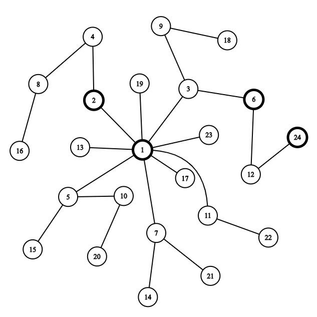

<h1 style='text-align: center;'> D. Chaotic V.</h1>

<h5 style='text-align: center;'>time limit per test: 2 seconds</h5>
<h5 style='text-align: center;'>memory limit per test: 512 megabytes</h5>

[Æsir - CHAOS](https://soundcloud.com/kivawu/aesir-chaos) [Æsir - V.](https://soundcloud.com/kivawu/aesir-v)"Everything has been planned out. No more hidden concerns. The condition of Cytus is also perfect.

The time right now...... 00:01:12......

It's time."

The emotion samples are now sufficient. After almost 3 years, it's time for Ivy to awake her bonded sister, Vanessa.

The system inside A.R.C.'s Library core can be considered as an undirected graph with infinite number of processing nodes, numbered with all positive integers ($1, 2, 3, \ldots$). The node with a number $x$ ($x > 1$), is directly connected with a node with number $\frac{x}{f(x)}$, with $f(x)$ being the lowest prime divisor of $x$.

Vanessa's mind is divided into $n$ fragments. Due to more than 500 years of coma, the fragments have been scattered: the $i$-th fragment is now located at the node with a number $k_i!$ (a factorial of $k_i$).

To maximize the chance of successful awakening, Ivy decides to place the samples in a node $P$, so that the total length of paths from each fragment to $P$ is smallest possible. If there are multiple fragments located at the same node, the path from that node to $P$ needs to be counted multiple times.

In the world of zeros and ones, such a requirement is very simple for Ivy. Not longer than a second later, she has already figured out such a node.

But for a mere human like you, is this still possible?

For simplicity, please answer the minimal sum of paths' lengths from every fragment to the emotion samples' assembly node $P$.

###### Input

The first line contains an integer $n$ ($1 \le n \le 10^6$) — number of fragments of Vanessa's mind.

The second line contains $n$ integers: $k_1, k_2, \ldots, k_n$ ($0 \le k_i \le 5000$), denoting the nodes where fragments of Vanessa's mind are located: the $i$-th fragment is at the node with a number $k_i!$.

###### Output

Print a single integer, denoting the minimal sum of path from every fragment to the node with the emotion samples (a.k.a. node $P$).

As a reminder, if there are multiple fragments at the same node, the distance from that node to $P$ needs to be counted multiple times as well.

## Examples

###### Input


```text
3
2 1 4
```
###### Output


```text
5
```
###### Input


```text
4
3 1 4 4
```
###### Output


```text
6
```
###### Input


```text
4
3 1 4 1
```
###### Output


```text
6
```
###### Input


```text
5
3 1 4 1 5
```
###### Output


```text
11
```
## Note

Considering the first $24$ nodes of the system, the node network will look as follows (the nodes $1!$, $2!$, $3!$, $4!$ are drawn bold):



For the first example, Ivy will place the emotion samples at the node $1$. From here:

* The distance from Vanessa's first fragment to the node $1$ is $1$.
* The distance from Vanessa's second fragment to the node $1$ is $0$.
* The distance from Vanessa's third fragment to the node $1$ is $4$.

The total length is $5$.

For the second example, the assembly node will be $6$. From here:

* The distance from Vanessa's first fragment to the node $6$ is $0$.
* The distance from Vanessa's second fragment to the node $6$ is $2$.
* The distance from Vanessa's third fragment to the node $6$ is $2$.
* The distance from Vanessa's fourth fragment to the node $6$ is again $2$.

The total path length is $6$.


#### Tags 

#2700 #NOT OK #dp #graphs #greedy #math #number_theory #trees 

## Blogs
- [All Contest Problems](../Codeforces_Round_614_(Div._1).md)
- [Codeforces Round #614 (en)](../blogs/Codeforces_Round_614_(en).md)
- [Tutorial (en)](../blogs/Tutorial_(en).md)
