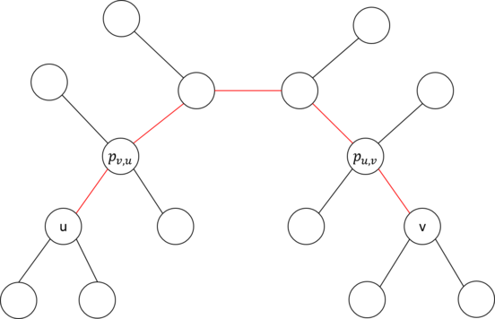
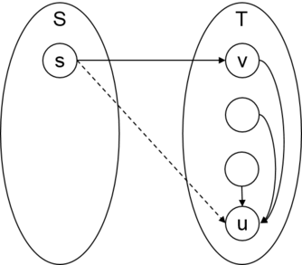
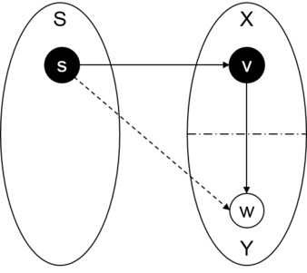
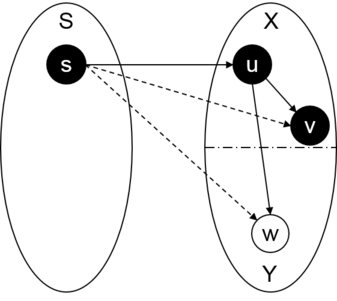

# Tutorial_(en)

All themes written by [AkiLotus](https://codeforces.com/profile/AkiLotus "Master AkiLotus") (I am the only one in the team playing Cytus II anyway :D).

[1293A - ConneR and the A.R.C. Markland-N](../problems/A._ConneR_and_the_A.R.C._Markland-N.md "Codeforces Round 614 (Div. 2)")
---------------------------------------------------------------------------------------------------------------------------

Author: [xuanquang1999](https://codeforces.com/profile/xuanquang1999 "Grandmaster xuanquang1999")  
Development: [xuanquang1999](https://codeforces.com/profile/xuanquang1999 "Grandmaster xuanquang1999"), [AkiLotus](https://codeforces.com/profile/AkiLotus "Master AkiLotus")  
Editorialist: [xuanquang1999](https://codeforces.com/profile/xuanquang1999 "Grandmaster xuanquang1999"), [AkiLotus](https://codeforces.com/profile/AkiLotus "Master AkiLotus") 

 **Tutorial**
### [1293A - ConneR and the A.R.C. Markland-N](../problems/A._ConneR_and_the_A.R.C._Markland-N.md "Codeforces Round 614 (Div. 2)")

[Team Grimoire+あま猫 - Xiorc](https://codeforces.com/https://www.youtube.com/watch?v=QdYIs6-B9WE)Since there's only $k$ closed restaurants, in the worst case we'll only have to walk for $k$ staircases only (one such case would be $s = n$ and all the restaurants from floor $s-k+1$ to $s$ are closed).

Therefore, a brute force solution is possible: try out every distance $x$ from $0$ to $k$. For each, determine if either $s-x$ or $s+x$ is within range $[1, n]$ and not being in the closed list.

The check of an element being a list or not can be done easily by a built-in function in most programming languages, for C++ it would be the "find" function with linear time complexity. Of course one would love to check with set/TreeSet, but for this problem it's an overkill.

Time complexity: $\mathcal{O}(k^2)$.

 **Solution (Akikaze, C++)**Submission link: [69149995](https://codeforces.com/contest/1293/submission/69149995 "Submission 69149995 by AkiLotus")

 **Source code in plain text**
```cpp
#pragma GCC optimize("Ofast")
 
#include <bits/stdc++.h>
using namespace std;
 
#define endl 'n'
 
int n, s, k;
vector<int> a;
 
void Input() {
	cin >> n >> s >> k; a.clear(); a.resize(k);
	for (auto &z: a) cin >> z;
}
 
void Solve() {
	for (int i=0; i<=k; i++) {
		if (s-i >= 1 && find(a.begin(), a.end(), s-i) == a.end()) {cout << i << endl; return;}
		if (s+i <= n && find(a.begin(), a.end(), s+i) == a.end()) {cout << i << endl; return;}
	}
	assert(false); // if reached this line, the solution failed to find a free floor
}
 
int main(int argc, char* argv[]) {
	ios_base::sync_with_stdio(0); cin.tie(NULL);
	int T; cin >> T; while (T--) {Input(); Solve();} return 0;
}
```
 **Solution (Akikaze, Java 8)**Submission link: [69150848](https://codeforces.com/contest/1293/submission/69150848 "Submission 69150848 by AkiLotus")

 **Source code in plain text**
```cpp
import java.io.*;
import java.util.*;

public class Akisolution {
	public static Scanner sc = new Scanner(System.in);
	public static PrintWriter out = new PrintWriter(System.out, true);
	public static int n, s, k;
	public static int[] a;

	public static boolean exist(int[] arr, int x) {
		for (int i=0; i<arr.length; i++) {
			if (arr[i] == x) return true;
		}
		return false;
	}

	public static void Input() {
		n = sc.nextInt(); s = sc.nextInt(); k = sc.nextInt();
		a = new int[k];
		for (int i=0; i<k; i++) a[i] = sc.nextInt();
	}

	public static void Solve() {
		for (int i=0; i<=k; i++) {
			if (s-i >= 1 && !exist(a, s-i)) {out.println(i); return;}
			if (s+i <= n && !exist(a, s+i)) {out.println(i); return;}
		}
		assert false; // if reached this line, the solution failed to find a free floor
	}

	public static void main(String[] args) {
		int t = sc.nextInt();
		while (t-- > 0) {Input(); Solve();}
	}
}
```
 **Solution (Akikaze, Python 3)**Submission link: [69150816](https://codeforces.com/contest/1293/submission/69150816 "Submission 69150816 by AkiLotus")

 **Source code in plain text**
```cpp
T = int(input())
for test_no in range(T):
	n, s, k = map(int, input().split())
	a = list(map(int, input().split()))

	for i in range(0, k+1):
		if s-i >= 1 and not s-i in a: 
			print(i); break
		if s+i <= n and not s+i in a:
			print(i); break
	else: assert(False) 
# if reached this line, the solution failed to find a free floor
```
[1293B - JOE is on TV!](../problems/B._JOE_is_on_TV!.md "Codeforces Round 614 (Div. 2)")
-------------------------------------------------------------------------------------------------------

Author: [AkiLotus](https://codeforces.com/profile/AkiLotus "Master AkiLotus")  
Development: [AkiLotus](https://codeforces.com/profile/AkiLotus "Master AkiLotus")  
Editorialist: [AkiLotus](https://codeforces.com/profile/AkiLotus "Master AkiLotus") 

 **Tutorial**
### [1293B - JOE is on TV!](../problems/B._JOE_is_on_TV!.md "Codeforces Round 614 (Div. 2)")

[Frums - Turnstile Jumper](https://codeforces.com/https://soundcloud.com/frums/turnstile-jumper)This is a greedy problem, with the optimal scenario being each question eliminating a single opponent.

It is easy to see that we will want each question to eliminate one opponent only, since after each elimination, the ratio $t/s$ will be more and more rewarding (as $s$ lowers overtime) - as a result, each elimination should have the lowest possible $t$ (i.e. $t = 1$) so more opponents would have their rewards increased.

Time complexity is $\mathcal{O}(n)$.

 **Solution (Akikaze, C++)**Submission link: [69151243](https://codeforces.com/contest/1293/submission/69151243 "Submission 69151243 by AkiLotus")

 **Source code in plain text**
```cpp
#pragma GCC optimize("Ofast")

#include <bits/stdc++.h>
using namespace std;

#define endl 'n'

int n;

void Input() {
	cin >> n;
}

void Solve() {
	double ans = 0;
	for (int i=1; i<=n; i++) ans += 1.0 / i;
	
	cout << fixed << setprecision(12) << ans << endl;
}

int main(int argc, char* argv[]) {
	ios_base::sync_with_stdio(0); cin.tie(NULL);
	Input(); Solve(); return 0;
}
```
 **Solution (Akikaze, Java 8)**Submission link: [69151737](https://codeforces.com/contest/1293/submission/69151737 "Submission 69151737 by AkiLotus")

 **Source code in plain text**
```cpp
import java.io.*;
import java.util.*;

public class Akisolution {
	public static Scanner sc = new Scanner(System.in);
	public static PrintWriter out = new PrintWriter(System.out, true);
	public static int n;

	public static void Input() {
		n = sc.nextInt();
	}

	public static void Solve() {
		double ans = 0;
		for (int i=1; i<=n; i++) ans += 1.0 / i;

		out.printf("%.12fn", ans);
	}

	public static void main(String[] args) {
		Input(); Solve();
	}
}
```
 **Solution (Akikaze, Python 3)**Submission link: [69151256](https://codeforces.com/contest/1293/submission/69151256 "Submission 69151256 by AkiLotus")

 **Source code in plain text**
```cpp
T = 1
for test_no in range(T):
	n = int(input())
	ans = sum([1.0 / i for i in range(1, n+1)])

	print(ans)
```
[1292A - NEKO's Maze Game](https://codeforces.com/contest/1292/problem/A "Codeforces Round 614 (Div. 1)")
----------------------------------------------------------------------------------------------------------

Author: [xuanquang1999](https://codeforces.com/profile/xuanquang1999 "Grandmaster xuanquang1999")  
Development: [xuanquang1999](https://codeforces.com/profile/xuanquang1999 "Grandmaster xuanquang1999"), [AkiLotus](https://codeforces.com/profile/AkiLotus "Master AkiLotus")  
Editorialist: [AkiLotus](https://codeforces.com/profile/AkiLotus "Master AkiLotus") 

 **Tutorial**
### [1292A - NEKO's Maze Game](https://codeforces.com/contest/1292/problem/A "Codeforces Round 614 (Div. 1)")

[SIHanatsuka - REmorse](https://codeforces.com/https://soundcloud.com/hanatsuka/sihanatsuka-remorse)The main observation is that, it is possible to travel from $(1, 1)$ to $(2, n)$ if and only if there exist no pair of forbidden cell $(1, a)$ and $(2, b)$ such that $|a - b| \le 1$.

Therefore, to answer the query quickly, for every $d$ from $-1$ to $1$, one should keep track of the number of pair $(a, b)$ such that:

* $(1, a)$ and $(2, b)$ are both forbidden.
* $a - b = d$.

One of the methods to do this is: after a cell $(x, y)$ has been swapped, check for all cells $(3-x, y-1)$, $(3-x, y)$, $(3-x, y+1)$ and update the number of pairs based on the status of those cells and new status of $(x, y)$. Since $n \le 10^5$, the status of all cells can be easily kept in a 2D boolean array, and accessed in $\mathcal{O}(1)$ time complexity.

Total complexity: $\mathcal{O}(n + q)$.

 **Video editorial**Video by [Errichto](https://codeforces.com/profile/Errichto "International Grandmaster Errichto"): [https://www.youtube.com/watch?v=mhrvlor1qH0](https://codeforces.com/https://www.youtube.com/watch?v=mhrvlor1qH0)

 **Solution (Akikaze, C++)**Submission link: [69151594](https://codeforces.com/contest/1292/submission/69151594 "Submission 69151594 by AkiLotus")

 **Source code in plain text**
```cpp
#pragma GCC optimize("Ofast")

#include <bits/stdc++.h>
using namespace std;

#define endl 'n'

int n, q;
vector<vector<int>> lava;

void Input() {
	cin >> n >> q;
	lava.resize(2, vector<int>(n, 0));
}

void Solve() {
	int blockedPair = 0;
	while (q--) {
		int x, y; cin >> x >> y; x--; y--;
		int delta = (lava[x][y] == 0) ? +1 : -1;

		lava[x][y] = 1 - lava[x][y];
		for (int dy=-1; dy<=1; dy++) {
			if (y+dy < 0 || y+dy >= n) continue;

			if (lava[1-x][y+dy] == 1) blockedPair += delta;
		}

		cout << ((blockedPair == 0) ? "Yesn" : "Non");
	}
}

int main(int argc, char* argv[]) {
	ios_base::sync_with_stdio(0); cin.tie(NULL);
	Input(); Solve(); return 0;
}
```
 **Solution (Akikaze, Java 8)**Submission link: [69151628](https://codeforces.com/contest/1292/submission/69151628 "Submission 69151628 by AkiLotus")

 **Source code in plain text**
```cpp
import java.io.*;
import java.util.*;

public class Akisolution {
	public static Scanner sc = new Scanner(System.in);
	public static PrintWriter out = new PrintWriter(System.out, true);
	public static int n, q;
	public static int[][] lava;

	public static void Input() {
		n = sc.nextInt(); q = sc.nextInt();
		lava = new int[2][n];
	}

	public static void Solve() {
		int blockedPair = 0;
		while (q-- > 0) {
			int x = sc.nextInt() - 1, y = sc.nextInt() - 1;
			int delta = (lava[x][y] == 0) ? +1 : -1;

			lava[x][y] = 1 - lava[x][y];
			for (int dy=-1; dy<=1; dy++) {
				if (y+dy < 0 || y+dy >= n) continue;

				if (lava[1-x][y+dy] == 1) blockedPair += delta;
			}

			if (blockedPair == 0) out.println("Yes");
			else out.println("No");
		}
	}

	public static void main(String[] args) {
		Input(); Solve();
	}
}
```
 **Solution (Akikaze, Python 3)**Submission link: [69151636](https://codeforces.com/contest/1292/submission/69151636 "Submission 69151636 by AkiLotus")

 **Source code in plain text**
```cpp
T = 1
for test_no in range(T):
	n, q = map(int, input().split())
	lava = [[0 for j in range(n)] for i in range(2)]

	blockedPair = 0
	while q > 0:
		q -= 1
		x, y = map(lambda s: int(s)-1, input().split())
		delta = +1 if lava[x][y] == 0 else -1

		lava[x][y] = 1 - lava[x][y]
		for dy in range(-1, 2):
			if y + dy >= 0 and y + dy < n and lava[1-x][y+dy] == 1:
				blockedPair += delta
		
		if blockedPair == 0: print('Yes')
		else: print('No')
```
[1292B - Aroma's Search](https://codeforces.com/contest/1292/problem/B "Codeforces Round 614 (Div. 1)")
--------------------------------------------------------------------------------------------------------

Author: [AkiLotus](https://codeforces.com/profile/AkiLotus "Master AkiLotus") feat. [xuanquang1999](https://codeforces.com/profile/xuanquang1999 "Grandmaster xuanquang1999")  
Development: [xuanquang1999](https://codeforces.com/profile/xuanquang1999 "Grandmaster xuanquang1999"), [AkiLotus](https://codeforces.com/profile/AkiLotus "Master AkiLotus")  
Editorialist: [AkiLotus](https://codeforces.com/profile/AkiLotus "Master AkiLotus") 

 **Tutorial**
### [1292B - Aroma's Search](https://codeforces.com/contest/1292/problem/B "Codeforces Round 614 (Div. 1)")

[M2U feat. Kaicy - Gravity](https://codeforces.com/https://www.youtube.com/watch?v=cfX1yBMQW3E)First, keep a list of "important" nodes (nodes that are reachable from the starting point with $t$ seconds), and denote this list $[(x_1, y_1), (x_2, y_2), \ldots, (x_k, y_k)]$. Since $a_x, a_y \geq 2$, there are no more than $\log_2(t)$ important nodes (in other words, $k \leq \log_2(t))$. 

In an optimal route, we must first reach a data node in fastest time possible. Suppose that we reach node $z$ first, and we now have $t'$ seconds left.

Let's denote $d(i, j)$ the time required to travel from the $i$-th node to the $j$-th node. $d(i, j)$ is also the Manhattan distance between the $i$-th and the $j$-th node – in other words, $d(i, j) = |x_j - x_i| + |y_j - y_i|$. Since $x_i \geq x_{i-1}$ and $y_i \geq y_{i-1}$, we have $d(u, v) + d(v, w) = d(u, w)$ for all $1 \leq u < v < w \leq k$. Therefore, if we consider all the nodes to stay in a line in such a way that $x_i = x_{i-1} + d(i-1, i)$, the problem is reduced to the following problem:

To solve the above problem, one should notice that it is optimal to collect nodes in a continuous segment. Suppose that we collect all nodes from the $l$-th to $r$-th (for some $l \leq s \leq r$). An optimal route is one of the two below:

* Go from $z$ to $r$ and then go to $l$. The time required for this route is $d(r, z) + d(r, l)$.
* Go from $z$ to $l$ and then go to $r$. The time required for this route is $d(z, l) + d(r, l)$.

Therefore, the minimum amount of energy required to collect all the nodes from $l$-th to $r$-th is $d(r, l) + \min(d(z, l), d(r, z))$.

Since $k$ is small, one can brute-force through all triple of $(l, z, r)$ such that $1 \leq l \leq z \leq r \leq k$ and check if $t$ seconds are enough to go to $i$-th node and then collect all the nodes from $l$-th to $r$-th or not.

The time complexity for that approach is $\mathcal{O}(\log_2(t)^3)$.

However, we can notice that it's always the most optimal to choose $z$ as either $l$ or $r$, for a few reasons: 

* As the aforementioned formula, either $d(z, l)$ or $d(r, z)$ will be counted twice (one there, and one within $d(r, l)$, so having it reduced to $0$ nullifies the exceeded step.
* The distance from $(x_z, y_z)$ to $(x_s, y_s)$ does not break the minimal properties of the endpoint(s) regardless of $(x_s, y_s)$'s position. We can prove it by considering all possible relative positions of $(x_s, y_s)$ over the segment (we'll consider the $x$-coordinates only, $y$-coordinates will have the same properties, without loss of generality):
	+ If $x_s \le x_l$, the distance is minimal at $z = l$.
	+ If $x_r \le x_s$, the distance is minimal at $z = r$.
	+ If $x_l \le x_s \le x_r$, the travelling time in $x$-coordinates is $d(s, z) + d(r, l) + \min(d(z, l), d(r, z))$. One can see that $d(s, z) + \min(d(z, l), d(r, z)) = \min(d(s, l), d(s, r))$, therefore any $z$ (including the endpoints, of course) is equally optimal. Proof for the above formula is trivial.

The optimal solution's time complexity is $\mathcal{O}(\log_2(t)^2)$.

 **Solution (Akikaze, C++)**Submission link: [69152149](https://codeforces.com/contest/1292/submission/69152149 "Submission 69152149 by AkiLotus")

 **Source code in plain text**
```cpp
#pragma GCC optimize("Ofast")

#include <bits/stdc++.h>
using namespace std;

#define endl 'n'

long long x0, y0, ax, ay, bx, by, xs, ys, t;

void Input() {
	cin >> x0 >> y0 >> ax >> ay >> bx >> by;
	cin >> xs >> ys >> t;
}

void Solve() {
	vector<long long> x(1, x0), y(1, y0);
	long long LIMIT = (1LL << 62) - 1;
	while ((LIMIT - bx) / ax >= x.back() && (LIMIT - by) / ay >= y.back()) {
		x.push_back(ax * x.back() + bx); y.push_back(ay * y.back() + by);
	}

	int n = x.size();
	int ans = 0;
	for (int i=0; i<n; i++) {
		for (int j=i; j<n; j++) {
			long long length = x[j] - x[i] + y[j] - y[i];
			long long dist2Left = abs(xs - x[i]) + abs(ys - y[i]);
			long long dist2Right = abs(xs - x[j]) + abs(ys - y[j]);
			if (length <= t - dist2Left || length <= t - dist2Right) ans = max(ans, j-i+1);
		}
	}

	cout << ans << endl;
}

int main(int argc, char* argv[]) {
	ios_base::sync_with_stdio(0); cin.tie(NULL);
	Input(); Solve(); return 0;
}
```
 **Solution (Akikaze, Java 8)**Submission link: [69152154](https://codeforces.com/contest/1292/submission/69152154 "Submission 69152154 by AkiLotus")

 **Source code in plain text**
```cpp
import java.io.*;
import java.util.*;

public class Akisolution {
	public static Scanner sc = new Scanner(System.in);
	public static PrintWriter out = new PrintWriter(System.out, true);
	public static long x0, y0, ax, ay, bx, by, xs, ys, t;

	public static long abs(long x) {return ((x > 0) ? x : -x);}

	public static void Input() {
		x0 = sc.nextLong(); y0 = sc.nextLong();
		ax = sc.nextLong(); ay = sc.nextLong(); bx = sc.nextLong(); by = sc.nextLong();
		xs = sc.nextLong(); ys = sc.nextLong(); t = sc.nextLong();
	}

	public static void Solve() {
		ArrayList<Long> x = new ArrayList<>(), y = new ArrayList<>();
		x.add(x0); y.add(y0);
		long LIMIT = ((long)1 << 62) - 1;
		int n = x.size();
		while ((LIMIT - bx) / ax >= x.get(n - 1) && (LIMIT - by) / ay >= y.get(n - 1)) {
			x.add(ax * x.get(n - 1) + bx); y.add(ay * y.get(n - 1) + by); n++;
		}

		int ans = 0;
		for (int i=0; i<n; i++) {
			for (int j=i; j<n; j++) {
				long length = x.get(j) - x.get(i) + y.get(j) - y.get(i);
				long dist2Left = abs(xs - x.get(i)) + abs(ys - y.get(i));
				long dist2Right = abs(xs - x.get(j)) + abs(ys - y.get(j));
				if (length <= t - dist2Left || length <= t - dist2Right) {
					ans = (ans > j-i+1) ? ans : (j - i + 1);
				}
			}
		}
		
		out.println(ans);
	}

	public static void main(String[] args) {
		Input(); Solve();
	}
}
```
 **Solution (Akikaze, Python 3)**Submission link: [69152156](https://codeforces.com/contest/1292/submission/69152156 "Submission 69152156 by AkiLotus")

 **Source code in plain text**
```cpp
T = 1
for test_no in range(T):
	x0, y0, ax, ay, bx, by = map(int, input().split())
	xs, ys, t = map(int, input().split())

	LIMIT = 2 ** 62 - 1
	x, y = [x0], [y0]
	while ((LIMIT - bx) / ax >= x[-1] and (LIMIT - by) / ay >= y[-1]):
		x.append(ax * x[-1] + bx)
		y.append(ay * y[-1] + by)
	
	n = len(x)
	ans = 0
	for i in range(n):
		for j in range(i, n):
			length = x[j] - x[i] + y[j] - y[i]
			dist2Left = abs(xs - x[i]) + abs(ys - y[i])
			dist2Right = abs(xs - x[j]) + abs(ys - y[j])
			if (length <= t - dist2Left or length <= t - dist2Right): ans = max(ans, j-i+1)
	
	print(ans)
```
[1292C - Xenon's Attack on the Gangs](https://codeforces.com/contest/1292/problem/C "Codeforces Round 614 (Div. 1)")
---------------------------------------------------------------------------------------------------------------------

Author: [xuanquang1999](https://codeforces.com/profile/xuanquang1999 "Grandmaster xuanquang1999")  
Development: [xuanquang1999](https://codeforces.com/profile/xuanquang1999 "Grandmaster xuanquang1999")  
Editorialist: [xuanquang1999](https://codeforces.com/profile/xuanquang1999 "Grandmaster xuanquang1999") 

 **Tutorial**
### [1292C - Xenon's Attack on the Gangs](https://codeforces.com/contest/1292/problem/C "Codeforces Round 614 (Div. 1)")

[A-Tse & KIVΛ - Black Hole](https://codeforces.com/https://soundcloud.com/kivawu/black-hole)The first observation is that, the formula can be rewritten as: 

$$S = \sum_{1 \leq u < v \leq n} mex(u, v) = \sum_{1 \leq x \leq n} \left( \sum_{mex(u, v) = x} x \right) = \sum_{1 \leq x \leq n} \left( \sum_{mex(u, v) \geq x} 1 \right) = \sum_{1 \leq x \leq n} f(x)$$

Where $f(x)$ is number of pairs $(u, v)$ such that $1 \leq u < v \leq n$ and $mex(u, v) \geq x$ (in other word, the path from $u$ to $v$ contains all numbers from $0$ to $x-1$).

Consider the process of placing numbers in order from $0$ to $n-1$ (first place number $0$, then place number $1$, etc.) on edges of the tree. Suppose that the placement for all numbers from $0$ to $x-1$ are fixed, and now we need to place number $x$. To maximize $S$, we should try to place $x$ in a way that there exists a path contain all numbers from $0$ to $x$ (if this is possible).

In other word, in the optimal solution, there will be a path connecting two leaf vertices that contain all numbers from $0$ to $l - 1$ (where $l$ is the number of vertices in that path). The placement of numbers from $l$ to $n-2$ does not matter, since it will not affect the result.

Now, suppose that the location of such path is fixed, and its length is $l$. Let $a$ the sequence of number on edges on the path from $u$ to $v$. One can show that, in other to archive maximum $S$, $a$ must be a 'valley' sequence (there exist some position $p$ such that $a_1 > a_2 > \ldots > a_p < \ldots < a_{l-1} < a_l$.

All the observation above leads to the following dynamic programming solution:

Let $dp[u][v]$ the maximum value of $\sum_{1 \leq x \leq l} f(x)$ if all number from $0$ to $l-1$ are written on the edges on the path from $u$ to $v$ (with $l$ denote the length of that path). We also define:

* $par(r, u)$: the parent of vertex $u$ if we root the tree at vertex $r$.
* $sub(r, u)$: the number of vertices in the subtree of vertex $u$ if we root the tree at vertex $r$.

The figure below demonstrate $par(u, v)$ and $par(v, u)$ for two vertices $u$ and $v$ (in the figure, $p_{u,v}$ is $par(u, v)$ and $p_{v,u}$ is $par(v, u)$).

  To calculate $dp[u][v]$, there are two cases:

* Putting number $l$ on the edge $(u, par(v, u))$. In this case:$$\sum_{1 \leq x \leq l} f(x) = f(l) + \sum_{1 \leq x \leq l-1} f(x) = sub(u, v) \times sub(v, u) + dp[par(v, u)][v]$$
* Putting number $l$ on the edge $(v, par(u, v))$. Similarly, $\sum_{1 \leq x \leq l} f(x) = sub(u, v) \times sub(v, u) + dp[u][par(u, v)]$

The final formula to calculate $dp[u][v]$ is:

$$dp[u][v] = sub(u, v) \times sub(v, u) + \max(dp[par(v, u)][v], dp[u][par(u, v)])$$

The formula can be calculated in $O(1)$ if all the values of $par(r, u)$ and $sub(r, u)$ are calculated (we can preprocess to calculate these value in $\mathcal{O}(n^2)$. by doing performing DFS once from each vertex). Therefore, the overall complexity for this algorithm is $\mathcal{O}(n^2)$.

 **Solution (xuanquang1999, C++)**Submission link: [69152556](https://codeforces.com/contest/1292/submission/69152556 "Submission 69152556 by AkiLotus")

 **Source code in plain text**
```cpp
#include <bits/stdc++.h>

using namespace std;

int n, root;
vector<vector<int>> tree, par, sub;
vector<vector<long long>> dp;

void dfs(int u) {
	sub[root][u] = 1;
	for(int v: tree[u]) {
		if (v == par[root][u])
			continue;
		par[root][v] = u;
		dfs(v);
		sub[root][u] += sub[root][v];
	}
}

long long getDP(int u, int v) {
	if (u == v) return 0;
	if (dp[u][v] != -1) return dp[u][v];

	long long res = sub[u][v] * sub[v][u] + max(getDP(par[v][u], v), getDP(u, par[u][v]));
	return dp[u][v] = res;
}

void input() {
	scanf("%d", &n);

	tree.assign(n, vector<int>());
	for(int i = 0; i < n-1; ++i) {
		int u, v;
		scanf("%d%d", &u, &v);
		--u; --v;
		tree[u].push_back(v); tree[v].push_back(u);
	}
}

void solve() {
	// Preprocessing
	par.assign(n, vector<int>(n, -1));
	sub.assign(n, vector<int>(n, -1));
	for(int u = 0; u < n; ++u) {
		root = u;
		dfs(u);
	}

	// Calculating DP
	dp.assign(n, vector<long long>(n, -1LL));
	long long ans = 0;
	for(int u = 0; u < n; ++u)
		for(int v = 0; v < n; ++v)
			ans = max(ans, getDP(u, v));

	cout << ans << endl;	
}

int main() {
	input();
	solve();

	return 0;
}
```
 **Solution (xuanquang1999, Java 8)**Submission link: [69152568](https://codeforces.com/contest/1292/submission/69152568 "Submission 69152568 by AkiLotus")

 **Source code in plain text**
```cpp
import java.io.PrintWriter;
import java.util.ArrayList;
import java.util.Scanner;

public class Main {
	private static Scanner in;
	private static PrintWriter out;
	
	private static int n, root;
	private static ArrayList<Integer>[] tree;
	private static int[][] par, sub;
	private static long[][] dp;
	
	private static long getDP(int u, int v) {
		if (u == v) return 0;
		if (dp[u][v] != -1) return dp[u][v];

		long res = sub[u][v] * sub[v][u] + Math.max(getDP(par[v][u], v), getDP(u, par[u][v]));
		return dp[u][v] = res;
	}

	private static void dfs(int u) {
		sub[root][u] = 1;
		for(int v: tree[u]) {
			if (v == par[root][u])
				continue;
			par[root][v] = u;
			dfs(v);
			sub[root][u] += sub[root][v];
		}
	}

	private static void input() {
		n = in.nextInt();

		tree = new ArrayList[n];
		for(int u = 0; u < n; ++u)
			tree[u] = new ArrayList<>();
		for(int i = 0; i < n-1; ++i) {
			int u = in.nextInt(), v = in.nextInt();
			u -= 1; v -= 1;
			tree[u].add(v); tree[v].add(u);
		}
	}

	private static void solve() {
		// Preprocessing
		par = new int[n][n];
		sub = new int[n][n];
		for(int u = 0; u < n; ++u) {
			par[u][u] = -1;
			root = u;
			dfs(u);
		}

		// Calculating DP
		dp = new long[n][n];
		for(int u = 0; u < n; ++u)
			for(int v = 0; v < n; ++v)
				dp[u][v] = -1;

		long ans = 0;
		for(int u = 0; u < n; ++u)
			for(int v = 0; v < n; ++v)
				ans = Math.max(ans, getDP(u, v));

		out.println(ans);
	}

	public static void main(String[] args) {
		in = new Scanner(System.in);
		out = new PrintWriter(System.out);

		input();
		solve();

		out.close();
	}
}
```
 **Solution (pajenegod, PyPy3)**Submission link: [72000655](https://codeforces.com/contest/1292/submission/72000655 "Submission 72000655 by pajenegod")

 **Source code in plain text**
```cpp
import sys
 
# Read input and build the graph
inp = [int(x) for x in sys.stdin.buffer.read().split()]; ii = 0
n = inp[ii]; ii += 1
coupl = [[] for _ in range(n)]
for _ in range(n - 1):
    u = inp[ii] - 1; ii += 1
    v = inp[ii] - 1; ii += 1
    coupl[u].append(v)
    coupl[v].append(u)
 
# Relabel to speed up n^2 operations later on
bfs = [0]
found = [0]*n
found[0] = 1
for node in bfs:
    for nei in coupl[node]:
        if not found[nei]:
            found[nei] = 1
            bfs.append(nei)
 
new_label = [0]*n
for i in range(n):
    new_label[bfs[i]] = i
 
coupl = [coupl[i] for i in bfs]
for c in coupl:
    c[:] = [new_label[x] for x in c]
 
##### DP using multisource bfs
 
DP = [0] * (n * n)
size = [1] * (n * n)
P = [-1] * (n * n)
 
# Create the bfs ordering
bfs = [root * n + root for root in range(n)]
for ind in bfs:
    P[ind] = ind
 
for ind in bfs:
    node, root = divmod(ind, n)
    for nei in coupl[node]:
        ind2 = nei * n + root
        if P[ind2] == -1:
            bfs.append(ind2)
            P[ind2] = ind
 
del bfs[:n]
 
# Do the DP
for ind in reversed(bfs):
    node, root = divmod(ind, n)
    ind2 = root * n + node
    pind = P[ind]
    parent = pind//n
    
    
# Update size of (root, parent)
    size[pind] += size[ind]
 
    
# Update DP value of (root, parent)
    DP[pind] = max(DP[pind], max(DP[ind], DP[ind2]) + size[ind] * size[ind2])
print(max(DP[root * n + root] for root in range(n)))
```
 **Additional notes**[pajenegod](https://codeforces.com/profile/pajenegod "Grandmaster pajenegod") uses a variant of BFS dedicated for speed efficiency on Python 3 / PyPy3. More details [here](https://codeforces.com/blog/entry/124286?#comment-1103326).

[1292D - Chaotic V.](https://codeforces.com/contest/1292/problem/D "Codeforces Round 614 (Div. 1)")
----------------------------------------------------------------------------------------------------

Author: [AkiLotus](https://codeforces.com/profile/AkiLotus "Master AkiLotus")  
Development: [AkiLotus](https://codeforces.com/profile/AkiLotus "Master AkiLotus")  
Editorialist: [AkiLotus](https://codeforces.com/profile/AkiLotus "Master AkiLotus") 

 **Tutorial**
### [1292D - Chaotic V.](https://codeforces.com/contest/1292/problem/D "Codeforces Round 614 (Div. 1)")

[Ice - iL](https://codeforces.com/https://soundcloud.com/iceloki/il-1)First of all, one can see that the network is a tree rooted at vertex $1$, thus for each pair of vertices in it there can only be one simple path.

Also, the assembly node $P$ must be on at least one simple path of a fragment to the root (proof by contradiction, explicit solution is trivial).

Let's start with $P$ being node $1$.

From here, moving down to any branch will increase $1$ for each element not being in that branch and decrease $1$ for each element being in, thus we'll only move down to the branch having the most elements until the decreasing cannot outmatch the increasing (in other words, the number of fragments in a branch must be more than half for that branch to be reached).

Given the criteria of the graph, we can see that: two nodes are in the same branch from the root if having the same one largest factor from the prime factorization, they are in the same branch from a depth-1-node if having the same two largest factors, ..., in the same branch from a depth-$k$-node if having the same $k+1$ largest factors.

Keep in mind that here the largest factors can be the duplicated, i.e. in the case of $576 = 2^6 \cdot 3^2$, the two largest factors are $3$ and $3$, and the three largest factors are $3$, $3$ and $2$.

The process will now become factorizing the numbers, and then, cycle by cycle, pop the current largest factor of each number and group them, find out the group (branch) with most occurences and either move on (if the total sum can be lowered) or stop the process.

Since all of these are factorials, the factorizing can be done with a bottom-up dynamic programming fashion.

Also, as $k \le 5000$ and $n \le 10^6$, consider grouping duplicated elements to reduce calculating complexity.

Both factorization and processing has the worst-case complexity of $\mathcal{O}(MAXK^2 \cdot f(MAXK))$, with $k \cdot f(k)$ being the estimated quantity of prime divisors of $k!$.

It's proven that $f(k) = M + \ln \ln k$, with $M$ being the [Meissel-Mertens constant](https://codeforces.com/https://en.wikipedia.org/wiki/Meissel-Mertens_constant).

The proof of this formula is based on the fact this number is calculated through [the sum of the reciprocals of the primes](https://codeforces.com/https://en.wikipedia.org/wiki/Divergence_of_the_sum_of_the_reciprocals_of_the_primes#Proof_that_the_series_exhibits_log-log_growth).

 **Solution (Akikaze, C++)**Submission link: [69153064](https://codeforces.com/contest/1292/submission/69153064 "Submission 69153064 by AkiLotus")

 **Source code in plain text**
```cpp
#pragma GCC optimize("Ofast")

#include <bits/stdc++.h>
using namespace std;

#define endl 'n'

const int MAXK = 5000;
int n; vector<int> cnt(MAXK + 1, 0);
vector<vector<int>> primeExponential(MAXK + 1, vector<int>(MAXK + 1, 0));

void Preprocess() {
	for (int i=2; i<MAXK + 1; i++) {
		for (int j=0; j<MAXK + 1; j++) primeExponential[i][j] += primeExponential[i-1][j];
		int tmp = i;
		for (int x=2; x<=sqrt(tmp); x++) {
			while (tmp % x == 0) {primeExponential[i][x]++; tmp /= x;}
		}
		if (tmp > 1) primeExponential[i][tmp]++;
	}
}

void Input() {
	cin >> n;
	for (int i=0; i<n; i++) {
		int k; cin >> k; cnt[k]++;
	}
}

void Solve() {
	Preprocess();

	vector<int> bestPD(MAXK + 1, 1);
	long long ans = 0, cur = 0;
	for (int i=1; i<MAXK + 1; i++) {
		if (!cnt[i]) {bestPD[i] = 1; continue;}
		for (int j=1; j<MAXK + 1; j++) {
			ans += 1LL * primeExponential[i][j] * cnt[i];
			cur += 1LL * primeExponential[i][j] * cnt[i];
			if (primeExponential[i][j]) bestPD[i] = j;
		}
	}

	while (*max_element(bestPD.begin(), bestPD.end()) > 1) {
		vector<int> frequency(MAXK + 1, 0);

		for (int i=0; i<MAXK + 1; i++) frequency[bestPD[i]] += cnt[i];

		int bestPrime = max_element(frequency.begin(), frequency.end()) - frequency.begin();
		int bestGroup = frequency[bestPrime];
		if (bestGroup * 2 <= n) break;
		if (bestPrime == 1) break;
		cur -= bestGroup; cur += (n - bestGroup); ans = min(ans, cur);

		for (int i=0; i<MAXK + 1; i++) {
			if (bestPD[i] != bestPrime) bestPD[i] = 1;
			if (bestPD[i] == 1) continue;
			primeExponential[i][bestPD[i]] -= 1;
			while (bestPD[i] > 1 && primeExponential[i][bestPD[i]] == 0) bestPD[i]--;
		}
	}

	cout << ans << endl;
}

int main(int argc, char* argv[]) {
	ios_base::sync_with_stdio(0); cin.tie(NULL);
	Input(); Solve(); return 0;
}
```
 **Solution (Akikaze, Java 8)**Submission link: [69153077](https://codeforces.com/contest/1292/submission/69153077 "Submission 69153077 by AkiLotus")

 **Source code in plain text**
```cpp
import java.io.*;
import java.util.*;

public class Akisolution {
	public static Scanner sc = new Scanner(System.in);
	public static PrintWriter out = new PrintWriter(System.out, true);
	public static final int MAXK = 5000;
	public static int n;
	public static int[] cnt = new int[MAXK + 1];
	public static int[][] primeExponential = new int[MAXK + 1][MAXK + 1];

	public static long min(long a, long b) {return ((a < b) ? a : b);}

	public static int max_element(int[] arr) {
		int res = -1000000000;
		for (int i=0; i<arr.length; i++) {
			if (arr[i] > res) res = arr[i];
		}
		return res;
	}

	public static int max_id(int[] arr) {
		int res = -1000000000, id = -1;
		for (int i=0; i<arr.length; i++) {
			if (arr[i] > res) {
				res = arr[i];
				id = i;
			}
		}
		return id;
	}

	public static void Preprocess() {
		for (int i=2; i<MAXK + 1; i++) {
			for (int j=0; j<MAXK + 1; j++) primeExponential[i][j] += primeExponential[i-1][j];
			int tmp = i;
			for (int x=2; x<=Math.sqrt(tmp); x++) {
				while (tmp % x == 0) {primeExponential[i][x]++; tmp /= x;}
			}
			if (tmp > 1) primeExponential[i][tmp]++;
		}
	}

	public static void Input() {
		n = sc.nextInt();
		for (int i=0; i<n; i++) {
			int k = sc.nextInt();
			cnt[k] += 1;
		}
	}

	public static void Solve() {
		Preprocess();

		int[] bestPD = new int[MAXK + 1];
		for (int i=0; i<MAXK + 1; i++) bestPD[i] = 1;
		long ans = 0, cur = 0;
		for (int i=1; i<MAXK + 1; i++) {
			if (cnt[i] == 0) {bestPD[i] = 1; continue;}
			for (int j=1; j<MAXK + 1; j++) {
				ans += (long)primeExponential[i][j] * cnt[i];
				cur += (long)primeExponential[i][j] * cnt[i];
				if (primeExponential[i][j] != 0) bestPD[i] = j;
			}
		}

		while (max_element(bestPD) > 1) {
			int[] frequency = new int[MAXK + 1];

			for (int i=0; i<MAXK + 1; i++) frequency[bestPD[i]] += cnt[i];

			int bestPrime = max_id(frequency);
			int bestGroup = frequency[bestPrime];
			if (bestGroup * 2 <= n) break;
			if (bestPrime == 1) break;
			cur -= bestGroup; cur += (n - bestGroup); ans = min(ans, cur);

			for (int i=0; i<MAXK + 1; i++) {
				if (bestPD[i] != bestPrime) bestPD[i] = 1;
				if (bestPD[i] == 1) continue;
				primeExponential[i][bestPD[i]] -= 1;
				while (bestPD[i] > 1 && primeExponential[i][bestPD[i]] == 0) bestPD[i]--;
			}
		}

		out.println(ans);
	}

	public static void main(String[] args) {
		Input(); Solve();
	}
}
```
 **Solution (Akikaze, PyPy 3)**Submission link: [69153090](https://codeforces.com/contest/1292/submission/69153090 "Submission 69153090 by AkiLotus")

 **Source code in plain text**
```cpp
T = 1
for test_no in range(T):
	MAXK = 5000
	n = int(input())
	cnt = [0] * (MAXK + 1)
	primeExponential = [[0 for j in range(MAXK + 1)] for i in range(MAXK + 1)]

	line, num = (input() + ' '), 0
	for c in line:
		if c != ' ': num = num * 10 + (ord(c) - 48)
		else:
			cnt[num] += 1
			num = 0

	for i in range(2, MAXK + 1):
		for j in range(0, MAXK + 1): primeExponential[i][j] += primeExponential[i-1][j]
		tmp, x = i, 2
		while x * x <= tmp:
			while tmp % x == 0:
				primeExponential[i][x] += 1
				tmp //= x
			x += 1
		if tmp > 1: primeExponential[i][tmp] += 1

	bestPD = [1] * (MAXK + 1)
	ans, cur = 0, 0

	for i in range(1, MAXK + 1):
		if cnt[i] == 0: continue
		for j in range(1, MAXK + 1):
			ans += primeExponential[i][j] * cnt[i]
			cur += primeExponential[i][j] * cnt[i]
			if primeExponential[i][j]: bestPD[i] = j

	frequency = [0] * (MAXK + 1)
	while max(bestPD) > 1:
		for i in range(MAXK + 1): frequency[i] = 0
		for i in range(MAXK + 1): frequency[bestPD[i]] += cnt[i]

		bestGroup = max(frequency)
		bestPrime = frequency.index(bestGroup)
		if bestGroup * 2 <= n: break
		if bestPrime == 1: break
		cur -= bestGroup
		cur += (n - bestGroup); ans = min(ans, cur)

		for i in range(MAXK + 1):
			if bestPD[i] != bestPrime: bestPD[i] = 1
			if bestPD[i] == 1: continue
			primeExponential[i][bestPD[i]] -= 1
			while bestPD[i] > 1 and primeExponential[i][bestPD[i]] == 0: bestPD[i] -= 1

	print(ans)
```
[1292E - Rin and The Unknown Flower](https://codeforces.com/contest/1292/problem/E "Codeforces Round 614 (Div. 1)")
--------------------------------------------------------------------------------------------------------------------

Author: [low_](https://codeforces.com/profile/low_ "Master low_") ([Sulfox](https://codeforces.com/profile/Sulfox "Grandmaster Sulfox") Remix)  
Development: [low_](https://codeforces.com/profile/low_ "Master low_"), [Sulfox](https://codeforces.com/profile/Sulfox "Grandmaster Sulfox"), [AkiLotus](https://codeforces.com/profile/AkiLotus "Master AkiLotus")  
Editorialist: [low_](https://codeforces.com/profile/low_ "Master low_") 

 **Tutorial**
### [1292E - Rin and The Unknown Flower](https://codeforces.com/contest/1292/problem/E "Codeforces Round 614 (Div. 1)")

[Sherwin - The Grand Debate](https://codeforces.com/https://www.youtube.com/watch?v=7QB4rMzTQJc)To be fair, this is a complicated decision tree problem. I recommend instead of heading straight to read the main solutions for this, try to spend some time and come up with at least 2 solutions for the case when the query limit is 5/3 first.

<spoilers> There are many solutions when limit = 5/3, and I'll point 2 of them out. The difference between the two solutions is how you approach the string and build a decision tree out of those queries:

1. The easiest to come up with: disclose every joint of the string (which is equivalent to find every position $i$ that S[i]==S[i+1]). All remaining letters can be filled up with the nearest disclosed letter to it. This can be done by asking 6 queries: "CH", "HC", "CO", "OC", "OH", "HO". If none of the letters is disclosed, then all of the letters are the same. You can disclose all of them by asking 2 more queries of length n and determine what letter is it.

2. The most natural solution (in my opinion): The idea of this is to disclose at least one letter of the string, to disclose the rest with at most one string of length $2$ to $n$ each. We could do this by simply asking "C". This could go either way:

* If a 'C' is disclosed at a position $i$, we can disclose the position $i+1$ with one query of length $2$, $i+2$ with one query of length $3$, ... and so on. From there, undisclose position $i-1$ with a query of length $n-i+1$, $i-2$ with a query of length $n-i+2$, ... and so on.
* If no letter is disclosed, the problem narrows down to solve with a binary string and total cost of $2/3$. There are multiple ways to tackle this so I won't spend any more time to explain this case.

The key here is to come up with a strategy that works in all branches of the decision tree. And to do that, we must find a good starting query/set of queries to begin with.

In the two strategies above, number 1 is too brutal, and number 2 is too naive. But my main solution contains the essences which can be seen in both solutions. The main idea is to find a set of queries to begin with like strat #2 but would give us more hints and cost us less when things go the other way.

We'll start by asking queries with "CH", "CO", "HC", "HO", which in total have cost of $1$. That way, the non-disclosed parts can be one of those:

* Consecutive similar characters.
* A joint starting with "O".

Supposed that after four above queries and no occurrences were found at all, the string can now be only in one of those kinds:

* An entire string constructed by a single character.
* A string of form "OO...XX", with "X" being either "C" or "H". In other words, the string is constructed by $n_0$ characters "O", followed by $n_1$ characters "X" ($n_0 + n_1 = n$).

Proof for this is trivial.

We'll find the trace of large chunks of "C" or "H" (cannot find every trace since the cost limit is very tight here, the minimum length allowed should only be $3$). To do this, we'll ask queries "CCC" and "HHH" sequentially. If any of the two queries return occurrence(s), that means all occurrences of "C" or "H" has been revealed (and also guaranteed to completely inherit the right side of the string), any undisclosed characters on the left will obviously be "O". From here, we can conclude and return the original string.

However, if both queries return nothing, this means either the string contains only "O" characters or there are at most $2$ rightmost characters being "C" or "H". Given this, we ought to find the chunk of "O" by asking query "OOO" (similar logic to the former step). If it returns occurrence(s) and there are still undisclosed characters, we'll need another query of length $n$ to finalize: replacing all of the undisclosed positions to "C" then ask a query with that string, if it returns occurrence then "C" is for the missing characters, otherwise "H" is.

This method works because there will always be one chunk with length at least $3$ (on either end of the string), except two cases: "OOCC" and "OOHH".

You will get to this if all three above queries failed to return anything. However, since this is a matter of picking one from two, a single query of either string will work: the original string is the asked string if occurrence found, otherwise the other.

This is also the worst case in this branch. Total cost would be $1 + 3 \cdot \frac{1}{9} + \frac{1}{16} = 1.3958(3)$ - very close to the limit.

Back to the case that some occurrence(s) are found when after asking the $4$ joint queries. The logic now is pretty similar to strat #2 mentioned above however due to the more varied undisclosed patterns, we'll need to take some extra caution.

First of all, we'll start at the leftmost revealed segment, and disclose any hidden characters to the left of it. It's easy to see that the leftmost revealed character can never be "O", and since the leftmost hidden segment always come in one of two forms similar to the no-occurrence case branch above, you can always reveal the nearest character by assuming it is the same as the current leftmost revealed character and use it as a query to ask. If the assumption is incorrect, then it and any remaining hidden letters to the left of it will be "O".

Now that we have a fully revealed prefix, we'll extend it by revealing letters to the right. For simplicity, let's split into two cases: one when there are revealed letter(s) not within our current prefix, one when there is none.

If such revealed letters are found, consider the one being closest to our prefix. We can see that the hidden gap between our prefix and it can only be produced by some (probably none) characters being the same as our rightmost character in the prefix, followed by some (probably none) characters being the same as our leftmost character outside of the prefix. Thus, we can simply assume the next hidden character is the same as our rightmost in-prefix character, then ask the query. If the assumption is incorrect, fill it and all the remaining hidden characters in that segment with the other one.

If there are none, then the last hidden segment is again, similar to the no-occurrence case branch. However, we have a significant clue this time: our rightmost in-prefix character. If it is not "O", we can quickly fill all the hidden positions with it, otherwise, we'll keep asking query again, assuming the next hidden character is still "O": if incorrect, take another query to ask if either it is "C" or "H", and then fill it and all the other hidden ones.

** Example interaction:

The string is "COHHHH..." ($n = 50$, in other words the string is construct by appending $48$ character "H" to the string "CO").

=> 50

(Finding joints not starting at O)

? CH => 0

? CO => 1 1

? HC => 0

? HO => 0

(Now, the string can be deduced as "CO????...")

? COO => 0 (Assuming that the third character is still "O", sadly it isn't.)

? COC => 0 (Assuming that the third character is still "C", and it isn't either.)

(By now we can deduce the string to be "COHHHH....", since the fourth character and beyond cannot be anything other than "H" (otherwise it would have raised a signal in the joints queries)).

! COHHHH... => 1

** End of example.

The maximum cost for this will be ($i = 3$ because starting from a joint means we have at least $2$ found characters, incremented by $1$ by the character we're about to guess):

$$\displaystyle \max_{4 \le n \le 50} \left( 1 + \sum_{i = 3}^{n} \frac{1}{i^2} + \frac{1}{n^2} \right)$$

With $n$ going to positive infinity, the limit of this function will be $\frac{2 \pi^2 - 3}{12} < 1.4$, therefore this solution still works.

</spoilers>

Big credits to Sooke for making this problem more interesting by pointing out a way to reduce the initial limit (5/3) and make this problem much less trivial.

 **Solution (Akikaze, C++)**Submission link: [69153383](https://codeforces.com/contest/1292/submission/69153383 "Submission 69153383 by AkiLotus")

 **Source code in plain text**
```cpp
#pragma GCC optimize("Ofast")

#include <bits/stdc++.h>
using namespace std;

#define endl 'n'

int n, L, minID;
string s;

void fill(int id, char c) {
	L -= (s[id] == 'L'); s[id] = c;
	minID = min(minID, id);
}

void query(char cmd, string str) {
	cout << cmd << " " << str << endl; cout.flush();
	if (cmd == '?') {
		int k; cin >> k;
		assert(k != -1);
		vector<int> a(k);
		for (auto &z: a) {
			cin >> z; z--;
			for (int i=0; i<str.size(); i++) {
				assert(s[z+i] == 'L' || s[z+i] == str[i]);
				fill(z+i, str[i]);
			}
		}
	}
	else if (cmd == '!') {
		int correct; cin >> correct;
		assert(correct);
	}
}

void Input() {
	cin >> n; s.clear();
	L = n; minID = n; s.resize(n, 'L');
}

void Solve() {
	query('?', "CH"); query('?', "CO");
	query('?', "HC"); query('?', "HO");
	if (L == n) {
		// the string exists in form O...OX...X, with X=C or X=H
		// or it's completely mono-character
		query('?', "CCC");
		if (minID < n) {for (int x=minID-1; x>=0; x--) fill(x, 'O');}
		else {
			query('?', "HHH");
			if (minID < n) {for (int x=minID-1; x>=0; x--) fill(x, 'O');}
			else {
				query('?', "OOO");
				if (minID == n) {
					// obviously n=4
					query('?', "OOCC");
					if (minID == n) {fill(0, 'O'); fill(1, 'O'); fill(2, 'H'); fill(3, 'H');}
				}
				if (s[n-1] == 'L') {
					string t = s; t[n-1] = 'C';
					if (t[n-2] == 'L') t[n-2] = 'C';
					query('?', t);
					if (s[n-1] == 'L') {
						fill(n-1, 'H');
						if (s[n-2] == 'L') fill(n-2, 'H');
					}
				}
			}
		}
	}
	else {
		int maxID = minID; while (maxID < n-1 && s[maxID+1] != 'L') maxID++;
		for (int i=minID-1; i>=0; i--) {
			query('?', s.substr(i+1, 1) + s.substr(minID, maxID-minID+1));
			if (minID != i) {
				for (int x=0; x<=i; x++) fill(x, 'O');
				break;
			}
		}
		int nextFilled;
		for (int i=maxID+1; i<n; i++) {
			if (s[i] != 'L') continue;
			nextFilled = i;
			while (nextFilled < n && s[nextFilled] == 'L') nextFilled++;
			query('?', s.substr(0, i) + s[i-1]);
			if (s[i] == 'L') {
				if (s[i-1] != 'O') fill(i, 'O');
				else {
					if (nextFilled == n) {
						query('?', s.substr(0, i) + 'C');
						if (s[i] == 'L') fill(i, 'H');
						for (int x=i+1; x<nextFilled; x++) fill(x, s[i]);
					}
					else for (int x=i; x<nextFilled; x++) fill(x, s[nextFilled]);
					i = nextFilled - 1;
				}
			}
		}
	}
	query('!', s);
}

int main(int argc, char* argv[]) {
	ios_base::sync_with_stdio(0); cin.tie(NULL);
	int T; cin >> T; while (T--) {Input(); Solve();} return 0;
}
```
 **Solution (Akikaze, Java 8)**Submission link: [69153556](https://codeforces.com/contest/1292/submission/69153556 "Submission 69153556 by AkiLotus")

 **Source code in plain text**
```cpp
import java.io.*;
import java.util.*;

public class Akisolution {
	public static Scanner sc = new Scanner(System.in);

	public static class CPPString {
		// as the Java String is insanely cryptic to modify
		public char[] arr;

		public CPPString() {}
		public CPPString(String str) {this.arr = str.toCharArray();}
		public CPPString(char[] ca) {this.arr = ca;}
		public CPPString(CPPString other) {
			this.arr = new char[other.arr.length];
			for (int i=0; i<other.arr.length; i++) this.arr[i] = other.arr[i];
		}
		public void resize(int length, char defaultChar) {
			this.arr = new char[length];
			for (int i=0; i<length; i++) this.arr[i] = defaultChar;
		}
		public int size() {return this.arr.length;}
		public CPPString substr(int L, int len) {
			// get substring [L, L+len)
			char[] res = new char[len];
			for (int i=0; i<len; i++) res[i] = this.arr[L+i];
			return new CPPString(res);
		}
		public CPPString add(char ch) {
			char[] new_ca = new char[this.arr.length + 1]; new_ca[this.arr.length] = ch;
			for (int i=0; i<this.arr.length; i++) new_ca[i] = this.arr[i];
			return new CPPString(new_ca);
		}
		public CPPString add(CPPString other) {
			char[] new_ca = new char[this.arr.length + other.arr.length];
			for (int i=0; i<this.arr.length; i++) new_ca[i] = this.arr[i];
			for (int i=0; i<other.arr.length; i++) new_ca[this.arr.length + i] = other.arr[i];
			return new CPPString(new_ca);
		}

		@Override
		public String toString() {return new String(arr);}
	}

	public static int n, L, minID;
	public static CPPString s;

	public static void fill(int id, char c) {
		if (s.arr[id] == 'L') L--;
		s.arr[id] = c;
		minID = (minID < id) ? minID : id;
	}

	public static void query(char cmd, CPPString str) {
		System.out.println(cmd + " " + str); System.out.flush();
		System.err.println(cmd + " " + str);
		if (cmd == '?') {
			int k = sc.nextInt();
			assert (k != -1);
			int[] a = new int[k];
			for (int index = 0; index < k; index++) {
				a[index] = sc.nextInt() - 1;
				for (int i=0; i<str.size(); i++) {
					assert (s.arr[a[index]+i] == 'L' || s.arr[a[index]+i] == str.arr[i]);
					fill(a[index]+i, str.arr[i]);
				}
			}
		}
		else if (cmd == '!') {
			int correct = sc.nextInt();
			assert (correct == 1);
		}
	}

	public static void query(char cmd, String str) {
		query(cmd, new CPPString(str));
	}

	public static void Input() {
		n = sc.nextInt(); s = new CPPString();
		L = n; minID = n; s.resize(n, 'L');
	}

	public static void Solve() {
		query('?', "CH"); query('?', "CO");
		query('?', "HC"); query('?', "HO");
		if (L == n) {
			// the string exists in form O...OX...X, with X=C or X=H
			// or it's completely mono-character
			query('?', "CCC");
			if (minID < n) {for (int x=minID-1; x>=0; x--) fill(x, 'O');}
			else {
				query('?', "HHH");
				if (minID < n) {for (int x=minID-1; x>=0; x--) fill(x, 'O');}
				else {
					query('?', "OOO");
					if (minID == n) {
						// obviously n=4
						query('?', "OOCC");
						if (minID == n) {
							fill(0, 'O'); fill(1, 'O');
							fill(2, 'H'); fill(3, 'H');
						}
					}
					if (s.arr[n-1] == 'L') {
						CPPString t = new CPPString(s); t.arr[n-1] = 'C';
						if (t.arr[n-2] == 'L') t.arr[n-2] = 'C';
						query('?', t);
						if (s.arr[n-1] == 'L') {
							fill(n-1, 'H');
							if (s.arr[n-2] == 'L') fill(n-2, 'H');
						}
					}
				}
			}
		}
		else {
			int maxID = minID; while (maxID < n-1 && s.arr[maxID+1] != 'L') maxID++;
			for (int i=minID-1; i>=0; i--) {
				query('?', s.substr(i+1, 1).add(s.substr(minID, maxID-minID+1)));
				if (minID != i) {
					for (int x=0; x<=i; x++) fill(x, 'O');
					break;
				}
			}
			int nextFilled;
			for (int i=maxID+1; i<n; i++) {
				if (s.arr[i] != 'L') continue;
				nextFilled = i;
				while (nextFilled < n && s.arr[nextFilled] == 'L') nextFilled++;
				query('?', s.substr(0, i).add(s.arr[i-1]));
				if (s.arr[i] == 'L') {
					if (s.arr[i-1] != 'O') fill(i, 'O');
					else {
						if (nextFilled == n) {
							query('?', s.substr(0, i).add('C'));
							if (s.arr[i] == 'L') fill(i, 'H');
							for (int x=i+1; x<nextFilled; x++) fill(x, s.arr[i]);
						}
						else for (int x=i; x<nextFilled; x++) fill(x, s.arr[nextFilled]);
						i = nextFilled - 1;
					}
				}
			}
		}
		query('!', s);
	}

	public static void main(String[] args) {
		int T = sc.nextInt();
		while (T-- > 0) {Input(); Solve();}
	}
}
```
 **Solution (Akikaze, Python 3)**Submission link: [69153398](https://codeforces.com/contest/1292/submission/69153398 "Submission 69153398 by AkiLotus")

 **Source code in plain text**
```cpp
import sys
n, L, minID = None, None, None
s = []

def fill(id, c):
	global n, L, s, minID
	L -= (s[id] == 'L')
	s = s[0:id] + c + s[id+1:]
	minID = min(minID, id)

def query(cmd, str):
	global n, L, s, minID
	print(cmd, ''.join(str))
	print(cmd, ''.join(str), file=sys.stderr)
	sys.stdout.flush()
	if (cmd == '?'):
		result = list(map(int, input().split()))
		assert(result[0] != -1)
		for z in result[1:]:
			z -= 1
			for i in range(len(str)):
				assert(s[z+i] == 'L' or s[z+i] == str[i])
				fill(z+i, str[i])
	elif (cmd == '!'):
		correct = int(input())
		assert(correct == 1)

T = int(input())
for test_no in range(T):
	n = int(input())
	L, minID = n, n
	s = 'L' * n

	query('?', "CH")
	query('?', "CO")
	query('?', "HC")
	query('?', "HO")
	if (L == n):
		
# the string exists in form O...OX...X, with X=C or X=H
		
# or it's completely mono-character
		query('?', "CCC")
		if (minID < n): 
			for x in range(minID-1, -1, -1): fill(x, 'O')
		else:
			query('?', "HHH")
			if (minID < n):
				for x in range(minID-1, -1, -1): fill(x, 'O')
			else:
				query('?', "OOO")
				if (minID == n):
					
# obviously n=4
					query('?', "OOCC")
					if (minID == n):
						fill(0, 'O')
						fill(1, 'O')
						fill(2, 'H')
						fill(3, 'H')
				
				if (s[n-1] == 'L'):
					t = s[0:n-1] + 'C'
					if (t[n-2] == 'L'): t = t[0:n-2] + 'C' + t[n-1:]
					query('?', t)
					if (s[n-1] == 'L'):
						fill(n-1, 'H')
						if (s[n-2] == 'L'): fill(n-2, 'H')
	else:
		maxID = minID
		while (maxID < n-1 and s[maxID+1] != 'L'): maxID += 1
		for i in range(minID-1, -1, -1):
			query('?', s[i+1:i+2] + s[minID:maxID+1])
			if (minID != i):
				for x in range(i+1): fill(x, 'O')
				break
		
		nextFilled = None
		i = maxID + 1
		while i < n:
			if (s[i] != 'L'):
				i += 1
				continue
			nextFilled = i
			while (nextFilled < n and s[nextFilled] == 'L'): nextFilled += 1
			query('?', s[0:i] + s[i-1])
			if (s[i] == 'L'):
				if (s[i-1] != 'O'): fill(i, 'O')
				else:
					if (nextFilled == n):
						query('?', s[0:i] + 'C')
						if (s[i] == 'L'): fill(i, 'H')
						for x in range(i+1, nextFilled): fill(x, s[i])
					else:
						for x in range(i, nextFilled): fill(x, s[nextFilled])
					i = nextFilled - 1
			i += 1
	query('!', s)
```
[1292F - Nora's Toy Boxes](https://codeforces.com/contest/1292/problem/F "Codeforces Round 614 (Div. 1)")
----------------------------------------------------------------------------------------------------------

Author: [xuanquang1999](https://codeforces.com/profile/xuanquang1999 "Grandmaster xuanquang1999") × [MofK](https://codeforces.com/profile/MofK "Grandmaster MofK")  
Development: [xuanquang1999](https://codeforces.com/profile/xuanquang1999 "Grandmaster xuanquang1999")  
Editorialist: [xuanquang1999](https://codeforces.com/profile/xuanquang1999 "Grandmaster xuanquang1999") 

 **Tutorial**
### [1292F - Nora's Toy Boxes](https://codeforces.com/contest/1292/problem/F "Codeforces Round 614 (Div. 1)")

[KURORAK - Jakarta PROGRESSION](https://codeforces.com/https://soundcloud.com/kurorak/cytus-ii-jakarta-progression) [3R2 - Starlight (KIVΛ Remix)](https://codeforces.com/https://soundcloud.com/kivawu/starlight-remix)We consider a directed graph $G$, where we draw an edge from vertex $i$ to vertex $j$ if $a_i \mid a_j$. Notice that $G$ is a DAG and is transitive (if $(u, v), (v, w) \in G$ then $(u, w) \in G$).

For each vertex, we consider two states: "on" (not deleted) and "off" (deleted). An edge is "on" if both end vertices are not deleted, and "off" otherwise. The operation is equivalent to choosing a vertices triple $(u, v, w)$ such that $u$, $v$, $w$ are on and $(u, v), (u, w) \in G$; then turn off vertex $w$ and append $a_w$ to the end of $b$.

We first solve the problem for a weakly connected component $C$ (only choosing vertices triple belong to this component in each operation). Define $S$ the set of all vertices with no incoming edges, and $T$ the set of remaining vertices ($T = C - S$). Obviously, vertices in $S$ can't be turned off. We need to figure out the maximum number of vertices in $T$ we can turn off.

We consider the reversed process. Initially, some vertices in $T$ are turned off, and we can turn on a vertex with the following operation: choose a vertices triple $(u, v, w)$ such that $u$, $v$ are on, $w$ is off, and $(u, v), (u, w) \in G$; then turn on $w$ and append $a_w$ to the beginning of $b$. 

Lemma 1: For each vertex $u \in T$, there exist a vertex in $S$ that has an outgoing edge to $u$.

Proof:

Consider a vertex $u \in T$. 

* If $u$ has no incoming edge from another vertex in $T$, $u$ must has an incoming edge from a vertex in $S$ (if not, $u$ have no incoming edge, which mean $u$ should be in $S$ instead of $T$, contradiction).
* Otherwise, let $v$ the vertex with minimum $a_v$ among all vertices in $T$ with an outgoing edge to $u$. $v$ has no incoming edge from another vertex in $T$, so there exist a vertex $s \in S$ that has an outgoing edge to $v$. Since $G$ is transitive and $(v, u), (s, v) \in G$, $s$ has an outgoing edge to $u$. $\blacksquare$

  Lemma 2: If at least one vertex in $T$ is on, we can turn all other vertices in $T$ on.

Proof:

Let's $X$ the set of all vertices in $T$ that is currently on, and $Y$ the set of remaining vertices in $T$ ($Y = T - X$). We will prove that, if $X$ is not empty, we can always turn on a vertex in $Y$. If this is true, starting from the state where $X$ contain only one vertex (and $Y$ contain the remaining vertices of $T$), one can repeat turning on a vertex in $Y$ until all vertices in $T$ are on.

To prove it, we need to show that there exist a vertex in $S$ that has an outgoing edge to some vertex in $X$ and some vertex in $Y$ (so we can choose the triple of three mentioned vertices to turn on a vertex in $Y$). Consider two cases:

* Case 1: There exist some edge $(v, w)$ with $v \in X$ and $w \in Y$.Let $s$ a vertex in $S$ that has an outgoing edge to $v$. Since $G$ is transitive and $(s, v)$, $(v, w)$ are in $G$, $(s, w)$ are also in $G$. In other word, $s \in S$ has an outgoing edge to both $v \in X$ and $w \in Y$.

 
* Case 2: There is no edge from a vertex in $X$ to a vertex in $Y$. In this case, if there exist no vertex in $S$ that has an outgoing edge to some vertex in $X$ and some vertex in $Y$, the component would be divided into two smaller component (one with all vertices in $X$ with their incoming vertices, one with all vertices in $Y$ with their incoming vertices). This contradict the fact that $S$, $X$ and $Y$ are weakly connected. $\blacksquare$

The lemma above give us the maximum length of sequence $B$ we can construct: $|T| - 1$. Now we need to count the number of such sequence $B$. Equivalently, for each vertex $u \in T$, we need to count the number of orders to turn on all other vertices in $T$ (given that $u$ is initially on and all other vertices in $T$ are initially off).

Let $s_1, s_2, \ldots, s_p$ the vertices in $S$ and $t_1, t_2, \ldots, t_m$ the vertices in $T$. First, how can we know whether we can turn on a vertex in $T$, without having to consider the states of other vertices in $T$?

Lemma 3: When perform the above operation, it is sufficient to consider only all triples $(u, v, w)$ such that $u \in S$ and $v, w \in T$.

Proof:

For a vertex $w$ in $T$ that is off, assume that we can turn on $w$ by choosing a triple $(u, v, w)$ such that $u, v \in T$. In other to choose the triple, $u$, $v$ must be on and $(u, v), (u, w) \in G$. Let $s$ the vertex in $S$ that has an outgoing edge to $u$ ($s$ is always on since $s \in S$). Since the graph is transitive, $s$ also has outgoing edges to $v$ and $w$. Therefore, we can turn on $w$ by choosing the triple $(s, v, w)$ instead. $\blacksquare$

  With the above lemma, it is sufficient to only consider, for each vertex $u \in S$, whether there is an on outgoing edge from $u$. We can use a bitmask of length $p$ to represent this information, with $x$-th bit equal $1$ if $s_x$ has an on outgoing edge (and equal $0$ otherwise). For each vertex $t_i \in T$, let $inMask[i]$ the bitmask of length $p$, with $x$-th bit equal $1$ if $s_x$ has an outgoing edge to $t_i$ in $G$.

Let $dp[mask][k]$ the number of distinct box piles of length $k$ ROBO can have, with the $x$-th bit of $mask$ equals $1$ if $s_x$ has an on outgoing edge to a vertex in $T$ that is turned on. For a vertex $t_j$ that is currently off, we can turn on $t_j$ if $inMask[j] \; \\& \; mask \neq 0$.

There are two cases:

* Turn on a currently-off vertex $t_j$ in a way that $mask$ is expanded (some bit(s) $0$ turn into bit(s) $1$). To archive this, we must select $t_j$ in such a way that $inMask[j]$ must not be a subset of $mask$, and we can turn on $t_j$ (if a $t_j$ satisfy these two conditions, we know for sure that $t_j$ is currently off). Therefore, for $1 \le j \leq m$ such that $inMask[j] \nsubseteq mask$ and $inMask[j] \; \\& \; mask \neq 0$, we update the following:$$dp[mask \; | \; inMask[j]][k + 1] = dp[mask \; | \; inMask[j]][k + 1] + dp[mask][k]$$
* Turn on a currently-off vertex $t_j$ in a way that $mask$ is not expanded. Let $cnt(mask)$ be the number of indices j such that $inMask[j] \subseteq mask$. We can turn on one of the $cnt(mask) - k$ vertices that is currently off. Therefore, we update the following:$$dp[mask][k + 1] = dp[mask][k + 1] + dp[mask][k] * (cnt(mask) - k)$$

To solve the general case, we can calculate the number of orders for each weakly connected component separately and then combine the result with some combinatorics formula.

Complexity: $O(2^r * n^2)$, with $r$ the maximum number of vertices with no incoming vertices (number of vertices in set $S$) among all weakly connected component. We will prove that $r \leq \frac{X}{4}$ (where $X$ is the constraint of $n$ and $a_i$), therefore the algorithm fit the given time limit.

Proof:

For simplicity, assume that $X$ is divisible by $4$. Let's focus only on the weakly connected component $C$ with maximum number of vertices (which will equal $r$). Let's define $S$ and $T$ in the same manner as the above solution. Notice that, for all $x$ from $\frac{X}{2}$ to $X$, if $x$ in $S$, then $x$ is a separate weakly connected component. Therefore, all numbers in $S$ should range from $1$ to $\frac{X}{2}$.

On another hand, there should be no number in $S$ that divide another one in $S$. In other word, consider the divisibility graph of all integer from $1$ to $\frac{X}{2}$. Therefore, the size of $S$ cannot exceed the size of the maximum anti-chain (a subset of vertices such that no pair of vertices is connected by an edge) of the graph. The size of the maximum anti-chain of the divisibility graph with vertices from $1$ to $n$ is $\frac{n}{2}$ (proof below). Therefore, the size of $S$ cannot exceed $\frac{\frac{X}{2}}{2} = \frac{X}{4}$, or $r \leq \frac{X}{4}$. $\blacksquare$

Though, for an anti-chain of the divisibility graph with $\frac{X}{2}$ vertices, even if we include all the numbers from $\frac{X}{2} + 1$ to $X$, it may happen that vertices of the anti-chain belong to different weakly connected component. In reality, our [brute-force program](https://codeforces.com/https://ideone.com/zuNsWb) figure out that in the worst case, $r = 11$ (achieved with $a = [2, 11, 13, \ldots, 27, 29, 30, 31, \ldots, 59, 60]$). 

We still need to prove that, for even $n$, the maximum anti-chain of the divisibility graph with vertices from $1$ to $n$ is $\frac{n}{2}$.

Proof:

For any number $x$, let $f(x)$ the number received by continuously divide $x$ by $2$. In other word, let $k$ the maximum value of $i$ such that $x$ is divisible by $2^i$, then $f(x) = \frac{x}{2^k}$. Notice that, for two number $x$ and $y$, if $f(x) = f(y)$ then $x$ divides $y$ or $y$ divides $x$.

For all $x$ from $1$ to $n$, $f(x)$ has at most $\frac{n}{2}$ different value (all odd number from $1$ to $n-1$). For any subset $s$ of integers from $1$ to $n$, if $s$ has $\frac{n}{2} + 1$ elements or more, according to Pigeonhole principle, there are two elements in $s$ that have the same value of $f$. One of these two numbers will divide the other, so $s$ is not an anti-chain. $\blacksquare$

 **Solution (xuanquang1999, C++)**Submission link: [69153931](https://codeforces.com/contest/1292/submission/69153931 "Submission 69153931 by AkiLotus")

 **Source code in plain text**
```cpp
#include <bits/stdc++.h>

using namespace std;

const int MOD = 1000000007;

bool isSubset(int a, int b) {
	return (a & b) == a;
}

bool isIntersect(int a, int b) {
	return (a & b) != 0;
}

void add(int &a, long long b) {
	a = (a + b) % MOD;
}

// Solve for each weakly connected component (WCC)
int cntOrder(vector<int> s, vector<int> t) {
	int p = s.size(), m = t.size();

	vector<int> inMask(m, 0);
	for(int x = 0; x < p; ++x)
		for(int i = 0; i < m; ++i)
			if (t[i] % s[x] == 0)
				inMask[i] |= 1 << x;

	vector<int> cnt(1<<p, 0);
	for(int mask = 0; mask < (1<<p); ++mask)
		for(int i = 0; i < m; ++i)
			if (isSubset(inMask[i], mask))
				++cnt[mask];

	vector<vector<int>> dp(m+1, vector<int>(1<<p, 0));
	for(int i = 0; i < m; ++i)
		dp[1][inMask[i]] += 1;
	for(int k = 1; k < m; ++k) {
		for(int mask = 0; mask < (1<<p); ++mask) {
			for(int i = 0; i < m; ++i)
				if (!isSubset(inMask[i], mask) && isIntersect(inMask[i], mask))
					add(dp[k+1][mask | inMask[i]], dp[k][mask]);
			add(dp[k+1][mask], 1LL * dp[k][mask] * (cnt[mask] - k));
		}
	}

	return dp[m][(1<<p)-1];
}

int n;
vector<int> a, degIn, s, t;
vector<vector<int>> graph;
vector<bool> visited;

void dfs(int u) {
	visited[u] = true;
	if (degIn[u] == 0)
		s.push_back(a[u]);
	else
		t.push_back(a[u]);

	for(int v: graph[u])
		if (!visited[v])
			dfs(v);
}

void input() {
	scanf("%d", &n);
	a.resize(n);
	for(int u = 0; u < n; ++u)
		scanf("%d", &a[u]);
}

void solve() {
	// Pre-calculate C(n, k)
	vector<vector<int>> c(n, vector<int>(n, 0));
	for(int i = 0; i < n; ++i) {
		c[i][0] = 1;
		for(int j = 1; j <= i; ++j)
			c[i][j] = (c[i-1][j-1] + c[i-1][j]) % MOD;
	}

	// Building divisibility graph
	degIn.assign(n, 0);
	graph.assign(n, vector<int>());
	for(int u = 0; u < n; ++u) {
		for(int v = 0; v < n; ++v) {
			if (u != v && a[v] % a[u] == 0) {
				graph[u].push_back(v);
				graph[v].push_back(u);
				++degIn[v];
			}
		}
	}

	// Solve for each WCC of divisibility graph and combine result
	int ans = 1;
	int curLen = 0;
	visited.assign(n, false);
	for(int u = 0; u < n; ++u) {
		if (!visited[u]) {
			s.clear();
			t.clear();
			dfs(u);

			if (!t.empty()) {
				int sz = t.size() - 1;
				int cnt = cntOrder(s, t);

				// Number of orders for current WCC
				ans = (1LL * ans * cnt) % MOD;
				// Number of ways to insert <sz> number to array of <curLen> elements
				ans = (1LL * ans * c[curLen + sz][sz]) % MOD;
				curLen += sz;
			}
		}
	}

	printf("%dn", ans);  
}

int main() {
	input();
	solve();

	return 0;
}
```
 **Solution (xuanquang1999, Java 8)**Submission link: [69153932](https://codeforces.com/contest/1292/submission/69153932 "Submission 69153932 by AkiLotus")

 **Source code in plain text**
```cpp
import java.io.PrintWriter;
import java.util.ArrayList;
import java.util.Scanner;

public class Main {
	private static Scanner in;
	private static PrintWriter out;
	private static final int MOD = (int)1e9 + 7;
	
	private static int n;
	private static int[] a, degIn;
	private static ArrayList<Integer> s, t;
	private static boolean[] visited;
	private static ArrayList<Integer>[] graph;
	
	private static boolean isSubset(int a, int b) {
		return (a & b) == a;
	}

	private static boolean isIntersect(int a, int b) {
		return (a & b) != 0;
	}

	// Solve for each weakly connected component (WCC)
	private static int cntOrder(ArrayList<Integer> s, ArrayList<Integer> t) {
		int p = s.size(), m = t.size();

		int[] inMask = new int[m];
		for(int x = 0; x < p; ++x)
			for(int i = 0; i < m; ++i)
				if (t.get(i) % s.get(x) == 0)
					inMask[i] |= 1 << x;

		int[] cnt = new int[1<<p];
		for(int mask = 0; mask < (1<<p); ++mask)
			for(int i = 0; i < m; ++i)
				if (isSubset(inMask[i], mask))
					++cnt[mask];

		int[][] dp = new int[m+1][1<<p];
		for(int i = 0; i < m; ++i)
			dp[1][inMask[i]] += 1;
		for(int k = 1; k < m; ++k) {
			for(int mask = 0; mask < (1<<p); ++mask) {
				for(int i = 0; i < m; ++i)
					if (!isSubset(inMask[i], mask) && isIntersect(inMask[i], mask))
						dp[k+1][mask | inMask[i]] = (int)((dp[k+1][mask | inMask[i]] + dp[k][mask]) % MOD);
				dp[k+1][mask] = (int)((dp[k+1][mask] + (long)dp[k][mask] * (cnt[mask] - k)) % MOD);
			}
		}

		return dp[m][(1<<p)-1];
	}

	private static void dfs(int u) {
		visited[u] = true;
		if (degIn[u] == 0)
			s.add(a[u]);
		else
			t.add(a[u]);
	
		for(int v: graph[u])
			if (!visited[v])
				dfs(v);
	}
	
	private static void input() {
		n = in.nextInt();
		a = new int[n];
		for(int u = 0; u < n; ++u)
			a[u] = in.nextInt();
	}
	
	private static void solve() {
		// Pre-calculate C(n, k)
		int[][] c = new int[n][n];
		for(int i = 0; i < n; ++i) {
			c[i][0] = 1;
			for(int j = 1; j <= i; ++j)
				c[i][j] = (c[i-1][j-1] + c[i-1][j]) % MOD;
		}
	
		// Building divisibility graph
		degIn = new int[n];
		graph = new ArrayList[n];
		for(int u = 0; u < n; ++u)
			graph[u] = new ArrayList<>();
		for(int u = 0; u < n; ++u) {
			for(int v = 0; v < n; ++v) {
				if (u != v && a[v] % a[u] == 0) {
					graph[u].add(v);
					graph[v].add(u);
					++degIn[v];
				}
			}
		}
	
		// Solve for each WCC of divisibility graph and combine result
		int ans = 1;
		int curLen = 0;
		visited = new boolean[n];
		for(int u = 0; u < n; ++u) {
			if (!visited[u]) {
				s = new ArrayList<>();
				t = new ArrayList<>();
				dfs(u);
	
				if (!t.isEmpty()) {
					int sz = t.size() - 1;
					int cnt = cntOrder(s, t);
	
					// Number of orders for current WCC
					ans = (int)(((long)ans * cnt) % MOD);
					// Number of ways to insert <sz> number to array of <curLen> elements
					ans = (int)(((long)ans * c[curLen + sz][sz]) % MOD);
					curLen += sz;
				}
			}
		}
	
		out.println(ans);
	}
	
	public static void main(String[] args) {
		in = new Scanner(System.in);
		out = new PrintWriter(System.out);

		input();
		solve();

		out.close();
	}
}
```
 **Solution (xuanquang1999, PyPy 3)**Submission link: [69153968](https://codeforces.com/contest/1292/submission/69153968 "Submission 69153968 by AkiLotus")

 **Source code in plain text**
```cpp
MOD = 1000000007


def isSubset(a, b):
	return (a & b) == a


def isIntersect(a, b):
	return (a & b) != 0


# Solve for each weakly connected component (WCC)
def cntOrder(s, t):
	p = len(s)
	m = len(t)

	inMask = [0 for i in range(m)]

	for x in range(p):
		for i in range(m):
			if t[i] % s[x] == 0:
				inMask[i] |= 1 << x

	cnt = [0 for mask in range(1<<p)]
	for mask in range(1<<p):
		for i in range(m):
			if isSubset(inMask[i], mask):
				cnt[mask] += 1

	dp = [[0 for mask in range(1<<p)] for k in range(m+1)]
	for i in range(m):
		dp[1][inMask[i]] += 1
	for k in range(m):
		for mask in range(1<<p):
			for i in range(m):
				if not isSubset(inMask[i], mask) and isIntersect(inMask[i], mask):
					dp[k+1][mask | inMask[i]] = (dp[k+1][mask | inMask[i]] + dp[k][mask]) % MOD
			dp[k+1][mask] = (dp[k+1][mask] + dp[k][mask] * (cnt[mask] - k)) % MOD

	return dp[m][(1<<p)-1]


def dfs(u):
	global a, graph, degIn, visited, s, t

	visited[u] = True
	if degIn[u] == 0:
		s.append(a[u])
	else:
		t.append(a[u])

	for v in graph[u]:
		if not visited[v]:
			dfs(v)


def main():
	global a, graph, degIn, visited, s, t

	
# Reading input
	n = int(input())
	a = list(map(int, input().split()))

	
# Pre-calculate C(n, k)
	c = [[0 for j in range(n)] for i in range(n)]
	for i in range(n):
		c[i][0] = 1
		for j in range(1, i+1):
			c[i][j] = (c[i-1][j-1] + c[i-1][j]) % MOD	

	
# Building divisibility graph
	degIn = [0 for u in range(n)]
	graph = [[] for u in range(n)]
	for u in range(n):
		for v in range(n):
			if u != v and a[v] % a[u] == 0:
				graph[u].append(v)
				graph[v].append(u)
				degIn[v] += 1

	
# Solve for each WCC of divisibility graph and combine result
	ans = 1
	curLen = 0
	visited = [False for u in range(n)]
	for u in range(n):
		if not visited[u]:
			s = []
			t = []
			dfs(u)

			if len(t) > 0:
				sz = len(t) - 1
				cnt = cntOrder(s, t)

				
# Number of orders for current WCC
				ans = (ans * cnt) % MOD
				
# Number of ways to insert <sz> number to array of <curLen> elements
				ans = (ans * c[curLen + sz][sz]) % MOD
				curLen += sz		

	print(ans)

if __name__ == "__main__":
	main()
```
