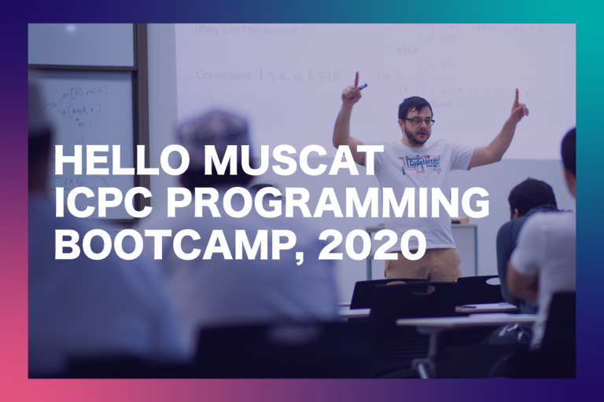

# Announcement_(en)

Hello Codeforces!

On [Wednesday, January 29, 2020 at 20:35UTC+6](https://codeforces.com/https://www.timeanddate.com/worldclock/fixedtime.html?day=29&month=1&year=2020&hour=17&min=35&sec=0&p1=166) [Educational Codeforces Round 81 (Rated for Div. 2)](https://codeforces.com/contest/1295 "Educational Codeforces Round 81 (Rated for Div. 2)") will start.

Series of Educational Rounds continue being held as [Harbour.Space University](https://codeforces.com/https://harbour.space/) initiative! You can read the details about the cooperation between [Harbour.Space University](https://codeforces.com/https://harbour.space/) and Codeforces in the [blog post](//codeforces.com/blog/entry/51208).

This round will be **rated for the participants with rating lower than 2100**. It will be held on extended ICPC rules. The penalty for each incorrect submission until the submission with a full solution is 10 minutes. After the end of the contest you will have 12 hours to hack any solution you want. You will have access to copy any solution and test it locally.

You will be given **6 problems** and **2 hours** to solve them.

The problems were invented and prepared by Roman [Roms](https://codeforces.com/profile/Roms "Master Roms") Glazov, Adilbek [adedalic](https://codeforces.com/profile/adedalic "International Master adedalic") Dalabaev, Vladimir [vovuh](https://codeforces.com/profile/vovuh "Master vovuh") Petrov, Ivan [BledDest](https://codeforces.com/profile/BledDest "International Grandmaster BledDest") Androsov, Maksim [Neon](https://codeforces.com/profile/Neon "Candidate Master Neon") Mescheryakov and me. Also huge thanks to Mike [MikeMirzayanov](https://codeforces.com/profile/MikeMirzayanov "Headquarters, MikeMirzayanov") Mirzayanov for great systems Polygon and Codeforces.

Good luck to all the participants!

Our friends at Harbour.Space also have a message for you:

   *Hi Codeforces!* 

*As a special prize for the Educational Round 81, we would like to invite the top participants to take part in our [Hello Muscat ICPC Programming Bootcamp](https://icpc.harbour.space/?utm_source=codeforces&utm_medium=partners), which will take place in Oman, from March 19 to March 25, 2020. The prize will cover the participation fee, accommodation, and half-board meals for the entire duration of the bootcamp (except flights)!* 

***There are three requirements to satisfy:*** 

 * *You took part in at least 10 rated contests on Codeforces*
* *Your max rating should be less than 2400*
* *You should be eligible for ICPC and/or IOI 2020+*

  [Fill out the form→](https://codeforces.com/userForm/614b4a7f341c05b2) *Good luck to everyone!* 

*We are also excited to announce that we are working with our partners to provide free participation (flights not included) for the teams going to the ICPC World Finals 2020, which will take place in Moscow. If you and your team qualified for the Finals, fill out the form below to see if you’re eligible.* 

  [Apply Now→](https://codeforces.com/https://docs.google.com/forms/d/e/1FAIpQLSeiEkhucSWbHYqjj792C8bCwH-WvHBDCPL85S8p_6pg22Picw/viewform) Congratulations to the winners: 

| Rank | Competitor | Problems Solved | Penalty |
| --- | --- | --- | --- |
| 1 | [nickluo](https://codeforces.com/profile/nickluo "Expert nickluo") | 6 | 177 |
| 2 | [KrK](https://codeforces.com/profile/KrK "International Grandmaster KrK") | 6 | 184 |
| 3 | [NoLongerRed](https://codeforces.com/profile/NoLongerRed "Grandmaster NoLongerRed") | 6 | 185 |
| 4 | [Anadi](https://codeforces.com/profile/Anadi "International Grandmaster Anadi") | 6 | 200 |
| 5 | [neal](https://codeforces.com/profile/neal "International Grandmaster neal") | 6 | 204 |

Congratulations to the best hackers: 

| Rank | Competitor | Hack Count |
| --- | --- | --- |
| 1 | [GiantTornado](https://codeforces.com/profile/GiantTornado "Pupil GiantTornado") | **58** |
| 2 | [rachit_raj](https://codeforces.com/profile/rachit_raj "Pupil rachit_raj") | **51****:-1** |
| 3 | [harshraj22](https://codeforces.com/profile/harshraj22 "Specialist harshraj22") | **41****:-5** |
| 4 | [Ahmad__](https://codeforces.com/profile/Ahmad__ "Specialist Ahmad__") | **35****:-1** |
| 5 | [Sadik](https://codeforces.com/profile/Sadik "Newbie Sadik") | **33****:-2** |

 1096 successful hacks and 873 unsuccessful hacks were made in total!And finally people who were the first to solve each problem: 

| Problem | Competitor | Penalty |
| --- | --- | --- |
| A | [antontrygubO_o](https://codeforces.com/profile/antontrygubO_o "International Master antontrygubO_o") | 0:01 |
| B | [neal](https://codeforces.com/profile/neal "International Grandmaster neal") | 0:05 |
| C | [IgorI](https://codeforces.com/profile/IgorI "Master IgorI") | 0:07 |
| D | [NoLongerRed](https://codeforces.com/profile/NoLongerRed "Grandmaster NoLongerRed") | 0:06 |
| E | [Egg_Tart_Forest](https://codeforces.com/profile/Egg_Tart_Forest "Grandmaster Egg_Tart_Forest") | 0:14 |
| F | [Combi](https://codeforces.com/profile/Combi "Master Combi") | 0:23 |

**UPD:** [Editorial is out](Tutorial.md)

