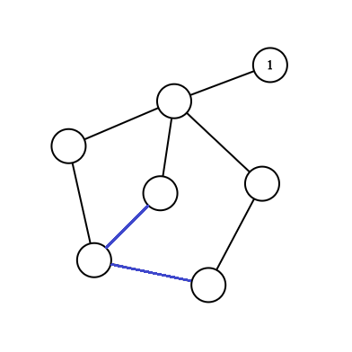

# Tutorial

Authors:  
d2A: [rotavirus](https://codeforces.com/profile/rotavirus "Grandmaster rotavirus")  
d2B: [nvmdava](https://codeforces.com/profile/nvmdava "International Master nvmdava")  
d1A: [nvmdava](https://codeforces.com/profile/nvmdava "International Master nvmdava")  
d1B: [rotavirus](https://codeforces.com/profile/rotavirus "Grandmaster rotavirus")  
d1C: [nvmdava](https://codeforces.com/profile/nvmdava "International Master nvmdava")  
d1D: [rotavirus](https://codeforces.com/profile/rotavirus "Grandmaster rotavirus")  
d1E: [antontrygubO_o](https://codeforces.com/profile/antontrygubO_o "International Master antontrygubO_o") 

 
### [1300A - Non-zero](https://codeforces.com/contest/1300/problem/A "Codeforces Round 618 (Div. 2)")

While there are any zeros in the array, the product will be zero, so we should add $1$ to each zero. Now, if the sum is zero, we should add $1$ to any positive number, so the sum becomes nonzero. So the answer is the number of zeroes in the array plus $1$ if the sum of numbers is equal to zero after adding $1$ to zeros.

 
### [1300B - Assigning to Classes](https://codeforces.com/contest/1300/problem/B "Codeforces Round 618 (Div. 2)")

Let's sort the array. From now on, $a_1 \le a_2 \dots \le a_{2n}$.

Consider any partition. Suppose that the first class has $2k+1$ students, and the skill level of this class is $a_i$, and the second class had $2l+1$ students, and the skill level of this class is $a_j$, where $(2k + 1) + (2l + 1) = 2n \implies k + l = n-1$. Without losing generality, $i<j$. 

At least $n+1$ students have skill level at least $a_i$. Indeed, as $a_i$ is a median of his class, he and $k$ other students have skill level at least $a_i$. As $a_j\ge a_i$ and at least $l$ other students of the second class have skill level at least $a_j\ge a_i$, we get at least $k + l + 2 = n + 1$ students (including $a_i$) with skill level at least $a_i$. Therefore, $a_i\le a_n$.

Similarly, we get that at least $n + 1$ students have skill level at most $a_j$. Therefore, $a_j\ge a_{n+1}$.

So, $|a_j - a_i| \ge a_{n+1} - a_n$. However, $a_{n+1} - a_n$ is achievable. Let's put student $a_n$ into the class alone, and all other students into other class. $a_{n+1}$ will be the median skill level of that class, so the absolute difference will be exactly $a_{n+1} - a_n$.

Therefore, it's enough to sort the array and to output the difference between two middle elements. 

 
### [1299A - Anu Has a Function](../problems/A._Anu_Has_a_Function.md "Codeforces Round 618 (Div. 1)")

If you work on the bits, you may see $f(a, b)$ can easily be written as $a \\& (\sim b)$.

And so, value of an array $[a_1, a_2, \dots, a_n]$ would be $a_1 \\& (\sim a_2) \\& \dots (\sim a_n)$, meaning that if we are to reorder, only the first element matters.

By keeping prefix and suffix $AND$ after we apply $\sim$ to the given array, we can find $(\sim a_2) \\& \dots (\sim a_n)$ in $O(1)$.

Or notice that if a bit was to be in the answer, it must be in $a_1$ and not in any of $a_2, a_3, \dots a_n$. So you can start from the most significant bit and check if that bit can be in the answer to find $a_1$, resulting in $O(n)$.

 
### [1299B - Aerodynamic](../problems/B._Aerodynamic.md "Codeforces Round 618 (Div. 1)")

$T$ has the central symmetry: indeed, if $P(x,y)$ covers $(0,0)$ and $(x_0,y_0)$ then $P(x-x_0,y-y_0)$ covers $(-x_0,-y_0)$ and $(0,0)$. So the answer for polygons which don't have the sentral symmetry is NO. Let's prove if $P$ has the central symmetry then the answer is YES. Translate $P$ in such a way that the origin becomes its center of symmetry. Let's show that the homothety with the center at the origin and the coefficient $2$ transforms $P$ into $T$: 

* if a point $(x_0,y_0)$ lies in $P$, then $P(x_0,y_0)$ covers both $(0,0)$ and $(2x_0,2y_0)$;
* if a point $(x_0,y_0)$ doesn't lie in $P$, then consider a segment connecting the center of symmetry of the polygon $P$ (also known as origin) and $(x_0,y_0)$; it crosses some side of $P$; WLOG, assume this side is parallel to the $x$-axis and lies in the line $y=y_1, y_1>0$ (otherwise we can rotate the plane). Since the polygon is convex, it completely lies in the stripe $y \in [-y_1;y_1]$, that's why there isn't any vector which connects two points in $P$ with a $y$-coordinate greater than $2y_1$. Since $2y_0 > 2y_1$, there isn't any vector which connects two points in $P$ with a $y$-coordinate equal to $2y_0$, that's why the point $(2x_0,2y_0)$ doesn't lie in $T$.

To find whether a polygon has the central symmetry, check whether the midpoints of segments connecting the opposite vertexes coincide; if a polygon has an odd number of vertexes it can't have the central symmetry.

 
### [1299C - Water Balance](../problems/C._Water_Balance.md "Codeforces Round 618 (Div. 1)")

Let's try to make the operation simpler. When we apply the operation, only the sum of the segment matters. And so let's instead define the operation on prefix sum array:

Replace each of $p_l, p_{l+1}, \dots, p_r$ by $p_i = p_{l-1} + \frac{p_r - p_{l - 1} }{r-l+1} \cdot (i - l + 1)$. You may see how similar it is to a line function. Hence we get the idea to plot points $(i, p_i)$ ($(0, p_0 = 0)$ included), and our operation is just drawing a line between $2$ points on integer $x$ coordinates.

Nicely if sequence $a$ is lexicographically smaller than sequence $b$, then prefix sum array of $a$ is smaller than prefix sum array of $b$.

So we need to find the lexicographically smallest array $p$. And then it is easy to see the lexicographically smallest sequence $p$ will be the lower part of the convex hull.

If you're interested you can solve IMO 2018 SL A4 by plotting similar points. I have written my solution[here](https://codeforces.com/https://artofproblemsolving.com/community/c6h1876762p12752819)

 
### [1299D - Around the World](../problems/D._Around_the_World.md "Codeforces Round 618 (Div. 1)")

It's common knowledge that in an undirected graph there is some subset (not necessarily unique) of simple cycles called basis such that any Eulerian subgraph (in connected graphs also known as a cyclic path) is a xor-combination of exactly one subset of basis cycles. In a given connected graph consider any spanning tree; any edge which isn't in that spanning tree forms a cycle with some tree's edges of some cost $c$. These cycles form the basis. A cost of a cyclic path is an XOR of costs of basis cycles that form this path. Now we can move from cycle space to the space of $5$-dimensional vectors $\mathbb{Z}_2^5$. If the costs of basis cycles are linear dependent, then there is a cycle of cost $0$, else they form the basis of some subspace of $\mathbb{Z}_2^5$.

In the given graph there are two types of "components" connected to $1$, and after removing the edges each component contributes some subspace (possibly an empty one); these subspaces shouldn't intersect. These two types are components connected with an edge and components connected with two edges:

 

In the first picture, the basis cycles are formed by the blue edges. We can cut the edge incident to $1$ or keep it; if we don't cut that edge, this component contributes a subspace formed by costs of basis cycles unless they are linear dependent, else it contributes the empty subspace.

In the second picture, the basis cycles are formed by the blue edges and the red edge. We can cut both edges, and then this component contributes an empty subspace; if we cut one edge, the red edge moves to the spanning tree and no longer form a basis cycle, so this component contributes a subspace formed by costs of basis cycles formed by blue edges; if we don't cut any edges, then this component contributes a subspace formed by costs of basis cycles formed by blue and red edges.

If any choice leads to keeping a set of linear dependent basis cycles' costs, then this choice is invalid.

Now for every component, we have from $1$ to $4$ valid choices of choosing the contributing subspace. There are $374$ subspaces of $\mathbb{Z}_2^5$, which can be precalculated as well as their sums. Now we can calculate a dp $dp_{i,j}$ — the number of ways to get the subspace $j$ using the first $i$ components. The transitions are obvious: if we can get the subspace $X$ at the $i$-th component, then for each existing subspace $Y$, if $X$ and $Y$ don't intersect, do $dp_{i,X+Y} := dp_{i,X+Y} + dp_{i-1,Y}$, where $X+Y$ is the sum of subspaces. The answer is a sum of dp values for the last component.

 
### [1299E - So Mean](../problems/E._So_Mean.md "Codeforces Round 618 (Div. 1)")

Let's solve this problem in several steps.

1. First, let's ask a query about each group of $n-1$ numbers. Note that $1 + 2 + \dots + (i-1) + (i+1) + \dots + n = \frac{n(n+1)}{2} - i \equiv \frac{1\cdot 2}{2} - i \bmod (n-1)$. Therefore, answer will be YES only for numbers $1$ and $n$. Find the positions where $1$ and $n$ lie, assign one of them to be $1$ and the other one to be $n$ (it doesn't matter how to assign $1$ and $n$ to these $2$ spots, as permutations $[p_1, p_2, \dots, p_k]$ and $[n + 1 - p_1, n + 1 - p_2, \dots, n + 1 - p_k]$ are indistinguishable). 

$n$ queries.
2. Note that knowing $1$, we can find parity of every other number. Indeed, just ask about $1$ and $p_i$, if answer is YES, $p_i$ is odd, else it is even.

$n$ queries.
3. Suppose that we have found numbers $1, 2, \dots, k, n-k+1, n-k+2, \dots, n$ at some point. Let's find numbers $k+1$ and $n-k$.

Consider all numbers except $1, 2, \dots, k, n-k+1, n-k+2, \dots, n$ now. Ask a query about each subset of $n - 2k - 1$ numbers among them. Again, we can see that we will get answer YES only when we omit $k+1$ and $n-k$. Indeed, $k+1 + \dots (i-1) + (i+1) + \dots + (n-k) = k\cdot (n - 2k - 1) + \frac{(n-2k)(n-2k+1)}{2} - (i-k) \equiv 1 - (i-k) \bmod (n-2k-1)$, which is $0$ only for $i = k+1$ and $n-k$.

Now that we know parities of all numbers, we can distinguish between $k+1$ and $n-k$. So, we determined $k+1$ and $n-k$ in $n - 2k$ queries.
4. Note that this already means that we can solve our problem in $n + n + (n - 2) + (n - 4) + (n - 6) \dots + (n - (n-2))$ queries, which is $\frac{n^2 + 6n}{4}$ queries. Unfortunately, this is much larger than we are allowed. However, we will use this method for $n\le 8$.
5. Let's use the procedure above to find numbers $1, 2, 3, 4, n-3, n-2, n-1, n$. We have used $5n - 12$ queries by now, but let's round this up to $5n$. Now, we are going to find the remainders of each element of permutation modulo $3$, $5$, $7$, $8$. As $3\cdot 5 \cdot 7 \cdot 8 = 840 \ge 800 \ge n$, we will be able to restore each number uniquely.
6. To find remainders modulo $3$, we will first ask each number with already found $1$ and $2$. We will get YES only for numbers, divisible by $3$. Next, we will ask each number whose remainder under division by $3$ we haven't yet found with $1$, $3$. This way we find all the numbers which give the remainder $2$. All others give the remainder $1$.

We spend $n + \frac{2n}{3}$ queries.
7. Similarly, we find remainders mod $5$ and mod $7$. For mod $5$, at step $i$ ask each number whose remainder we don't know yet with $n, n-2, n-3, i$ (for $i$ from $1$ to $4$). 

We spend $n + \frac{4n}{5} + \frac{3n}{5} + \frac{2n}{5}$ queries.

For mod $7$, first ask all numbers whose remainders we don't know yet with $\{1, 2, 3, n-3, n-2, n-1\}$, then with $\{1, 2, 3, n-3, n-2, n\}$, $\{1, 2, 3, n-3, n-1, n\}$, $\{1, 2, 3, n-2, n-1, n\}$, $\{1, 2, 4, n-2, n-1, n\}$, $\{1, 3, 4, n-2, n-1, n\}$ (sums of all these sets are different mod $7$).

We spend $n + \frac{6n}{7} + \dots + \frac{2n}{7}$ queries.
8. Now time to find remainders mod $4$. We already know all remainders mod $2$. To distinguish $4k$ from $4k+2$, ask with $1, 2, 3$. To distinguish $4k+1$ from $4k+3$, ask with $1, 2, 4$.

We spend $n$ queries.

Now time to find remainders mod $8$. We already know all remainders mod $4$. Similarly, to distinguish $8k$ from $8k+4$, ask with $n, n-1, n-2, n-3, 1, 2, 3$, $\dots$, to distinguish $8k+3$ from $8k+7$, ask with $n, n-1, n-2, n-3, 1, 2, 4$.

We spend $n$ queries.

Overall, we spend $5n + (n + \frac{2n}{3}) + (n + \frac{4n}{5} + \frac{3n}{5} + \frac{2n}{5}) + (n + \frac{6n}{7} + \dots + \frac{2n}{7}) + n + n \sim 15.324 n$. 

Note that this bound is easy to optimize (for example, determine all remainders mod $3$ and $4$ from $1, 2, n, n-1$, and after that check only candidates which work mod $12$ in phase $5$. This will reduce the number of operations to $13.66 n$ operations. Of course, a lot of other optimizations are possible.

