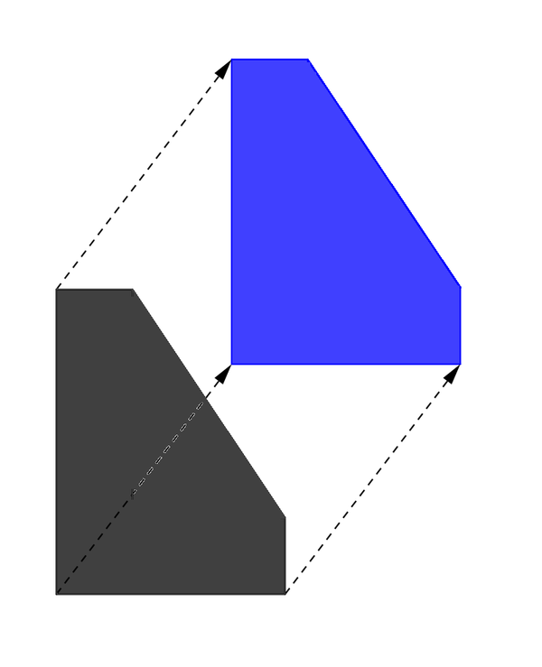
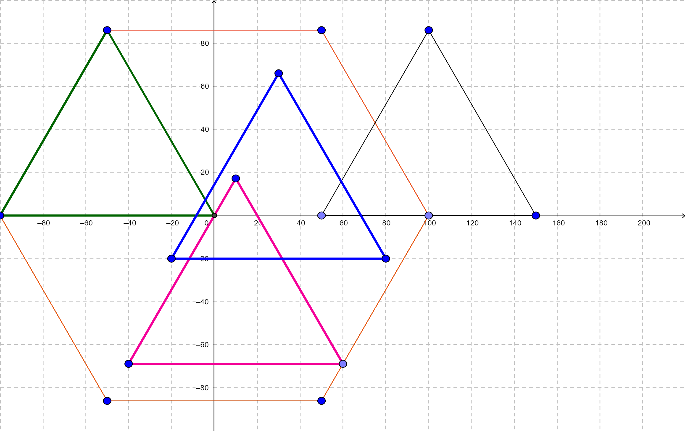
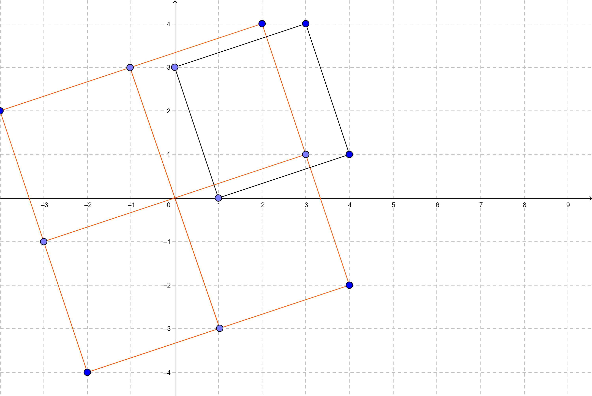

<h1 style='text-align: center;'> B. Aerodynamic</h1>

<h5 style='text-align: center;'>time limit per test: 1 second</h5>
<h5 style='text-align: center;'>memory limit per test: 256 megabytes</h5>

Guy-Manuel and Thomas are going to build a polygon spaceship. 

You're given a strictly convex (i. e. no three points are collinear) polygon $P$ which is defined by coordinates of its vertices. Define $P(x,y)$ as a polygon obtained by translating $P$ by vector $\overrightarrow {(x,y)}$. The picture below depicts an example of the translation:



Define $T$ as a set of points which is the union of all $P(x,y)$ such that the origin $(0,0)$ lies in $P(x,y)$ (both strictly inside and on the boundary). There is also an equivalent definition: a point $(x,y)$ lies in $T$ only if there are two points $A,B$ in $P$ such that $\overrightarrow {AB} = \overrightarrow {(x,y)}$. One can prove $T$ is a polygon too. For example, if $P$ is a regular triangle then $T$ is a regular hexagon. At the picture below $P$ is drawn in black and some $P(x,y)$ which contain the origin are drawn in colored: 



The spaceship has the best aerodynamic performance if $P$ and $T$ are similar. Your task is to check whether the polygons $P$ and $T$ are [similar](https://tinyurl.com/vp5m7vl).

##### Input

The first line of input will contain a single integer $n$ ($3 \le n \le 10^5$) — the number of points.

The $i$-th of the next $n$ lines contains two integers $x_i, y_i$ ($|x_i|, |y_i| \le 10^9$), denoting the coordinates of the $i$-th vertex.

It is guaranteed that these points are listed in counterclockwise order and these points form a strictly convex polygon.

##### Output

##### Output

 "YES" in a separate line, if $P$ and $T$ are similar. Otherwise, output "NO" in a separate line. You can print each letter in any case (upper or lower).

## Examples

##### Input


```text
4
1 0
4 1
3 4
0 3
```
##### Output


```text
YES
```
##### Input

```text

3
100 86
50 0
150 0

```
##### Output


```text
nO
```
##### Input

```text

8
0 0
1 0
2 1
3 3
4 6
3 6
2 5
1 3

```
##### Output


```text

YES
```
## Note

The following image shows the first sample: both $P$ and $T$ are squares. The second sample was shown in the statements.




#### Tags 

#1800 #NOT OK #geometry 

## Blogs
- [All Contest Problems](../Codeforces_Round_618_(Div._1).md)
- [Codeforces Round #618](../blogs/Codeforces_Round_618.md)
- [Tutorial](../blogs/Tutorial.md)
