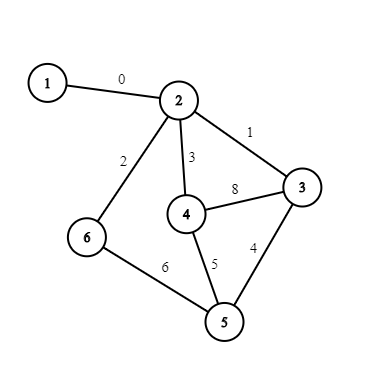
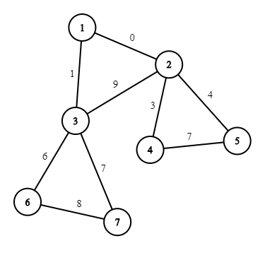
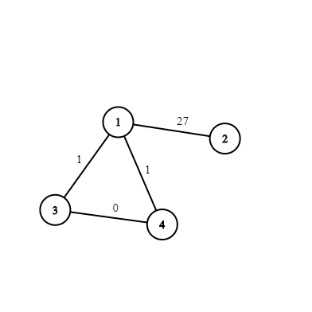

<h1 style='text-align: center;'> D. Around the World</h1>

<h5 style='text-align: center;'>time limit per test: 2 seconds</h5>
<h5 style='text-align: center;'>memory limit per test: 512 megabytes</h5>

Guy-Manuel and Thomas are planning $144$ trips around the world.

You are given a simple weighted undirected connected graph with $n$ vertexes and $m$ edges with the following restriction: there isn't any simple cycle (i. e. a cycle which doesn't pass through any vertex more than once) of length greater than $3$ which passes through the vertex $1$. The cost of a path (not necessarily simple) in this graph is defined as the [XOR](https://en.wikipedia.org/wiki/Bitwise_operation#XOR) of weights of all edges in that path with each edge being counted as many times as the path passes through it.

But the trips with cost $0$ aren't exciting. 

You may choose any subset of edges incident to the vertex $1$ and remove them. How many are there such subsets, that, when removed, there is not any nontrivial cycle with the cost equal to $0$ which passes through the vertex $1$ in the resulting graph? A cycle is called nontrivial if it passes through some edge odd number of times. As the answer can be very big, output it modulo $10^9+7$.

##### Input

The first line contains two integers $n$ and $m$ ($1 \le n,m \le 10^5$) — the number of vertexes and edges in the graph. The $i$-th of the next $m$ lines contains three integers $a_i$, $b_i$ and $w_i$ ($1 \le a_i, b_i \le n, a_i \neq b_i, 0 \le w_i < 32$) — the endpoints of the $i$-th edge and its weight. It's guaranteed there aren't any multiple edges, the graph is connected and there isn't any simple cycle of length greater than $3$ which passes through the vertex $1$.

##### Output

##### Output

 the answer modulo $10^9+7$.

## Examples

##### Input


```text
6 8
1 2 0
2 3 1
2 4 3
2 6 2
3 4 8
3 5 4
5 4 5
5 6 6
```
##### Output


```text
2
```
##### Input


```text
7 9
1 2 0
1 3 1
2 3 9
2 4 3
2 5 4
4 5 7
3 6 6
3 7 7
6 7 8
```
##### Output


```text
1
```
##### Input


```text
4 4
1 2 27
1 3 1
1 4 1
3 4 0
```
##### Output


```text

6
```
## Note

The pictures below represent the graphs from examples.  In the first example, there aren't any nontrivial cycles with cost $0$, so we can either remove or keep the only edge incident to the vertex $1$.  In the second example, if we don't remove the edge $1-2$, then there is a cycle $1-2-4-5-2-1$ with cost $0$; also if we don't remove the edge $1-3$, then there is a cycle $1-3-2-4-5-2-3-1$ of cost $0$. The only valid subset consists of both edges.  In the third example, all subsets are valid except for those two in which both edges $1-3$ and $1-4$ are kept.


#### Tags 

#3000 #NOT OK #bitmasks #combinatorics #dfs_and_similar #dp #graphs #graphs #math #trees 

## Blogs
- [All Contest Problems](../Codeforces_Round_618_(Div._1).md)
- [Codeforces Round #618](../blogs/Codeforces_Round_618.md)
- [Tutorial](../blogs/Tutorial.md)
