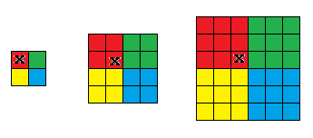
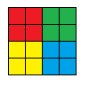
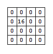

# Tutorial_(en)

### [1301A - Three Strings](../problems/A._Three_Strings.md "Codeforces Round 619 (Div. 2)")

For every $i$ $(1 \leq i \leq n)$ where $n$ is the length of the strings. If $c_i$ is equal to $a_i$ we can swap it with $b_i$ or if $c_i$ is equal to $b_i$ we can swap it with $a_i$, otherwise we can't swap it. So we only need to check that $c_i$ is equal $a_i$ or $c_i$ is equal to $b_i$.

Complexity is $O(n)$.

Code:[https://ideone.com/Z5Hamc](https://codeforces.com/https://ideone.com/Z5Hamc)

 
### [1301B - Motarack's Birthday](../problems/B._Motarack's_Birthday.md "Codeforces Round 619 (Div. 2)")

Let's take all non missing elements that are adjacent to at least one missing element, we need to find a value $k$ that minimises the maximum absolute difference between $k$ and these values. The best $k$ is equal to (minimum value + maximum value) / 2.

Then we find the maximum absolute difference between all adjacent pairs.

Complexity is $O(n)$.

code:[https://ideone.com/79k8oT](https://codeforces.com/https://ideone.com/79k8oT)

 
### [1301C - Ayoub's function](../problems/C._Ayoub's_function.md "Codeforces Round 619 (Div. 2)")

We can calculate the number of sub-strings that has at least one symbol equals to "1" like this:

$f(s)$ $=$ (number of all sub-strings) $-$ (number of sub-strings that doesn't have any symbol equals to "1").

if the size of $s$ is equal to $n$, $f(s)$ $=$ $\frac{n\cdot(n+1)}{2}$ $-$ (number of sub-strings that doesn't have any symbol equals to "1").

if we want to calculate them, we only need to find every continuous sub-string of 0's if it's length was $l$, then we subtract $\frac{l\cdot(l+1)}{2}$.

now we have a string contains $(n - m)$ "0" symobol, and we want to divide these symbols into $(m+1)$ groups so that the summation of $\frac{l\cdot(l+1)}{2}$ for every group is minimised.

The best way is to divide them into equal groups or as equal as possible.

let $z$ be the number of zeroes in the string, $z=(n - m)$, and g be the number of groups, $g=m+1$.

let $k$ equal to $\lfloor$ $\frac{z}{g}$ $\rfloor$.

we should give every group $k$ zeroes, except for the first $(z\mod g)$ groups, we should give them $k+1$ zeroes.

So the answer is $\frac{n.(n+1)}{2}$ $-$ $\frac{k.(k+1)}{2} \cdot g$ $-$ $(k + 1) \cdot (z\mod g)$.

Complexity is $O(1)$.

code:[https://ideone.com/rk5nDE](https://codeforces.com/https://ideone.com/rk5nDE)

 
### [1301D - Time to Run](../problems/D._Time_to_Run.md "Codeforces Round 619 (Div. 2)")

A strategy that guarantees that you can visit all the edges exactly once:

1- keep going right until you reach the last column in the first row.

2- keep going left until you reach the first column in the first row again.

3- go down.

4- keep going right until you reach the last column in the current row.

5- keep going {up, down, left} until you reach the first column in the current row again.

6- if you were at the last row, just keep going up until you reach the top left cell again, otherwise repeat moves 3, 4 and 5.

We need only to take the first $k$ moves, and we can print them in about $3 \cdot n$ steps.

complexity $O(n)$

code:[https://ideone.com/PkCMZM](https://codeforces.com/https://ideone.com/PkCMZM)

 
### [1301E - Nanosoft](../problems/E._Nanosoft.md "Codeforces Round 619 (Div. 2)")

For each cell, we will calculate the maximum size of a Nanosoft logo in which it is the bottom right cell, in the top left square.

The cell marked with $x$ in this picture:

If we had a grid like this:

If we take the cell in the second row, second column, it can make a Nanosoft logo with size $4 \times 4$, being the bottom right cell in the top left square.

We can calculate the answer for every cell using binary search , and checking every sub-square using 2D cumulative sum.

Now we build a 2D array that contains that previous calculated answer, lets call it $val[n][m]$. 

For the previous picture $val$ will be like this:

Now for each query we can do binary search on its answer. We check the current mid this way:

The mid will tell us the length of one of the sides divided by 2.

Like if mid = 2, the area of the square we are checking is $(4 \cdot 4 = 16)$.

Now we should check the maximum element in the 2D array val, in the 2D range: $(r_1 + mid - 1, c_1 + mid - 1,r_2 - mid , c_2 - mid)$. 

The current mid is correct if the maximum element in that 2D range is greater than or equal to $(4 \cdot mid \cdot mid)$.

We can get the maximum value in a 2D range using 2D sparse table, with build in $O(n \cdot m \cdot \log{n} \cdot \log{m})$ and query in $O(1)$.

total Complexity is $O(n \cdot m \cdot \log{n} \cdot \log{m} + q \cdot \log{m})$.

code:[https://ideone.com/VyYsoc](https://codeforces.com/https://ideone.com/VyYsoc)

 
### [1301F - Super Jaber](../problems/F._Super_Jaber.md "Codeforces Round 619 (Div. 2)")

In the shortest path between any two cells, you may use an edge that goes from a cell to another one with the same color at least once, or you may not.

If you didn't use an edge that goes from a cell to another one with the same color then the distance will be the Manhattan distance.

Otherwise you should find the best color that you will use that edge in it, the cost will be (the minimum cost between any cell of that color with first cell + the minimum cost between any cell of that color with the second cell + 1).

In order to find the minimum cost from every color to each cell, we can run multi-source BFS for every color.

But visiting all other cells that has the same color every time is too slow, so we can only visit these cells when we reach the first cell from every color.

Complexity is $O(n \cdot m \cdot k + q \cdot k)$.

code:[https://ideone.com/emv9dj](https://codeforces.com/https://ideone.com/emv9dj)

