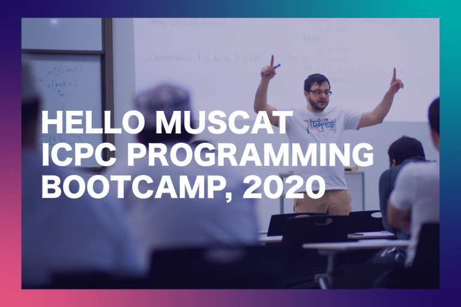

# Announcement

Hello Codeforces!

On [Wednesday, February 12, 2020 at 20:35UTC+6](https://codeforces.com/https://www.timeanddate.com/worldclock/fixedtime.html?day=12&month=2&year=2020&hour=17&min=35&sec=0&p1=166) [Educational Codeforces Round 82 (Rated for Div. 2)](https://codeforces.com/contest/1303 "Educational Codeforces Round 82 (Rated for Div. 2)") will start.

Series of Educational Rounds continue being held as [Harbour.Space University](https://codeforces.com/https://harbour.space/) initiative! You can read the details about the cooperation between [Harbour.Space University](https://codeforces.com/https://harbour.space/) and Codeforces in the [blog post](//codeforces.com/blog/entry/51208).

This round will be **rated for the participants with rating lower than 2100**. It will be held on extended ICPC rules. The penalty for each incorrect submission until the submission with a full solution is 10 minutes. After the end of the contest you will have 12 hours to hack any solution you want. You will have access to copy any solution and test it locally.

You will be given **7 problems** and **2 hours** to solve them.

The problems were invented and prepared by Roman [Roms](https://codeforces.com/profile/Roms "Master Roms") Glazov, Adilbek [adedalic](https://codeforces.com/profile/adedalic "International Master adedalic") Dalabaev, Vladimir [vovuh](https://codeforces.com/profile/vovuh "Master vovuh") Petrov, Ivan [BledDest](https://codeforces.com/profile/BledDest "International Grandmaster BledDest") Androsov, Maksim [Neon](https://codeforces.com/profile/Neon "Candidate Master Neon") Mescheryakov and me. Also huge thanks to Mike [MikeMirzayanov](https://codeforces.com/profile/MikeMirzayanov "Headquarters, MikeMirzayanov") Mirzayanov for great systems Polygon and Codeforces.

Good luck to all the participants!

Our friends at Harbour.Space also have a message for you:

   *Hi Codeforces!* 

*This is not the last call for participation, but we’re almost there. We have extended the early bird discount deadline of [Hello Muscat ICPC Programming Bootcamp](https://icpc.harbour.space/?utm_source=codeforces&utm_medium=partners) until this Sunday, February 16th.* *Remember you can request a support letter to present to your university, employer or local companies to sponsor your participation and trip to the bootcamp.* 

  [Register now](https://icpc.harbour.space/?utm_source=codeforces&utm_medium=partners) *We would also like to remind you that if your team is going to the ICPC World Finals in Moscow this June, you can fill out the form below to see if you are eligible for a full scholarship for our Bootcamp (flights not included), and we will contact you within three days to let you know about the results.* 

  [Fill out form](https://codeforces.com/https://docs.google.com/forms/d/e/1FAIpQLSeiEkhucSWbHYqjj792C8bCwH-WvHBDCPL85S8p_6pg22Picw/viewform?usp=sf_link) **UPD:** There will be **7 problems** in the round

Congratulations to the winners: 

| Rank | Competitor | Problems Solved | Penalty |
| --- | --- | --- | --- |
| 1 | [tmwilliamlin168](https://codeforces.com/profile/tmwilliamlin168 "International Grandmaster tmwilliamlin168") | 7 | 294 |
| 2 | [Egor](https://codeforces.com/profile/Egor "International Grandmaster Egor") | 6 | 173 |
| 3 | [ivan100sic](https://codeforces.com/profile/ivan100sic "International Grandmaster ivan100sic") | 6 | 174 |
| 4 | [neal](https://codeforces.com/profile/neal "International Grandmaster neal") | 6 | 175 |
| 5 | [244mhq](https://codeforces.com/profile/244mhq "International Grandmaster 244mhq") | 6 | 179 |

39 successful hacks and 147 unsuccessful hacks were made in total!

And finally people who were the first to solve each problem: 

| Problem | Competitor | Penalty |
| --- | --- | --- |
| A | [Mprimus](https://codeforces.com/profile/Mprimus "Expert Mprimus") | 0:01 |
| B | [icecuber](https://codeforces.com/profile/icecuber "International Grandmaster icecuber") | 0:04 |
| C | [MylnikovNikolay](https://codeforces.com/profile/MylnikovNikolay "Candidate Master MylnikovNikolay") | 0:09 |
| D | [waynetuinfor](https://codeforces.com/profile/waynetuinfor "Grandmaster waynetuinfor") | 0:11 |
| E | [Mehrdad_Sohrabi](https://codeforces.com/profile/Mehrdad_Sohrabi "Master Mehrdad_Sohrabi") | 0:17 |
| F | [wucstdio](https://codeforces.com/profile/wucstdio "International Grandmaster wucstdio") | 1:10 |
| G | [arknave](https://codeforces.com/profile/arknave "Master arknave") | 0:49 |

**UPD:** [Editorial is out](Tutorial_(en).md)

