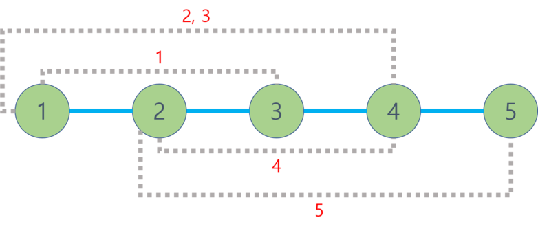

<h1 style='text-align: center;'> E. 1-Trees and Queries</h1>

<h5 style='text-align: center;'>time limit per test: 4 seconds</h5>
<h5 style='text-align: center;'>memory limit per test: 512 megabytes</h5>

Gildong was hiking a mountain, walking by millions of trees. Inspired by them, he suddenly came up with an interesting idea for trees in data structures: What if we add another edge in a tree?

Then he found that such tree-like graphs are called 1-trees. Since Gildong was bored of solving too many tree problems, he wanted to see if similar techniques in trees can be used in 1-trees as well. Instead of solving it by himself, he's going to test you by providing queries on 1-trees.

First, he'll provide you a tree (not 1-tree) with $n$ vertices, then he will ask you $q$ queries. Each query contains $5$ integers: $x$, $y$, $a$, $b$, and $k$. This means you're asked to determine if there exists a path from vertex $a$ to $b$ that contains exactly $k$ edges after adding a bidirectional edge between vertices $x$ and $y$. A path can contain the same vertices and same edges multiple times. All queries are independent of each other; i.e. the added edge in a query is removed in the next query.

### Input

The first line contains an integer $n$ ($3 \le n \le 10^5$), the number of vertices of the tree.

Next $n-1$ lines contain two integers $u$ and $v$ ($1 \le u,v \le n$, $u \ne v$) each, which means there is an edge between vertex $u$ and $v$. All edges are bidirectional and distinct.

Next line contains an integer $q$ ($1 \le q \le 10^5$), the number of queries Gildong wants to ask.

Next $q$ lines contain five integers $x$, $y$, $a$, $b$, and $k$ each ($1 \le x,y,a,b \le n$, $x \ne y$, $1 \le k \le 10^9$) – the integers explained in the description. It is guaranteed that the edge between $x$ and $y$ does not exist in the original tree.

### Output

For each query, print "YES" if there exists a path that contains exactly $k$ edges from vertex $a$ to $b$ after adding an edge between vertices $x$ and $y$. Otherwise, print "NO".

You can print each letter in any case (upper or lower).

## Example

### Input


```text
5
1 2
2 3
3 4
4 5
5
1 3 1 2 2
1 4 1 3 2
1 4 1 3 3
4 2 3 3 9
5 2 3 3 9
```
### Output


```text
YES
YES
NO
YES
NO
```
## Note

The image below describes the tree (circles and solid lines) and the added edges for each query (dotted lines).

  Possible paths for the queries with "YES" answers are: 

* $1$-st query: $1$ – $3$ – $2$
* $2$-nd query: $1$ – $2$ – $3$
* $4$-th query: $3$ – $4$ – $2$ – $3$ – $4$ – $2$ – $3$ – $4$ – $2$ – $3$


#### Tags 

#2000 #NOT OK #data_structures #dfs_and_similar #shortest_paths #trees 

## Blogs
- [All Contest Problems](../Codeforces_Round_620_(Div._2).md)
- [Announcement (en)](../blogs/Announcement_(en).md)
- [Tutorial (en)](../blogs/Tutorial_(en).md)
