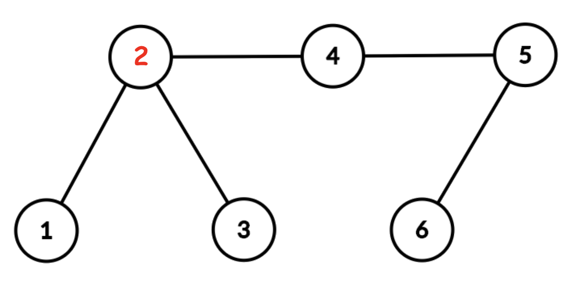
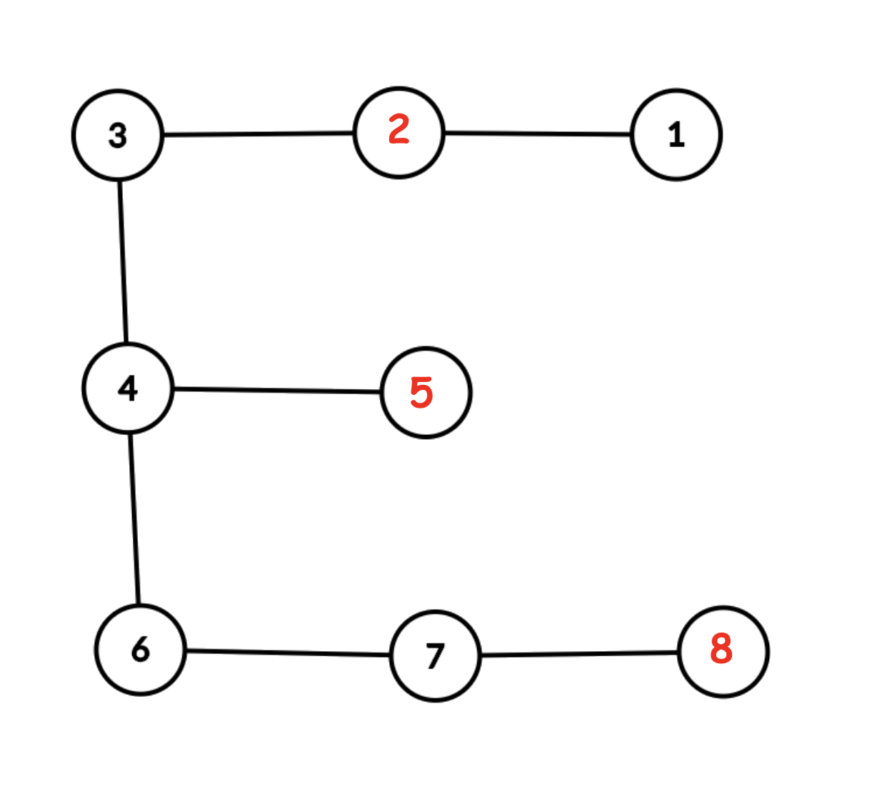

<h1 style='text-align: center;'> F. Cow and Vacation</h1>

<h5 style='text-align: center;'>time limit per test: 2 seconds</h5>
<h5 style='text-align: center;'>memory limit per test: 256 megabytes</h5>

Bessie is planning a vacation! In Cow-lifornia, there are $n$ cities, with $n-1$ bidirectional roads connecting them. It is guaranteed that one can reach any city from any other city. 

Bessie is considering $v$ possible vacation plans, with the $i$-th one consisting of a start city $a_i$ and destination city $b_i$.

It is known that only $r$ of the cities have rest stops. Bessie gets tired easily, and cannot travel across more than $k$ consecutive roads without resting. In fact, she is so desperate to rest that she may travel through the same city multiple times in order to do so.

For each of the vacation plans, does there exist a way for Bessie to travel from the starting city to the destination city?

#### Input

The first line contains three integers $n$, $k$, and $r$ ($2 \le n \le 2 \cdot 10^5$, $1 \le k,r \le n$)  — the number of cities, the maximum number of roads Bessie is willing to travel through in a row without resting, and the number of rest stops.

Each of the following $n-1$ lines contain two integers $x_i$ and $y_i$ ($1 \le x_i, y_i \le n$, $x_i \neq y_i$), meaning city $x_i$ and city $y_i$ are connected by a road. 

The next line contains $r$ integers separated by spaces  — the cities with rest stops. Each city will appear at most once.

The next line contains $v$ ($1 \le v \le 2 \cdot 10^5$)  — the number of vacation plans.

Each of the following $v$ lines contain two integers $a_i$ and $b_i$ ($1 \le a_i, b_i \le n$, $a_i \ne b_i$)  — the start and end city of the vacation plan. 

#### Output

If Bessie can reach her destination without traveling across more than $k$ roads without resting for the $i$-th vacation plan, print YES. Otherwise, print NO.

## Examples

#### Input


```text
6 2 1
1 2
2 3
2 4
4 5
5 6
2
3
1 3
3 5
3 6
```
#### Output


```text
YES
YES
NO
```
#### Input


```text
8 3 3
1 2
2 3
3 4
4 5
4 6
6 7
7 8
2 5 8
2
7 1
8 1
```
#### Output


```text
YES
NO
```
## Note

The graph for the first example is shown below. The rest stop is denoted by red.

For the first query, Bessie can visit these cities in order: $1, 2, 3$.

For the second query, Bessie can visit these cities in order: $3, 2, 4, 5$. 

For the third query, Bessie cannot travel to her destination. For example, if she attempts to travel this way: $3, 2, 4, 5, 6$, she travels on more than $2$ roads without resting.

  The graph for the second example is shown below. 

  

#### Tags 

#3300 #NOT OK #dfs_and_similar #dsu #trees 

## Blogs
- [All Contest Problems](../Codeforces_Round_621_(Div._1_+_Div._2).md)
- [Announcement (en)](../blogs/Announcement_(en).md)
- [Tutorial (en)](../blogs/Tutorial_(en).md)
