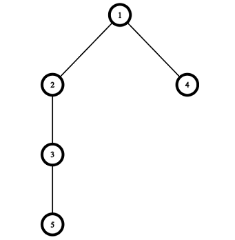
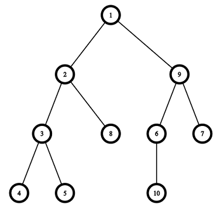

<h1 style='text-align: center;'> E. Construct the Binary Tree</h1>

<h5 style='text-align: center;'>time limit per test: 2 seconds</h5>
<h5 style='text-align: center;'>memory limit per test: 256 megabytes</h5>

You are given two integers $n$ and $d$. You need to construct a rooted binary tree consisting of $n$ vertices with a root at the vertex $1$ and the sum of depths of all vertices equals to $d$.

A tree is a connected graph without cycles. A rooted tree has a special vertex called the root. A parent of a vertex $v$ is the last different from $v$ vertex on the path from the root to the vertex $v$. The depth of the vertex $v$ is the length of the path from the root to the vertex $v$. Children of vertex $v$ are all vertices for which $v$ is the parent. The binary tree is such a tree that no vertex has more than $2$ children.

You have to answer $t$ independent test cases.

### Input

The first line of the input contains one integer $t$ ($1 \le t \le 1000$) — the number of test cases.

The only line of each test case contains two integers $n$ and $d$ ($2 \le n, d \le 5000$) — the number of vertices in the tree and the required sum of depths of all vertices.

It is guaranteed that the sum of $n$ and the sum of $d$ both does not exceed $5000$ ($\sum n \le 5000, \sum d \le 5000$).

### Output

For each test case, print the answer.

If it is impossible to construct such a tree, print "NO" (without quotes) in the first line. Otherwise, print "{YES}" in the first line. Then print $n-1$ integers $p_2, p_3, \dots, p_n$ in the second line, where $p_i$ is the parent of the vertex $i$. 
## Note

 that the sequence of parents you print should describe some binary tree.

## Example

### Input


```text
3
5 7
10 19
10 18
```
### Output


```text
YES
1 2 1 3 
YES
1 2 3 3 9 9 2 1 6 
NO
```
## Note

Pictures corresponding to the first and the second test cases of the example:






#### Tags 

#2200 #NOT OK #brute_force #constructive_algorithms #trees 

## Blogs
- [All Contest Problems](../Codeforces_Round_624_(Div._3).md)
- [Announcement](../blogs/Announcement.md)
- [Tutorial](../blogs/Tutorial.md)
