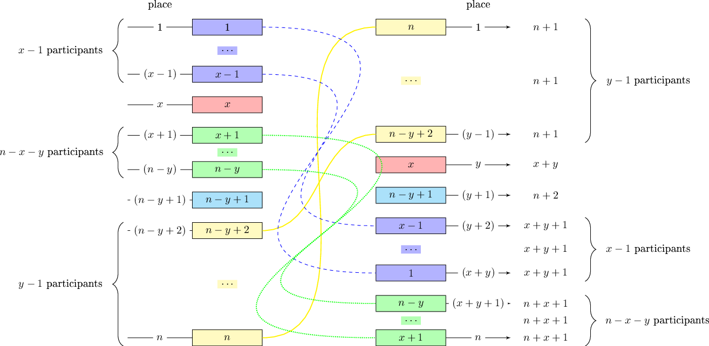
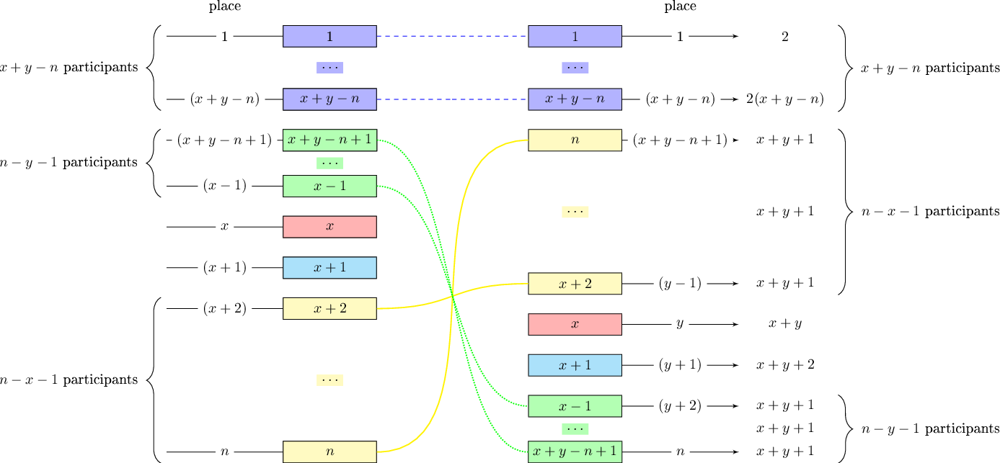

# Editorial_(en)

Thanks for the participation!

[1313A - Fast Food Restaurant](../problems/A._Fast_Food_Restaurant.md "Codeforces Round 622 (Div. 2)") was authored by [Endagorion](https://codeforces.com/profile/Endagorion "International Grandmaster Endagorion") and prepared by [ch_egor](https://codeforces.com/profile/ch_egor "International Grandmaster ch_egor")

[1313B - Different Rules](../problems/B._Different_Rules.md "Codeforces Round 622 (Div. 2)") was authored by [meshanya](https://codeforces.com/profile/meshanya "Grandmaster meshanya") and prepared by [DebNatkh](https://codeforces.com/profile/DebNatkh "Candidate Master DebNatkh")

[1313C2 - Skyscrapers (hard version)](../problems/C2._Skyscrapers_(hard_version).md "Codeforces Round 622 (Div. 2)") was authored by [meshanya](https://codeforces.com/profile/meshanya "Grandmaster meshanya") and prepared by [Sehnsucht](https://codeforces.com/profile/Sehnsucht "Candidate Master Sehnsucht")

[1313D - Happy New Year](../problems/D._Happy_New_Year.md "Codeforces Round 622 (Div. 2)") was authored and prepared by [voidmax](https://codeforces.com/profile/voidmax "International Grandmaster voidmax")

[1313E - Concatenation with intersection](../problems/E._Concatenation_with_intersection.md "Codeforces Round 622 (Div. 2)") was authored and prepared by [isaf27](https://codeforces.com/profile/isaf27 "International Grandmaster isaf27")

 
### [1313A - Fast Food Restaurant](../problems/A._Fast_Food_Restaurant.md "Codeforces Round 622 (Div. 2)")

Bruteforce solution

There are seven possible sets of dishes, so the simplest solution is to iterate over all possible $2^7$ subsets of sets of dishes.

You can also go over $7!$ permutations of sets of dishes and gather sets of dishes greedily in the selected order.

Greedy solution

Note that the solution can be optimal only when it is impossible to add an additional set of dishes to it.

Let the solution be such that it is impossible to add a single set of dishes to it and it does not have any set consisting of one dish, but there is a set consisting of two or three dishes containing this one dish. Then you can replace the corresponding set with a set of one dish, without worsening the answer. This means that at the beginning you can greedily add all the sets consisting of one dish.

The same can show that any set of three dishes can be replaced with a set of two dishes, so after the sets of one and two dishes are fixed, it is enough to simply check whether you can add a set of three dishes.

However, it is wrong to choose sets of two dishes greedily. Suppose that after choosing sets of one dish, there is one dish of the first type, one dish of the second type and two dishes of the third type. Then you can choose two sets of dishes, but if you take at the beginning a set of dishes of the first and second types, you won't get two different sets.

In this case, you can simply iterate over the order of choosing sets of two dishes or notice that all such tests have the form $2\, 2\, x$, $2\, x\, 2$, $x\, 2\, 2$, where $x \geq 3$, and solve them separately.

 
### [1313B - Different Rules](../problems/B._Different_Rules.md "Codeforces Round 622 (Div. 2)")

Without loss of generality, assume that $x \leq y$. For convenience, we will number the participants from 1 to $n$ in the order of their places in the first round. Thus, the participant we are interested in is the participant $x$.

First we can prove the formula: $ \operatorname{MIN\\_PLACE} = \max(1, \min(n, x + y - n + 1))$ 

1. First case: $x + y < n$. It can be shown that participant $x$ can achieve first place in the Olympics. In order to do this, the following example can be built:
	* $i$-th participant ($1 \leq i \leq x-1$) takes $(x+y+1-i)$-th place in the second round (sum — $x+y+1$)
	* $x$-th participant takes $y$-th place in the second round (sum — $x+y$)
	* $j$-th participant ($x+1 \leq j \leq n-y$) takes $(n+x+1-j)$-th place in the second round (sum — $n+x+1$)
	* $(n-y+1)$-th participant takes $(y+1)$-th place in the second round (sum — $n+2$)
	* $t$-th participant ($n-y+2 \leq t \leq n$) takes $(n+1-t)$-th place in the second round (sum — $n+1$) The illustration below explains this example 
2. Second case: $x + y \geq n+1;\; y \ne n$Consider the participant with the number $k$ ($k \leq x + y - n < x$). They will receive no more than $x+y-n+n = x + y$ in total (because $n$ is the maximum place in the second round they can take), that is guaranteed to overtake the main character. Thus we can't achieve any place better than $x+y-n+1$. For this assessment, an example below is given:

	* $i$-th participant $(1 \leq i \leq x+y-n)$ takes $i$-th place in the second round (sum — $2i < x + y$)
	* $j$-th participant $(x+y-n+1 \leq j \leq x-1)$ takes $(x+y+1-j)$-th place in the second round (sum — $x+y+1$)
	* $x$-th participant takes the y-th place in the second round (sum — $x+y$)
	* $(x+1)$-th participant takes $(y+1)$-th place in the second round (sum — $x+y+2$)
	* $t$-th participant $(x+2 \leq t \leq n)$ takes $(x+y+1-t)$-th place in the second round (sum — $x+y+1$) The illustration below explains this example 
3. Third case: $x + y \geq n+1$; $y = n$Then the participant with the number $k$ ($k \leq x + y - n + 1 = x + 1$) will receive no more than $x+y-n+1+n-1 = x + y$ in total, that is guaranteed to overtake the main character. That is, we can't take places better than $x+y-n+1$. For this assessment, we give an example below:

	* Participant $i < x$ takes $x$-th place, overtaking $x+y$
	* Participant $x + 1$ takes $(n-1)$-th place, overtaking $x+y$
	* Participant $j$ ($x + 2 \leq j \leq n$) takes $(x+y+1-j)$-th placeA separate case: $x = y = n$, then the outcome is obvious

The formula for the minimum place is proved. The formula for the maximum place will be proven in the same way:

We prove the formula: $ \operatorname{MAX\\_PLACE} = \min(n, x + y-1)$

1. First case: $x + y \geq n+1$. Then we can give an example in which we will take the last place:
	* $i$-th participant ($1 \leq i \leq x+y-n-1$) takes $(y+x-n-i)$-th place in the second round (sum — $y + x-n$)
	* $j$-th participant ($x+y-n-1 \leq j \leq n$) takes $(x+y-j)$-th place in the second round (sum — $y + x$)
2. Second case: $x + y \leq n$ Consider a participant with the number $k$ ($x+y \leq k$). They are guaranteed to be overtaken by $x+y$ (main character) So the main character can not take any place worse than $x+y-1$:
	* $i$-th participant ($1 \leq i \leq x+y-1$) takes ($y+x-i$)-th place in the second round (sum — $y + x-n$)
	* $j$-th participant ($x+y-1 \leq j \leq n$) takes ($x+y+n-j$)-th place in the second round (sum — $y + x$)

Thus, the problem was reduced to the problem of output of two numbers – $\left< \max(1, \min(n, x + y - n + 1)),\;\;\min(n, x + y-1)\right>$

 
### [1313C2 - Skyscrapers (hard version)](../problems/C2._Skyscrapers_(hard_version).md "Codeforces Round 622 (Div. 2)")

Let's solve the task on an array $m$ of length $n$. Let's find a minimal element in this array. Let it be on the $i$-th ($1 \leq i \leq n$) position. We can build the skyscraper at the $i$-th position as high as possible, that is $a_i = m_i$.

Now we should make a choice — we need to equate to $a_i$ either the left part of the array ($a_1 = a_i, a_2 = a_i, \ldots, a_{i-1} = a_i$), or the right part ($a_{i+1} = a_i, a_{i+2} = a_i, \ldots, a_{n} = a_i$), and solve the task recursively on the remaining part of the array, until we get an array of length 1.

The described recursive task has $n$ different states. Depending on the approach of finding a minimal element on a segment, we can get solutions of complexity $O(n^2)$, $O(n \sqrt{n})$ or $O(n \log n)$.

There is another solution. It can be proved that the answer looks like this: from the start of the array the heights are non-decreasing, and starting from the certain skyscraper the heights are non-increasing. Let's call a skyscraper "peak" if there is the change of direction on this skyscraper. We are to find the optimal "peak".

We can build arrays $l$ and $r$ of length $n$. Let's iterate positions from left to right. Let we are on the $i$-th position. If $m_i$ is the smallest element among $m_1, \ldots, m_i$, then $l_i = i \times m_i$. Otherwise, let's look at $m_1, m_2, \ldots, m_{i-1}$ and take the rightest number smaller than $m_i$, let it be $m_j$ on the $j$-th position. Then $l_i = l_j + (i - j) \times m_i$. Similarly, we build $r$ (but changing the direction from right to left). The "peak" is the skyscraper $t$ such that $l_t + r_t - m_t$ is maximal.

The complexity of this solution can be $O(n^2)$, $O(n \log n)$, $O(n)$ depending on the approach of finding "nearest" numbers to the right and to the left that are smaller than the current one.

 
### [1313D - Happy New Year](../problems/D._Happy_New_Year.md "Codeforces Round 622 (Div. 2)")

We wil use scanline to solve this problem. For all segments, we add event of its beginning and end. Let's maintain $dp_{i, mask}$, where $i$ is number of events that we have already processed. $mask$ is mask of $k$ bits, where $1$ in some bit means that segment corresponding to this bit is taken.

How to move from one coordinate to another? For all masks we can count number of $1$ bits and if it is odd, we should add distance between to points to value of this $dp$.

How to add new segment? As we know, at one point can be at most $k$ segments, so when we add segment we can find free bit and create match to this segment. After this operation we also should change some values of $dp$. Deleting of the segments is similar to adding.

As you may notice, only $(i - 1)$-th lay is needed to calculate $i$-th lay, so we can use only $O(2^k)$ additional memory.

Total complexity $O(n \log n + n2^k)$.

 
### [1313E - Concatenation with intersection](../problems/E._Concatenation_with_intersection.md "Codeforces Round 622 (Div. 2)")

For all $1 \leq i \leq n$ let's define $fa_i$ as the length of the longest common prefix of strings $a[i, n]$ and $s[1, m - 1]$, $fb_i$ as the length of the longest common suffix of strings $b[1, i]$ and $s[2, m]$. Values of $fa$ can be easily found from $z$-function of the string "$s\\#a$", values of $fb$ from $z$-function of the string "$\overline{s}\\#\overline{b}$" (here $\overline{s}$ is defined as reversed string $s$).

Let's fix $l_1$ and $r_2$. Let's note, that $l_1 \leq r_2$, because segments have non-empty intersection. Also, the sum of lengths of segments is equal to $m$ and they have non-empty intersection, so $r_2 \leq l_1 + m - 2$. It's easy to see, that segments will have non-empty intersection if and only if $l_1 \leq r_2 \leq l_1 + m - 2$.

Let's note, that if for fixed $l_1$ and $r_2$ innequalities are true, the number of segments with such $l_1$ and $r_2$ is equal to $\max{(fa_{l_1} + fb_{r_2} - m + 1, 0)}$. So, the answer to the problem is equal to $\sum\limits_{1 \leq l_1 \leq r_2 \leq \min{(l_1 + m - 2, n)}} {\max{(fa_{l_1} + fb_{r_2} - m + 1, 0)}} = \sum\limits_{l_1 = 1}^{n} {\sum\limits_{r_2 = l_1}^{\min{(l_1 + m - 2, n)}} {\max{(fa_{l_1} + fb_{r_2} - m + 1, 0)}}}$.

Let's make two Fenwick trees on arrays of size $m$. Let's iterate $l_1$ from $1$ to $n$. For $r_2 \in [l_1, \min{(l_1 + m - 2, n)}]$ let's add in the position $m - 1 - fb_{r_2}$ of the first tree the number $1$, in the position $m - 1 - fb_{r_2}$ of the second tree the number $fb_{r_2}$. After that the sum for fixed $l_1$ can be easily found from sums in Fenwick trees on prefixes $i \leq fa_{l_1}$.

The total complexity is $O(n \log{n})$.

