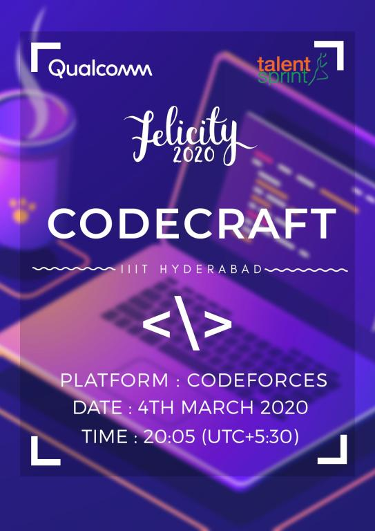

# CodeCraft-20_(Div._2)_(en)

Hello Codeforces!

We are thrilled to invite you to [CodeCraft-20 (Div. 2)](https://codeforces.com/contest/1316 "CodeCraft-20 (Div. 2)"), which is to take place on [Wednesday, March 4, 2020 at 20:35UTC+6](https://codeforces.com/https://www.timeanddate.com/worldclock/fixedtime.html?day=4&month=3&year=2020&hour=17&min=35&sec=0&p1=166). The contest is rated for all participants with ratings under 2100. 

The contest comes under the wing of **Threads '20**, the annual technical fest, a part of [Felicity, IIIT Hyderabad](https://codeforces.com/https://felicity.iiit.ac.in/) . 

Participants will be asked to solve **6** problems in **2 hours** . Scoring will be announced just before the contest .

The problems were created by [gaurav172](https://codeforces.com/profile/gaurav172 "Candidate Master gaurav172"), [lazyneuron](https://codeforces.com/profile/lazyneuron "Specialist lazyneuron"), [preet_t](https://codeforces.com/profile/preet_t "Specialist preet_t") and [shaanknight](https://codeforces.com/profile/shaanknight "Master shaanknight") .

We want to thank all the people for making this contest possible .

 * Our Coordinator [antontrygubO_o](https://codeforces.com/profile/antontrygubO_o "Grandmaster antontrygubO_o") for the immense help and guidance.
* All the testers of the round : [codelegend](https://codeforces.com/profile/codelegend "Master codelegend"), [aryanc403](https://codeforces.com/profile/aryanc403 "International Master aryanc403"), [_overrated_](https://codeforces.com/profile/_overrated_ "Master _overrated_"), [Savior-of-Cross](https://codeforces.com/profile/Savior-of-Cross "Master Savior-of-Cross"), [nvmdava](https://codeforces.com/profile/nvmdava "International Master nvmdava"), [Rahul](https://codeforces.com/profile/Rahul "Candidate Master Rahul"), [sigma_g](https://codeforces.com/profile/sigma_g "Candidate Master sigma_g"), [pllk](https://codeforces.com/profile/pllk "International Master pllk"), [vivace_jr](https://codeforces.com/profile/vivace_jr "Master vivace_jr"), [hoke_t](https://codeforces.com/profile/hoke_t "Candidate Master hoke_t"), [pajenegod](https://codeforces.com/profile/pajenegod "International Master pajenegod"), [Arpanet](https://codeforces.com/profile/Arpanet "Expert Arpanet"), [suzaku_kuru](https://codeforces.com/profile/suzaku_kuru "Specialist suzaku_kuru"), [heisenberg97](https://codeforces.com/profile/heisenberg97 "Expert heisenberg97"), [TselmegKh](https://codeforces.com/profile/TselmegKh "Expert TselmegKh"), [swetanjal](https://codeforces.com/profile/swetanjal "Expert swetanjal"), [MohamedMagdy](https://codeforces.com/profile/MohamedMagdy "Pupil MohamedMagdy").
* [coder_h](https://codeforces.com/profile/coder_h "Expert coder_h"), [riz_1_](https://codeforces.com/profile/riz_1_ "Expert riz_1_"), [night_fury208](https://codeforces.com/profile/night_fury208 "Candidate Master night_fury208"), [firebolt](https://codeforces.com/profile/firebolt "Specialist firebolt"), [Altitude](https://codeforces.com/profile/Altitude "Expert Altitude"), [matcoder](https://codeforces.com/profile/matcoder "Expert matcoder") for help in the problem preparation.
* [AnimeshSinha1309](https://codeforces.com/profile/AnimeshSinha1309 "Candidate Master AnimeshSinha1309"), [madlad](https://codeforces.com/profile/madlad "Expert madlad"), [pk1210](https://codeforces.com/profile/pk1210 "Expert pk1210") for contributing to the initital set of ideas for the problems .
* [Ashishgup](https://codeforces.com/profile/Ashishgup "Master Ashishgup") for pushing our contest in front of the Codeforces coordinators .
* And finally, [MikeMirzayanov](https://codeforces.com/profile/MikeMirzayanov "Headquarters, MikeMirzayanov") for the great platforms, Codeforces and Polygon.

**Wish you luck and hope you like the problems !!**

**UPD 1:**

**Score-Distribution**

**500-1000-1500-1750-2250-2500**

**UPD 2:**

Congratulations to the winners of the round.

**Div 1**

 1. [tmwilliamlin168](https://codeforces.com/profile/tmwilliamlin168 "International Grandmaster tmwilliamlin168")
2. [244mhq](https://codeforces.com/profile/244mhq "International Grandmaster 244mhq")
3. [natsugiri](https://codeforces.com/profile/natsugiri "International Grandmaster natsugiri")
4. [Golovanov399](https://codeforces.com/profile/Golovanov399 "International Grandmaster Golovanov399")
5. [Egor](https://codeforces.com/profile/Egor "International Grandmaster Egor")

**Div 2**

 1. [Afterglow](https://codeforces.com/profile/Afterglow "Candidate Master Afterglow")
2. [Zetro](https://codeforces.com/profile/Zetro "Expert Zetro")
3. [I-Love-Islam](https://codeforces.com/profile/I-Love-Islam "Candidate Master I-Love-Islam")
4. [DraqonLore](https://codeforces.com/profile/DraqonLore "Candidate Master DraqonLore")
5. [ix35](https://codeforces.com/profile/ix35 "Candidate Master ix35")

**UPD 3:**

[Editorial](Tutorial_(en).md)

