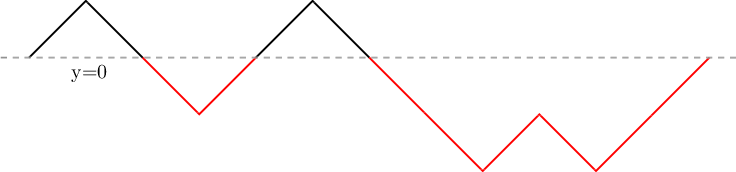
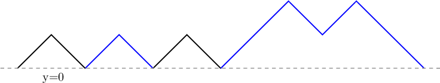

# Tutorial

Thanks for the participation!

[1323A - Even Subset Sum Problem](https://codeforces.com/contest/1323/problem/A "Codeforces Round 626 (Div. 2, based on Moscow Open Olympiad in Informatics)") was authored and prepared by [vintage_Vlad_Makeev](https://codeforces.com/profile/vintage_Vlad_Makeev "International Grandmaster vintage_Vlad_Makeev")

[1323B - Count Subrectangles](https://codeforces.com/contest/1323/problem/B "Codeforces Round 626 (Div. 2, based on Moscow Open Olympiad in Informatics)") was authored and prepared by [vintage_Vlad_Makeev](https://codeforces.com/profile/vintage_Vlad_Makeev "International Grandmaster vintage_Vlad_Makeev")

[1322A - Unusual Competitions](../problems/A._Unusual_Competitions.md "Codeforces Round 626 (Div. 1, based on Moscow Open Olympiad in Informatics)") was authored by [vintage_Vlad_Makeev](https://codeforces.com/profile/vintage_Vlad_Makeev "International Grandmaster vintage_Vlad_Makeev") and prepared by [DebNatkh](https://codeforces.com/profile/DebNatkh "Candidate Master DebNatkh")

[1322B - Present](../problems/B._Present.md "Codeforces Round 626 (Div. 1, based on Moscow Open Olympiad in Informatics)") was authored by [meshanya](https://codeforces.com/profile/meshanya "Grandmaster meshanya") and prepared by [wrg0ababd](https://codeforces.com/profile/wrg0ababd "Expert wrg0ababd")

[1322C - Instant Noodles](../problems/C._Instant_Noodles.md "Codeforces Round 626 (Div. 1, based on Moscow Open Olympiad in Informatics)") was authored by [vintage_Vlad_Makeev](https://codeforces.com/profile/vintage_Vlad_Makeev "International Grandmaster vintage_Vlad_Makeev") and prepared by [ch_egor](https://codeforces.com/profile/ch_egor "International Grandmaster ch_egor")

[1322D - Reality Show](../problems/D._Reality_Show.md "Codeforces Round 626 (Div. 1, based on Moscow Open Olympiad in Informatics)") was authored by [voidmax](https://codeforces.com/profile/voidmax "International Grandmaster voidmax") and prepared by [okwedook](https://codeforces.com/profile/okwedook "Master okwedook")

[1322E - Median Mountain Range](../problems/E._Median_Mountain_Range.md "Codeforces Round 626 (Div. 1, based on Moscow Open Olympiad in Informatics)") was authored by [Sender](https://codeforces.com/profile/Sender "Expert Sender") and prepared by [grphil](https://codeforces.com/profile/grphil "Master grphil")

[1322F - Assigning Fares](../problems/F._Assigning_Fares.md "Codeforces Round 626 (Div. 1, based on Moscow Open Olympiad in Informatics)") was authored by [mingaleg](https://codeforces.com/profile/mingaleg "Candidate Master mingaleg"), [vintage_Vlad_Makeev](https://codeforces.com/profile/vintage_Vlad_Makeev "International Grandmaster vintage_Vlad_Makeev") and prepared by [KiKoS](https://codeforces.com/profile/KiKoS "Master KiKoS")

 
### [1323A - Задача о подмножестве чётной суммы](https://codeforces.com/contest/1323/problem/A "Codeforces Round 626 (Div. 2, по задачам Открытой олимпиады школьников по программированию)")

If there is an even element in array there is an answer consisting of only it. Otherwise if there is at least two odd elements in array there is an answer consisting of this two elements. Otherwise array is only one odd element and there is no answer.

 
### [1323B - Посчитай подпрямоугольники](https://codeforces.com/contest/1323/problem/B "Codeforces Round 626 (Div. 2, по задачам Открытой олимпиады школьников по программированию)")

Rectangle $[x1; x2][y1; y2]$ consists of only ones iff subsegment $[x1; x2]$ consists of only ones in $a$ and subsegment $[y1; y2]$ consists of only ones in $b$. Let's iterate over divisors of $k$. Let the current divisor be $p$ (i.e. $k = p \cdot q$), so we are interested in number of subsegments consisting of ones of length $p$ in $a$ and number of subsegments consisting of ones of length $q$ in $b$.

It's possible to precalculate number of segments consisting of ones in $a$ and $b$ of each length. Let's find all maximal subsegments consisting of ones in $a$ and $b$. Consider subsegment of length $l$. It adds $l - s + 1$ for amount of subsegments of length $s$.

 **c++ code by gritukan**
```cpp
#include <bits/stdc++.h>

using ll = long long;
using ld = long double;
using ull = unsigned long long;

using namespace std;

vector<ll> gao(vector<int> a) {
    int n = a.size();
    vector<ll> res(n + 1);
    int i = 0;
    while (i < n) {
        if (a[i] == 0) {
            i++;
            continue;
        }

        int j = i;
        while (j < n && a[j] == 1) {
            j++;
        }
        for (int len = 1; len <= j - i; len++) {
            res[len] += j - i - len + 1;
        }
        i = j;
    }

    return res;
}

int main() {
    ios_base::sync_with_stdio(false); cin.tie(0); cout.tie(0);
    int n, m;
    ll k;
    cin >> n >> m >> k;
    vector<int> a(n);
    vector<int> b(m);
    for (int& x : a) {
        cin >> x;
    }
    for (int& x : b) {
        cin >> x;
    }

    ll ans = 0;

    auto ga = gao(a);
    auto gb = gao(b);
    for (int i = 1; i < ga.size(); i++) {
        if (k % i == 0 && k / i <= m) {
            ans += ga[i] * gb[k / i];
        }
    }

    cout << ans << "n";
    return 0;
}

```
 
### [1322A - Unusual Competitions](../problems/A._Unusual_Competitions.md "Codeforces Round 626 (Div. 1, based on Moscow Open Olympiad in Informatics)")

Obviously, if the number of opening brackets is not equal to the number of closing ones, then since the described operation does not change their number, it will be impossible to get the correct sequence. Otherwise, if their numbers are equal, you can take the entire string and rearrange its $n$ characters so that the string becomes a right bracketed sequence, for example, "(((($\dots$))))".

Let $p_i$ be a prefix balance on the first $i$ characters, that is, the difference between the number of opening and closing brackets.

Consider an index $i$ such that $bal_{i-1} \leq 0$, $bal_{i} < 0$, or $bal_{i-1} < 0$, $bal_i \leq 0$. Then, if the $s_i$ character does not participate in any shuffle oeration, the resulting string will have a $i$th or $i-1$th prefix balance negative, making the resulting sequence incorrect. This means that at least characters with such indexes $i$ must participate in at least one operation. It will be shown below how to use only them in shuffles to make a right bracketed sequence.

Let's represent this bracketed sequence as a polyline. It will start at the point with coordinates $(0,0)$, end at the point with coordinates $(2n, 0)$, $i$ - th vector of this polyline will be equal to $(+1, +1)$, if $s_i = $ ( and $(+1, -1)$ otherwise. Then the above-described indexes $i$, which must participate in at least one operation — are exactly all the segments below the line $x=0$. To make the sequence correct, we will turn all consecutive segments of such brackets backwards. It's not hard to see that the sequence will become correct.

An example of this conversion is shown below:

   Given sequence was ())(()))()((   After reshuffling 2 segments of total length 8, we can get a right bracketed sequence:()()((()()) 
### [1322B - Подарок](../problems/B._Present.md "Codeforces Round 626 (Div. 1, по задачам Открытой олимпиады школьников по программированию)")

Let's calculate each bit in the answer separately. Suppose we want to know the value of $k$-th (in 0-indexation) bit in the answer. Then we can notice that we are only interested in bits from $0$-th to $k$-th, which means that we can take all numbers modulo $2^{k+1}$. After that, the sum of the two numbers can't exceed $2^{k+2} - 2$. $k$-th bit is 1 if and only if sum belongs to $[2^k; 2^{k+1})$ or $[2^{k+1} + 2^k; 2^{k+2} - 2]$.

So, we have to count the number of pairs of numbers that give a sum that belongs to these segments. Let's sort all numbers (taken by modulo) and make a pass with two pointers or do binary searches for each number.

Total complexity: $O(n \log n \log C)$

Bonus: can you do it in $O(n \log C)$?

 
### [1322C - Instant Noodles](../problems/C._Instant_Noodles.md "Codeforces Round 626 (Div. 1, based on Moscow Open Olympiad in Informatics)")

Let's split vertices of right half of graph in groups in such a way that group consists of vertices with same neighboring set. Then answer equals to $gcd$ of sums of numbers in all groups except the group with empty neighboring set. Let's prove it.

If there are some vertices with same list of neighbors then they will both in some $N(S)$ or none of them will be in it. It means that we can replace such vertices with one vertex with value equals to sum of values in these vertices. After that numbers in all vertices are divisible by answer and thus sum of every subset is divisible by it. Let's divide all the numbers by answer and prove that after it answer will be 1.

Consider some integer $k$ and we'll find some set of vertices $S$ such that $f(S)$ is not divisible by $k$. If sum of all numbers is not divisible by $k$ we can take all the left half and its sum is not divisible by $k$. Otherwise consider a vertex with minimum degree such that its value is not divisible by $k$ (such vertex exists because gcd of numbers in right half is 1 now). Let's take subset of vertices in left part which are not connected to $v$. Which vertices are not neighboring to this set? It is $v$ and all the vertices that their neighboring set it a subset of neighboring set of $v$ (and their sum is divisible by $k$). But value of $v$ is not divisible by $k$ so sum in complement of its neighboring set is not divisible by $k$ too.

 
### [1322D - Реалити-шоу](../problems/D._Reality_Show.md "Codeforces Round 626 (Div. 1, по задачам Открытой олимпиады школьников по программированию)")

First of all, we will notice that the order of entering doesn't affect the answer. 

Let's reverse the sequence. We will add people in the non-decreasing order. Let's use dynamic programming: $dp[i][k][cnt]$ is the answer if we processed first $i$ candidates with the maximum value less or equal $k$ and total number of people who will reach $l_j = k$ is $cnt \leq n$. 

How we should change values of $dp$ when we go from $k$ to $k + 1$? $dp[i][k + 1][cnt / 2] \leq dp[i][k][cnt] + (cnt / 2) \cdot c_{k + 1}$

But how $dp$ changes when we take $i$-th element? $dp[i + 1][a_i][cnt] \leq dp[i][a_i][cnt - 1] + s_i$ 

After adding $i$-th element we also should change $dp[i + 1][>a_i ]$. But every next lay will change less: $n + \left \lceil \frac{n}{2} \right \rceil + \left \lceil \frac{n}{4} \right \rceil + \left \lceil \frac{n}{8} \right \rceil + \ldots = O(n + m)$.

It clear, that we can remove first parameter of $dp$ and finally get the asymptotics $O(n(n + m))$.

 
### [1322E - Медианный горный хребет](../problems/E._Median_Mountain_Range.md "Codeforces Round 626 (Div. 1, по задачам Открытой олимпиады школьников по программированию)")

Let's assume that $1 \le a_i \le 2$. We can notice that if for some $i$ $a_i = a_{i + 1}$, than on $i$-th and $(i+1)$-th positions numbers will stay the same forever. So the only changes will happen to segments of consecutive alternating $1$ and $2$. Now let's look what will happen to such segments after first alignment of mountain peaks. The beginning and end of segment will stay the same, and all intermediate number will change ($1$ will change to $2$ and $2$ will change to $1$). So the second number will be equal to first and pre last number will be equal to last. That means that lengths of all segments of consecutive alternating $1$ and $2$ will decrease by $2$. So the number of alignments equals to length of longest segment divided by $2$, and for each segment its first half will be equal to beginning of segment, and its second half will be equal to the end of segment.

Now let's fix some number $x$ and create array $b$, where $b_i = 1$ if $a_i < x$ and $b_i = 2$ if $a_i \ge x$. It can be observed, that if we will make alignment with initial mountain heights and replace them with $1$ and $2$ the same way, we will get array $b$ after first alignment. So if we will get array $b$ after stabilization, we will know that on positions where $b_i = 1$ mountains will have height less than $x$, and on positions where $b_i = 2$ the mountain heights after stabilization will be grater or equal than $x$. So to get the number of alignments we will need to find the longest segment of consecutive alternating $1$ and $2$ for all possible $x$.

Now we need to get the final heights. Let's assume that we know all positions where final heights will be grater than $x$. Let's create array $b$ the same way as described above. Using this array we can get positions where the mountain heights will be grater or equal than $x$ after stabilization. As we know positions where the heights will be grater than $x$, we can get positions where heights will be equal to $x$. So if we will decrease $x$ from maximum value to $1$, we can get the final heights of all mountains.

To perform it quick enough, we can consider only those $x$, that equal to some of existing initial heights. Then we can decrease $x$ and in some set store all segments of consecutive alternating $1$ and $2$ in array $b$ for such $x$. When the $x$ is decreased, on some positions $1$ can change to $2$. The changes can happen only to the segments that have such positions. (The segments can be splited by this position, or this position can be merged with neighbouring segment(s)) So in total there will be $O(n)$ changes to segments, and we can perform all of them in $O(n \log n)$ time. Also we can store in set all positions, for which we do not know the final heights, we for each new segment we can find positions where $1$ will be in the end (it will be some segment of consecutive positions) and search free positions among them in the set. In total it will take $O(n \log n)$ time.

There also exists solution in $O(n)$ time.

 
### [1322F - Разработка тарифов](../problems/F._Assigning_Fares.md "Codeforces Round 626 (Div. 1, по задачам Открытой олимпиады школьников по программированию)")

Let's assume $c_v$ is the color of vertex v. So, we need to find a coloring of tree, where $c_v$ strictly increases along every path.

First of all, if coloring exists, we can renumerate colors so that they will be in range [1, $n$]. Secondly, we can always revert our coloring, make $c_v \rightarrow k + 1 - c_v$. Also, let's do binary search to find $k$. So, now we want to check if it is possible to paint tree using $k$ colors.

Every path can be on of two directions. If we determine direction for path #0, then we also automatically determine direction for every path which has common edge with path #0. So, we can get a components of paths — if we choose one path direction, we choose every other paths direction. We can notice, that if a single component is not bipartite, answer is -1. So, for every path, we know it's component and it's orientation inside the component. It can be calculated using subtree sum — for vertexes $a$ and $b$ we make +1 for $a$, +1 for $b$, and -2 for $lca(a,\,b)$. Let's make our tree rooted and then count dp on subtrees. $dp_v$ — minimal color of $v$, if all it's subtree is colored in a correct way and edge $v \rightarrow parent_v$ goes from lower to higher color. How to calculate dp?

If we fix $parent_v \rightarrow v$ edge direction, for some edges $v \rightarrow to$ we know the orientation. It happens when they were in same component as $parent_v \rightarrow v$. For other components, we can or use $dp_{to}$ or $k + 1 - dp_{to}$ — depending on which direction of component we use. If we will try both variants and combine all the constraints, we will get two different segments $[l, r]$ and $[k + 1 - r, k + 1 - l]$, and $dp_v$ must be in one of them. It can be solved with scanline in $O(n \log n)$ time.

Now we can notice that $r = k + 1 - dp_{to}$. Let's think of segments as about two left constraints: $l_1$ and $l_2$. We have two sets $L$ and $R$. We either put $l_1 \rightarrow L,\ l_2 \rightarrow R$ or $l_2 \rightarrow L,\ l_1 \rightarrow R$.

So, we want these conditions to be done: $$\begin{cases} \max(L) \le \min(k - R) \\\ \max(L) \rightarrow \min \end{cases} \rightarrow \begin{cases} \max(L) + \max(R) \le k \\\ \max(L) \rightarrow \min \end{cases}$$

If we fix what is more — $\max(R)$ or $\max(L)$, we get fixed distribuition between $L$ and $R$ — max of $l_1$ and $l_2$ goes to max of two sets. Then we just need to check conditions and use best of variants. Solution will have complexity $O(n \log n)$.

