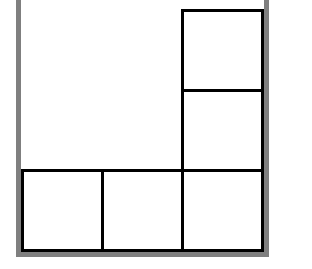
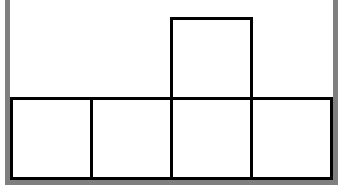

<h1 style='text-align: center;'> A. Yet Another Tetris Problem</h1>

<h5 style='text-align: center;'>time limit per test: 2 seconds</h5>
<h5 style='text-align: center;'>memory limit per test: 256 megabytes</h5>

You are given some Tetris field consisting of $n$ columns. The initial height of the $i$-th column of the field is $a_i$ blocks. On top of these columns you can place only figures of size $2 \times 1$ (i.e. the height of this figure is $2$ blocks and the width of this figure is $1$ block). 
## Note

 that you cannot rotate these figures.

Your task is to say if you can clear the whole field by placing such figures.

More formally, the problem can be described like this:

The following process occurs while at least one $a_i$ is greater than $0$:

1. You place one figure $2 \times 1$ (choose some $i$ from $1$ to $n$ and replace $a_i$ with $a_i + 2$);
2. then, while all $a_i$ are greater than zero, replace each $a_i$ with $a_i - 1$.

And your task is to determine if it is possible to clear the whole field (i.e. finish the described process), choosing the places for new figures properly.

You have to answer $t$ independent test cases.

### Input

The first line of the input contains one integer $t$ ($1 \le t \le 100$) — the number of test cases.

The next $2t$ lines describe test cases. The first line of the test case contains one integer $n$ ($1 \le n \le 100$) — the number of columns in the Tetris field. The second line of the test case contains $n$ integers $a_1, a_2, \dots, a_n$ ($1 \le a_i \le 100$), where $a_i$ is the initial height of the $i$-th column of the Tetris field.

### Output

For each test case, print the answer — "YES" (without quotes) if you can clear the whole Tetris field and "NO" otherwise.

## Example

### Input


```text
4
3
1 1 3
4
1 1 2 1
2
11 11
1
100
```
### Output


```text
YES
NO
YES
YES
```
## Note

The first test case of the example field is shown below:



Gray lines are bounds of the Tetris field. 
## Note

 that the field has no upper bound.

One of the correct answers is to first place the figure in the first column. Then after the second step of the process, the field becomes $[2, 0, 2]$. Then place the figure in the second column and after the second step of the process, the field becomes $[0, 0, 0]$.

And the second test case of the example field is shown below:



It can be shown that you cannot do anything to end the process.

In the third test case of the example, you first place the figure in the second column after the second step of the process, the field becomes $[0, 2]$. Then place the figure in the first column and after the second step of the process, the field becomes $[0, 0]$.

In the fourth test case of the example, place the figure in the first column, then the field becomes $[102]$ after the first step of the process, and then the field becomes $[0]$ after the second step of the process.


#### Tags 

#900 #NOT OK #implementation #number_theory 

## Blogs
- [All Contest Problems](../Codeforces_Round_627_(Div._3).md)
- [Announcement](../blogs/Announcement.md)
- [Tutorial](../blogs/Tutorial.md)
