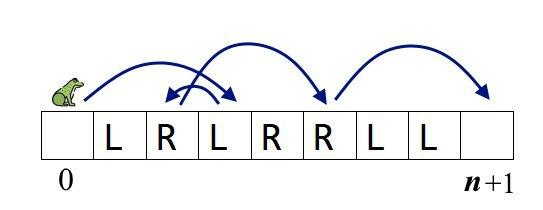

<h1 style='text-align: center;'> C. Frog Jumps</h1>

<h5 style='text-align: center;'>time limit per test: 2 seconds</h5>
<h5 style='text-align: center;'>memory limit per test: 256 megabytes</h5>

There is a frog staying to the left of the string $s = s_1 s_2 \ldots s_n$ consisting of $n$ characters (to be more precise, the frog initially stays at the cell $0$). Each character of $s$ is either 'L' or 'R'. It means that if the frog is staying at the $i$-th cell and the $i$-th character is 'L', the frog can jump only to the left. If the frog is staying at the $i$-th cell and the $i$-th character is 'R', the frog can jump only to the right. The frog can jump only to the right from the cell $0$.

## Note

 that the frog can jump into the same cell twice and can perform as many jumps as it needs.

The frog wants to reach the $n+1$-th cell. The frog chooses some positive integer value $d$ before the first jump (and cannot change it later) and jumps by no more than $d$ cells at once. I.e. if the $i$-th character is 'L' then the frog can jump to any cell in a range $[max(0, i - d); i - 1]$, and if the $i$-th character is 'R' then the frog can jump to any cell in a range $[i + 1; min(n + 1; i + d)]$.

The frog doesn't want to jump far, so your task is to find the minimum possible value of $d$ such that the frog can reach the cell $n+1$ from the cell $0$ if it can jump by no more than $d$ cells at once. It is guaranteed that it is always possible to reach $n+1$ from $0$.

You have to answer $t$ independent test cases.

### Input

The first line of the input contains one integer $t$ ($1 \le t \le 10^4$) — the number of test cases.

The next $t$ lines describe test cases. The $i$-th test case is described as a string $s$ consisting of at least $1$ and at most $2 \cdot 10^5$ characters 'L' and 'R'.

It is guaranteed that the sum of lengths of strings over all test cases does not exceed $2 \cdot 10^5$ ($\sum |s| \le 2 \cdot 10^5$).

### Output

For each test case, print the answer — the minimum possible value of $d$ such that the frog can reach the cell $n+1$ from the cell $0$ if it jumps by no more than $d$ at once.

## Example

### Input


```text
6
LRLRRLL
L
LLR
RRRR
LLLLLL
R
```
### Output


```text
3
2
3
1
7
1
```
## Note

The picture describing the first test case of the example and one of the possible answers:



In the second test case of the example, the frog can only jump directly from $0$ to $n+1$.

In the third test case of the example, the frog can choose $d=3$, jump to the cell $3$ from the cell $0$ and then to the cell $4$ from the cell $3$.

In the fourth test case of the example, the frog can choose $d=1$ and jump $5$ times to the right.

In the fifth test case of the example, the frog can only jump directly from $0$ to $n+1$.

In the sixth test case of the example, the frog can choose $d=1$ and jump $2$ times to the right.


#### Tags 

#1100 #NOT OK #binary_search #data_structures #dfs_and_similar #greedy #implementation 

## Blogs
- [All Contest Problems](../Codeforces_Round_627_(Div._3).md)
- [Announcement](../blogs/Announcement.md)
- [Tutorial](../blogs/Tutorial.md)
