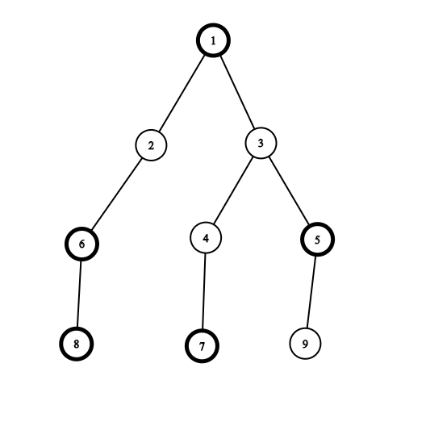

<h1 style='text-align: center;'> F. Maximum White Subtree</h1>

<h5 style='text-align: center;'>time limit per test: 2 seconds</h5>
<h5 style='text-align: center;'>memory limit per test: 256 megabytes</h5>

You are given a tree consisting of $n$ vertices. A tree is a connected undirected graph with $n-1$ edges. Each vertex $v$ of this tree has a color assigned to it ($a_v = 1$ if the vertex $v$ is white and $0$ if the vertex $v$ is black).

You have to solve the following problem for each vertex $v$: what is the maximum difference between the number of white and the number of black vertices you can obtain if you choose some subtree of the given tree that contains the vertex $v$? The subtree of the tree is the connected subgraph of the given tree. More formally, if you choose the subtree that contains $cnt_w$ white vertices and $cnt_b$ black vertices, you have to maximize $cnt_w - cnt_b$.

#### Input

The first line of the input contains one integer $n$ ($2 \le n \le 2 \cdot 10^5$) — the number of vertices in the tree.

The second line of the input contains $n$ integers $a_1, a_2, \dots, a_n$ ($0 \le a_i \le 1$), where $a_i$ is the color of the $i$-th vertex.

Each of the next $n-1$ lines describes an edge of the tree. Edge $i$ is denoted by two integers $u_i$ and $v_i$, the labels of vertices it connects $(1 \le u_i, v_i \le n, u_i \ne v_i$).

It is guaranteed that the given edges form a tree.

#### Output

Print $n$ integers $res_1, res_2, \dots, res_n$, where $res_i$ is the maximum possible difference between the number of white and black vertices in some subtree that contains the vertex $i$.

## Examples

#### Input


```text
9
0 1 1 1 0 0 0 0 1
1 2
1 3
3 4
3 5
2 6
4 7
6 8
5 9
```
#### Output


```text
2 2 2 2 2 1 1 0 2 
```
#### Input


```text
4
0 0 1 0
1 2
1 3
1 4
```
#### Output


```text
0 -1 1 -1 
```
## Note

The first example is shown below:



The black vertices have bold borders.

In the second example, the best subtree for vertices $2, 3$ and $4$ are vertices $2, 3$ and $4$ correspondingly. And the best subtree for the vertex $1$ is the subtree consisting of vertices $1$ and $3$.


#### Tags 

#1800 #NOT OK #dfs_and_similar #dp #graphs #trees 

## Blogs
- [All Contest Problems](../Codeforces_Round_627_(Div._3).md)
- [Announcement](../blogs/Announcement.md)
- [Tutorial](../blogs/Tutorial.md)
