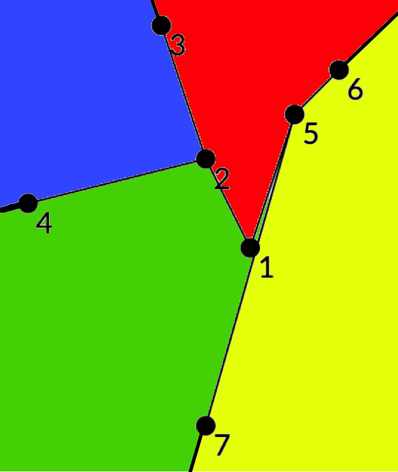

# Tutorial_(en)

The problems A, C, D, G are authored and prepared by [isaf27](https://codeforces.com/profile/isaf27 "Международный гроссмейстер isaf27").

The problems B, E, F are authored and prepared by [300iq](https://codeforces.com/profile/300iq "Легендарный гроссмейстер 300iq").

 
### [1326A - Плохие некрасивые числа](../problems/A._Bad_Ugly_Numbers.md "Codeforces Global Round 7")

If $n = 1$, no solution exists.

Otherwise, if $n \geq 2$, the number $\overline{2 3 3 \ldots 3}$ ($n$ digits) satisfies all conditions, because it is not divisible by $2$ and $3$.

Jury solution: [link](https://codeforces.com/https://pastebin.com/KEBHMi12)

 
### [1326B - Максимумы](../problems/B._Maximums.md "Codeforces Global Round 7")

Let's restore $a_1, a_2, \ldots, a_n$ from left to right.

$a_1 = b_1$.

For $i>1$, $x_i = \max({a_1, \ldots, a_{i-1}})$, so we can maintain the maximum of previous elements and get the value of $x_i$. Using this value, we can restore $a_i$ as $b_i + x_i$.

Jury solution: [link](https://codeforces.com/https://pastebin.com/jkDQzBBT)

 
### [1326C - Разбиения перестановки](../problems/C._Permutation_Partitions.md "Codeforces Global Round 7")

Note that the maximum possible partition value is equal to $(n - k + 1) + \ldots + (n - 1) + n$.

Let's define $a_1, a_2, \ldots, a_k$ as positions of the numbers $(n-k+1), \ldots, n$ in the increasing order ($a_1 < a_2 < \ldots < a_k$). The number of partitions with the maximum possible value is equal to $\prod\limits_{i=1}^{k-1} {(a_{i+1}-a_i)}$. 

This is true because if we have the maximum possible value, each of the segments in a partition should contain exactly one of the values $(n-k+1), \ldots, n$, and thus, one of the positions $a_1, a_2, \ldots, a_k$. So, between each pair of neighboring positions, we should choose exactly one of the borders of the segments in the partition. There are $(a_{i+1}-a_i)$ ways to do this.

Jury solution: [link](https://codeforces.com/https://pastebin.com/ZhLxB8wm)

 
### [1326D2 - Префиксно-суффиксный палиндром (усложненная версия)](../problems/D2._Prefix-Suffix_Palindrome_(Hard_version).md "Codeforces Global Round 7")

Each possible string $t$ can be modeled as $s[1..l] + s[(n-r+1)..n]$ for some numbers $l,r$ such that $0 \leq l, r$ and $l + r \leq n$.

Let's find the maximum integer $0 \leq k \leq \lfloor \frac{n}{2} \rfloor$ such that $s_1 = s_n, s_2 = s_{n-1}, \ldots, s_k = s_{n-k+1}$.

In some optimal solution, where $t$ is as long as possible, $\min{(l, r)} = k$. This is because if $\min{(l, r)} < k$, we can increase $l$ or $r$ by $1$ and decrease the other variable by $1$ (if needed), and the string will be still a palindrome.

So if we know that $\min{(l, r)} = k$, we just need to find the longest palindrome $w$ that is a prefix or suffix of the string $s[(k+1)..(n-k)]$. After that, the answer will be $s[1..k] + w + s[(n-k+1)..n]$.

In order to find the longest palindrome which is a prefix of some string, $a$, let's find $p$ from the prefix function of the string $a +$ '#' $+ \overline{a}$, where $\overline{a}$ represents the reverse of $a$. The string $a[1..p]$ will be the longest palindrome which is a prefix of $a$.

After that, we can repeat this process for $\overline{a}$ to find the longest palindrome which is a suffix of the string.

Time complexity: $O(|s|)$.

Jury solution: [link](https://codeforces.com/https://pastebin.com/St9RUYvN)

 
### [1326E - Бомбы](../problems/E._Bombs.md "Codeforces Global Round 7")

Let's come up with some criteria that answer is $< x$.

We claim that the answer is $< x$ if:

* There is at least one bomb after the rightmost value $\geq x$.
* There are at least two bombs after the next rightmost value $\geq x$....
* There are at least $k$ bombs after the $k$-th rightmost value $\geq x$.

Let $ans_i$ be the answer for bombs $q_1, q_2, \ldots, q_{i-1}$.

Then, $ans_i \geq ans_{i+1}$.

Let's add new bombs starting from $ans_{i-1}$, and while the actual answer is smaller than the current answer, decrease the actual answer.

To do this quickly, we'll use a segment tree.

In the segment tree, let's store $b_i = $ (number of values $\geq x$ on suffix $i \ldots n$) $-$ (number of bombs on this suffix).

Then, the real answer is $< x$ if $b_i \leq 0$ for all $i$. 

Using range addition updates and max queries, we can update $b$ and decrease the answer quickly.

The total complexity is $\mathcal{O}{(n \log n)}$.

Bonus: is it possible to solve the problem in $\mathcal{O}{(n)}$?

Jury solution: [link](https://codeforces.com/https://pastebin.com/A1gFm627)

 
### [1326F2 - Мудрецы (усложненная версия)](../problems/F2._Wise_Men_(Hard_Version).md "Codeforces Global Round 7")

For each binary string $s$, let's calculate $f(s)$ – the number of permutations, such that, if $s_i=1$, then $p_i$ and $p_{i+1}$ know each other, otherwise, they may know or don't know each other.

To get real answers, we may use inclusion-exclusion, which may be optimized using a straightforward sum over subsets dp.

To calculate $f(s)$, we need to note that $f$ depends only on the multiset of lengths of blocks of $1$'s in it.

For example, $f(110111) = f(111011)$, because the multiset of lengths is $\{1, 3, 4\}$ (note that block of size $x$ of $1$'s corresponds to length $x+1$).

And note that there are exactly $P(n)$ (the number of partitions of $n$) possible multisets.

$P(18) = 385$

To process further, at first let's calculate $g_{len, mask}$ – the number of paths of length $len$, which pass only through the vertices from $mask$ (and only through them).

You can calculate it with a straightforward $dp_{mask, v}$ in $\mathcal{O}{(2^n \cdot n^2)}$.

Then, let's fix the multiset of lengths $a_1, a_2, \ldots, a_k$.

I claim that the $f(s)$ for this multiset is equal to $\sum{\prod{g_{a_i, m_i}}}$ over all masks $m_1, m_2, \ldots m_k$, such that the bitwise OR of $m_1, m_2, \ldots, m_k$ is equal to $2^n-1$ (note that we don't care about the number of bits like in a usual non-intersecting subsets convolution, because if some masks are intersecting, then their OR won't be equal to $2^n-1$ because $\sum{a_i} = n$).

You can calculate this sum by changing $g_{len}$ to the sum over subsets.

And then, for this partition, you can just calculate $d_{mask} = \prod{g_{a_i, mask}}$ in $\mathcal{O}{(k \cdot 2^n)}$, and you can restore the real value of $2^n-1$ by inclusion-exclusion in $\mathcal{O}{(2^n)}$.

If you will calculate this naively, you will get the $\mathcal{O}$((sum of sizes of all partitions) $\cdot 2^n)$ solution, which is enough to get AC.

But you can optimize this because you can maintain $d_{mask}$ during the brute force of all partitions. And in the tree of all partitions, there are $\mathcal{O}{(P(n))}$ intermediate vertices, so it will work in $\mathcal{O}{(P(n) \cdot 2^n)}$.

The total complexity is $\mathcal{O}{((P(n) + n^2) \cdot 2^n))}$.

Jury solution: [link](https://codeforces.com/https://pastebin.com/rM7K34EK)

 
### [1326G - Деревья паутины](../problems/G._Spiderweb_Trees.md "Codeforces Global Round 7")

Let's hang the tree on the vertex $1$. After that, we will calculate the value $dp_i$ for all vertices $i$, which is equal to the number of good partitions of the subtree of the vertex $i$ (subtree in the rooted tree). The answer to the problem in these definitions is $dp_1$.

To calculate these values let's make dfs. We know in the vertex $p$ and we want to calculate $dp_p$. We know the values $dp_i$ for all $i$ in the subtree of $p$. Let's define the set of the partition, which contains $p$ as $S$.

There are some cases:

Case $1$: $|S| = 1$. In this case, the number of good partitions is $dp_{i_1} dp_{i_2} \ldots dp_{i_k}$, there $i_1, i_2, \ldots, i_k$ are all sons of the vertex $p$.

Case $2$: $|S| = 2$. In this case, the number of good partitions is $\sum\limits_{i \in Sons(p)} {f_i \prod\limits_{j \in Sons(p), j \neq i} dp_{j}}$, there $f_i = dp_{i_1} dp_{i_2} \ldots dp_{i_k}$, there $i_1, i_2, \ldots, i_k$ are all sons of the vertex $i$.

The values in these cases are easy to find. We have one, last case:

Case $3$: $|S| \geq 3$.

In this case, the number of good partitions is $\sum\limits_{p \in S, \, S \, is \, spiderweb} func(S)$. Let's define $func(S)$ as the product of $dp_i$ for all vertices $i$, which are going from $S$ (it means, that $i$ isn't in $S$, but ancestor of $i$ is in $S$). Let's try to calculate this sum faster.

Let's call a pair of vertices $(i, j)$ good if they are not connected and all vertices $t$ on the path from $i$ to $j$ lies on the left side from the vector $\overrightarrow{A_i A_j}$. It can be shown, that if the polygon $A_{i_1} A_{i_2} \ldots A_{i_k}$ is convex and all pairs $(i_{j}, i_{j+1})$ are good, the subtree with leafs $i_1, i_2, \ldots, i_k$ is spiderweb.

So, let's fix all leaf vertices in $S$: $i_1, i_2, \ldots, i_k$ (these are the vertices of the subtree of $p$, they can be equal to $p$). If $S$ is the spiderweb tree, the ways $(i_j, i_{j+1})$ divide the plane into infinite parts (for explanation look at the picture):

  The part is defined only with the way in the tree. Let's define $value_{ij}$ as the product of $dp_t$ for all vertices $t$, such that $A_t$ lies in the part for the way $(i, j)$, the vertex $t$ doesn't lie on the way and the ancestor of $t$ lies on the way. So, it's easy to see, that $func(S) = \prod\limits_{i=1}^{k} {value_{i_j i_{j+1}}}$. We can calculate the value for each path only one time during the dfs, after the moment, when all needed values of dp will be defined.

So, let's take all pairs of vertices $(i, j)$, such that $i$ and $j$ are in the subtree of vertex $p$, the way $(i, j)$ is good and the point $A_p$ lies on the left side from the vector $\overrightarrow{A_i A_j}$. After that, we should calculate the sum of products of $value_{i_j i_{j+1}}$ for all convex polygons $A_{i_1} A_{i_2} \ldots A_{i_k}$, which contains the vertex $p$ on some path $(i_j i_{j+1)}$. This thing can be done by the standard dp in time $O(n^3)$ (the same dp as how we calculate the number of convex polygons). To fix the last condition we can make this dp two times: with all good pairs and with good pairs, which don't contain the vertex $p$. After that, the needed number is the subtraction of these two numbers.

So, we have the solution with time complexity $O(n^4)$.

Jury solution: [link](https://codeforces.com/https://pastebin.com/iJzJZauM)

Let's discuss your ideas and solutions in the comments. Thanks for your participation!

