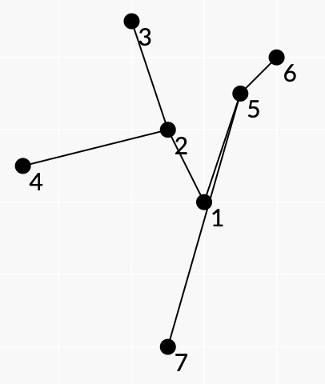
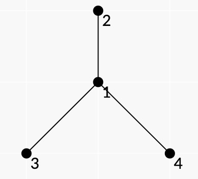
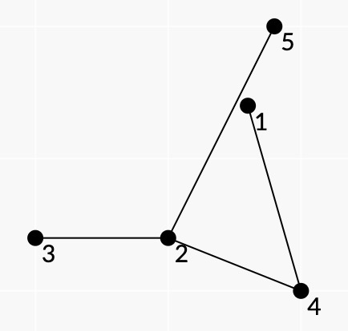
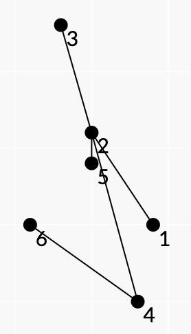
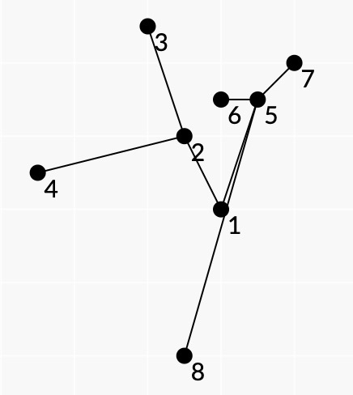

<h1 style='text-align: center;'> G. Spiderweb Trees</h1>

<h5 style='text-align: center;'>time limit per test: 1 second</h5>
<h5 style='text-align: center;'>memory limit per test: 256 megabytes</h5>

Let's call a graph with $n$ vertices, each of which has it's own point $A_i = (x_i, y_i)$ with integer coordinates, a planar tree if:

* All points $A_1, A_2, \ldots, A_n$ are different and no three points lie on the same line.
* The graph is a tree, i.e. there are exactly $n-1$ edges there exists a path between any pair of vertices.
* For all pairs of edges $(s_1, f_1)$ and $(s_2, f_2)$, such that $s_1 \neq s_2, s_1 \neq f_2,$ $f_1 \neq s_2$, and $f_1 \neq f_2$, the segments $A_{s_1} A_{f_1}$ and $A_{s_2} A_{f_2}$ don't intersect.

Imagine a planar tree with $n$ vertices. Consider the convex hull of points $A_1, A_2, \ldots, A_n$. Let's call this tree a spiderweb tree if for all $1 \leq i \leq n$ the following statements are true:

* All leaves (vertices with degree $\leq 1$) of the tree lie on the border of the convex hull.
* All vertices on the border of the convex hull are leaves.

An example of a spiderweb tree: 

  The points $A_3, A_6, A_7, A_4$ lie on the convex hull and the leaf vertices of the tree are $3, 6, 7, 4$.

Refer to the notes for more examples.

Let's call the subset $S \subset \{1, 2, \ldots, n\}$ of vertices a subtree of the tree if for all pairs of vertices in $S$, there exists a path that contains only vertices from $S$. 
## Note

 that any subtree of the planar tree is a planar tree.

You are given a planar tree with $n$ vertexes. Let's call a partition of the set $\{1, 2, \ldots, n\}$ into non-empty subsets $A_1, A_2, \ldots, A_k$ (i.e. $A_i \cap A_j = \emptyset$ for all $1 \leq i < j \leq k$ and $A_1 \cup A_2 \cup \ldots \cup A_k = \{1, 2, \ldots, n\}$) good if for all $1 \leq i \leq k$, the subtree $A_i$ is a spiderweb tree. Two partitions are different if there exists some set that lies in one parition, but not the other.

Find the number of good partitions. Since this number can be very large, find it modulo $998\,244\,353$.

###### Input

The first line contains an integer $n$ ($1 \leq n \leq 100$) — the number of vertices in the tree.

The next $n$ lines each contain two integers $x_i, y_i$ ($-10^9 \leq x_i, y_i \leq 10^9$)  — the coordinates of $i$-th vertex, $A_i$.

The next $n-1$ lines contain two integers $s, f$ ($1 \leq s, f \leq n$) — the edges $(s, f)$ of the tree.

It is guaranteed that all given points are different and that no three of them lie at the same line. Additionally, it is guaranteed that the given edges and coordinates of the points describe a planar tree.

###### Output

Print one integer  — the number of good partitions of vertices of the given planar tree, modulo $998\,244\,353$.

## Examples

###### Input


```text
4
0 0
0 1
-1 -1
1 -1
1 2
1 3
1 4
```
###### Output


```text
5
```
###### Input


```text
5
3 2
0 -3
-5 -3
5 -5
4 5
4 2
4 1
5 2
2 3
```
###### Output


```text
8
```
###### Input


```text
6
4 -5
0 1
-2 8
3 -10
0 -1
-4 -5
2 5
3 2
1 2
4 6
4 2
```
###### Output


```text
13
```
###### Input


```text
8
0 0
-1 2
-2 5
-5 1
1 3
0 3
2 4
-1 -4
1 2
3 2
5 6
4 2
1 5
5 7
5 8
```
###### Output


```text
36
```
## Note

  The picture for the first sample. In the first test case, all good partitions are:

1. $\{1\}$, $\{2\}$, $\{3\}$, $\{4\}$;
2. $\{1, 2\}$, $\{3\}$, $\{4\}$;
3. $\{1, 3\}$, $\{2\}$, $\{4\}$;
4. $\{1, 4\}$, $\{2\}$, $\{3\}$;
5. $\{1, 2, 3, 4\}$.

The partition $\{1, 2, 3\}$, $\{4\}$ isn't good, because the subtree $\{1, 2, 3\}$ isn't spiderweb tree, since the non-leaf vertex $1$ lies on the convex hull.

The partition $\{2, 3, 4\}$, $\{1\}$ isn't good, because the subset $\{2, 3, 4\}$ isn't a subtree.

  The picture for the second sample. In the second test case, the given tree isn't a spiderweb tree, because the leaf vertex $1$ doesn't lie on the convex hull. However, the subtree $\{2, 3, 4, 5\}$ is a spiderweb tree.

  The picture for the third sample.   The picture for the fourth sample. In the fourth test case, the partition $\{1, 2, 3, 4\}$, $\{5, 6, 7, 8\}$ is good because all subsets are spiderweb subtrees.


#### Tags 

#3500 #NOT OK #dp #geometry #trees 

## Blogs
- [All Contest Problems](../Codeforces_Global_Round_7.md)
- [Announcement (en)](../blogs/Announcement_(en).md)
- [Tutorial (en)](../blogs/Tutorial_(en).md)
