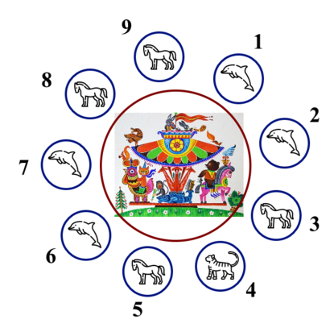

<h1 style='text-align: center;'> D. Carousel</h1>

<h5 style='text-align: center;'>time limit per test: 2 seconds</h5>
<h5 style='text-align: center;'>memory limit per test: 256 megabytes</h5>

The round carousel consists of $n$ figures of animals. Figures are numbered from $1$ to $n$ in order of the carousel moving. Thus, after the $n$-th figure the figure with the number $1$ follows. Each figure has its own type — the type of the animal corresponding to this figure (the horse, the tiger and so on). The type of animal of the $i$-th figure equals $t_i$.

  The example of the carousel for $n=9$ and $t=[5, 5, 1, 15, 1, 5, 5, 1, 1]$. You want to color each figure in one of the colors. You think that it's boring if the carousel contains two different figures (with the distinct types of animals) going one right after another and colored in the same color.

Your task is to color the figures in such a way that the number of distinct colors used is the minimum possible and there are no figures of the different types going one right after another and colored in the same color. If you use exactly $k$ distinct colors, then the colors of figures should be denoted with integers from $1$ to $k$.

### Input

The input contains one or more test cases.

The first line contains one integer $q$ ($1 \le q \le 10^4$) — the number of test cases in the test. Then $q$ test cases follow. One test case is given on two lines.

The first line of the test case contains one integer $n$ ($3 \le n \le 2 \cdot 10^5$) — the number of figures in the carousel. Figures are numbered from $1$ to $n$ in order of carousel moving. Assume that after the $n$-th figure the figure $1$ goes.

The second line of the test case contains $n$ integers $t_1, t_2, \dots, t_n$ ($1 \le t_i \le 2 \cdot 10^5$), where $t_i$ is the type of the animal of the $i$-th figure.

The sum of $n$ over all test cases does not exceed $2\cdot10^5$.

### Output

Print $q$ answers, for each test case print two lines.

In the first line print one integer $k$ — the minimum possible number of distinct colors of figures.

In the second line print $n$ integers $c_1, c_2, \dots, c_n$ ($1 \le c_i \le k$), where $c_i$ is the color of the $i$-th figure. If there are several answers, you can print any.

## Example

### Input


```text
4
5
1 2 1 2 2
6
1 2 2 1 2 2
5
1 2 1 2 3
3
10 10 10
```
### Output


```text
2
1 2 1 2 2
2
2 1 2 1 2 1
3
2 3 2 3 1
1
1 1 1 
```


#### Tags 

#1800 #NOT OK #constructive_algorithms #dp #graphs #greedy #math 

## Blogs
- [All Contest Problems](../Codeforces_Round_629_(Div._3).md)
- [Announcement](../blogs/Announcement.md)
- [Tutorial (en)](../blogs/Tutorial_(en).md)
