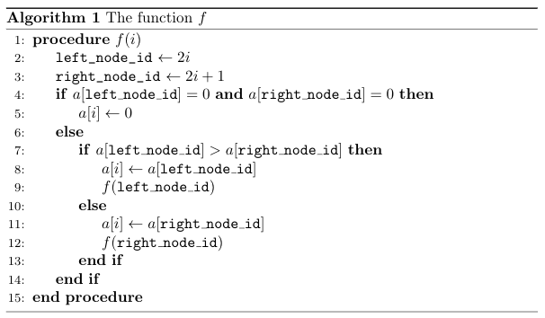

<h1 style='text-align: center;'> C. Drazil Likes Heap</h1>

<h5 style='text-align: center;'>time limit per test: 1.5 seconds</h5>
<h5 style='text-align: center;'>memory limit per test: 256 megabytes</h5>

Drazil likes heap very much. So he created a problem with heap:

There is a max heap with a height $h$ implemented on the array. The details of this heap are the following:

This heap contains exactly $2^h - 1$ distinct positive non-zero integers. All integers are distinct. These numbers are stored in the array $a$ indexed from $1$ to $2^h-1$. For any $1 < i < 2^h$, $a[i] < a[\left \lfloor{\frac{i}{2}}\right \rfloor]$.

Now we want to reduce the height of this heap such that the height becomes $g$ with exactly $2^g-1$ numbers in heap. To reduce the height, we should perform the following action $2^h-2^g$ times:

Choose an index $i$, which contains an element and call the following function $f$ in index $i$:



Note that we suppose that if $a[i]=0$, then index $i$ don't contain an element.

After all operations, the remaining $2^g-1$ element must be located in indices from $1$ to $2^g-1$. Now Drazil wonders what's the minimum possible sum of the remaining $2^g-1$ elements. Please find this sum and find a sequence of the function calls to achieve this value.

### Input

The first line of the input contains an integer $t$ ($1 \leq t \leq 70\,000$): the number of test cases.

Each test case contain two lines. The first line contains two integers $h$ and $g$ ($1 \leq g < h \leq 20$). The second line contains $n = 2^h-1$ distinct positive integers $a[1], a[2], \ldots, a[n]$ ($1 \leq a[i] < 2^{20}$). For all $i$ from $2$ to $2^h - 1$, $a[i] < a[\left \lfloor{\frac{i}{2}}\right \rfloor]$.

The total sum of $n$ is less than $2^{20}$.

### Output

For each test case, print two lines.

The first line should contain one integer denoting the minimum sum after reducing the height of heap to $g$. The second line should contain $2^h - 2^g$ integers $v_1, v_2, \ldots, v_{2^h-2^g}$. In $i$-th operation $f(v_i)$ should be called.

## Example

### Input


```text
2
3 2
7 6 3 5 4 2 1
3 2
7 6 5 4 3 2 1
```
### Output


```text
10
3 2 3 1
8
2 1 3 1
```


#### Tags 

#2400 #NOT OK #constructive_algorithms #data_structures #greedy #implementation 

## Blogs
- [All Contest Problems](../Codeforces_Round_631_(Div._1)_-_Thanks,_Denis_aramis_Shitov!.md)
- [Announcement (en)](../blogs/Announcement_(en).md)
- [Tutorial (en)](../blogs/Tutorial_(en).md)
