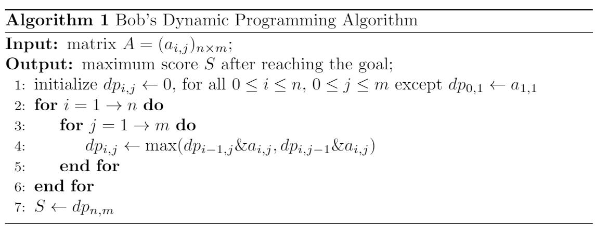

<h1 style='text-align: center;'> D. Walk on Matrix</h1>

<h5 style='text-align: center;'>time limit per test: 2 seconds</h5>
<h5 style='text-align: center;'>memory limit per test: 512 megabytes</h5>

Bob is playing a game named "Walk on Matrix".

In this game, player is given an $n \times m$ matrix $A=(a_{i,j})$, i.e. the element in the $i$-th row in the $j$-th column is $a_{i,j}$. Initially, player is located at position $(1,1)$ with score $a_{1,1}$. 

To reach the goal, position $(n,m)$, player can move right or down, i.e. move from $(x,y)$ to $(x,y+1)$ or $(x+1,y)$, as long as player is still on the matrix.

However, each move changes player's score to the [bitwise AND](https://en.wikipedia.org/wiki/Bitwise_operation#AND) of the current score and the value at the position he moves to.

Bob can't wait to find out the maximum score he can get using the tool he recently learnt  — dynamic programming. Here is his algorithm for this problem. 

  However, he suddenly realize that the algorithm above fails to output the maximum score for some matrix $A$. Thus, for any given non-negative integer $k$, he wants to find out an $n \times m$ matrix $A=(a_{i,j})$ such that 

* $1 \le n,m \le 500$ (as Bob hates large matrix);
* $0 \le a_{i,j} \le 3 \cdot 10^5$ for all $1 \le i\le n,1 \le j\le m$ (as Bob hates large numbers);
* the difference between the maximum score he can get and the output of his algorithm is exactly $k$.

It can be shown that for any given integer $k$ such that $0 \le k \le 10^5$, there exists a matrix satisfying the above constraints.

Please help him with it!

#### Input

The only line of the input contains one single integer $k$ ($0 \le k \le 10^5$).

#### Output

#### Output

 two integers $n$, $m$ ($1 \le n,m \le 500$) in the first line, representing the size of the matrix. 

Then output $n$ lines with $m$ integers in each line, $a_{i,j}$ in the $(i+1)$-th row, $j$-th column.

## Examples

#### Input


```text
0
```
#### Output


```text
1 1
300000
```
#### Input

```text

1

```
#### Output


```text

3 4
7 3 3 1
4 8 3 6
7 7 7 3
```
## Note

In the first example, the maximum score Bob can achieve is $300000$, while the output of his algorithm is $300000$.

In the second example, the maximum score Bob can achieve is $7\\&3\\&3\\&3\\&7\\&3=3$, while the output of his algorithm is $2$.


#### Tags 

#1700 #NOT OK #bitmasks #constructive_algorithms #math 

## Blogs
- [All Contest Problems](../Codeforces_Round_630_(Div._2).md)
- [Announcement (en)](../blogs/Announcement_(en).md)
- [Tutorial (en)](../blogs/Tutorial_(en).md)
