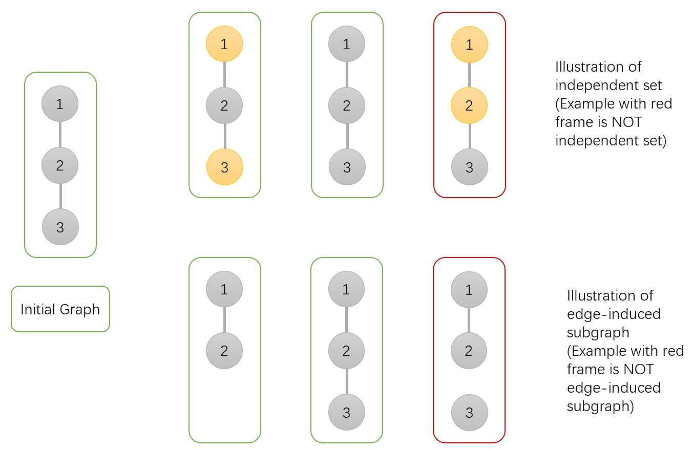
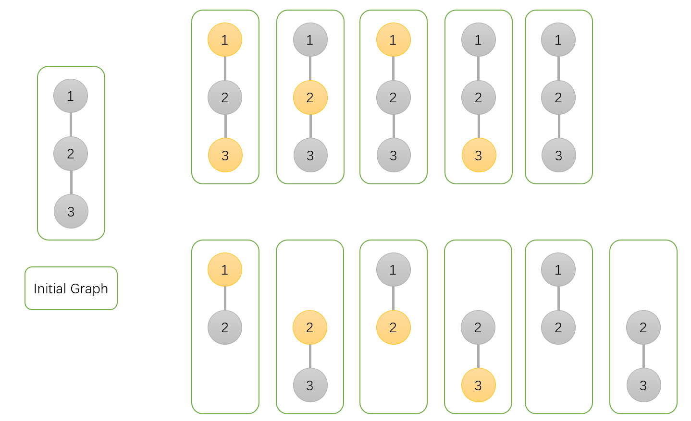

<h1 style='text-align: center;'> F. Independent Set</h1>

<h5 style='text-align: center;'>time limit per test: 2 seconds</h5>
<h5 style='text-align: center;'>memory limit per test: 512 megabytes</h5>

Eric is the teacher of graph theory class. Today, Eric teaches independent set and edge-induced subgraph.

Given a graph $G=(V,E)$, an independent set is a subset of vertices $V' \subset V$ such that for every pair $u,v \in V'$, $(u,v) \not \in E$ (i.e. no edge in $E$ connects two vertices from $V'$).

An edge-induced subgraph consists of a subset of edges $E' \subset E$ and all the vertices in the original graph that are incident on at least one edge in the subgraph.

Given $E' \subset E$, denote $G[E']$ the edge-induced subgraph such that $E'$ is the edge set of the subgraph. Here is an illustration of those definitions:

  In order to help his students get familiar with those definitions, he leaves the following problem as an exercise:

Given a tree $G=(V,E)$, calculate the sum of $w(H)$ over all except null edge-induced subgraph $H$ of $G$, where $w(H)$ is the number of independent sets in $H$. Formally, calculate $\sum \limits_{\emptyset \not= E' \subset E} w(G[E'])$.

Show Eric that you are smarter than his students by providing the correct answer as quickly as possible. 
## Note

 that the answer might be large, you should output the answer modulo $998,244,353$.

#### Input

The first line contains a single integer $n$ ($2 \le n \le 3 \cdot 10^5$), representing the number of vertices of the graph $G$.

Each of the following $n-1$ lines contains two integers $u$ and $v$ ($1 \le u,v \le n$, $u \not= v$), describing edges of the given tree.

It is guaranteed that the given edges form a tree.

#### Output

#### Output

 one integer, representing the desired value modulo $998,244,353$.

## Examples

#### Input


```text
2
2 1
```
#### Output


```text
3
```
#### Input


```text
3
1 2
3 2
```
#### Output


```text
11
```
## Note

For the second example, all independent sets are listed below.

  

#### Tags 

#2500 #NOT OK #dfs_and_similar #dp #trees 

## Blogs
- [All Contest Problems](../Codeforces_Round_630_(Div._2).md)
- [Announcement (en)](../blogs/Announcement_(en).md)
- [Tutorial (en)](../blogs/Tutorial_(en).md)
