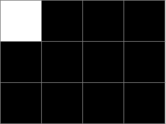
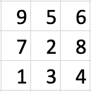
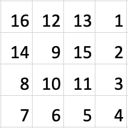
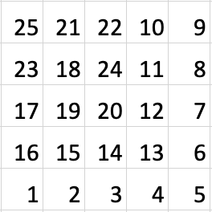

# Tutorial_(en)

I hope you liked problems!

Sorry for incorrect placement of problems. I had to do swap(E, F).

 
### [1333A - Маленький Артем](../problems/A._Little_Artem.md "Codeforces Round 632 (Div. 2)")

In this problem it is enough to simply paint the upper left corner white and all the others black for any size of the board Like this:

  And there are W=1W=1 (cell with coordinates {1,1}{1,1}) and B=2B=2 (cells with coordinates {1,2}{1,2} and {2,1}{2,1}).

In the first version, the task restrictions were 1≤n,m1≤n,m, but we thought it would be too difficult for div2A.

 **Solution C++**
```cpp
#include <bits/stdc++.h>

using namespace std;


void solve() {
    int n, m; cin >> n >> m;
    string black_row(m, 'B');
    vector<string> result(n, black_row);
    result[0][0] = 'W';
    for (int i = 0; i < n; ++i) {
        cout << result[i] << 'n';
    }
}


int main() {
    int t; cin >> t;
    while(t--) solve();
}

```
 
### [1333B - Добрый Антон](../problems/B._Kind_Anton.md "Codeforces Round 632 (Div. 2)")

First of all, note that we can add an element with index ii to an element with index jj iff i<ji<j. This means that the element anan cannot be added to any other element because there is no index j>nj>n in the array. This is why we can first equalize the elements anan and bnbn. If an=bnan=bn, they are already equal. If an<bnan<bn, then we need to have element equal to 11 along the elements aa with indexes {1,...,n−1}{1,...,n−1}. For an>bnan>bn, we need to have −1−1 along these elements. After the elements with index nn become equal, we can go to the element with index n−1n−1 and do the same. Then indexes n−2n−2, n−3n−3, ..., 11. You can implement this idea yourself!

Final time complexity: O(n)O(n)

 **Solution C++**
```cpp
#include <bits/stdc++.h>

using namespace std;

void solve() {
    int n; cin >> n;
    vector<int> a(n), b(n);
    for (int i = 0; i < n; ++i) {
        cin >> a[i];
    }
    for (int i = 0; i < n; ++i) {
        cin >> b[i];
    }
    vector<int> good(2, 0);
    for (int i = 0; i < n; ++i) {
        if (a[i] > b[i] && !good[0]) {
            cout << "NOn";
            return;
        } else if (a[i] < b[i] && !good[1]) {
            cout << "NOn";
            return;
        }
        if (a[i] == -1) good[0] = 1;
        if (a[i] == 1) good[1] = 1;
    }
    cout << "YESn";
}

int main() {
    int t; cin >> t;
    while(t--) {
        solve();
    }
}
```
 
### [1333C - Евгений и массив](../problems/C._Eugene_and_an_array.md "Codeforces Round 632 (Div. 2)")

Let's solve this problem in O(n2×log(n))O(n2×log(n))for now.

Note that if the subarray [ai,...,aj][ai,...,aj] is good, then the subarray [ai,...,aj−1][ai,...,aj−1] is also good, and if the subset [ai,...,aj][ai,...,aj] is not good, then the subarray [ai,...,aj+1][ai,...,aj+1] is not good either. Then for each left border aiai we want to find the rightmost border ajaj such that [ai,...,aj][ai,...,aj] is good and add to the answer j−i+1j−i+1 (subarrays [ai,...,aj],[ai,...,aj−1],...,[ai][ai,...,aj],[ai,...,aj−1],...,[ai]) [1]. Let's denote the rightmost border jj for border ii as R(i)R(i).

Let's calculate the prefix-sum of the array PP.

P0=0,Pi=a1+..+ai,1≤i≤nP0=0,Pi=a1+..+ai,1≤i≤n.

Note that a subset of [ai,...,aj][ai,...,aj] has a zero sum iff Pi−1=PjPi−1=Pj. Then the subset [ai,...,aj][ai,...,aj] is a good iff sum of prefixes [Pi−1,...,Pj][Pi−1,...,Pj] has no duplicates [2].

Using [1] and [2], we can simply iterate over ii from 00 to nn and over jj from ii to nn and count the set of prefix sums [Pi,...,Pj][Pi,...,Pj]. The first moment j0j0 when this set contains duplicates gives us the rightmost border j0−1j0−1, and we add (j0−1)−i(j0−1)−i (no +1+1, because it is an array of prefix sums) to answer.

To improve this solution to O(n×log(n))O(n×log(n)), we need to note that R(i)R(i) is monotonous over ii. Now we can iterate over ii from 00 to nn and over jj from R(i−1)R(i−1) to nn uses a set of prefix sums from the previous iteration. Thus we have a solution O(n×log(n))O(n×log(n)), because jj points to each element of the array exactly once.

If you code in C++, it is important not to use std:: unordered_set in this task, but use std::set. One of the participants hacked the solution using std:: unordered_set, using collisions in this structure. I highly recommend you to read this blog for more info https://codeforces.com/blog/entry/62393.

Final time complexity: O(n×log(n))O(n×log(n))

 **Solution C++**
```cpp
#include <bits/stdc++.h>

using namespace std;


int main() {
    int n; cin >> n;
    vector<long long> prefix(n + 1, 0);
    for (int i = 0; i < n; ++i) {
        int x; cin >> x;
        prefix[i + 1] = prefix[i] + x;
    }
    int begin = 0, end = 0;
    long long ans = 0;
    set<long long> s = {0};
    while(begin < n) {
        while(end < n && !s.count(prefix[end + 1])) {
            ++end;
            s.insert(prefix[end]);
        }
        ans += end - begin;
        s.erase(prefix[begin]);
        ++begin;
    }
    cout << ans << endl;
}
```
 
### [1333D - Досуг в школе №41](../problems/D._Challenges_in_school_№41.md "Codeforces Round 632 (Div. 2)")

If solution exist let's count the minimum and maximum bounds for kk for initial arrangement of children. A minimum kk achieved all possible pairs of children turn theirs heads at every step. The maximum kk reached if only one of possible pairs of children turn theirs heads at every step. This values is easy to count, I'll leave it to you!

If kk from the statement not fit within our bounds, then we need to print −1−1. Otherwise solution exist and we need to construct them. For each next move we can use all pairs of children to turn theirs heads, decrease kk by 1 and recalculate maximum bound (lets call it UU) on kk (just decrease them on the number of pairs used). If after moving new value of kk fits in the bound (k≤Uk≤U), then we proceed to the next iteration. Otherwise, we roll back to the previous iteration and use U−k+1U−k+1 pairs in this move. Number of remaining moves will be k−1k−1 and upper bound will be U−(U−k+1)=k−1U−(U−k+1)=k−1. And from that moment, just use only one pair in one move to the end of the process (to find one of the pair quickly we need to store them in the queue).

Final time complexity: O(n2)O(n2)

 **Solution C++**
```cpp
#include <bits/stdc++.h>

using namespace std;

int n, k;

vector<int> find_steps(const vector<int>& a) {
    vector<int> steps;
    for (int i = 0; i < n - 1; ++i) {
        if (a[i] == 1 && a[i + 1] == 0) steps.push_back(i);
    }
    return steps;
}


int main() {
    cin >> n >> k;
    string s; cin >> s;
    vector<int> a(n);
    for (int i = 0; i < n; ++i) a[i] = (s[i] == 'L') ? 0 : 1;
    int maxi = 0, mini = 0;
    int cnt = 0;
    int last = -1;
    for (int i = n - 1; i >= 0; --i) {
        if (a[i] == 0) {
            ++cnt;
        } else {
            if (cnt == 0) continue;
            maxi += cnt;
            mini = max(cnt, last + 1);
            last = mini;
        }
    }
    if (k < mini || k > maxi) {
        cout << -1;
        return 0;
    }
    bool is_min = false;
    vector<int> have_step;
    for (int i = 0; i < k; ++i) {
        if (!is_min) {
            auto steps = find_steps(a);
            cout << min(int(steps.size()), maxi - k + i + 1) << ' ';
            int cur = 0;
            while (k - i - 1 < maxi && cur < steps.size()) {
                cout << steps[cur] + 1 << ' ';
                a[steps[cur]] = 0;
                a[steps[cur] + 1] = 1;
                ++cur;
                --maxi;
            }
            if (maxi == k - i - 1) {
                is_min = true;
                have_step = find_steps(a);
            }
        } else {
            int v = have_step.back();
            have_step.pop_back();
            cout << "1 " << v + 1;
            a[v] = 0;
            a[v + 1] = 1;
            if (v > 0 && a[v - 1] == 1) {
                have_step.push_back(v - 1);
            }
            if (v + 2 < n && a[v + 2] == 0) {
                have_step.push_back(v + 1);
            }
        }
        cout << 'n';
    }
}
```
 
### [1333E - Путь к 1600](../problems/E._Road_to_1600.md "Codeforces Round 632 (Div. 2)")

First of all notice that there are no such boards for N=1,2N=1,2. Then you can find an example for N=3N=3 by yourself or with counting all cases with program. One of possible examples (I find it using paper, pencil and my hands):

N=3N=3:

  For large NN we can walk by spiral (like snake) to the case N=3N=3.

N=4N=4:

  N=5N=5:

  Rook and Queen first going in a spiral and arrive to N=3N=3 case. It can be used any of such spiral, not just this one.

Final time complexity: O(N2)O(N2)

 **Solution C++**
```cpp
#include <bits/stdc++.h>

using namespace std;


int main() {
    int n; cin >> n;
    if (n < 3) {
        cout << -1;
        return 0;
    }
    vector<int> solution = {
        1, 3, 4, 8, 2, 7, 9, 5, 6
    };
    vector<vector<int>> table(n, vector<int>(n, 0));
    int cur = 1;
    for (int i = 0; i < n - 3; ++i) {
        if (i & 1) {
            for (int j = n - 1; j >= 0; --j) {
                table[i][j] = cur;
                ++cur;
            }
        } else {
            for (int j = 0; j < n; ++j) {
                table[i][j] = cur;
                ++cur;
            }
        }
    }
    if ((n - 3) & 1) {
        for (int j = n - 1; j >= 0; --j) {
            if (j & 1) {
                for (int i = n - 3; i < n; ++i) {
                    if (j > 2) {
                        table[i][j] = cur;
                        ++cur;
                    } else {
                        table[i][j] = solution[(2 - j) * 3 + i - n + 3] + n * n - 9;
                    }
                }
            } else {
                for (int i = n - 1; i >= n - 3; --i) {
                    if (j > 2) {
                        table[i][j] = cur;
                        ++cur;
                    } else {
                        table[i][j] = solution[(2 - j) * 3 + n - 1 - i] + n * n - 9;
                    }
                }
            }
        }
    } else {
        for (int j = 0; j < n; ++j) {
            if (j & 1) {
                for (int i = n - 1; i >= n - 3; --i) {
                    if (j < n - 3) {
                        table[i][j] = cur;
                        ++cur;
                    } else {
                        table[i][j] = solution[(j - n + 3) * 3 + n - 1 - i] + n * n - 9;
                    }
                }
            } else {
                for (int i = n - 3; i < n; ++i) {
                    if (j < n - 3) {
                        table[i][j] = cur;
                        ++cur;
                    } else {
                        table[i][j] = solution[(j - n + 3) * 3 + i - n + 3] + n * n - 9;
                    }
                }
            }
        }
    }
    for (int i = 0; i < n; ++i) {
        for (int j = 0; j < n; ++j) {
            cout << table[i][j] << ' ';
        }
        cout << 'n';
    }
}
```
 
### [1333F - Катя и несовершенства](../problems/F._Kate_and_imperfection.md "Codeforces Round 632 (Div. 2)")

Let A={a1,a2,...,ak}A={a1,a2,...,ak} be one of the possible subsets with smallest imperfection. If for any number aiai in AA not all of its divisors contained in AA then we can replace aiai with one of it divisor. The size os the subset does not change and imperfection may only decrease. Then we can assume that for any aiai all of it divisors contained in AA. Let d(n)d(n) be the greatest divisor of nn exclude nn (d(1)=1d(1)=1). Since AA contains element with its divisors then smallest gcd of pair of an elements not less than maximum of d(ai)d(ai) over elements of AA (because AA contains aiai with d(ai)d(ai)). And for any element aiai there is no element aj<aiaj<ai in AA with gcd(ai,aj)>d(ai)gcd(ai,aj)>d(ai) (because d(ai)d(ai) is the greatest divisor). Then imperfection of AA is equal to greatest d(ai)d(ai) over elements of AA. After this observation we can just sort elements {1,...,n}{1,...,n} by theirs d(∗)d(∗) and take smallest kk for every 2≤k≤n2≤k≤n. You can calculate d(∗)d(∗) using the sieve of Eratosthenes.

Final time complexity: O(n×log(n))O(n×log(n))

 **Solution C++**
```cpp
#include <bits/stdc++.h>

using namespace std;


vector<int> max_div;

void eratosthenes(int limit) {
    max_div.assign(limit + 1, 0);
    max_div[0] = limit + 10;
    max_div[1] = 1;
    for (int i = 2; i <= limit; ++i) {
        if (max_div[i]) continue;
        for (int j = i; j <= limit; j += i) {
            if (max_div[j]) continue;
            max_div[j] = j / i;
        }
    }
}


int main() {
    int n; cin >> n;
    eratosthenes(n);
    sort(max_div.begin(), max_div.end());
    for (int i = 1; i < n; ++i) {
        cout << max_div[i] << ' ';
    }
}
```
