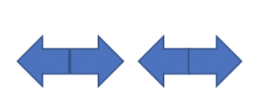

<h1 style='text-align: center;'> D. Challenges in school №41</h1>

<h5 style='text-align: center;'>time limit per test: 2 seconds</h5>
<h5 style='text-align: center;'>memory limit per test: 256 megabytes</h5>

There are $n$ children, who study at the school №41. It is well-known that they are good mathematicians. Once at a break, they arranged a challenge for themselves. All children arranged in a row and turned heads either to the left or to the right.

Children can do the following: in one second several pairs of neighboring children who are looking at each other can simultaneously turn the head in the opposite direction. For instance, the one who was looking at the right neighbor turns left and vice versa for the second child. Moreover, every second at least one pair of neighboring children performs such action. They are going to finish when there is no pair of neighboring children who are looking at each other. 

You are given the number $n$, the initial arrangement of children and the number $k$. You have to find a way for the children to act if they want to finish the process in exactly $k$ seconds. More formally, for each of the $k$ moves, you need to output the numbers of the children who turn left during this move.

For instance, for the configuration shown below and $k = 2$ children can do the following steps: 

   At the beginning, two pairs make move: $(1, 2)$ and $(3, 4)$. After that, we receive the following configuration:    At the second move pair $(2, 3)$ makes the move. The final configuration is reached. Good job.   It is guaranteed that if the solution exists, it takes not more than $n^2$ "headturns".

##### Input

The first line of input contains two integers $n$ and $k$ ($2 \le n \le 3000$, $1 \le k \le 3000000$)  — the number of children and required number of moves.

The next line contains a string of length $n$ and consists only of characters L and R, where L means that the child looks to the left and R means that the child looks to the right. 

##### Output

If there is no solution, print a single line with number $-1$.

Otherwise, output $k$ lines. Each line has to start with a number $n_i$ ($1\le n_i \le \frac{n}{2}$)  — the number of pairs of children, who turn at this move. After that print $n_i$ distinct integers  — the numbers of the children who will turn left during this move. 

After performing all "headturns", there can't be a pair of two neighboring children looking at each other.

If there are many solutions, print any of them.

## Examples

##### Input


```text
2 1
RL
```
##### Output


```text
1 1 
```
##### Input


```text
2 1
LR
```
##### Output


```text
-1
```
##### Input

```text

4 2
RLRL

```
##### Output


```text
2 1 3 
1 2
```
## Note

The first sample contains a pair of children who look at each other. After one move, they can finish the process.

In the second sample, children can't make any move. As a result, they can't end in $k>0$ moves.

The third configuration is described in the statement.


#### Tags 

#2100 #NOT OK #brute_force #constructive_algorithms #games #graphs #greedy #implementation #sortings 

## Blogs
- [All Contest Problems](../Codeforces_Round_632_(Div._2).md)
- [Announcement](../blogs/Announcement.md)
- [Tutorial (en)](../blogs/Tutorial_(en).md)
