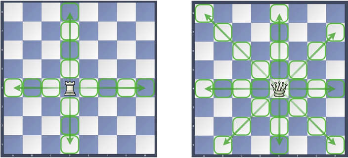

<h1 style='text-align: center;'> E. Road to 1600</h1>

<h5 style='text-align: center;'>time limit per test: 1 second</h5>
<h5 style='text-align: center;'>memory limit per test: 256 megabytes</h5>

Egor wants to achieve a rating of 1600 points on the well-known chess portal ChessForces and he needs your help!

Before you start solving the problem, Egor wants to remind you how the chess pieces move. Chess rook moves along straight lines up and down, left and right, as many squares as it wants. And when it wants, it can stop. The queen walks in all directions vertically and diagonally at any distance. You can see the examples below.

  To reach the goal, Egor should research the next topic:

There is an $N \times N$ board. Each cell of the board has a number from $1$ to $N ^ 2$ in it and numbers in all cells are distinct.

In the beginning, some chess figure stands in the cell with the number $1$. 
## Note

 that this cell is already considered as visited. After that every move is determined by the following rules: 

1. Among all not visited yet cells to which the figure can get in one move, it goes to the cell that has minimal number.
2. If all accessible cells were already visited and some cells are not yet visited, then the figure is teleported to the not visited cell that has minimal number. If this step happens, the piece pays a fee of $1$ vun.
3. If all cells are already visited, the process is stopped.

Egor should find an $N \times N$ board on which the rook pays strictly less vuns than the queen during the round with this numbering. Help him to find such $N \times N$ numbered board, or tell that it doesn't exist.

#### Input

The only line contains one integer $N$  — the size of the board, $1\le N \le 500$.

#### Output

The output should contain $N$ lines.

In $i$-th line output $N$ numbers  — numbers on the $i$-th row of the board. All numbers from $1$ to $N \times N$ must be used exactly once.

On your board rook must pay strictly less vuns than the queen.

If there are no solutions, print $-1$.

If there are several solutions, you can output any of them. 

## Examples

#### Input


```text
1
```
#### Output


```text
-1
```
#### Input

```text

4

```
#### Output


```text
4 3 6 12 
7 5 9 15 
14 1 11 10 
13 8 16 2 
```
## Note

In case we have $1 \times 1$ board, both rook and queen do not have a chance to pay fees.

In second sample rook goes through cells $1 \to 3 \to 4 \to 6 \to 9 \to 5 \to 7 \to 13 \to 2 \to 8 \to 16 \to 11 \to 10 \to 12 \to 15 \to \textbf{(1 vun)} \to 14$. 

Queen goes through $1 \to 3 \to 4 \to 2 \to 5 \to 6 \to 9 \to 7 \to 13 \to 8 \to 11 \to 10 \to 12 \to 15 \to \textbf{(1 vun)} \to 14 \to \textbf{(1 vun)} \to 16$.

As a result rook pays 1 vun and queen pays 2 vuns.


#### Tags 

#2400 #NOT OK #brute_force #constructive_algorithms 

## Blogs
- [All Contest Problems](../Codeforces_Round_632_(Div._2).md)
- [Announcement](../blogs/Announcement.md)
- [Tutorial (en)](../blogs/Tutorial_(en).md)
