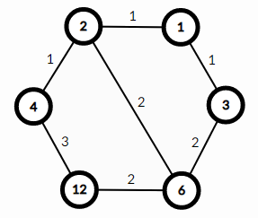

<h1 style='text-align: center;'> E. Divisor Paths</h1>

<h5 style='text-align: center;'>time limit per test: 3 seconds</h5>
<h5 style='text-align: center;'>memory limit per test: 256 megabytes</h5>

You are given a positive integer $D$. Let's build the following graph from it: 

* each vertex is a divisor of $D$ (not necessarily prime, $1$ and $D$ itself are also included);
* two vertices $x$ and $y$ ($x > y$) have an undirected edge between them if $x$ is divisible by $y$ and $\frac x y$ is a prime;
* the weight of an edge is the number of divisors of $x$ that are not divisors of $y$.

For example, here is the graph for $D=12$: 

  Edge $(4,12)$ has weight $3$ because $12$ has divisors $[1,2,3,4,6,12]$ and $4$ has divisors $[1,2,4]$. Thus, there are $3$ divisors of $12$ that are not divisors of $4$ — $[3,6,12]$.

There is no edge between $3$ and $2$ because $3$ is not divisible by $2$. There is no edge between $12$ and $3$ because $\frac{12}{3}=4$ is not a prime.

Let the length of the path between some vertices $v$ and $u$ in the graph be the total weight of edges on it. For example, path $[(1, 2), (2, 6), (6, 12), (12, 4), (4, 2), (2, 6)]$ has length $1+2+2+3+1+2=11$. The empty path has length $0$.

So the shortest path between two vertices $v$ and $u$ is the path that has the minimal possible length.

Two paths $a$ and $b$ are different if there is either a different number of edges in them or there is a position $i$ such that $a_i$ and $b_i$ are different edges.

You are given $q$ queries of the following form: 

* $v$ $u$ — calculate the number of the shortest paths between vertices $v$ and $u$.

The answer for each query might be large so print it modulo $998244353$.

##### Input

The first line contains a single integer $D$ ($1 \le D \le 10^{15}$) — the number the graph is built from.

The second line contains a single integer $q$ ($1 \le q \le 3 \cdot 10^5$) — the number of queries.

Each of the next $q$ lines contains two integers $v$ and $u$ ($1 \le v, u \le D$). It is guaranteed that $D$ is divisible by both $v$ and $u$ (both $v$ and $u$ are divisors of $D$).

##### Output

Print $q$ integers — for each query output the number of the shortest paths between the two given vertices modulo $998244353$.

## Examples

##### Input


```text
12
3
4 4
12 1
3 4
```
##### Output


```text
1
3
1
```
##### Input


```text
1
1
1 1
```
##### Output


```text
1
```
##### Input


```text
288807105787200
4
46 482955026400
12556830686400 897
414 12556830686400
4443186242880 325
```
##### Output


```text
547558588
277147129
457421435
702277623
```
## Note

In the first example: 

* The first query is only the empty path — length $0$;
* The second query are paths $[(12, 4), (4, 2), (2, 1)]$ (length $3+1+1=5$), $[(12, 6), (6, 2), (2, 1)]$ (length $2+2+1=5$) and $[(12, 6), (6, 3), (3, 1)]$ (length $2+2+1=5$).
* The third query is only the path $[(3, 1), (1, 2), (2, 4)]$ (length $1+1+1=3$).


#### Tags 

#2200 #NOT OK #combinatorics #graphs #greedy #math #number_theory 

## Blogs
- [All Contest Problems](../Educational_Codeforces_Round_85_(Rated_for_Div._2).md)
- [Announcement](../blogs/Announcement.md)
- [Tutorial](../blogs/Tutorial.md)
