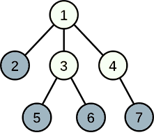
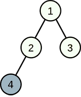

<h1 style='text-align: center;'> A. Linova and Kingdom</h1>

<h5 style='text-align: center;'>time limit per test: 2 seconds</h5>
<h5 style='text-align: center;'>memory limit per test: 256 megabytes</h5>

Writing light novels is the most important thing in Linova's life. Last night, Linova dreamed about a fantastic kingdom. She began to write a light novel for the kingdom as soon as she woke up, and of course, she is the queen of it.

 There are $n$ cities and $n-1$ two-way roads connecting pairs of cities in the kingdom. From any city, you can reach any other city by walking through some roads. The cities are numbered from $1$ to $n$, and the city $1$ is the capital of the kingdom. So, the kingdom has a tree structure.

As the queen, Linova plans to choose exactly $k$ cities developing industry, while the other cities will develop tourism. The capital also can be either industrial or tourism city.

A meeting is held in the capital once a year. To attend the meeting, each industry city sends an envoy. All envoys will follow the shortest path from the departure city to the capital (which is unique).

Traveling in tourism cities is pleasant. For each envoy, his happiness is equal to the number of tourism cities on his path.

In order to be a queen loved by people, Linova wants to choose $k$ cities which can maximize the sum of happinesses of all envoys. Can you calculate the maximum sum for her?

##### Input

The first line contains two integers $n$ and $k$ ($2\le n\le 2 \cdot 10^5$, $1\le k< n$)  — the number of cities and industry cities respectively.

Each of the next $n-1$ lines contains two integers $u$ and $v$ ($1\le u,v\le n$), denoting there is a road connecting city $u$ and city $v$.

It is guaranteed that from any city, you can reach any other city by the roads.

##### Output

Print the only line containing a single integer  — the maximum possible sum of happinesses of all envoys.

## Examples

##### Input


```text
7 4
1 2
1 3
1 4
3 5
3 6
4 7
```
##### Output


```text
7
```
##### Input

```text

4 1
1 2
1 3
2 4

```
##### Output


```text
2
```
##### Input

```text

8 5
7 5
1 7
6 1
3 7
8 3
2 1
4 5

```
##### Output


```text

9
```
## Note



In the first example, Linova can choose cities $2$, $5$, $6$, $7$ to develop industry, then the happiness of the envoy from city $2$ is $1$, the happiness of envoys from cities $5$, $6$, $7$ is $2$. The sum of happinesses is $7$, and it can be proved to be the maximum one.



In the second example, choosing cities $3$, $4$ developing industry can reach a sum of $3$, but remember that Linova plans to choose exactly $k$ cities developing industry, then the maximum sum is $2$.


#### Tags 

#1600 #NOT OK #dfs_and_similar #dp #greedy #sortings #trees 

## Blogs
- [All Contest Problems](../Codeforces_Round_635_(Div._1).md)
- [Codeforces Round #635 (en)](../blogs/Codeforces_Round_635_(en).md)
- [Tutorial (en)](../blogs/Tutorial_(en).md)
