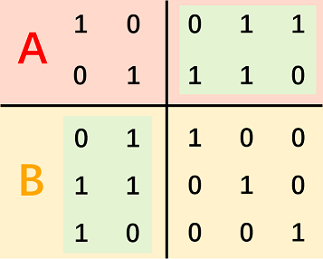
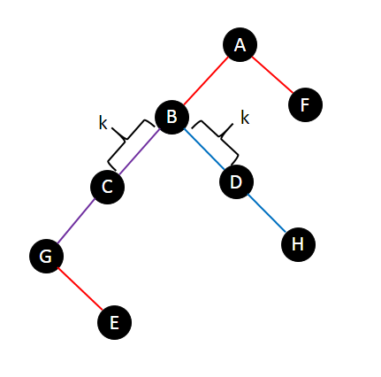
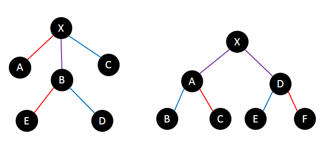

# Tutorial_(en)

[1337A - Ichihime и треугольник](../problems/A._Ichihime_and_Triangle.md "Codeforces Round 635 (Div. 2)")

Idea: [Sulfox](https://codeforces.com/profile/Sulfox "Международный мастер Sulfox")

 **Tutorial**
### [1337A - Ichihime и треугольник](../problems/A._Ichihime_and_Triangle.md "Codeforces Round 635 (Div. 2)")

There are many possible solutions, one of them is to always output $b$, $c$, $c$. You can easily prove that $b$, $c$, $c$ always satisfies the requirements.

 **Solution by Sooke**
```cpp
#include <bits/stdc++.h>
using namespace std;

int t, a, b, c, d;

int main() {
    for (cin >> t; t; t--) {
        cin >> a >> b >> c >> d;
        cout << b << " " << c << " " << c << endl;
    }
    return 0;
}
```
[1337B - Kana и игра Dragon Quest](../problems/B._Kana_and_Dragon_Quest_game.md "Codeforces Round 635 (Div. 2)")

Idea: [EternalAlexander](https://codeforces.com/profile/EternalAlexander "Мастер EternalAlexander")

 **Tutorial**
### [1337B - Kana и игра Dragon Quest](../problems/B._Kana_and_Dragon_Quest_game.md "Codeforces Round 635 (Div. 2)")

First, it's better not to cast Void Absorptions after a Lightning Strike.

Otherwise, there will be a Void Absorption right after a Lightning Strike. Supposing the hit point was $x$ before casting these two spells, if you cast Lightning Strike first, after these two spells the hit point will be $\left\lfloor \frac{x-10}{2} \right\rfloor +10 = \left\lfloor \frac{x}{2} \right\rfloor + 5$, but if you cast Void Absorption first, after these two spells the hit point will be $\left\lfloor \frac{x}{2} \right\rfloor$, which is smaller.

So the solution is to cast Void Absorptions until the dragon's hit point won't decrease with more casts or you can't cast more Void Absorptions, then cast all Lightning Strikes you have.

We can also use DP to solve this problem. Let $f_{i,j,k} = 0/1$ be possibility of defeating the dragon when the dragon's hit point is at $i$, you can cast $j$ more Void Absorptions and $k$ more Lightning Strikes. This is a slow solution but is enough to get accepted. You may have to use boolean arrays instead of integer arrays to save memory.

 **Solution by EternalAlexander**
```cpp
#include <bits/stdc++.h>
int x,n,m,t;
void solve(){
	scanf("%d%d%d",&x,&n,&m);
	while (x>0&&n&&x/2+10<x){n--;x=x/2+10;}
	if (x<=m*10)printf("YESn");
	else printf("NOn"); 
}
int main(){
	scanf("%d",&t);
	while(t--)solve();
	return 0;
}
```
[1336A - Linova и королевство](https://codeforces.com/contest/1336/problem/A "Codeforces Round 635 (Div. 1)")

Idea: [EternalAlexander](https://codeforces.com/profile/EternalAlexander "Мастер EternalAlexander")

 **Tutorial**
### [1336A - Linova и королевство](https://codeforces.com/contest/1336/problem/A "Codeforces Round 635 (Div. 1)")

Lemma: In the optimum solution, if a node (except the root) is chosen to develop tourism, its parent must be chosen to develop tourism, too.

Proof: Otherwise, if we choose its parent to develop tourism instead of itself, the sum of happiness will be greater.

Then we can calculate how much happiness we will get if we choose a certain node to develop tourism. Suppose the depth of node $u$ is $dep_u$ (i.e. there are $dep_u$ nodes on the path $(1,u)$), the size of the subtree rooted on $u$ is $siz_u$ (i.e. there are $siz_u$ nodes $v$ that $u$ is on the path $(1,v)$). Then, if we choose $u$ to develop tourism, compared to choose it to develop industry, the total happiness will be increased by $siz_u-dep_u$: the envoy of $u$ won't be sent, we will lose $dep_u-1$ happiness; a total of $siz_u-1$ envoys of all nodes in the subtree rooted on $u$ except $u$ itself will get one more happiness.

So, just use DFS to calculate all $siz_u-dep_u$, then sort them from big to small, calculate the sum of the first $n-k$ elements. You can also use std::nth_element in STL to get an $O(n)$ solution.

 **Solution by EternalAlexander**
```cpp
#include <bits/stdc++.h>
#define maxn 200005
std::vector<int>conj[maxn];
int n,k,u,v,depth[maxn]={0},size[maxn]={0},det[maxn];
long long ans=0;
int cmp(int a,int b){return a>b;}
int dfs(int u,int f){depth[u]=depth[f]+1;size[u]=1;
	for (int i=0;i<conj[u].size();++i){
		if ((v=conj[u][i])==f)continue;
		size[u]+=dfs(v,u);
	}det[u]=size[u]-depth[u];return size[u];
}
int main(){
	scanf("%d%d",&n,&k);
	for (int i=1;i<n;++i){
		scanf("%d%d",&u,&v);conj[u].push_back(v);conj[v].push_back(u);
	}dfs(1,0);
	std::nth_element(det+1,det+n-k,det+n+1,cmp);
	for (int i=1;i<=n-k;++i)ans+=det[i];std::cout<<ans;
	return 0;
}
```
[1336B - Xenia и разноцветные камушки](https://codeforces.com/contest/1336/problem/B "Codeforces Round 635 (Div. 1)")

Idea: [ustze](https://codeforces.com/profile/ustze "Мастер ustze") & [isaf27](https://codeforces.com/profile/isaf27 "Международный гроссмейстер isaf27")

 **Tutorial**
### [1336B - Xenia и разноцветные камушки](https://codeforces.com/contest/1336/problem/B "Codeforces Round 635 (Div. 1)")

First, let's assume that there exists an optimum solution in which we choose $r_x$, $g_y$ and $b_z$ satisfying $r_x \le g_y \le b_z$.

Here's a lemma:

When $y$ is fixed, $r_x$ is the maximum one that $r_x \le g_y$, and $b_z$ is the minimum one that $g_y \le b_z$.

It's easy to prove: no matter what $z$ is, the bigger $r_x$ is, the smaller $(r_x-g_y)^2$ and $(r_x-b_z)^2$ are; for $b_z$ it's similar.

So, if we know that in one of the optimum solutions, $r_x \le g_y \le b_z$, we can sort each array at first and then find $x$ and $z$ by binary search or maintaining some pointers while enumerating $y$.

Back to the original problem without $r_x \le g_y \le b_z$, we can enumerate the six possible situations: $r_x \le g_y \le b_z$, $r_x \le b_z \le g_y$, $g_y \le r_x \le b_z$, $g_y \le b_z \le r_x$, $b_z \le r_x \le g_y$ and $b_z \le g_y \le r_x$. Find the optimum solution in each situation and the optimum one among them is the answer.

 **Solution by Sooke**
```cpp
#include <bits/stdc++.h>
using namespace std;

int t, nr, ng, nb;
long long ans;

long long sq(int x) { return 1ll * x * x; }

void solve(vector<int> a, vector<int> b, vector<int> c) {
    for (auto x : a) {
        auto y = lower_bound(b.begin(), b.end(), x);
        auto z = upper_bound(c.begin(), c.end(), x);
        if (y == b.end() || z == c.begin()) { continue; }
        z--; ans = min(ans, sq(x - *y) + sq(*y - *z) + sq(*z - x));
    }
}

int main() {
    for (cin >> t; t; t--) {
        cin >> nr >> ng >> nb;
        vector<int> r(nr), g(ng), b(nb);
        for (int i = 0; i < nr; i++) { cin >> r[i]; }
        for (int i = 0; i < ng; i++) { cin >> g[i]; }
        for (int i = 0; i < nb; i++) { cin >> b[i]; }
        sort(r.begin(), r.end());
        sort(g.begin(), g.end());
        sort(b.begin(), b.end());
        ans = 9e18;
        solve(r, g, b); solve(r, b, g);
        solve(g, b, r); solve(g, r, b);
        solve(b, r, g); solve(b, g, r);
        cout << ans << endl;
    }
    return 0;
}
```
[1336C - Kaavi и магическое заклинание](https://codeforces.com/contest/1336/problem/C "Codeforces Round 635 (Div. 1)")

Idea: [EternalAlexander](https://codeforces.com/profile/EternalAlexander "Мастер EternalAlexander") 

 **Tutorial**
### [1336C - Kaavi и магическое заклинание](https://codeforces.com/contest/1336/problem/C "Codeforces Round 635 (Div. 1)")

We can use DP to solve this problem.

Let $f_{i,j}$ be the answer when $S[0..i-1]$ has already been used and the current $A[0..\min(i-1,m-1-j)]$ will be in the position $[j..\min(i+j-1,m-1)]$ after all operations are finished. Specially, $f_{i,m}$ means that all characters in the current $A$ won't be in the position $[j..\min(i+j-1,m-1)]$ after all operations are finished.

By definition, $f_{n,0}=1$ and $f_{n, j}=0 (j\ge 1)$.

The state transition:

* $j=0$If $i\ge m$, $A$ has already had the prefix $T$, so you can stop performing operations at any position, there are $n-i+1$ positions in total.

Otherwise, only when $S[i]=T[i]$, you can add $S[i]$ at the back of $A$, there are $f_{i+1,0}$ different operation sequences in this situation.
* $1\le j \le m-1$If $i+j\ge m$ or $S[i]=T[i+j]$, you can add $S[i]$ at the back of $A$, there are $f_{i+1,j}$ different operation sequences in this situation.

If $S[i]=T[j-1]$, you can add $S[i]$ at the front of $A$, there are $f_{i+1,j-1}$ different operation sequences in this situation.
* $j=m$You can always add $S[i]$ at the front/back of $A$ in this situation ($2f_{i+1,m}$ different operation sequences). However, if $S[i]=T[m-1]$, you can let $S[i]$ to match $T[m-1]$ ($f_{i+1,m-1}$ different operation sequences).

So, if $S[i]=T[m-1]$, $f_{i,m}=2f_{i+1,m}+f_{i+1,m-1}$. Otherwise, $f_{i,m}=2f_{i+1,m}$.

The answer is $2(f_{1,m}+\sum\limits_{T[i]=S[0]}f_{1,i})$.

 **Solution by ouuan**
```cpp
#include <iostream>
#include <string>
#include <vector>

using namespace std;

const int mod = 998244353;

int main()
{
	string s, t;
	
	cin >> s >> t;
	int n = s.size();
	int m = t.size();
	
	vector<vector<int> > f(n + 1, vector<int>(m + 1));
	
	f[n][0] = 1;
	
	for (int i = n - 1; i >= 1; --i)
	{
		for (int j = 0; j <= m; ++j)
		{
			if (j == 0)
			{
				if (i >= m) f[i][0] = n - i + 1;
				else if (s[i] == t[i]) f[i][0] = f[i + 1][0];
			}
			else if (j == m)
			{
				f[i][m] = 2 * f[i + 1][m] % mod;
				if (s[i] == t[m - 1]) f[i][m] = (f[i][m] + f[i + 1][m - 1]) % mod;
			}
			else
			{
				if (i + j >= m || s[i] == t[i + j]) f[i][j] = f[i + 1][j];
				if (s[i] == t[j - 1]) f[i][j] = (f[i][j] + f[i + 1][j - 1]) % mod;
			}
		}
	}
	
	int ans = f[1][m];
	for (int i = 0; i < m; ++i) if (t[i] == s[0]) ans = (ans + f[1][i]) % mod;
	ans = ans * 2 % mod;
	
	cout << ans;
	
	return 0;
}
```
[1336D - Yui и маджонг](https://codeforces.com/contest/1336/problem/D "Codeforces Round 635 (Div. 1)")

Idea: [Sulfox](https://codeforces.com/profile/Sulfox "Международный мастер Sulfox") 

 **Tutorial**
### [1336D - Yui и маджонг](https://codeforces.com/contest/1336/problem/D "Codeforces Round 635 (Div. 1)")

Suppose $c_i$ equals to the number of tiles in the current set with value $i$ (before making a query).

If you insert a tile with value $x$:

* The delta of triplet subsets is $\dbinom{c_x}{2}$. Once you're sure that $c_x \neq 0$ holds, you can determine the exact value of $c_x$.
* The delta of straight subsets is $c_{x-2}c_{x-1}+c_{x-1}c_{x+1}+c_{x+1}c_{x+2}$. Once you've known the values of $c_{1} \ldots c_{x+1}$ and you're sure that $c_{x+1} \neq 0$, you can determine the exact value of $c_{x+2}$.

Let's insert tiles with following values in order: $n-1$, $n-2$, $\ldots$, $3$, $1$, $2$, $1$.

We can easily get $a_1$ by the delta of triplet subsets since we insert tiles with value $1$ twice.

Consider the delta of straight subsets when you insert the tile with value $1$. It equals to $a_2(a_3+1)$ for the first time and $(a_2+1)(a_3+1)$ for the second time. Use subtraction to get $a_3$, then use division to get $a_2$. (The divisor is $a_3+1$, which is non-zero)

Finally, let do the following for each $x$ from $2$ to $n-2$. We've known the values of $a_{1} \ldots a_{x+1}$. Since we've inserted a tile with value $x+1$ before inserting $x$, we can use division to get $a_{x+2}$ by the delta of straight subsets and avoid dividing zero.

[PinkRabbitAFO](https://codeforces.com/profile/PinkRabbitAFO "Международный гроссмейстер PinkRabbitAFO") gives another solution which inserts tiles with value 1, 2, …, n−1, 1 in order. See more details [here](https://codeforces.com/blog/entry/76092).

 **Solution by Sooke**
```cpp
#include <bits/stdc++.h>
using namespace std;

int n, s1, s2, t1, t2, d1[105], d2[105], a[105];

int main() {
    cin >> n >> s1 >> s2;
    for (int i = n - 1; i >= 0; i--) {
        cout << "+ " << (i > 2 ? i : i % 2 + 1) << endl;
        t1 = s1; t2 = s2; cin >> s1 >> s2;
        d1[i] = s1 - t1; d2[i] = s2 - t2;
    }
    a[1] = sqrt(d1[0] * 2);
    a[3] = d2[0] - d2[2] - 1;
    a[2] = d2[2] / (a[3] + 1);
    a[4] = d2[1] / (a[3] + 1) - a[1] - 2;
    for (int i = 5; i <= n; i++) {
        a[i] = (d2[i - 2] - a[i - 4] * a[i - 3]) / (a[i - 1] + 1) - a[i - 3] - 1;
    }
    cout << "!"; a[n]++;
    for (int i = 1; i <= n; i++) { cout << " " << a[i]; }
    cout << endl;
    return 0;
}
```
 **Solution by PinkRabbit**
```cpp
#include <cstdio>

const int MN = 105;

int N, lstv1, lstv2, v1, v2;
int dv1[MN], dv2[MN], Tag[MN], Ans[MN];

int main() {
	scanf("%d", &N);
	scanf("%d%d", &lstv1, &lstv2);
	for (int i = 1; i < N; ++i) {
		printf("+ %dn", i), fflush(stdout);
		scanf("%d%d", &v1, &v2);
		dv1[i] = v1 - lstv1, dv2[i] = v2 - lstv2;
		if (dv1[i] > 0)
			for (int x = 2; x <= N; ++x)
				if (x * (x - 1) / 2 == dv1[i]) {
					Tag[i] = x; break;
				}
		lstv1 = v1, lstv2 = v2;
	}
	printf("+ 1n"), fflush(stdout);
	scanf("%d%d", &v1, &v2);
	int ndv1 = v1 - lstv1, ndv2 = v2 - lstv2;
	for (int x = 0; x <= N; ++x)
		if (x * (x + 1) / 2 == ndv1) {
			Ans[1] = x; break;
		}
	int delta = ndv2 - dv2[1] - 1; // delta = a[2] + a[3]
	if (Tag[2] >= 2) Ans[2] = Tag[2], Ans[3] = delta - Ans[2];
	else if (Tag[3] >= 2) Ans[3] = Tag[3], Ans[2] = delta - Ans[3];
	else if (delta == 0) Ans[3] = Ans[2] = 0;
	else if (delta == 2) Ans[3] = Ans[2] = 1;
	else if (dv2[2] > 0) Ans[2] = 0, Ans[3] = 1;
	else Ans[2] = 1, Ans[3] = 0;
	for (int i = 3; i <= N - 2; ++i) {
		if (Tag[i + 1] >= 2) {
			Ans[i + 1] = Tag[i + 1];
			continue;
		}
		if ((Ans[i - 2] + 1) * (Ans[i - 1] + 1) == dv2[i]) Ans[i + 1] = 0;
		else Ans[i + 1] = 1;
	}
	Ans[N] = (dv2[N - 1] - (Ans[N - 3] + 1) * (Ans[N - 2] + 1)) / (Ans[N - 2] + 1);
	printf("!");
	for (int i = 1; i <= N; ++i) printf(" %d", Ans[i]);
	puts(""), fflush(stdout);
	return 0;
}
```
[1336E1 - Chiori и выбор кукол (простая версия)](https://codeforces.com/contest/1336/problem/E1 "Codeforces Round 635 (Div. 1)") and [1336E2 - Chiori и выбор кукол (сложная версия)](https://codeforces.com/contest/1336/problem/E2 "Codeforces Round 635 (Div. 1)")

Idea: [Sulfox](https://codeforces.com/profile/Sulfox "Международный мастер Sulfox") 

 **Tutorial**
### [1336E2 - Chiori и выбор кукол (сложная версия)](https://codeforces.com/contest/1336/problem/E2 "Codeforces Round 635 (Div. 1)")

Build linear basis $A$ with given numbers. Suppose:

* $k$ is the length of $A$.
* $S(A)$ is the set consisted of numbers which can be produced in $A$.
* $p_i$ is equal to the number of $x$, where $x \in S(A)$ and $\text{popcount}(x)=i$.
* $ans_i$ is equal to the number of doll picking ways with value $i$. Thus, $ans_i = p_i \cdot 2^{n-k}$.

 Algorithm 1

Enumerate each base of $A$ is picked or not, so you can find out the whole $S(A)$ in $O(2^k)$ and get $p_0 \ldots p_m$. Note that you should implement $\text{popcount}(x)$ in $O(1)$ to make sure the whole algorithm runs in $O(2^k)$.

 Algorithm 2

Let's assume the highest $1$-bits in every base are key bits, so in $A$ there are $k$ key bits and $m-k$ non-key bits. We can get a new array of bases by Gauss-Jordan Elimination, such that every key bit is $1$ in exactly one base and is $0$ in other bases.

Then, let $f_{i,j,s}$ be if we consider the first $i$ bases in $A$, the number of ways that $j$ key bits are $1$ in xor-sum and the binary status of all non-key bits is $s$. Enumerate $i$-th base (suppose it is equal to $x$) is picked or not, we write the state transition: $f_{i,j,s} = f_{i-1,j,s}+f_{i-1,j-1,s \oplus x}$.

At last, we add up $f_{k,j,s}$ to $p_{j+\text{popcount}(s)}$. In conclusion, we get an $O(k^2 \cdot 2^{m-k})$ algorithm.

So far, the easy version can be passed if you write a solution which runs Algorithm 1 or Algorithm 2 by the value of $k$.

 Algorithm 3

We can regard $A$ as a $2^m$ long zero-indexation array satisfying $a_i=[i \in S(A)]$. Similarly, we define a $2^m$ long zero-indexation array $F^c$ satisfying $f^c_i=[\text{popcount}(i)=c]$.

By XOR Fast Walsh-Hadamard Transform, we calculate $\text{IFWT}(\text{FWT}(A) * \text{FWT}(F^c))$ (also can be written as $A \oplus F^c$). $p_c$ is equal to the $0$-th number of resulting array. That means $p_c$ is also equal to the sum of every number in $\text{FWT}(A) * \text{FWT}(F^c)$ divide $2^m$.

Lemma 1: $\text{FWT}(A)$ only contains two different values: $0$ and $2^k$.

Proof: The linear space satisfies closure, which means $A \oplus A = A * 2^k$. Thus, $\text{FWT}(A) * \text{FWT}(A) = \text{FWT}(A) * 2^k$. We can proved the lemma by solving an equation.

Lemma 2: The $i$-th number of $\text{FWT}(A)$ is $2^k$, if and only if $\text{popcount}(i\ \\&\ x)$ is always even, where $x$ is any of $k$ bases in $A$.

Proof: XOR Fast Walsh-Hadamard Transform tells us, the $i$-th number of $\text{FWT}(A)$ is equal to the sum of $(-1)^{\text{popcount}(i\ \\&\ j)}$ for each $j \in S(A)$. Once we find a base $x$ such that $\text{popcount}(i\ \\&\ x)$ is odd, the sum must be $0$ according to Lemma 1.

Lemma 3: The indices of $\text{FWT}(A)$ which their values are $2^k$, compose an orthogonal linear basis.

Proof: See Lemma 2. If $\text{popcount}(i\ \\&\ x)$ is even, $\text{popcount}(j\ \\&\ x)$ is even, obviously $\text{popcount}((i \oplus j)\ \\&\ x)$ is even.

Lemma 4: Suppose $B$ is the orthogonal linear basis. The length of $B$ is $m-k$.

Proof: We know that $A=\text{IFWT}(B*2^k)$, so $a_0 = 1 = \dfrac{1}{2^m}\sum\limits_{i=0}^{2^m-1} b_i \cdot 2^k$. From this, we then find that $|S(B)|$ should be $2^{m-k}$, which means the length of $B$ is $m-k$.

Let the key bits in $A$ are non-key bits in $B$ and the non-key bits in $A$ are key bits in $B$. Now I'll show you how to get the $m-k$ bases in $B$. Divide key bits for $A$ and put them to the left. Similarly, we put the key bits in $B$ to the right. Let's make those $1$ key bits form a diagonal.

Look at the following picture. Do you notice that the non-key bit matrices (green areas) are symmetrical along the diagonal?

 The proof is intuitive. $\text{popcount}(x\ \\&\ y)$ should be even according to Lemma 2, where $x$ is any of bases in $A$ and $y$ is any of bases in $B$. Since we've divided key bits for two linear basis, $\text{popcount}(x\ \\&\ y)$ is not more than $2$. Once two symmetrical non-key bits are $0$, $1$ respectively, there will exist $x$, $y$ satisfying $\text{popcount}(x\ \\&\ y) = 1$. Otherwise, $\text{popcount}(x\ \\&\ y)$ is always $0$ or $2$.

In order to get $B$, you can also divide $A$ into $k$ small linear basis, construct their orthogonal linear basis and intersect them. It is harder to implement.

Lemma 5: The $i$-th number of $\text{FWT}(F^c)$ only depends on $\text{popcount}(i)$.

Proof: The $i$-th number of $F^c$ only depends on $\text{popcount}(i)$, so it still holds after Fast Walsh-Hadamard Transform.

Let $w_d^c$ be the $(2^d-1)$-th number of $\text{FWT}(F^c)$. Again, Fast Walsh-Hadamard Transform tells us:

* $w_d^c = \sum\limits_{i=0}^{2^m-1} [\text{popcount}(i)=c](-1)^{\text{popcount}(i\ \\&\ (2^d-1))}$

Note that $\text{popcount}(2^d-1)=d$. Let's enumerate $j = \text{popcount}(i\ \\&\ (2^d-1))$. There are $\dbinom{d}{j}$ different intersections, each one has $\dbinom{m-d}{c-j}$ ways to generate the remaining part of $i$. So:

* $w_d^c = \sum\limits_{j=0}^{d} (-1)^j \dbinom{d}{j}\dbinom{m-d}{c-j}$

It takes $O(m^3)$ to calculate all necessary combinatorial numbers and $w_d^c$.

Finally, let's consider the sum of every number in $\text{FWT}(A) * \text{FWT}(F^c)$. Suppose $q_i$ is equal to the number of $x$, where $x \in S(B)$ and $\text{popcount}(x)=i$. We can easily get:

* $p_c = \dfrac{1}{2^m}\sum\limits_{d=0}^{m} 2^k q_d w_d^c = \dfrac{1}{2^{m-k}}\sum\limits_{d=0}^{m} q_d w_d^c$

Just like Algorithm 1. We can enumerate each base of $B$ is picked or not, find out the whole $S(B)$ in $O(2^{m-k})$, get $q_0 \ldots q_m$ and calculate $p_0 \ldots p_m$ at last. Since one of $A$, $B$ has a length of not more than $m/2$, we just need to enumerate bases of the smaller one in order to pass the hard version in $O(2^{m/2} + m^3 + n)$. 

 **Solution by Sooke**
```cpp
#include <bits/stdc++.h>
using namespace std;

const int mod = 998244353, inv2 = 499122177;
const int M = 64;

int n, m, k, p[M], c[M][M];
long long a[M], b[M], f[M];

void dfs(int i, long long x) {
    if (i == k) { p[__builtin_popcountll(x)]++; return; }
    dfs(i + 1, x); dfs(i + 1, x ^ a[i]);
}

int main() {
    cin >> n >> m;
    for (int i = 0; i < n; i++) {
        long long x; cin >> x;
        for (int j = m; j >= 0; j--) {
            if (x >> j & 1) {
                if (!f[j]) { f[j] = x; break; }
                x ^= f[j];
            }
        }
    }
    for (int i = 0; i < m; i++) {
        if (f[i]) {
            for (int j = 0; j < i; j++) {
                if (f[i] >> j & 1) { f[i] ^= f[j]; }
            }
            for (int j = 0; j < m; j++) {
                if (!f[j]) { a[k] = a[k] * 2 + (f[i] >> j & 1); }
            }
            a[k] |= 1ll << m - 1 - k; k++;
        }
    }
    if (k <= 26) {
        dfs(0, 0);
        for (int i = 0; i <= m; i++) {
            int ans = p[i];
            for (int j = 0; j < n - k; j++) { ans = ans * 2 % mod; }
            cout << ans << " ";
        }
    } else {
        k = m - k; swap(a, b);
        for (int i = 0; i < k; i++) {
            for (int j = 0; j < m - k; j++) {
                if (b[j] >> i & 1) { a[i] |= 1ll << j; }
            }
            a[i] |= 1ll << m - 1 - i;
        }
        dfs(0, 0);
        for (int i = 0; i <= m; i++) {
            c[i][0] = 1;
            for (int j = 1; j <= i; j++) { c[i][j] = (c[i - 1][j] + c[i - 1][j - 1]) % mod; }
        }
        for (int i = 0; i <= m; i++) {
            int ans = 0;
            for (int j = 0; j <= m; j++) {
                int coef = 0;
                for (int k = 0; k <= i; k++) {
                    coef = (coef + (k & 1 ? -1ll : 1ll) * c[j][k] * c[m - j][i - k] % mod + mod) % mod;
                }
                ans = (ans + 1ll * coef * p[j]) % mod;
            }
            for (int j = 0; j < k; j++) { ans = 1ll * ans * inv2 % mod; }
            for (int j = 0; j < n - m + k; j++) { ans = ans * 2 % mod; }
            cout << ans << " ";
        }
    }
    return 0;
}
```
 **Bonus**Solve the same problem with m≤63.

[1336F - Путешествия](https://codeforces.com/contest/1336/problem/F "Codeforces Round 635 (Div. 1)")

Idea: [EternalAlexander](https://codeforces.com/profile/EternalAlexander "Мастер EternalAlexander") 

 **Tutorial**First, let's choose an arbitrary root for the tree. Then for all pairs of paths, their LCA (lowest common ancestor) can be either different or the same.

Then, let's calculate the answer of pairs with different LCAs. In this case, if the intersection is not empty, it will be a vertical path as in the graph below.



Here path G−H and path E−F intersects at path B−G.

We can process all paths in decreasing order of the depth of their LCA. When processing a path p we calculate the number of paths q, where q is processed before p, and the edge-intersection of p and q is at least k. To do this we can plus one to the subtree of the nodes on the path k edges away from the LCA (node C and D for path G−H in the graph above), then we can query the value at the endpoints of the path (node E and F for path E−F). We can maintain this easily with BIT (binary indexed tree, or Fenwick tree).

Next, we calculate pairs with the same LCA. This case is harder.

For each node u we calculate the number of pairs with the LCA u. 



For a pair of path (x1,y1) and (x2,y2), there are still two cases we need to handle.

Let dfnx be the index of x in the DFS order. For a path (x,y) we assume that dfnx<dfny (otherwise you can just swap them)

In the first case ( the right one in the graph above, where (x1,y1)=(B,E),(x2,y2)=(C,F) ), the intersection of (x1,y1) and (x2,y2) is the path that goes from LCA(x1,x2) to LCA(y1,y2) (path A−D)

In this case the intersection may cross over node u.

For all paths (x,y) with the LCA u. We can build a virtual-tree over all x of the paths, and on node x we store the value of y. Let's do a dfs on the virtual-tree. On each node a we calculate pairs (x1,y1),(x2,y2) that LCA(x1,x2)=a. For x1 , let's go from a to y1 for k edges, assume the node we reached is b, all legal y2 should be in the subtree of b.

We can use a segment tree on the DFS-order to maintain all ys in the subtree and merge them with the small-to-large trick, meanwhile, iterate over all x1 in the smaller segment tree, count the valid y2's in the larger segment tree.

In fact, you can use HLD (heavy-light decomposition) instead of virtual-tree, which seems to be easier to implement.

Now note that the solution above is based on the fact that the intersection of (x1,y1) and (x2,y2) is the path that goes from LCA(x1,x2) to LCA(y1,y2). But it is not always true, so here we have another case to handle.

In this case, (the left one in the graph above), the intersection is definitely a vertical path that goes from u to LCA(y1,x2). This can be solved similarly to the case of different LCAs.

The overall complexity of this solution is O(mlog2m+nlogn).

 **Solution by EternalAlexander**
```cpp
#include <bits/stdc++.h>
#define maxn 200005
int n,m,k,u[maxn],v[maxn],ch[maxn<<6][2]={0},sum[maxn<<6]={0},pt[maxn],head[maxn]={0},tail=0,cnt=0,root[maxn]={0},
anc[maxn][19]={0},son[maxn]={0},depth[maxn]={0},dfn[maxn],size[maxn],idx=0;
long long ans=0;
std::vector<int>in[maxn],vec[maxn];
struct edge {
	int v,next;
}edges[maxn<<1];
void add_edge(int u,int v){
	edges[++tail].v=v;
	edges[tail].next=head[u];
	head[u]=tail;
}
namespace BIT {
	int sum[maxn<<2]={0};
	void add(int p,int x) {if (p==0) return;while (p<=n) {sum[p]+=x;p+=p&-p;}}
	int query(int p) {int ans=0;while (p>0) {ans+=sum[p];p-=p&-p;}return ans;}
	void Add(int l,int r){add(l,1);add(r+1,-1);}
}
void update(int x){sum[x]=sum[ch[x][0]]+sum[ch[x][1]];}
int insert(int rt,int l,int r,int p){
	if (!rt) rt=++cnt;
	if (l==r) {sum[rt]++;return rt;}
	int mid=(l+r)>>1;
	if (p<=mid) ch[rt][0]=insert(ch[rt][0],l,mid,p);
	else ch[rt][1]=insert(ch[rt][1],mid+1,r,p);
	update(rt);
	return rt;
} int merge(int u,int v){
	if (!u||!v)return u+v;
	ch[u][0]=merge(ch[u][0],ch[v][0]);
	ch[u][1]=merge(ch[u][1],ch[v][1]);
	sum[u]=sum[u]+sum[v];return u;
} int query(int rt,int L,int R,int l,int r){
	if (l>R||r<L)return 0;
	if (l<=L&&R<=r){return sum[rt];}
	return query(ch[rt][0],L,(L+R)>>1,l,r)+query(ch[rt][1],((L+R)>>1)+1,R,l,r);
}

void dfs1(int u,int f){
	anc[u][0]=f;depth[u]=depth[f]+1;size[u]=1;
	for (int i=1;i<=18;++i)anc[u][i]=anc[anc[u][i-1]][i-1];
	for (int i=head[u];i;i=edges[i].next){
		int v=edges[i].v;
		if (v==f) continue;
		dfs1(v,u);size[u]+=size[v];
		if (size[v]>size[son[u]])son[u]=v;
	}
} void dfsn(int u){
	dfn[u]=++idx;
	for (int i=head[u];i;i=edges[i].next){
		int v=edges[i].v;
		if (v==son[u]||v==anc[u][0])continue;
		dfsn(v);
	}if (son[u]) dfsn(son[u]);
}

int lift(int u,int x){
	for (int i=18;i>=0;i--)if (x>=(1<<i)) {u=anc[u][i];x-=(1<<i);}
	return u;
}

int lca(int u,int v){
	if (depth[u]<depth[v])std::swap(u,v);
	for (int i=18;i>=0;i--)if (depth[anc[u][i]]>=depth[v])u=anc[u][i];
	if (u==v)return u;
	for (int i=18;i>=0;i--)if (anc[u][i]!=anc[v][i]){u=anc[u][i];v=anc[v][i];}
	return anc[u][0];
} 

void dfs3(int x,int rt){
	pt[x]=x;root[x]=0;
	for (int i=0;i<in[x].size();++i) {
		int d=in[x][i];
		int rd=std::max(0,k-(depth[u[d]]-depth[rt]));
		if (depth[v[d]]-depth[rt]>=rd){
			int l=lift(v[d],depth[v[d]]-depth[rt]-rd);
			ans+=query(root[x],1,n,dfn[l],dfn[l]+size[l]-1);
		}root[x]=insert(root[x],1,n,dfn[v[d]]);
	}for (int i=head[x];i;i=edges[i].next){
		int t=edges[i].v;
		if (t==anc[x][0]||(rt==x&&t==son[x])) continue;
		dfs3(t,rt);
		if (in[pt[x]].size()<in[pt[t]].size()){
			std::swap(pt[x],pt[t]);
			std::swap(root[x],root[t]);
		}while (!in[pt[t]].empty()){
			int d=in[pt[t]][in[pt[t]].size()-1];in[pt[t]].pop_back();
			int rd=std::max(0,k-(depth[x]-depth[rt]));
			if (depth[v[d]]-depth[rt]>=rd) {
				int l=lift(v[d],(depth[v[d]]-depth[rt]-rd));
				ans+=query(root[x],1,n,dfn[l],dfn[l]+size[l]-1);
			}in[pt[x]].push_back(d);
		}root[x]=merge(root[x],root[t]);
	}
}

void dfs2(int x){
	int len=vec[x].size();
	for (int i=head[x];i;i=edges[i].next)if (edges[i].v!=anc[x][0])dfs2(edges[i].v);
	for (int i=0;i<len;++i)ans+=BIT::query(dfn[v[vec[x][i]]]);
	for (int i=0;i<len;++i){
		int j=vec[x][i];
		if (depth[v[j]]-depth[x]>=k) {
			int l=lift(v[j],depth[v[j]]-depth[x]-k);
			BIT::Add(dfn[l],dfn[l]+size[l]-1);
		}
	}for (int i=0;i<len;++i){ans+=BIT::query(dfn[u[vec[x][i]]]);in[u[vec[x][i]]].push_back(vec[x][i]);}
	dfs3(x,x);
	while (!in[pt[x]].empty())in[pt[x]].pop_back();
	for (int i=0;i<len;++i){
		int j=vec[x][i];
		if (depth[u[j]]-depth[x]>=k) {
			int l=lift(u[j],depth[u[j]]-depth[x]-k);
			BIT::Add(dfn[l],dfn[l]+size[l]-1);
		}
	}
}
	
int main(){
	scanf("%d%d%d",&n,&m,&k);
	for(int i=1;i<n;++i){
		int u,v;
		scanf("%d%d",&u,&v);
		add_edge(u,v);
		add_edge(v,u);
	}dfs1(1,0);dfsn(1);
	for (int i=1;i<=m;++i){
		scanf("%d%d",&u[i],&v[i]);
		if (dfn[u[i]]>dfn[v[i]]) std::swap(u[i],v[i]);
		int l=lca(u[i],v[i]);
		vec[l].push_back(i);
	} dfs2(1);
	std::cout<<ans;
	return 0;
}
```
