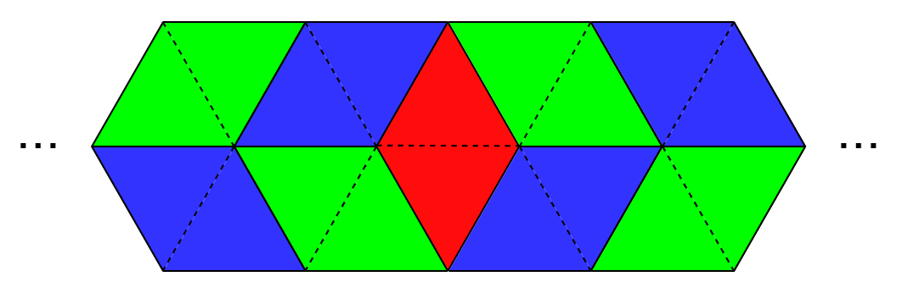
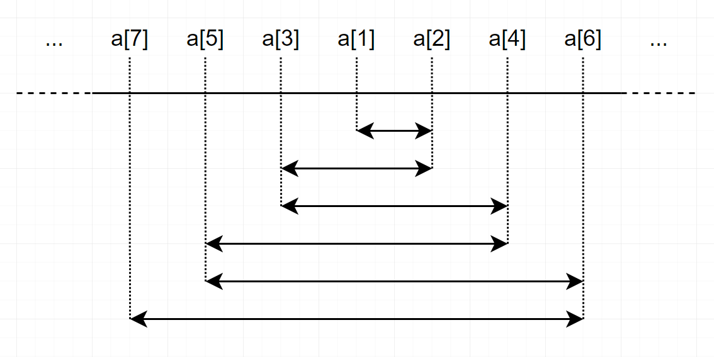
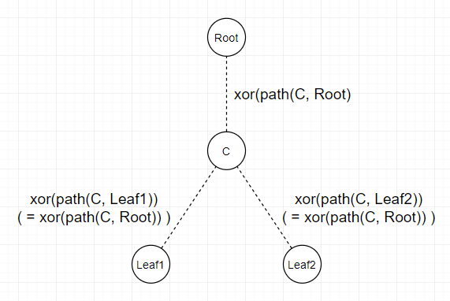
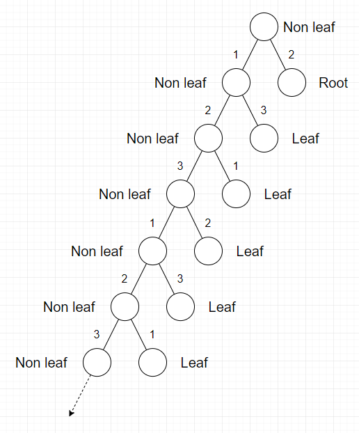
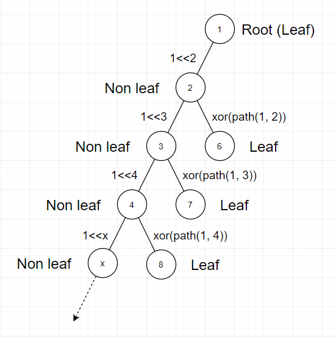
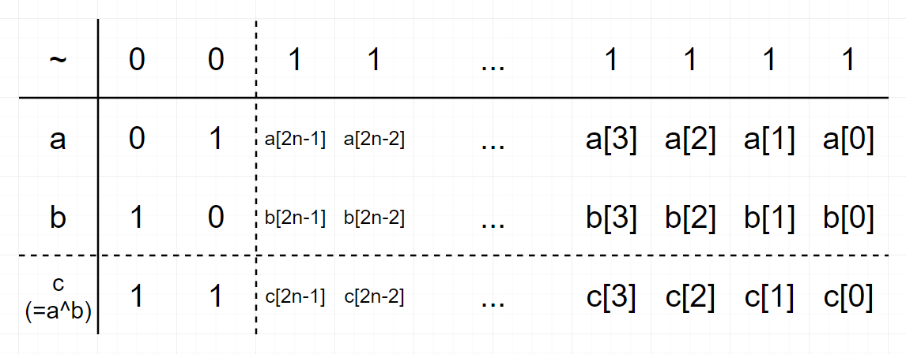
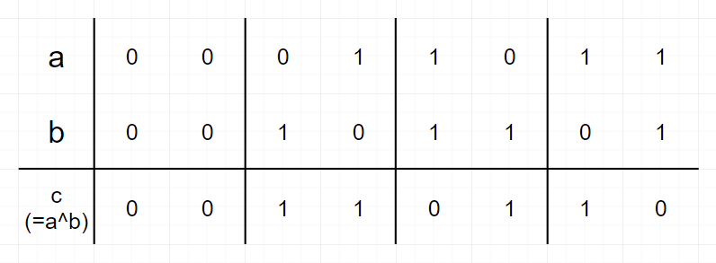
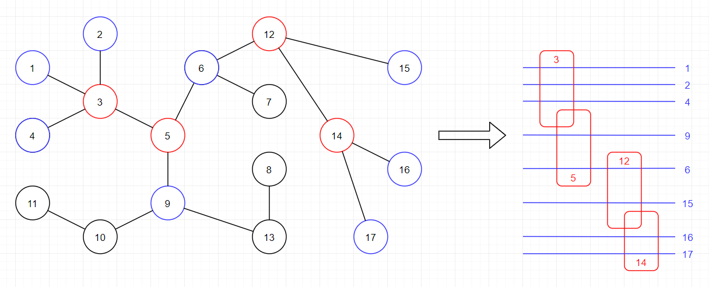
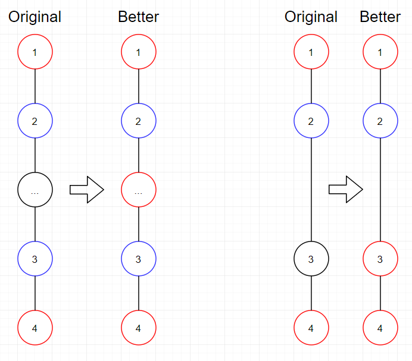

# Editorial_(en)

Hello! I hope all of you enjoyed my contest!

 
### [1339A - Filling Diamonds](https://codeforces.com/contest/1339/problem/A "Codeforces Round 633 (Div. 2)")

The key observation of this problem is, wherever you put vertical diamond at some point, all other places are uniquely placed by horizontal diamonds like picture below.

  There are n places you can put vertical diamond, so answer is n for each test case.

**Behind story of A**:

 * I tried to make the easiest Div2A ever. Will it work? :)

 
### [1339B - Sorted Adjacent Differences](https://codeforces.com/contest/1339/problem/B "Codeforces Round 633 (Div. 2)")

Sort the list, and make an oscillation centered on middle element like picture below.

  In this way, you will always achieve to make |ai−ai+1|≤|ai+1−ai+2| for all i. Time complexity is O(nlogn).

**Behind story of B**:

 * I tried to block various heuristics. There were some critical heuristics which could pass so many cases. Fortunately I blocked them during testing period, so I hope there won't be much FST this time.

 
### [1338A - Powered Addition](../problems/A._Powered_Addition.md "Codeforces Round 633 (Div. 1)")

First, let's define b as ideal destination of a, when we used operations.

Observation 1. Whatever you select any b, there is only one way to make it, because there is no more than single way to make specific amount of addition. That means we just have to select optimal destination of a.

For example, if you want to make a1 from 10 to 21, then you must do 10→11→13→21. There is no other way to make 10 to 21 using given operations.

So now we have to minimize max(b1−a1,b2−a2,…,bn−an), as smaller differences leads to use shorter time to make a nondecreasing.

Observation 2. b is optimal when bi is the maximum value among b1,b2,…,bi−1 and ai.

Because for each position i, we have to make bi−ai as smallest possible. Since bi should be not smaller than previous b values and also ai, we derived such formula.

So from position 1,2,…,n, greedily find a bi, and check how many seconds needed to convert ai to bi. The answer is maximum needed seconds among all positions.

Time complexity is O(n), but you can do O(nlogn) with "std::set" or whatever.

**Behind story of D2C/D1A**:

 * Originally, there was a different problem for this position. But it used XOR. As I made new D2E/D1C problem, I threw old D2C/D1A away and put this.

 
### [1338B - Edge Weight Assignment](../problems/B._Edge_Weight_Assignment.md "Codeforces Round 633 (Div. 1)")

Let's make an easy and good construction which can solve actual problem. Now reroot this tree at any leaf like picture below;

  Our goal in this construction is, we are trying to make xor(path(l1,lca(l1,l2)))=xor(path(l2,lca(l1,l2)))=xor(path(root,lca(l1,l2))) for all two leaves l1 and l2 to satisfy xor(path(l1,l2))=0.

First, let's solve about minimum f value. 

Observation 1. You can prove that minimum value of f is at most 3, by following construction;

  Since we pick any leaf as root, root is not at the top in this picture. Weight of edges are only determined by degree of two vertices and whether that edge is connected to leaf or not. So answer for minimum value is at most 3.

Observation 2. If there is any construction such that f=2, then it is always possible to have construction of f=1. Because if f=2 then there should be even number of edges for each weight, and you can simply change all weights them to single value without violating validity of edge weight assignment.

If you want to check validity of f=1 assignment, then you can simply check if all leaves have same parity of distance from root. Because distances between all nodes should be even.

Now let's solve about maximum value. 

Observation 3. You can solve maximum value of f by following construction;

  So for each non-root vertex i, assign weight to edge between i and pi by followings (pi is parent of vertex i); 

* If i is not leaf, then assign 2i as weight.
* Otherwise, assign xor(path(root,pi)) as weight.

This will differentize all edges' weights except for multiple leaves's edges which are connected to single vertex, because every non-leaf vertex have different weights of edge to its parent.

So the answer for maximum value is e−l+m, where 

* e is number of edges in this tree.
* l is number of leaves in this tree.
* m is number of non-leaves which has at least one leaf as its neighbor.

Time complexity is O(n).

——————

(Update) There is an another way to approach, provided by Darooha. 

If you label vertices instead of edges where all leaves have same label and none of neighbors have same label, then you can consider edge weight as xor of two vertices' labels, so this is basically equivalent to original problem.

Now for minimum, you can see that labelling 0 to leaves, and 1,2 to non-leaves are enough, so you can prove minimum value of f is at most 3. In same manner, you can try parity checking to check if f value can be 1 or not.

For maximum, assign 0 to all leaves and assign all different values(21,22,…) to non-leaf vertices, then you can see all edge weights(except leaves connected to same vertex) are different.

**Behind story of D2D/D1B**:

 * This problem is the most popular problem among testers. I also like this problem a lot.

 
### [1338C - Perfect Triples](../problems/C._Perfect_Triples.md "Codeforces Round 633 (Div. 1)")

Let's try mathematical induction.

First, suppose you have fully used numbers only between 1 and 4n−1 inclusive. Now we are going to use all numbers between 4n and 4n+1−1 inclusive by following methods. Following picture is description of a, b and c in bitwise manner;

  First row means we have already used all numbers until 4n−1. Other 3 rows mean a, b and c. Keep in mind that a, b, and c are the lexicographically smallest triple, so a⊕b=c and a<b<c should be satisfied at the same time.

Observation 1. a2n=1, a2n+1=0, b2n=0, b2n+1=1, c2n=c2n+1=1. Otherwise, a<b<c condition won't be satisfied, because top two digits of a, b, c are either 01, 10, and 11.

Then we have more freedom in lower digits, because since the highest 2 digits are all different, then we can fill lower digits of three numbers independently. Now look at picture below;

  This table shows you how to fill each 2 digits of a, b and c. Observation 2. For each 2 digits, a, b and c should have form like this. Of course, you can use mathematical induction again here; Try to prove this in only 2 digits at the first, then expand this lemma to 4 digits, 6 digits, ..., 2n digits.

Now you know the pattern of digits of a, b, and c. Apply this pattern for each test case. Time complexity is O(logn).

**Behind story of D2E/D1C**:

 * Feedback for this problem was too different by testers.
* I made this problem by modifying [Number Discovery](https://codeforces.com/contest/1242/problem/D), which is one of my previous problems.
* If you OEIS this, then you may find you can use Nimber Arithmetic to solve this.

 
### [1338D - Nested Rubber Bands](../problems/D._Nested_Rubber_Bands.md "Codeforces Round 633 (Div. 1)")

Observation 1. You have to generate optimal sequence which is subsequence of path between some two vertices. Neighbors of vertices in optimal sequence will be used as nested rubber bands.

  This is an example of conversion. Red vertices are picked sequence, and blue vertices are neighbor of red vertices which are used as nested rubber bands. The reason why black vertices can't be used as nested rubber bands is, basically you have to make a tunnel between any two blue lines, but it's impossible, because in each tunnel there is at least one red vertex which blocks complete connection on tunnel.

Also, this can be described as finding maximum independent set on subtree, which consists of vertices which has at most 1 distance from the optimal path connection of red vertices. Now your goal is to maximize number of blue vertices.

Observation 2. The distances between two adjacent red vertices are at most 2. Adjacent in this sentence means adjacent elements in generated optimal sequence. Because if there is some unused

  It is always optimal to take more red vertices than abandoning black vertices. Note that if there are two black vertices between two red vertices, then we cannot use both of them as blue vertices.

From those two observations, construct tree DP and run for it. Time complexity is O(n).

**Behind story of D1D**:

 * This problem was supposed to be D2E at first. But all LGM testers failed this problem during VC, so we thought that this problem's difficulty is high. Meanwhile, I found that old D1D problem can be easily googled, so we removed that problem, push this problem to be D1D, and made another D1C problem. I will share old D1D later.

 
### [1338E - JYPnation](../problems/E._JYPnation.md "Codeforces Round 633 (Div. 1)")

The solution contains several tricky observations, but its not hard to prove each of them seperately, so I will mention only the key points of the solution and proof.

Firstly, we should repeatedly remove points that have no in-degree. We can calculate their contribution easily.

For a node x, define in(x) to be the set of nodes u that u→x exists. 

Lemma 1: in(x)∪x has no cycles for any node x.

Let's pick X to be the node with maximum in-degree.

Let P = in(X)∪X, and let Q = Z∖P, where Z is the set of all vertices.

Lemma 2: There exist nodes U∈Q,V∈P, such that U→V exists.

Let R = in(V)∩Q, and let S = Q∖R

Lemma 3: For all nodes A∈S,B∈R, A→B exists.

Lemma 4: S has no cycles, R has no cycles.

Lemma 5: P has no cycles, Q has no cycles. 

That means we have partitioned the graph into two sets of nodes, where each set is completely ordered.

Lets label the nodes in P by Pi where i is an integer from 1 to |P|, such that for two nodes Pi and Pj, Pj→Pi exists iff j>i.

Label nodes in Q by Qi in similar manner. 

Define inP(x) to be the set of nodes u∈P that u→x exists. 

Define inQ(x) to be the set of nodes u∈Q that u→x exists. 

Lemma 6a: If |inQ(Pi)|=|inQ(Pj)| then inQ(Pi)=inQ(Pj). 

Lemma 6b: If |inP(Qi)|=|inP(Qj)| then inP(Qi)=inP(Qj). 

Final observations:

* dis(Pi,Pj)=1 iff i>j
* dis(Pi,Pj)=2 iff i<j and |inQ(Pi)|≠|inQ(Pj)|
* dis(Pi,Pj)=3 iff i<j and |inQ(Pi)|=|inQ(Pj)|
* dis(Qi,Qj)=1 iff i>j
* dis(Qi,Qj)=2 iff i<j and |inP(Qi)|≠|inP(Qj)|
* dis(Qi,Qj)=3 iff i<j and |inP(Qi)|=|inP(Qj)|
* dis(Pi,Qj)+dis(Qj,Pi)=3

Finally, we can count the answer in O(N2) by the above observations.

**Behind story of D1E**:

 * Thanks [tzuyu_chou](https://codeforces.com/profile/tzuyu_chou "Legendary Grandmaster tzuyu_chou") for writing this problem. She is genius in both singing and problemsolving.
