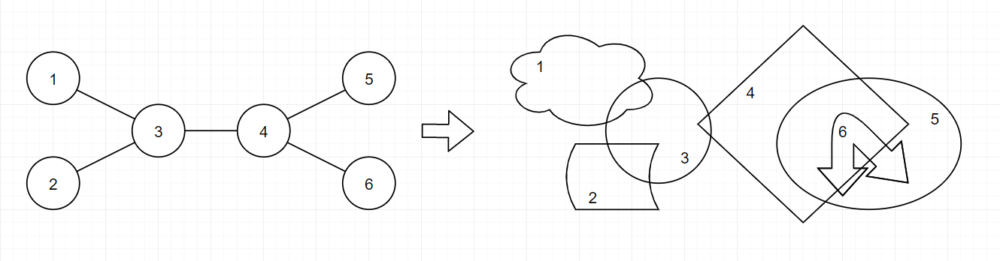
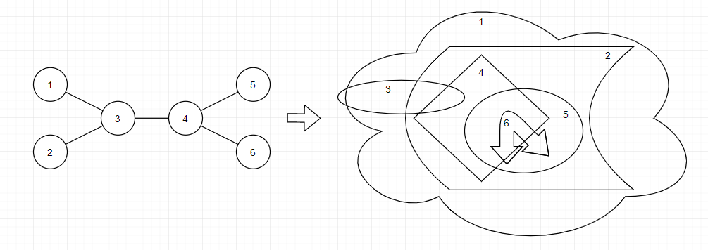
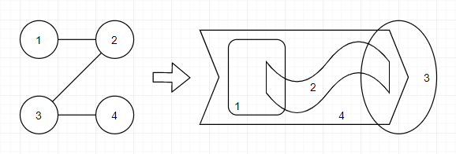

<h1 style='text-align: center;'> D. Nested Rubber Bands</h1>

<h5 style='text-align: center;'>time limit per test: 1 second</h5>
<h5 style='text-align: center;'>memory limit per test: 256 megabytes</h5>

You have a tree of $n$ vertices. You are going to convert this tree into $n$ rubber bands on infinitely large plane. Conversion rule follows:

* For every pair of vertices $a$ and $b$, rubber bands $a$ and $b$ should intersect if and only if there is an edge exists between $a$ and $b$ in the tree.
* Shape of rubber bands must be a simple loop. In other words, rubber band is a loop which doesn't self-intersect.

Now let's define following things: 

* Rubber band $a$ includes rubber band $b$, if and only if rubber band $b$ is in rubber band $a$'s area, and they don't intersect each other.
* Sequence of rubber bands $a_{1}, a_{2}, \ldots, a_{k}$ ($k \ge 2$) are nested, if and only if for all $i$ ($2 \le i \le k$), $a_{i-1}$ includes $a_{i}$.

  This is an example of conversion. 
## Note

 that rubber bands $5$ and $6$ are nested. It can be proved that is it possible to make a conversion and sequence of nested rubber bands under given constraints.

What is the maximum length of sequence of nested rubber bands can be obtained from given tree? Find and print it.

#### Input

The first line contains integer $n$ ($3 \le n \le 10^{5}$) — the number of vertices in tree.

The $i$-th of the next $n-1$ lines contains two integers $a_{i}$ and $b_{i}$ ($1 \le a_{i} \lt b_{i} \le n$) — it means there is an edge between $a_{i}$ and $b_{i}$. It is guaranteed that given graph forms tree of $n$ vertices.

#### Output

Print the answer.

## Examples

#### Input


```text
6
1 3
2 3
3 4
4 5
4 6
```
#### Output


```text
4
```
#### Input


```text
4
1 2
2 3
3 4
```
#### Output


```text
2
```
## Note

In the first sample, you can obtain a nested sequence of $4$ rubber bands($1$, $2$, $5$, and $6$) by the conversion shown below. Of course, there are other conversions exist to make a nested sequence of $4$ rubber bands. However, you cannot make sequence of $5$ or more nested rubber bands with given tree.

  You can see one of the possible conversions for the second sample below.

  

#### Tags 

#2700 #NOT OK #constructive_algorithms #dfs_and_similar #dp #math #trees 

## Blogs
- [All Contest Problems](../Codeforces_Round_633_(Div._1).md)
- [Codeforces Round #633 (en)](../blogs/Codeforces_Round_633_(en).md)
- [Editorial (en)](../blogs/Editorial_(en).md)
