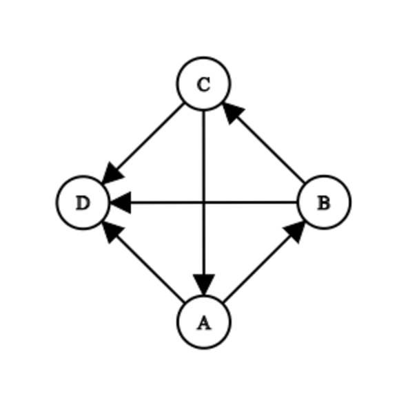
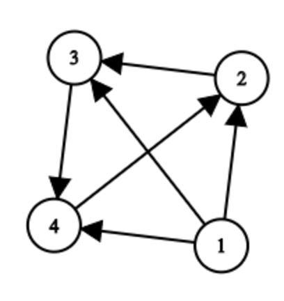

<h1 style='text-align: center;'> E. JYPnation</h1>

<h5 style='text-align: center;'>time limit per test: 2 seconds</h5>
<h5 style='text-align: center;'>memory limit per test: 1024 megabytes</h5>

Due to the success of TWICE, JYP Entertainment has earned countless money and emerged as the biggest entertainment firm by market capitalization. Therefore, the boss, JYP, has decided to create a new nation and has appointed you to provide a design diagram.

The new nation consists of $n$ cities and some roads between them. JYP has given some restrictions:

* To guarantee efficiency while avoiding chaos, for any $2$ different cities $A$ and $B$, there is exactly one road between them, and it is one-directional. There are no roads connecting a city to itself.
* The logo of rivaling companies should not appear in the plan, that is, there does not exist $4$ distinct cities $A$,$B$,$C$,$D$ , such that the following configuration occurs.

  JYP has given criteria for your diagram. For two cities $A$,$B$, let $dis(A,B)$ be the smallest number of roads you have to go through to get from $A$ to $B$. If it is not possible to walk from $A$ to $B$, $dis(A,B) = 614n$. Then, the efficiency value is defined to be the sum of $dis(A,B)$ for all ordered pairs of distinct cities $(A,B)$.

## Note

 that $dis(A,B)$ doesn't have to be equal to $dis(B,A)$.

You have drawn a design diagram that satisfies JYP's restrictions. Find the sum of $dis(A,B)$ over all ordered pairs of cities $(A,B)$ with $A\neq B$.

## Note

 that the input is given in compressed form. But even though it is compressed, you'd better use fast input.

#### Input

The first line contains a single integer $n$ ($4 \le n \le 8000$, $n \equiv 0 \pmod{4}$) — the number of cities.

A binary matrix is encrypted in the following format. Each of $n$ next lines contains $\frac{n}{4}$ one-digit hexadecimal numbers (that is, these numbers can be represented either as digits from $0$ to $9$ or as uppercase Latin letters from $A$ to $F$). Binary representation of each of these numbers denotes next $4$ elements of the matrix in the corresponding row. For example, if the number $B$ is given, then the corresponding elements are $1011$, and if the number is $5$, then the corresponding elements are $0101$.

After you obtain the decrypted binary matrix, the $j$-th character of the $i$-th row is $1$ if the one-directional road between cities $i$ and $j$ is directed from $i$ to $j$, and $0$ otherwise. It is guaranteed that the graph satisfies the restrictions mentioned above.

#### Output

#### Output

 one integer, representing the sum of $dis(A,B)$ over all ordered pairs of cities $(A,B)$ with $A\neq B$.

## Examples

#### Input


```text
4
7
2
1
4
```
#### Output


```text
7380
```
#### Input


```text
8
7F
3F
1F
0C
06
03
11
18
```
#### Output


```text
88464
```
## Note

The first example corresponds to the matrix:

$\begin{matrix} 0111 \\\ 0010 \\\ 0001 \\\ 0100 \\\ \end{matrix}$

Which corresponds to this graph:



$dis(1,2)=dis(1,3)=dis(1,4)=dis(2,3)=dis(3,4)=dis(4,2)=1$

$dis(2,4)=dis(4,3)=dis(3,2)=2$

$dis(2,1)=dis(3,1)=dis(4,1)=2456$

Therefore the answer for the diagram is $7380$.


#### Tags 

#3500 #NOT OK #graphs 

## Blogs
- [All Contest Problems](../Codeforces_Round_633_(Div._1).md)
- [Codeforces Round #633 (en)](../blogs/Codeforces_Round_633_(en).md)
- [Editorial (en)](../blogs/Editorial_(en).md)
