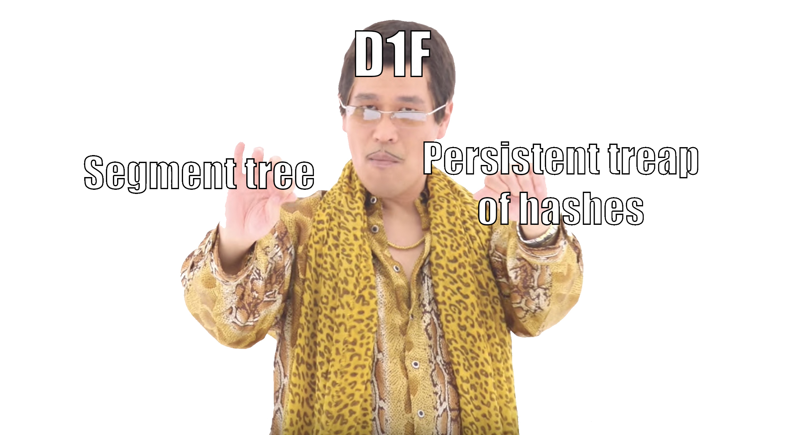

# Tutorial_(en)

### [1341A - Nastya and Rice](https://codeforces.com/contest/1341/problem/A "Codeforces Round 637 (Div. 2) - Thanks, Ivan Belonogov!")

We can get any weight of all grains from n(a−b)n(a−b) to n(a+b)n(a+b), so we need to check that the segments [n(a−b);n(a+b)][n(a−b);n(a+b)] and [c−d;c+d][c−d;c+d] intersect.

Idea: [I_love_myself](https://codeforces.com/profile/I_love_myself "Master I_love_myself")  
Solution: [77904333](https://codeforces.com/contest/1341/submission/77904333 "Submission 77904333 by I_love_myself") 

### [1341B - Nastya and Door](https://codeforces.com/contest/1341/problem/B "Codeforces Round 637 (Div. 2) - Thanks, Ivan Belonogov!")

Let's make an array consisting of 00 and 11, such that it shows whether the position ii is a peak on the whole segment. To do this, we will go through the indices from 22 to n−1n−1, and if the conditions ai−1<aiai−1<ai and ai>ai+1ai>ai+1 are true, then we write 11 in a new array at position ii. After that, we calculate the prefix sum in the new array prefpref. Now the number of peaks in the segment [l,l+k−1][l,l+k−1] is calculated as pref[l+k−2]−pref[l]pref[l+k−2]−pref[l], so we find out how many peaks in the desired segment, not including the boundaries of the segment. It remains only to go through all ll from 11 to n−k+1n−k+1 and find the leftmost ll, such that pref[l+k−2]−pref[l]pref[l+k−2]−pref[l] as much as possible.

 Idea: [alexX512](https://codeforces.com/profile/alexX512 "Master alexX512")  
Solution: [77904408](https://codeforces.com/contest/1341/submission/77904408 "Submission 77904408 by I_love_myself") 
### [1341C - Nastya and Strange Generator](https://codeforces.com/contest/1341/problem/C "Codeforces Round 637 (Div. 2) - Thanks, Ivan Belonogov!")

Consider the initial moment of time. Note that the array is r=[1,2,…,n]r=[1,2,…,n], count=[1,1,…,1]count=[1,1,…,1]. So the generator will choose a random position from the entire array – let it be the position i1i1. In the next step, r=[1,2,…i1+1,i1+1,i+2,…,n]r=[1,2,…i1+1,i1+1,i+2,…,n], count=[1,1,…,0,2,1,…,1]count=[1,1,…,0,2,1,…,1]. That is, now there is only one maximum and it is reached at the position i1+1i1+1. Thus, we will fill in the entire suffix starting at position i1i1: a=[×,…,×,1,…,i1]a=[×,…,×,1,…,i1]. After this, this procedure will be repeated for some i2i2 (1≤i2<i11≤i2<i1) and the array will become a=[×,…,×,i1+1,…,i1+i2,1,…,i1]a=[×,…,×,i1+1,…,i1+i2,1,…,i1] . That is, we need to check that the array consists of several ascending sequences.

  
Idea: [Aleks5d](https://codeforces.com/profile/Aleks5d "Grandmaster Aleks5d")  
Solution: [77904455](https://codeforces.com/contest/1340/submission/77904455 "Submission 77904455 by I_love_myself") 
### [1341D - Nastya and Scoreboard](https://codeforces.com/contest/1341/problem/D "Codeforces Round 637 (Div. 2) - Thanks, Ivan Belonogov!")

Let dp[i][j]=truedp[i][j]=true, if at the suffix i…ni…n you can turn on exactly jj sticks and get the correct sequence of digits and falsefalse otherwise. It is easy to recalculate this dynamics: we will make transitions to all possible digits (the mask at position ii should be a submask of the digit).

Asymptotic calculate of the dynamics O(10nd)O(10nd).

Now let's go in order from 11 to nn and will try to eagerly set the maximum possible figure using our dynamics. It is easy to understand that in this way we get the maximum possible number of nn digits.

 Idea: [I_love_myself](https://codeforces.com/profile/I_love_myself "Master I_love_myself")  
Solution: [77770331](https://codeforces.com/contest/1340/submission/77770331 "Submission 77770331 by tourist") 
### [1341E - Nastya and Unexpected Guest](https://codeforces.com/contest/1341/problem/E "Codeforces Round 637 (Div. 2) - Thanks, Ivan Belonogov!")

Notice the fact: if we somehow came to safety island and time imodgimodg (modmod - is a remainder after dividing ii by gg), we don't need anymore to come to this island at time jj where i<ji<j and imodg=jmodgimodg=jmodg, because this will form a cycle.

So that we can rephrase our task like this: we have some vertices, which are denoted as a pair (i,t)(i,t), ii - is island index, tt is a remainder after dividing the time we came to ii by gg. So it will be enough to use only edges between vertices (i,t)→(i+1,(t+a[i+1]−a[i])modg)(i,t)→(i+1,(t+a[i+1]−a[i])modg) and (i,t)→(i−1,(t+a[i]−a[i−1])modg)(i,t)→(i−1,(t+a[i]−a[i−1])modg), because all remaining edges can be expressed through these ones. Now lets notice that edges, which make time t+a>gt+a>g can't be used due to restriction of walking on red. But vertices with t+a=gt+a=g are good for us. So we can say, that while green light is on, Denis can walk without restrictions, and when t+a=gt+a=g we add g+rg+r to time. So we can use 0101-BFS to solve this task and at the end check find vertex and position from which we can go to our final destination.

Time complexity will be O(g∗m)O(g∗m).

 Idea: [Aleks5d](https://codeforces.com/profile/Aleks5d "Grandmaster Aleks5d")  
Solution: [77904646](https://codeforces.com/contest/1340/submission/77904646 "Submission 77904646 by I_love_myself") 
### [1341F - Nastya and Time Machine](https://codeforces.com/contest/1341/problem/F "Codeforces Round 637 (Div. 2) - Thanks, Ivan Belonogov!")

Lemma: The maximum time that Denis will visit will be at least maxv=1ndegv=Tmaxv=1ndeg⁡v=T

Proof: consider an arbitrary vertex vv. We will visit her degv−1deg⁡v−1 times when we will bypass all her neighbors and another 11 when we return to her ancestor. But we can't go to vertex at 0 time. So, we need degvdeg⁡v moments more than 0.

We construct a graph traversal with a maximum time equal to TT. Let us now stand at vv at a time tt and vv has an un visited son uu. We want to go to uu, go around its entire subtree and return to vv at time t+1t+1. That is, the route will be something like this: (v,t)→(u,t+1)→…→(u,t)→(v,t+1)(v,t)→(u,t+1)→…→(u,t)→(v,t+1).

Let k=degu−1k=deg⁡u−1, for wiwi we denote the ii th son of uu. If t+1≤T−kt+1≤T−k, then there are no problems, we will move back in time at the very end of the route: (v,t)(v,t) →→ (u,t+1)(u,t+1) →→ (w1,t+2)(w1,t+2) →→ …… →→ (u,t+2)(u,t+2) →→ …… →→ (wk,t+k+1)(wk,t+k+1) →→ …… →→ (u,t+k)(u,t+k) →→ (u,t)(u,t) →→ (v,t+1)(v,t+1).

Otherwise, you have to go back in time in the middle of the route (exactly when we get to T) so that after the last visit we will be in (v,t+1)(v,t+1), that is: (v,t)(v,t) →→ (u,t+1)(u,t+1) →→ (w1,t+2)(w1,t+2) →→ …… →→ (u,t+2)(u,t+2) →→ …… →→ (u,T)(u,T) →→ (u,t′)(u,t′) →→ …… (wk,t+k+1)(wk,t+k+1) →→ …… →→ (u,t+k)(u,t+k) →→ (u,t)(u,t) →→ (v,t+1)(v,t+1) , where t′t′ can be easily calculated by the number of not visited sons.

 Idea: [Aleks5d](https://codeforces.com/profile/Aleks5d "Grandmaster Aleks5d")  
Solution: [77904714](https://codeforces.com/contest/1340/submission/77904714 "Submission 77904714 by I_love_myself") 
### [1340E - Nastya and Bees](../problems/E._Nastya_and_Bees.md "Codeforces Round 637 (Div. 1) - Thanks, Ivan Belonogov!")

*Tutorial is not available*

 It turned out that the author’s solution does not work correctly and so far no one, including participants, can prove that Nastya can be caught. [This](Tutorial_(en).md?#comment-610176) comments contain a lot of good thoughts. But if you can offer at least some solution to this problem, then I (and some participants) will be very happy! 
### [1340F - Nastya and CBS](../problems/F._Nastya_and_CBS.md "Codeforces Round 637 (Div. 1) - Thanks, Ivan Belonogov!")

We will call the string exactly the wrong bracket sequence if we go through it with a stack and it will not be of the form close+openclose+open, where closeclose is the sequence of closing brackets, and openopen is opening.

Claim: if s=a+bs=a+b and aa is exactly not CBS or bb is exactly not CBS, then ss is also exactly not CBS.

At the top of the Segment Tree, we will keep the line after going through it with the stack in the form close+openclose+open or marking that it is exactly not CBS. How to merge 22 segments of the form {close1+open1}{close1+open1} and {close2+open2}{close2+open2}? Note that 33 cases are possible:

1. The suffix open1open1 is close2close2, then the result is close1+(close2−prefix)+open2close1+(close2−prefix)+open2.
2. The prefix close1close1 is equal to open2open2, similarly.
3. The result is exectly not CBS.

How can we quickly consider this? Let's build a segment tree, which contains treaps (which contain hashes) in each node, then we need to check for equality some prefixes, glue some strings and save all versions in order to update the ST.

The resulting asymptotics of O(nlog2n)O(nlog2⁡n).

   Idea: [I_love_myself](https://codeforces.com/profile/I_love_myself "Master I_love_myself")  
Solution: [77904971](https://codeforces.com/contest/1340/submission/77904971 "Submission 77904971 by I_love_myself")  
Thanks to [Holidin](https://codeforces.com/profile/Holidin "Grandmaster Holidin") for help in preparing this problem.