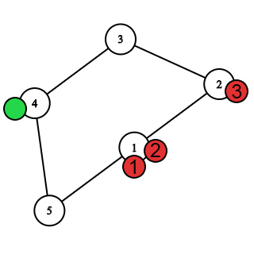
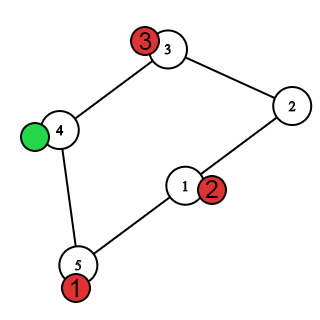
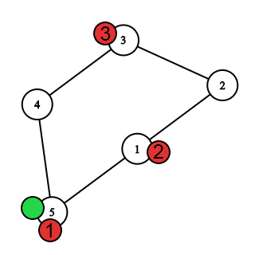
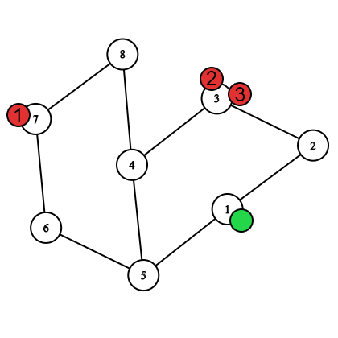
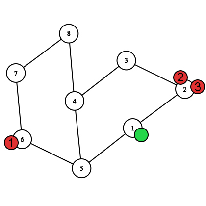
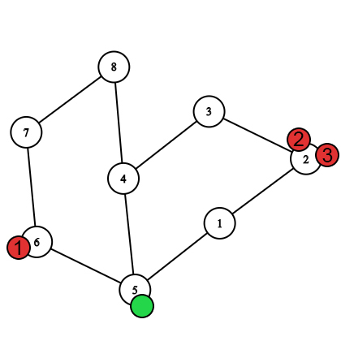
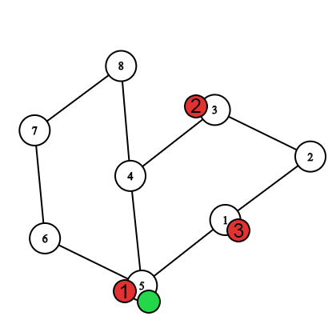

<h1 style='text-align: center;'> E. Nastya and Bees</h1>

<h5 style='text-align: center;'>time limit per test: 1 second</h5>
<h5 style='text-align: center;'>memory limit per test: 256 megabytes</h5>

Unfortunately, a mistake was found in the proof of the author's solution to this problem. Currently, we don't know the absolutely correct solution. However, you can solve this task, but if your solution passes all the tests, it is not guaranteed to be correct. If your solution has passed all the tests and you are sure that it is correct, you can write to one of the contest authors about it.

 Surely you all read the book "Alice in Wonderland". In this task, Nastya got to the country of Three strange Bees. The bees are strange because their honeycombs are pentagonal. Nastya got there illegally, so she wants bees not to catch her. Help the bees punish the intruder! 

This is an interactive problem.

A beehive is a connected undirected graph where bees and Nastya can move along the edges. A graph satisfies two properties: 

* The degree of any of its vertex is no more than $3$.
* For each edge, there exists a cycle of length not greater than $5$ passing through this edge.

 There are three bees and Nastya. You play for bees. Firstly, you choose the vertices where you put the bees. Then Nastya chooses another vertex in which she will initially appear. One move is first moving the bees, then Nastya, in turn: 1. For each of your bees, you can either move each one along some edge from the vertex they are currently staying or leave it in place.
2. Then Nastya will necessarily move along some edge of the graph from the vertex she is currently staying/.

You win if at least one of the bees and Nastya are in the same vertex at any time of the game.

If this situation does not occur after $n$ moves, then you lose.

Several bees can be in the same vertex.

#### Input

The first line contains two integers $n$ $(4 \leq n \leq 5000)$ and $m$ $(n \leq m \leq 3n)$  — the number of vertices and edges in the graph.

Each of the next $m$ lines contains two integers $v$ and $u$ $(1 \leq v, u \leq n)$, which mean that there is an edge between the vertices $v$ and $u$. It is guaranteed that the graph is connected, does not contain loops that the degree of any vertex does not exceed $3$ and a cycle of length no more than $5$ passes through each edge. 
## Note

 that the graph may contain multiple edges.

## Interaction

At each turn, you must output exactly three vertices $a, b, c$ $(1 \leq a, b, c \leq n)$. For the first time, $3$ vertices displayed will indicate which vertices you originally placed bees on. In response, you will receive the vertex where the jury placed Nastya. Each next $3$ vertices will indicate where the $3$ bees move at your turn. Each of the bees can, regardless of other bees, both remain at the current vertex and move along the edge. After the next output of $3$ vertices, in response, you get the number of the new vertex to which Nastya went.

As soon as one of the bees is at the same vertex with Nastya or you have reached the limit on the number of moves, your program should stop working. That is if you made a move, and one of the bees ended up at the same vertex with Nastya, your program must stop working, or if Nastya made a move and ended up at the same vertex with one of the bees, you should not make your move and the program should stop working.

If the number of moves exceeds limit ($n$, where $n$ is the number of vertices), you will get the Wrong Answer verdict.

Your solution may receive the verdict Idleness Limit Exceeded if you don't output anything or forget to flush the output buffer.

To flush the output buffer, you need to do the following immediately after printing the query and the line end:

* fflush(stdout) or cout.flush() in C++;
* System.out.flush() in Java;
* flush(output) in Pascal;
* stdout.flush() in Python;
* for other languages see documentation.

In this problem interactor is adaptive. This means that depending on all your previous moves, Nastya's behavior may change.

Hacks are not available for this problem.

## Examples

#### Input


```text
5 5
1 2
2 3
3 4
4 5
5 1
4
5
```
##Output
```text

1 1 2
1 5 3
```
#### Input

```text

8 9
1 2
2 3
3 4
4 5
5 1
5 6
6 7
7 8
8 4
1
5
```
##Output
```text

7 3 3
6 2 2
5 3 1
```
## Note

Let Nastya be a green chip, and three numbered red ones are three bees.

In the first test, the movement of the heroes looks like this.

  After selecting the starting vertices.   The first move after the bees move.   The first move after the Nastya's move. The first bee caught Nastya. In the second test, the movement of the heroes looks like this.

  After selecting the starting vertices.   The first move after the bees move.   The first move after the Nastya's move.   The second move after the bees move. The first bee caught Nastya. 

#### Tags 

#3000 #NOT OK #graphs #interactive #probabilities 

## Blogs
- [All Contest Problems](../Codeforces_Round_637_(Div._1)_-_Thanks,_Ivan_Belonogov!.md)
- [Announcement](../blogs/Announcement.md)
- [Tutorial (en)](../blogs/Tutorial_(en).md)
