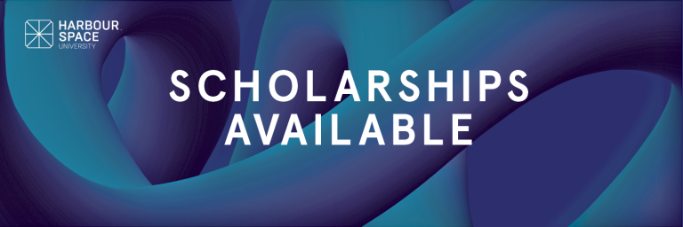

# Announcement_(en)

Hello Codeforces!

On [Sunday, April 26, 2020 at 20:35UTC+6](https://codeforces.com/https://www.timeanddate.com/worldclock/fixedtime.html?day=26&month=4&year=2020&hour=17&min=35&sec=0&p1=166) [Educational Codeforces Round 86 (рейтинговый для Див. 2)](https://codeforces.com/contest/1342 "Educational Codeforces Round 86 (рейтинговый для Див. 2)") will start.

Series of Educational Rounds continue being held as [Harbour.Space University](https://codeforces.com/https://harbour.space/) initiative! You can read the details about the cooperation between [Harbour.Space University](https://codeforces.com/https://harbour.space/) and Codeforces in the [blog post](//codeforces.com/blog/entry/51208).

This round will be **rated for the participants with rating lower than 2100**. It will be held on extended ICPC rules. The penalty for each incorrect submission until the submission with a full solution is 10 minutes. After the end of the contest you will have 12 hours to hack any solution you want. You will have access to copy any solution and test it locally.

You will be given **6 or 7 problems** and **2 hours** to solve them.

The problems were invented and prepared by Roman [Roms](https://codeforces.com/profile/Roms "Мастер Roms") Glazov, Adilbek [adedalic](https://codeforces.com/profile/adedalic "Международный мастер adedalic") Dalabaev, Vladimir [vovuh](https://codeforces.com/profile/vovuh "Мастер vovuh") Petrov, Ivan [BledDest](https://codeforces.com/profile/BledDest "Международный гроссмейстер BledDest") Androsov, Maksim [Neon](https://codeforces.com/profile/Neon "Кандидат в мастера Neon") Mescheryakov and me. Also huge thanks to Mike [MikeMirzayanov](https://codeforces.com/profile/MikeMirzayanov "Штаб, MikeMirzayanov") Mirzayanov for great systems Polygon and Codeforces.

Special thanks to Mikhail [darnley](https://codeforces.com/profile/darnley "Гроссмейстер darnley") Dvorkin for helping in round preparation!

Good luck to all the participants!

Our friends at Harbour.Space also have a message for you:

*Hi Codeforces!* 

*You really went for it in the last Educational Round! We had an all-time high participation of 21750 people :) We are happy to support such an awesome community, and look forward to growing these numbers in the future!* 

*We are searching for diamonds in the rough — driven, talented humans, passionate about technology and design, undefined by nationality, gender and cultural background. We know that no diamond is born polished, so our mission is to identify and support as many talented young individuals as we can, so that they can fulfill their potential and secure the future they deserve.* 

*If you are graduating or have already completed a bachelor's degree, we are waiting for your applications for fully-funded Master's degree scholarships by the link below.*

  [APPLY NOW→](https://in.harbour.space/bangkok-scholarships/?utm_source=codeforces&utm_medium=partners) Congratulations to the winners: 

| Rank | Competitor | Problems Solved | Penalty |
| --- | --- | --- | --- |
| 1 | [DreamLolita](https://codeforces.com/profile/DreamLolita "Кандидат в мастера DreamLolita") | 6 | 211 |
| 2 | [KrK](https://codeforces.com/profile/KrK "Международный гроссмейстер KrK") | 6 | 235 |
| 3 | [Sugar_fan](https://codeforces.com/profile/Sugar_fan "Международный гроссмейстер Sugar_fan") | 6 | 259 |
| 4 | [krijgertje](https://codeforces.com/profile/krijgertje "Международный гроссмейстер krijgertje") | 6 | 268 |
| 5 | [Temotoloraia](https://codeforces.com/profile/Temotoloraia "Гроссмейстер Temotoloraia") | 6 | 272 |

Congratulations to the best hackers: 

| Rank | Competitor | Hack Count |
| --- | --- | --- |
| 1 | [liouzhou_101](https://codeforces.com/profile/liouzhou_101 "Мастер liouzhou_101") | **81****:-35** |
| 2 | [j_peters](https://codeforces.com/profile/j_peters "Эксперт j_peters") | **29****:-16** |
| 3 | [eR6](https://codeforces.com/profile/eR6 "Кандидат в мастера eR6") | **18****:-19** |
| 4 | [tonyli00000](https://codeforces.com/profile/tonyli00000 "Эксперт tonyli00000") | **14****:-15** |
| 5 | [phyzzmat](https://codeforces.com/profile/phyzzmat "Мастер phyzzmat") | **8****:-7** |

 281 successful hacks and 925 unsuccessful hacks were made in total!And finally people who were the first to solve each problem: 

| Problem | Competitor | Penalty |
| --- | --- | --- |
| A | [sevlll777](https://codeforces.com/profile/sevlll777 "Кандидат в мастера sevlll777") | 0:00 |
| B | [Aerosmith](https://codeforces.com/profile/Aerosmith "Кандидат в мастера Aerosmith") | 0:02 |
| C | [DreamLolita](https://codeforces.com/profile/DreamLolita "Кандидат в мастера DreamLolita") | 0:03 |
| D | [xb0nS](https://codeforces.com/profile/xb0nS "Мастер xb0nS") | 0:14 |
| E | [AaParsa](https://codeforces.com/profile/AaParsa "Мастер AaParsa") | 0:17 |
| F | [chemthan](https://codeforces.com/profile/chemthan "Гроссмейстер chemthan") | 1:07 |

**UPD:** [Editorial is out](Tutorial_(en).md)

