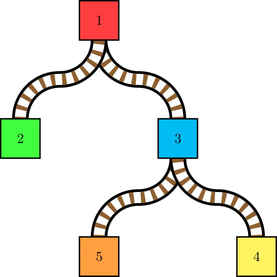

<h1 style='text-align: center;'> E. Train Tracks</h1>

<h5 style='text-align: center;'>time limit per test: 5 seconds</h5>
<h5 style='text-align: center;'>memory limit per test: 256 megabytes</h5>

That's right. I'm a Purdue student, and I shamelessly wrote a problem about trains.

There are $n$ stations and $m$ trains. The stations are connected by $n-1$ one-directional railroads that form a tree rooted at station $1$. All railroads are pointed in the direction from the root station $1$ to the leaves. A railroad connects a station $u$ to a station $v$, and has a distance $d$, meaning it takes $d$ time to travel from $u$ to $v$. Each station with at least one outgoing railroad has a switch that determines the child station an incoming train will be directed toward. For example, it might look like this:

  Here, stations $1$ and $3$ have switches directed toward stations $2$ and $4$, respectively. Initially, no trains are at any station. Train $i$ will enter station $1$ at time $t_i$. Every unit of time, starting at time $1$, the following two steps happen:

1. You can switch at most one station to point to a different child station. A switch change takes effect before step $2$.
2. For every train that is on a station $u$, it is directed toward the station $v$ indicated by $u$'s switch. So, if the railroad from $u$ to $v$ has distance $d$, the train will enter station $v$ in $d$ units of time from now.

Every train has a destination station $s_i$. When it enters $s_i$, it will stop there permanently. If at some point the train is going in the wrong direction, so that it will never be able to reach $s_i$ no matter where the switches point, it will immediately explode.

Find the latest possible time of the first explosion if you change switches optimally, or determine that you can direct every train to its destination so that no explosion occurs. Also, find the minimum number of times you need to change a switch to achieve this.

##### Input

The first line contains two integers $n$ and $m$ ($1\le n,m\le 10^5$) — the number of stations and trains, respectively.

The next $n-1$ lines describe the railroads. The $i$-th line contains three integers $u,v,d$ ($1\le u,v\le n$, $1\le d\le 10^9$), denoting a railroad from station $u$ to station $v$ with distance $d$. It is guaranteed that the railroads form a tree rooted at station $1$. The switch of a station $u$ is initially directed towards the last outgoing railroad from $u$ that appears in the input.

The next $m$ lines describe the trains. The $i$-th line contains two integers $s_i,t_i$ ($1\le s_i\le n$, $1\le t_1<t_2<\cdots<t_m\le 10^9$) — the destination station and the time the $i$-th train enters station $1$, respectively.

##### Output

##### Output

 two integers: the latest possible time of the first explosion (or $-1$ if it is possible to never have an explosion) and the minimum number of switch changes to achieve it.

## Examples

##### Input


```text
5 4
1 2 1
1 3 2
3 4 1
3 5 3
2 1
4 2
2 6
5 10
```
##### Output


```text
-1 6
```
##### Input


```text
5 4
1 2 1
1 3 2
3 4 1
3 5 3
5 1
4 2
4 3
2 4
```
##### Output


```text
4 0
```
##### Input


```text
11 6
1 2 1
1 3 2
3 4 1
3 5 2
5 6 1
5 7 2
7 8 1
7 9 2
9 10 1
9 11 1
2 1
8 3
6 5
10 7
4 9
2 11
```
##### Output


```text
11 4
```
## Note

For the first test, here's an example timeline: 

* At time $1$, train $1$ enters station $1$. We switch station $1$ to point to station $2$. Train $1$ is directed to station $2$.
* At time $2$, train $2$ enters station $1$, and train $1$ enters station $2$, where it stops permanently. We switch station $1$ to point to station $3$. Train $2$ is directed to station $3$.
* At time $4$, train $2$ enters station $3$. We switch station $3$ to point to station $4$. Train $2$ is directed to station $4$.
* At time $5$, train $2$ enters station $4$, where it stops permanently.
* At time $6$, train $3$ enters station $1$. We switch station $1$ to point to station $2$. Train $3$ is directed to station $2$.
* At time $7$, train $3$ enters station $2$, where it stops permanently. We switch station $3$ to point to station $5$.
* At time $10$, train $4$ enters station $1$. We switch station $1$ to point to station $3$. Train $4$ is directed to station $3$.
* At time $12$, train $4$ enters station $3$. Train $4$ is directed to station $5$.
* At time $15$, train $4$ enters station $5$, where it stops permanently.

For the second test, we switch nothing. At time $4$, train $2$ is directed to station $5$ and train $4$ is directed to station $3$. They both explode. It is impossible to prevent an explosion by time $4$.

For the third test, denote a switch change by $(u\to v,t)$ if we make station $u$ point to station $v$ at time $t$. One solution is to make these $4$ switch changes: $(1\to 2,1)$,$(1\to 3,2)$,$(7\to 8,5)$,$(5\to 6,8)$. At time $11$, trains $4$,$5$, and $6$ explode. It is impossible to prevent an explosion by time $11$.


#### Tags 

#3100 #NOT OK #data_structures #trees 

## Blogs
- [All Contest Problems](../Codeforces_Round_639_(Div._1).md)
- [Codeforces Round #639 (en)](../blogs/Codeforces_Round_639_(en).md)
- [Tutorial (en)](../blogs/Tutorial_(en).md)
