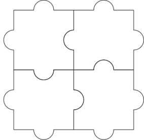

# Tutorial_(en)

[1345A - Puzzle Pieces](../problems/A._Puzzle_Pieces.md "Codeforces Round 639 (Div. 2)")

 **Tutorial**
### [1345A - Puzzle Pieces](../problems/A._Puzzle_Pieces.md "Codeforces Round 639 (Div. 2)")

If $n=1$ or $m=1$, then we can chain the pieces together to form a solution. If $n=m=2$, we can make the following solution:

  Any other potential solution would contain a $2\times 3$ or a $3\times 2$ solution, which we can show is impossible.

A $2\times 3$ grid has $7$ shared edges between the pieces, and each shared edge must have a blank. But there are only $6$ blanks available as there are $6$ pieces.

[1345B - Card Constructions](../problems/B._Card_Constructions.md "Codeforces Round 639 (Div. 2)")

 **Tutorial**
### [1345B - Card Constructions](../problems/B._Card_Constructions.md "Codeforces Round 639 (Div. 2)")

Let's count the number of cards in a pyramid of height $h$. There are $2(1+2+3+\cdots+h)$ cards standing up, and there are $0+1+2+\cdots+(h-1)$ horizontal cards. So, there are $2\frac{h(h+1)}{2}+\frac{(h-1)h}{2}=\frac{3}{2}h^2+\frac12 h$ cards total. Using this formula, we can quickly find the largest height $h$ that uses at most $n$ cards.

The quadratic formula or binary search can be used here, but are unnecessary. Simply iterating through all $h$ values works in $O(\sqrt n)$ time per test.

It's enough to see that this takes $O(t\sqrt N)$ time overall, where $N$ is the sum of $n$ across all test cases. But interestingly, we can argue for a tighter bound of $O(\sqrt{tN})$ due to the Cauchy-Schwarz Inequality:

$$\sum_{i=1}^t \left(1\cdot \sqrt{n_i}\right)\le \sqrt{\left(\sum_{i=1}^t1^2\right)\left(\sum_{i=1}^t\left(\sqrt n_i\right)^2\right)}=\sqrt{tN}$$

[1345C - Hilbert's Hotel](https://codeforces.com/contest/1345/problem/C "Codeforces Round 639 (Div. 2)")

 **Tutorial**
### [1345C - Hilbert's Hotel](https://codeforces.com/contest/1345/problem/C "Codeforces Round 639 (Div. 2)")

Suppose that $i+a_i\equiv j+a_j\pmod{n}$ for some $0\le i<j<n$. Then $i+a_i=j+a_j+kn$ for some integer $k$, so the guest in room $i$ is assigned the same room as guest $j+kn$.

Similarly, suppose that two different guests $k$ and $m$ are assigned the same room. Then we have $i+a_i\equiv j+a_j\pmod{n}$ for $i=k\bmod n$ and $j=m\bmod n$.

This proves there is a collision if and only if all $i+a_i$ are not distinct $\pmod n$. That is, $\{(0+a_0)\bmod n,(1+a_1)\bmod n,\ldots,(n-1+a_{n-1})\bmod n\}=\{0,1,\ldots,n-1\}$. This is simply checked with a boolean array to make sure each number from $0$ to $n-1$ is included.

Note that there are also no vacancies if this condition holds: Let $k$ be some room. Then $k\bmod n$ must appear in the array, so there is some $i$ with $i+a_i\equiv k\pmod n$. Then there is an integer $m$ with $i+mn+a_i=k$, meaning guest $i+mn$ is moved to room $k$.

Complexity is $O(n)$.

[1345D - Monopole Magnets](https://codeforces.com/contest/1345/problem/D "Codeforces Round 639 (Div. 2)")

 **Tutorial**
### [1345D - Monopole Magnets](https://codeforces.com/contest/1345/problem/D "Codeforces Round 639 (Div. 2)")

Suppose two cells $A$ and $B$ are colored black in the same row. Since there must be a south magnet in every row, there are segments of black cells from $A$ and $B$ to the cell with the south magnet. The same result holds for columns. Therefore, for a solution to exist, every row and every column has exactly one segment of black cells or is all-white.

Suppose there is an all-white row, but not an all-white column. (Or similarly, an all-white column but not an all-white row.) Then wherever we place a south magnet in this row, its column will have a black cell. But then the south magnet would be reachable, contradicting the fact that the row is all-white. Therefore, there should be an all-white row if and only if there is an all-white column, or no solution exists.

Now that we have excluded these cases where no solution exists, let's construct a solution. Place a south magnet in a cell if: 

1. The cell is colored black, or
2. Its row and column are both all-white.

Then place one north magnet in each connected component of black cells. A north magnet cannot travel between components, so this is optimal.

[1345E - Quantifier Question](https://codeforces.com/contest/1345/problem/E "Codeforces Round 639 (Div. 2)")

 **Tutorial**
### [1345E - Quantifier Question](https://codeforces.com/contest/1345/problem/E "Codeforces Round 639 (Div. 2)")

Build a directed graph of variables, where an edge xi→xj corresponds to an inequality xi<xj. Say that two variables are comparable if there is a directed path from one variable to the other.

Suppose xi and xj are comparable with i<j. Then xj cannot be universal since xi is determined before xj in the order and their comparability restricts the value of xj. So, a requirement for universality is that the variable is only comparable with larger-indexed variables.

If there is a cycle of inequalities, then there is no solution since the formula is contradictory. Otherwise, the graph is acyclic, so we can find a topological order. For each variable, we can find the minimum index of a node comparable to it by doing DP in forward and reverse topological order. Then for every variable not comparable to a smaller indexed variable, let it be universal. All other variables must be existential. Our requirement of universality proves this is optimal.

Let's prove this assignment gives a true statement (other than proof by AC). First, we can decrease the index of existential variables, which only strengthens the statement. So let's decrease the index of each existential variable to appear just after its largest-indexed comparable universal variable.

An existential variable xi may be comparable to many universal variables, but xi must be either greater than them all or less than them all. (Otherwise, we would have two comparable universals.) Without loss of generality, say xi is greater than its comparable universals. And suppose xi is less than another existential variable xj. Then xj is comparable to the same universals as xi, so we can determine the value of xj later such that it depends on xi. Therefore, each existential variable is only restricted by a lower bound or an upper bound of smaller-indexed variables. We can properly assign values to them, satisfying all inequalities.

[1345F - Résumé Review](https://codeforces.com/contest/1345/problem/F "Codeforces Round 639 (Div. 2)")

 **Tutorial**
### [1345F - Résumé Review](https://codeforces.com/contest/1345/problem/F "Codeforces Round 639 (Div. 2)")

If we increment some $b_i$ to $x$, the value of $f$ changes by $$\Delta_i (x):=\left[x(a_i-x^2)\right]-\left[(x-1)(a_i-(x-1)^2)\right]=a_i-3x^2+3x-1,$$

which decreases for $x\ge 1.$ If we initially set all $b_i$ to $0$, then greedily incrementing the best index gives an optimal solution. Since $k$ is large, we cannot afford to do this one increment at a time. However, we can observe that this process increments the values as long as $\Delta_i (x)\ge A$ for some constant $A$. Simply binary search on the value of $A$ so that we increment exactly $k$ times.

To compute the cutoffs for the $x$ values, we can either use the quadratic formula or do another binary search.

There may be ties for the $\Delta_i(x)$ values, but this can be handled without too much trouble.

Let $A=\max_{i=1,\ldots,n}\{a_i\}$. Complexity is $O(n\log(A))$ with the quadratic formula, or $O(n\log^2(A))$ with another binary search.

[1344E - Train Tracks](https://codeforces.com/contest/1344/problem/E "Codeforces Round 639 (Div. 1)")

 **Tutorial**
### [1344E - Train Tracks](https://codeforces.com/contest/1344/problem/E "Codeforces Round 639 (Div. 1)")

First, observe that a train can never pass one that enters earlier. So let's consider the trains independently. For a train $i$, look at the path from $1$ to $s_i$. We may need to change the switches of several stations on this path. We must make each switch within a time interval $(L, R]$, where $L$ is the most recent time some other train was directed the other way, and $R$ is the time train $i$ will enter the station. Let's mark all of these switches as changed before processing the next train.

Suppose the total number of switch changes is $k$, and for each station, we know its time intervals. We can manage all events in a priority queue of size $n$, always changing the switch with the earliest deadline that we can. Keep doing this until we are too late for a deadline, in which case an explosion happens, or until we have successfully made every switch change. This part will take $O(k\log n)$ time.

Let's find a nice upper bound on $k$. Note that the switches decompose the tree into a set of disjoint paths. When we process a train $i$, we are changing the switches to make a path from the root to $s_i$. It turns out this is exactly the same as an access operation on a link/cut tree! Because link/cut trees have $O(\log n)$ amortized time per operation, we can guarantee that the total number of switch changes is $k=O(n+m\log n)$.

Now let's consider the problem of finding all time intervals. We could use a link/cut tree, but everyone hates those, so let's discuss other methods. One strategy is to maintain a list of trains that go through a station, for every station. We start at the leaves and merge the lists going up. We can merge the lists efficiently by inserting elements from the smaller list to the larger list. Then a switch only needs to be changed when consecutive trains go to different children.

Unlike some of the testers, I wasn't smart enough to come up with the elegant small-to-large merging idea. So let's discuss an alternate solution using segment trees. When processing a train $i$, we want to do the following:

1. Find the top node $x$ of the path leading to $s_i$.
2. If $x$ is not the root, make the parent of $x$ point to $x$, and record the time interval we must make this switch. Repeat from step $1$ until $x$ is the root.

The queries we want to support are thus: 

1. Find the time the most recent train passed through a node $x$ (ignoring trains with $s_i=x,$ where it only stops at $x$).
2. Find the top node of the path containing node $x$.

Let's handle queries of type $1$ with a segment tree. After processing train $i$, update the value at index $s_i$ to $i$. To answer a query, find the maximum value in the range corresponding to the relevant subtree.

Let's also handle queries of type $2$ with a segment tree. At a segment tree node, store the minimum value on its range. To answer a query, check the range $[x,x]$. Support lazy updates of the form "On a range $[l, r]$, replace all values $X$ with value $Y$, with the precondition that $X$ is currently the minimum value in $[l,r]$ and $Y$ will remain the minimum value after the update". To make a switch change, we only need to do two lazy updates.

Therefore, finding all the time intervals will take $O((m+k)\log n)$ time.

The overall complexity is $O(n\log n+m\log^2 n)$.

[1344F - Piet's Palette](https://codeforces.com/contest/1344/problem/F "Codeforces Round 639 (Div. 1)")

 **Tutorial**
### [1344F - Piet's Palette](https://codeforces.com/contest/1344/problem/F "Codeforces Round 639 (Div. 1)")

Equate an empty cell with the color white, and let's represent the colors as 0/1 vectors: $$W=\begin{bmatrix}0\\\0\end{bmatrix},\ R=\begin{bmatrix}1\\\0\end{bmatrix},\ Y=\begin{bmatrix}0\\\1\end{bmatrix},\ B=\begin{bmatrix}1\\\1\end{bmatrix}.$$

Under this representation, mixing becomes addition $\pmod{2}$. And the operations $\mathrm{RY}$, $\mathrm{RB}$, $\mathrm{YB}$ are linear transformations of the colors. That is, each of these operations is equivalent to multiplying the corresponding matrix by a cell's vector: $$\mathrm{RY}=\begin{bmatrix}0&1\\\1&0\end{bmatrix},\ \mathrm{RB}=\begin{bmatrix}1&0\\\1&1\end{bmatrix},\ \mathrm{YB}=\begin{bmatrix}1&1\\\0&1\end{bmatrix}.$$

We simply have a system of $2k$ linear equations on $2n$ unknowns, which we can solve with Gaussian elimination using bitsets.

Complexity is $O((2k)^2 (2n) / 64).$

