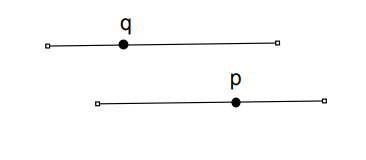
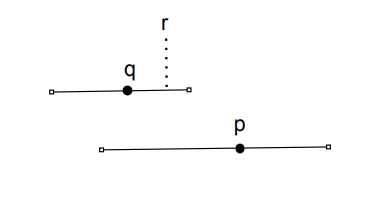

# Tutorial_(en)

[1348A - Phoenix and Balance](../problems/A._Phoenix_and_Balance.md "Codeforces Round 638 (Div. 2)")

 **Tutorial**
### [1348A - Phoenix and Balance](../problems/A._Phoenix_and_Balance.md "Codeforces Round 638 (Div. 2)")

We observe that the coin with the weight $2^n$ is greater than the sum of all the other weights combined. This is true because $\sum\limits_{i = 1}^{n-1}2^i=2^n-2$. Therefore, the pile that has the heaviest coin will always weigh more. To minimize the weight differences, we put the $n/2-1$ lightest coins into the pile with the heaviest coin. The answer will be $(2^n+\sum\limits_{i = 1}^{n/2-1}2^i)-\sum\limits_{i = n/2}^{n-1}2^i$.

Time complexity for each test case: $O(n)$

You can also solve the problem in $O(1)$ by simplifying the mathematical expression.

 **Solution**
```cpp
#include <bits/stdc++.h>
using namespace std;

void solve(){
  int N;
  cin>>N;
  //note: 1<<X means 2^X
  //we put largest coin in first pile
  int sum1=(1<<N), sum2=0;
  //we put n/2-1 smallest coins in first pile
  for (int i=1;i<N/2;i++)
    sum1+=(1<<i);
  //we put remaining n/2 coins in second pile
  for (int i=N/2;i<N;i++)
    sum2+=(1<<i);
  cout<<sum1-sum2<<endl;
}

int main(){
  int t; cin>>t;
  while (t--)
    solve();
}
```
[1348B - Phoenix and Beauty](../problems/B._Phoenix_and_Beauty.md "Codeforces Round 638 (Div. 2)")

 **Tutorial**
### [1348B - Phoenix and Beauty](../problems/B._Phoenix_and_Beauty.md "Codeforces Round 638 (Div. 2)")

For an array to be beautiful for some $k$, the array must be periodic with period $k$. If there exists more than $k$ distinct numbers in the array $a$, there is no answer and we print -1 (because the array cannot be periodic with period $k$). Otherwise, we propose the following construction.

Consider a list of all the distinct numbers in array $a$. If there are less than $k$ of them, we will append some $1$s (or any other number) until the list has size $k$. We can just print this list $n$ times. The length of our array $b$ is $nk$, which never exceeds $10^4$. Array $b$ can always be constructed by inserting some numbers into array $a$ because every number in $a$ corresponds to one list.

Time complexity for each test case: $O(n \log{n}+nk)$

 **Solution**
```cpp
#include <bits/stdc++.h>
using namespace std;

void solve(){
  int N,K;
  cin>>N>>K;
  set<int>s;
  for (int i=0;i<N;i++){
    int a;
    cin>>a;
    s.insert(a);
  }
  //if more than K distinct numbers, print -1
  if (s.size()>K){
    cout<<-1<<endl;
    return;
  }
  cout<<N*K<<endl;
  for (int i=0;i<N;i++){
    //print the distinct numbers
    for (int b:s)
      cout<<b<<' ';
    //print the extra 1s
    for (int j=0;j<K-(int)s.size();j++)
      cout<<1<<' ';
  }
  cout<<endl;
}

int main(){
  int t; cin>>t;
  while (t--)
    solve();
}
```
[1348C — Phoenix and Distribution](../problems/C._Phoenix_and_Distribution.md)

 **Tutorial**
### [1348C - Phoenix and Distribution](../problems/C._Phoenix_and_Distribution.md "Codeforces Round 638 (Div. 2)")

We first try to assign one letter to each string $a_i$. Let's denote the smallest letter in $s$ as $c$. If there exists at least $k$ occurrences of $c$ in $s$, we will assign $c$ as the first letter of each string $a_i$. Otherwise, the minimal solution is the $k$th smallest letter in $s$. For example, if $s=$aabbb and $k=3$, the $3$rd smallest letter is $b$ and that will be the answer. 

Otherwise, we consider the letters that are left in $s$. If they are all the same letter (or there are no letters left because $n=k$), we split the remaining letters as evenly as possible among $a_i$. If not, we will show that it is optimal to sort the remaining letters in $s$ and append them to arbitrary $a_i$. 

For example, let's suppose after assigning a letter to each $a_i$ that the remaining letters in $s$ are aaabb. We want to assign the $b$s as late as possible, so any string $a_i$ that receives a $b$ should have some number of $a$s before. It makes sense in fact that the string that receives a $b$ should receive all the $a$s, because if not it will be lexicographically larger. It can then be shown that all remaining larger letters should be sorted and added to the same string $a_i$ to minimize the answer.

Time complexity for each test case: $O(n \log{n})$ (for sorting $s$)

 **Solution**
```cpp
#include <bits/stdc++.h>
using namespace std;

void solve(){
  int n,k;
  cin>>n>>k;
  string s;
  cin>>s;
  sort(s.begin(),s.end());
  //if smallest k letters are not all the same, answer is kth smallest letter
  if (s[0]!=s[k-1]){
    cout<<s[k-1]<<endl;
    return;
  }
  cout<<s[0];
  //if remaining letters aren't the same, we append remaining letters to answer
  if (s[k]!=s[n-1]){
    for (int i=k;i<n;i++)
      cout<<s[i];
  }
  else{
    //remaining letters are the same, so we distribute evenly
    for (int i=0;i<(n-k+k-1)/k;i++)
      cout<<s[n-1];
  }
  cout<<endl;
}

int main(){
  int t; cin>>t;
  while (t--)
    solve();
}
```
[1348D - Phoenix and Science](../problems/D._Phoenix_and_Science.md "Codeforces Round 638 (Div. 2)")

 **Tutorial**
### [1348D - Phoenix and Science](../problems/D._Phoenix_and_Science.md "Codeforces Round 638 (Div. 2)")

There exists many constructive solutions, here is one I think is very elegant. We will try to approach the problem by considering how much the total mass increases every night. If there are $x$ bacteria some day before the splitting, that night can have a mass increase between $x$ and $2x$ inclusive (depending on how many bacteria split that day).

Therefore, we can reword the problem as follows: construct a sequence $a$ of minimal length $a_0=1, a_1, \dots, a_k$ such that $a_i \le a_{i+1} \le 2a_i$ and the sum of $a_i$ is $n$. To minimize the length of sequence $a$, we will start building our sequence with $1, 2, \dots, 2^x$ such that the total sum $s$ is less than or equal to $n$. If the total sum is $n$, we are done. Otherwise, we insert $n-s$ into our sequence and sort. This gives a valid sequence of minimal length.

To transform our sequence $a$ into the answer, we can just print the differences $a_i-a_{i-1}$ because the number of bacteria that split during the day is equal to how much the mass increase changes.

Time complexity for each test case: $O(\log{n})$, if you sort by insertion

 **Solution**
```cpp
#include <bits/stdc++.h>
using namespace std;

void solve(){
  vector<int>inc;   
  int N;
  cin>>N;
  //construct sequence 1, 2, 4, ... while sum <= N
  for (int i=1;i<=N;i*=2){
    inc.push_back(i);
    N-=i;
  }
  //if sum is not N, we insert and sort
  if (N>0){
    inc.push_back(N);
    sort(inc.begin(),inc.end());
  }
  cout<<inc.size()-1<<endl;
  for (int i=1;i<(int)inc.size();i++)
    cout<<inc[i]-inc[i-1]<<' ';
  cout<<endl;
}

int main(){
  int t; cin>>t;
  while (t--)
    solve();
}
```
[1348E - Phoenix and Berries](../problems/E._Phoenix_and_Berries.md "Codeforces Round 638 (Div. 2)")

 **Tutorial**
### [1348E - Phoenix and Berries](../problems/E._Phoenix_and_Berries.md "Codeforces Round 638 (Div. 2)")

Solution 1:

There is no obvious greedy solution, so we will try dynamic programming. Let $dp[i][j]$ be a boolean array that denotes whether we can have $j$ extra red berries after considering the first $i$ shrubs. A berry is extra if it is not placed into a full basket (of any kind). Note that if we know that there are $j$ extra red berries, we can also easily calculate how many extra blue berries there are. Note that we can choose to never have more than $k-1$ extra red berries, because otherwise we can fill some number of baskets with them.

To transition from shrub $i-1$ to shrub $i$, we loop over all possible values $l$ from $0$ to $min(k-1, a_i)$ and check whether or not we can leave $l$ extra red berries from the current shrub $i$. For some $i$ and $j$, we can leave $l$ extra red berries and put the remaining red berries in baskets possibly with blue berries from the same shrub if $(a_i-l)$ $mod$ $k+b_i \ge k$. The reasoning for this is as follows:

First of all, we are leaving $l$ red berries (or at least trying to). We show that from this shrub, there will be at most one basket containing both red and blue berries (all from this shrub). To place the remaining red berries into full baskets, the more blue berries we have the better. It is optimal to place the remaining $a_i-l$ red berries into their own separate baskets first before merging with the blue berries (this way requires fewest blue berries to satisfy the condition). Then, if $(a_i-l)$ $mod$ $k+b_i$ is at least $k$, we can fill some basket with the remaining red berries and possibly some blue berries. Remember that we do not care about how many extra blue berries we leave because that is uniquely determined by the number of extra red berries.

Also note that we can always leave $a_i$ $mod$ $k$ extra red berries.

Denote the total number of berries as $t$. The answer will be maximum over all $(t-j)/k$ such that $dp[n][j]$ is true, $0\le j\le k-1$.

Time Complexity: $O(nk^2)$

Solution 2:

We use dynamic programming. Let $dp[i][j]$ be true if after considering the first $i$ shrubs , $j$ is the number of red berries in heterogenous baskets modulo $k$. Heterogenous baskets contain berries from the same shrub, and homogenous baskets contain berries of the same type.

Suppose we know the number of red berries in heterogeneous baskets modulo $k$. This determines the number of blue berries in heterogeneous baskets modulo $k$. Since the number of red berries in homogeneous baskets is a multiple of $k$, it also determines the number of red berries not in any baskets (we can safely assume this to be less than $k$ since otherwise we can form another basket). Similarly, we can determine the number of blue berries not in any basket, and thus deduce the number of baskets.

To compute the possible numbers of red berries in heterogeneous baskets modulo $k$, it suffices to look at each shrub separately and determine the possible numbers of red berries modulo $k$ in heterogeneous baskets for that shrub. If there is more than one heterogeneous basket for one shrub, we can rearrange the berries to leave at most one heterogeneous. Now we have two cases. If there are no heterogeneous baskets, the number of red berries in those baskets is obviously zero. If there is one heterogeneous basket, let $x$ be the number of red berries in it and $k-x$ be the number of blue berries in it. Clearly, $0\le x \le a_i$ and $0 \le k-x \le b_i$. Rearranging, we get $max(0,k−b_i)\le x \le min(a_i,k)$. These correspond to the transitions for our DP.

There exists faster solutions (like $O(nk)$), can you find it?

 **Solution**
```cpp
//Solution 1
#include <bits/stdc++.h>
using namespace std;

int N,K;
int a[505],b[505];
bool dp[505][505];  //number of shrubs considered, "extra" red berries

int main(){
  cin>>N>>K;
  long long totA=0,totB=0;
  for (int i=1;i<=N;i++){
    cin>>a[i]>>b[i];
    totA+=a[i];
    totB+=b[i];
  }
  dp[0][0]=true;
  for (int i=1;i<=N;i++){
    for (int j=0;j<K;j++){
      //leave a[i]%K extra red berries
      dp[i][j]=dp[i-1][(j-a[i]%K+K)%K];
      for (int l=0;l<=min(K-1,a[i]);l++){
	//check if we can leave l extra red berries
	if ((a[i]-l)%K+b[i]>=K)
	  dp[i][j]|=dp[i-1][(j-l+K)%K];
      }
    }
  }
  long long ans=0;
  for (int i=0;i<K;i++){
    if (dp[N][i])
      ans=max(ans,(totA+totB-i)/K);
  }
  cout<<ans<<endl;
}
```
[1348F - Phoenix and Memory](../problems/F._Phoenix_and_Memory.md "Codeforces Round 638 (Div. 2)")

 **Tutorial**
### [1348F - Phoenix and Memory](../problems/F._Phoenix_and_Memory.md "Codeforces Round 638 (Div. 2)")

There are many many many solutions to this problem (which is cool!). I describe two of them below.

Both solutions first find an arbitrary valid ordering. This can be done in $O(n\log{n})$ with a greedy algorithm. We can sort the intervals $(a_i,b_i)$ and sweep from left to right. To see which position that we can assign friend $j$ to, we process all intervals with $a_i \le j$ and insert $b_i$ into a multiset (or similar) structure. We match friend $j$ to the interval with minimal $b_i$.

Solution $1$:

We prove that if there exists more than one valid ordering, we can transform one into another by swapping two friends.

Proof:

In our valid ordering, each friend is assigned a position. We can think of this as a point being assigned to an interval (Friend - point, position - interval). We will prove there exists a cycle of length $2$ or there exists no cycle at all.

Suppose we have a cycle: each point is on its interval and its predecessor's interval. Let's take the shortest cycle of length at least two. Let $q$ be the leftmost point, $p$ be $q$'s predecessor, and $r$ be $q$'s successor.

Case $1$: $q$'s interval's right endpoint is to the right of $p$. $p$ and $q$ form a cycle of length $2$.

  Case $2$: $q$'s interval's right endpoint is to the left of $p$. $r$ must be between $q$ and $p$. So, we can remove $q$ and get a shorter cycle. This is a contradiction.

  $\square$

Denote $p_i$ as the position that friend $i$ is assigned to in our arbitrary ordering. Now, we are interested whether or not there exists a friend $i$ such that there also exists some friend $j$ with $p_j$ such that $p_i < p_j \le b_{p_i}$ and $a_{p_j} \le p_i$. If there does, we can swap friends $i$ and $j$ to make another valid ordering. This can be done with a segment tree (build it with values $a_i$).

Time Complexity: $O(n \log n)$

Solution $2$:

The problem is equivalent to checking if there is a unique perfect matching in the following bipartite graph:

The vertices on the left correspond to position. The vertices on the right correspond to labels of the friends. A directed edge from a position node to a label node exists iff the friend with that label can be at that position.

Find a perfect matching (corresponding to finding any valid assignment) as described above. 

The matching is unique iff contracting the edges (merging nodes connected by edges from our perfect matching into one node) in the perfect matching creates a DAG. The reasoning is as follows:

Consider a simpler graph, with only nodes representing positions. We draw a directed edge from node $i$ to node $j$ if the friend currently assigned at position $i$ (from our greedy) can also be assigned to position $j$. So, if there exists any cycle, we can shift the friends around the cycle to create another valid ordering. In other words, if our graph is a DAG, the perfect matching is unique.

Now, returning back to the bipartite graph, we see that it is essentially the same. By contracting edges, all position nodes are equivalent to the friend node that is assigned to them (from the greedy). So, following an edge from the left side (position) to the right side (friend) puts us back on the left side (position), and this graph corresponds to the simpler version I explained above.

So, this can be done by DFS in $O(n^2)$, but this is too slow. We can speed it up by storing a set of unvisited vertices and only iterating across those (by binary search on set-like structure). Binary search works because every position corresponds to a range of friends.

Time Complexity: $O(n \log{n})$

 **Solution 1**
```cpp
#include <bits/stdc++.h>
using namespace std;

const int INF=1e9+7;
 
int as[200005], bs[200005];
         
vector<pair<int,int> > start[200005];
int ans[200005];
int where[200005];
int N;
         
void show(){
  for(int i=1;i<=N;i++)
    cout<<ans[i]<<' ';
  cout<<endl;
}
 
pair<int,int> st[400005];
 
int query(int l,int r){
  l--;
  pair<int,int> res{INF,INF};
  for(l+=N,r+=N;l<r;l>>=1,r>>=1){
    if(l&1) res=min(res,st[l++]);
    if(r&1) res=min(res,st[--r]);
  }
  return res.second;
}
         
int main(){
  cin>>N; 
  for(int i=1;i<=N;i++){
    cin>>as[i]>>bs[i];
    start[as[i]].push_back({bs[i],i});
  }
  set<pair<int,int> > active;//(right,index)
  for(int i=1;i<=N;i++){
    active.insert(start[i].begin(),start[i].end());
    ans[active.begin()->second]=i;
    where[i]=active.begin()->second;
    active.erase(active.begin());
  }
  for(int i=0;i<N;i++){
    st[i+N]={as[where[i+1]],i+1};
  }
  for(int i=N-1;i>0;i--){
    st[i]=min(st[i<<1],st[i<<1|1]);
  }
  for(int i=1;i<=N;i++){
    int j=query(i+1,bs[where[i]]);
    if(j==INF) continue;
    if(as[where[j]]<=i){
      cout<<"NO"<<endl;
      show();
      swap(ans[where[i]],ans[where[j]]);
      show();
      return 0;
    }
  }
  cout<<"YES"<<endl;
  show();
}
```
 **Solution 2**
```cpp
#include <bits/stdc++.h>
using namespace std;

int N;
int a[200005],b[200005];
int label[200005]; //the label of the person at i-th position in our perfect matching
int label2[200005]; //which position the i-th person is at

void perfectMatch(){ //finds a perfect matching
  deque<pair<pair<int,int>,int>>v;
  for (int i=1;i<=N;i++)
    v.push_back({{a[i],b[i]},i});
  sort(v.begin(),v.end());
  multiset<pair<int,int>>mst;
  for (int i=1;i<=N;i++){
    while ((int)v.size()>0 && v[0].first.first<=i){
      mst.insert({v[0].first.second,v[0].second});
      v.pop_front();
    }
    //match person with label to earliest ending interval
    label2[i]=mst.begin()->second;
    label[mst.begin()->second]=i;
    mst.erase(mst.find(*mst.begin()));
  }
}

set<int>active;
int vis[200005];
int from[200005];
int ans[200005];

void foundAnother(int node, int nextNode){
  vector<int>v;
  int cur=node;
  //backtracks on cycle to find other ordering
  while (cur!=label2[nextNode]){
    v.push_back(cur);
    cur=from[cur];
  }
  reverse(v.begin(),v.end());
  v.push_back(label2[nextNode]);
  reverse(v.begin(),v.end());
  cout<<"NO"<<endl;
  for (int i=1;i<=N;i++)
    cout<<label[i]<<' ';
  cout<<endl;
  for (int i=1;i<=N;i++)
    ans[i]=label[i];
  int temp=ans[v.back()];
  for (int i=0;i<(int)v.size();i++)
    swap(temp,ans[v[i]]);
  for (int i=1;i<=N;i++)
    cout<<ans[i]<<' ';
  cout<<endl;
  exit(0);
}
  
void dfs(int node){
  //activates node
  vis[node]=1;
  queue<int>toRemove;
  for (;;){
    //binary search for unvisisited neighbor
    auto it=active.lower_bound(a[node]);
    if (it!=active.end() && *it==label[node]){
      toRemove.push(*it);
      it++;
    }
    if (it==active.end() || *it>b[node])
      break;
    if (vis[label2[*it]]==1) //found cycle (another ordering)
      foundAnother(node,*it);
    toRemove.push(*it);
    if (vis[label2[*it]]==2)
      continue;
    from[label2[*it]]=node;
    dfs(label2[*it]);
  }
  //removes visited nodes from set
  while (!toRemove.empty()){
    if (active.count(toRemove.front()))
      active.erase(toRemove.front());
    toRemove.pop();
  }
  //deactivates and retire node
  vis[node]=2;
}

int main(){
  cin>>N;
  for (int i=1;i<=N;i++)
    cin>>a[i]>>b[i];
  perfectMatch();
  for (int i=1;i<=N;i++)
    active.insert(i);
  for (int i=1;i<=N;i++)
    if (vis[i]==0)
      dfs(i);
  cout<<"YES"<<endl;
  for (int i=1;i<=N;i++)
    cout<<label[i]<<' ';
  cout<<endl;
}
```
