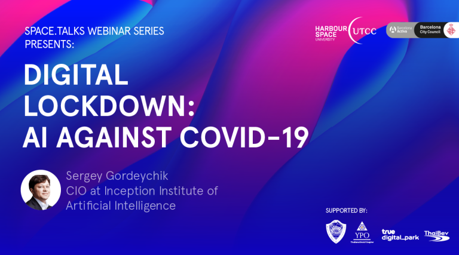

# Announcement

Hello Codeforces!

On [Sunday, May 17, 2020 at 15:20UTC+6](https://codeforces.com/https://www.timeanddate.com/worldclock/fixedtime.html?day=17&month=5&year=2020&hour=12&min=20&sec=0&p1=166) [Educational Codeforces Round 87 (Rated for Div. 2)](https://codeforces.com/contest/1354 "Educational Codeforces Round 87 (Rated for Div. 2)") will start.

**Please notice the unusual time.**

Series of Educational Rounds continue being held as [Harbour.Space University](https://codeforces.com/https://harbour.space/) initiative! You can read the details about the cooperation between [Harbour.Space University](https://codeforces.com/https://harbour.space/) and Codeforces in the [blog post](//codeforces.com/blog/entry/51208).

This round will be **rated for the participants with rating lower than 2100**. It will be held on extended ICPC rules. The penalty for each incorrect submission until the submission with a full solution is 10 minutes. After the end of the contest you will have 12 hours to hack any solution you want. You will have access to copy any solution and test it locally.

You will be given **6 or 7 problems** and **2 hours** to solve them.

The problems were invented and prepared by Roman [Roms](https://codeforces.com/profile/Roms "Master Roms") Glazov, Adilbek [adedalic](https://codeforces.com/profile/adedalic "International Master adedalic") Dalabaev, Vladimir [vovuh](https://codeforces.com/profile/vovuh "Master vovuh") Petrov, Ivan [BledDest](https://codeforces.com/profile/BledDest "International Grandmaster BledDest") Androsov, Maksim [Neon](https://codeforces.com/profile/Neon "Candidate Master Neon") Mescheryakov and me. Also huge thanks to Mike [MikeMirzayanov](https://codeforces.com/profile/MikeMirzayanov "Headquarters, MikeMirzayanov") Mirzayanov for great systems Polygon and Codeforces.

Also thanks to Neal [neal](https://codeforces.com/profile/neal "International Grandmaster neal") Wu for testing.

Good luck to all the participants!

Our friends at Harbour.Space also have a message for you:

*Hi Codeforces!* 

*We would like to invite you to a very special webinar called [Digital Lockdown: AI against COVID-19](https://codeforces.com/https://bit.ly/2WBPu6L), by Sergey Gordeychik, director of our Cyber Security programme.* 

*Sergey is CIO of Inception Institute of Artificial Intelligence, and former CTO at Kaspersky.*

*During this webinar, Sergey will share his expertise and insights on how AI is being used both positively and negatively, during the COVID-19 global pandemic. Tune in for some practical examples of how companies are using AI to innovate and disrupt during a time of crisis, exploring topics like Medical Imaging for CT analysis, diagnosis and mass surveillance.*

*Join us on Thursday, May 28th at 12h (BCN) to gain knowledge and deepen your understanding about how we can use AI to solve both operational and societal problems.*

*By participating in this 1hour webinar you will get a certificate of participation, a special digital gift from Sergey, and have the chance to win a FREE 3-week module at Harbour.Space University, depending on the availability and prerequisites of the course.* 

  [Reserve your spot now!](https://codeforces.com/https://bit.ly/2WBPu6L) Congratulations to the winners: 

| Rank | Competitor | Problems Solved | Penalty |
| --- | --- | --- | --- |
| 1 | [square1001](https://codeforces.com/profile/square1001 "Grandmaster square1001") | 8 | 294 |
| 2 | [Anadi](https://codeforces.com/profile/Anadi "International Grandmaster Anadi") | 8 | 305 |
| 3 | [tfg](https://codeforces.com/profile/tfg "International Grandmaster tfg") | 8 | 681 |
| 4 | [244mhq](https://codeforces.com/profile/244mhq "International Grandmaster 244mhq") | 7 | 192 |
| 5 | [xay_naive](https://codeforces.com/profile/xay_naive "Unrated, xay_naive") | 7 | 248 |

Congratulations to the best hackers: 

| Rank | Competitor | Hack Count |
| --- | --- | --- |
| 1 | [qwscaln](https://codeforces.com/profile/qwscaln "Specialist qwscaln") | **29****:-2** |
| 2 | [Ankit](https://codeforces.com/profile/Ankit "Specialist Ankit") | **5** |
| 3 | [lvao-x](https://codeforces.com/profile/lvao-x "Expert lvao-x") | **3****:-1** |
| 4 | [the_redback](https://codeforces.com/profile/the_redback "Specialist the_redback") | **3****:-1** |
| 5 | [WICK_ED](https://codeforces.com/profile/WICK_ED "Pupil WICK_ED") | **2****:-1** |

 142 successful hacks and 828 unsuccessful hacks were made in total!And finally people who were the first to solve each problem: 

| Problem | Competitor | Penalty |
| --- | --- | --- |
| A | [fedoseev.timofey](https://codeforces.com/profile/fedoseev.timofey "Grandmaster fedoseev.timofey") | 0:02 |
| B | [Ashishgup](https://codeforces.com/profile/Ashishgup "International Master Ashishgup") | 0:03 |
| C1 | [hitman623](https://codeforces.com/profile/hitman623 "International Master hitman623") | 0:04 |
| C2 | [square1001](https://codeforces.com/profile/square1001 "Grandmaster square1001") | 0:15 |
| D | [Not-Afraid](https://codeforces.com/profile/Not-Afraid "Expert Not-Afraid") | 0:10 |
| E | [autumn_eel](https://codeforces.com/profile/autumn_eel "International Master autumn_eel") | 0:17 |
| F | [squarepants](https://codeforces.com/profile/squarepants "Master squarepants") | 0:47 |
| G | [riantkb](https://codeforces.com/profile/riantkb "Grandmaster riantkb") | 0:37 |

**UPD:** [Editorial is out](Tutorial.md)

